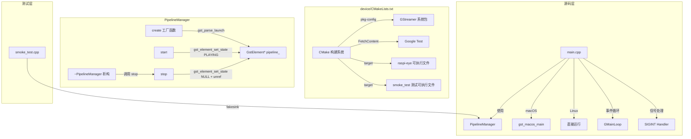
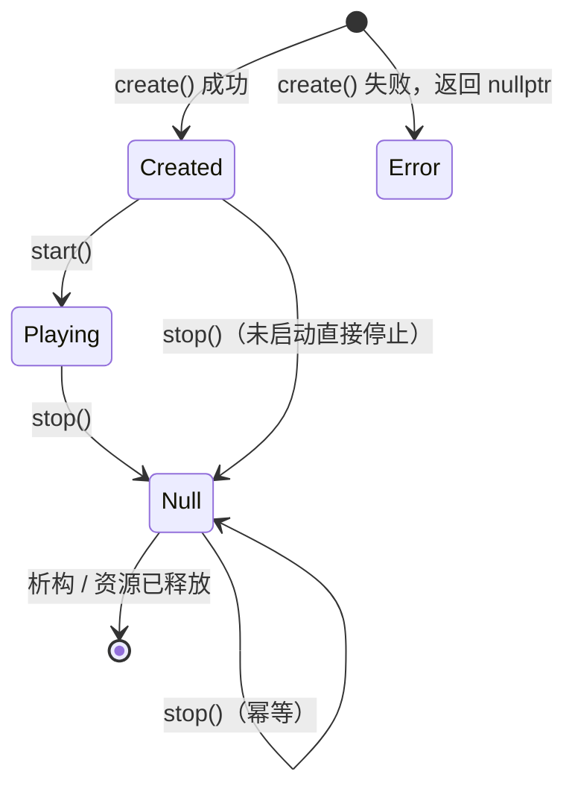

# 设计文档：Spec 0 — GStreamer Capture

## 概述

本设计实现 device 模块的第一个可编译、可测试的 C++ 项目骨架。核心交付物是 `PipelineManager` 类——一个将 GStreamer 纯 C API 封装为 C++ RAII 语义的管道生命周期管理器。

设计目标：
- 从零搭建 CMake 构建系统，集成 GStreamer（pkg-config）和 Google Test（FetchContent）
- 实现 PipelineManager 的创建、启动、停止接口，遵循 RAII 语义自动管理资源
- 提供 main.cpp 应用入口，支持 macOS（gst_macos_main）和 Linux 双平台
- 通过 fakesink 冒烟测试验证核心功能，Debug 构建开启 ASan

设计决策：
- **工厂函数 + 私有构造**：PipelineManager 通过静态工厂函数 `create()` 创建，返回 `std::unique_ptr`。工厂函数内部处理 GStreamer 初始化和 `gst_parse_launch` 调用，失败时返回 nullptr + 错误信息，避免构造函数中抛异常或持有无效资源。
- **GStreamer 运行时初始化**：采用 `gst_init_check()` 在工厂函数中按需初始化，配合 `static bool` 保证只初始化一次。不使用全局构造函数或 atexit，保持初始化时机可控。
- **平台隔离**：main.cpp 中通过 `#ifdef __APPLE__` 条件编译选择 `gst_macos_main()` 或直接运行，PipelineManager 本身不包含平台相关代码。

## 架构



### 文件布局

```
device/
├── CMakeLists.txt          # 构建配置
├── src/
│   ├── pipeline_manager.h  # PipelineManager 接口声明
│   ├── pipeline_manager.cpp # PipelineManager 实现
│   └── main.cpp            # 应用入口
└── tests/
    └── smoke_test.cpp      # 冒烟测试
```

## 组件与接口

### CMakeLists.txt

```cmake
cmake_minimum_required(VERSION 3.16)
project(raspi-eye LANGUAGES CXX)

set(CMAKE_CXX_STANDARD 17)
set(CMAKE_CXX_STANDARD_REQUIRED ON)
set(CMAKE_EXPORT_COMPILE_COMMANDS ON)

# ASan（Debug 构建）
if(CMAKE_BUILD_TYPE STREQUAL "Debug")
    add_compile_options(-fsanitize=address -fno-omit-frame-pointer)
    add_link_options(-fsanitize=address)
endif()

# GStreamer（pkg-config）
find_package(PkgConfig REQUIRED)
pkg_check_modules(GST REQUIRED gstreamer-1.0)

# Google Test（FetchContent）
include(FetchContent)
FetchContent_Declare(googletest
    GIT_REPOSITORY https://github.com/google/googletest.git
    GIT_TAG v1.14.0)
FetchContent_MakeAvailable(googletest)

# 主程序库（供测试和 main 共用）
add_library(pipeline_manager STATIC src/pipeline_manager.cpp)
target_include_directories(pipeline_manager PUBLIC src ${GST_INCLUDE_DIRS})
target_link_libraries(pipeline_manager PUBLIC ${GST_LIBRARIES})
target_compile_options(pipeline_manager PUBLIC ${GST_CFLAGS_OTHER})

# 可执行文件
add_executable(raspi-eye src/main.cpp)
target_link_libraries(raspi-eye PRIVATE pipeline_manager)

# 测试
enable_testing()
add_executable(smoke_test tests/smoke_test.cpp)
target_link_libraries(smoke_test PRIVATE pipeline_manager GTest::gtest_main)
add_test(NAME smoke_test COMMAND smoke_test)
```

设计决策：
- `pipeline_manager` 编译为 static library，主程序和测试共用，避免重复编译
- ASan 标志通过 `CMAKE_BUILD_TYPE` 条件控制，仅 Debug 构建开启
- GTest 使用 `gtest_main` 链接，测试文件无需手写 `main()`

### PipelineManager 接口

```cpp
// pipeline_manager.h
#pragma once
#include <gst/gst.h>
#include <memory>
#include <string>

class PipelineManager {
public:
    // 工厂函数：创建管道实例
    // 成功返回 unique_ptr<PipelineManager>，失败返回 nullptr
    // error_msg 输出错误信息（可选）
    static std::unique_ptr<PipelineManager> create(
        const std::string& pipeline_desc,
        std::string* error_msg = nullptr);

    ~PipelineManager();

    // 禁止拷贝
    PipelineManager(const PipelineManager&) = delete;
    PipelineManager& operator=(const PipelineManager&) = delete;

    // 允许移动
    PipelineManager(PipelineManager&& other) noexcept;
    PipelineManager& operator=(PipelineManager&& other) noexcept;

    // 启动管道，返回是否成功
    bool start(std::string* error_msg = nullptr);

    // 停止管道并释放资源（幂等）
    void stop();

    // 查询管道当前状态
    GstState current_state() const;

private:
    explicit PipelineManager(GstElement* pipeline);
    GstElement* pipeline_ = nullptr;
};
```

设计决策：
- **工厂函数模式**：`create()` 返回 `unique_ptr`，失败返回 nullptr。避免在构造函数中处理 GStreamer 错误（构造函数不能返回错误码，抛异常与 GStreamer C API 风格不匹配）。
- **错误输出参数**：`error_msg` 指针可选，调用方可以选择是否接收错误详情。比 `std::optional<std::string>` 或异常更轻量。
- **移动语义**：允许移动构造和移动赋值，支持将 PipelineManager 存入容器或从函数返回。移动后源对象的 `pipeline_` 置为 nullptr。
- **幂等 stop()**：多次调用 `stop()` 安全，内部检查 `pipeline_` 是否为 nullptr。析构函数调用 `stop()`，确保 RAII。
- **current_state()**：返回 `GstState` 枚举，供测试验证管道状态转换。内部调用 `gst_element_get_state()` 带超时查询。

### main.cpp 结构

```cpp
// main.cpp 伪代码结构
#include "pipeline_manager.h"
#include <gst/gst.h>
#include <csignal>

static GMainLoop* loop = nullptr;

// SIGINT 处理：退出主循环
void sigint_handler(int) {
    if (loop) g_main_loop_quit(loop);
}

// Bus 回调：处理 ERROR 和 EOS
gboolean bus_callback(GstBus* bus, GstMessage* msg, gpointer data) {
    switch (GST_MESSAGE_TYPE(msg)) {
        case GST_MESSAGE_ERROR: /* 解析错误，打印英文日志，退出循环 */ break;
        case GST_MESSAGE_EOS:   /* 打印 EOS 日志，退出循环 */ break;
        default: break;
    }
    return TRUE;
}

// 管道运行逻辑（被 gst_macos_main 或直接调用）
int run_pipeline(int argc, char* argv[]) {
    auto pm = PipelineManager::create("videotestsrc ! videoconvert ! autovideosink");
    // 获取 bus，注册 bus_callback
    // 注册 SIGINT handler
    // pm->start()
    // g_main_loop_run(loop)
    // pm->stop()（或依赖 RAII 析构）
    return 0;
}

int main(int argc, char* argv[]) {
#ifdef __APPLE__
    return gst_macos_main((GstMainFunc)run_pipeline, argc, argv, nullptr);
#else
    return run_pipeline(argc, argv);
#endif
}
```

设计决策：
- **平台隔离**：`#ifdef __APPLE__` 仅出现在 main.cpp 的 `main()` 函数中，PipelineManager 完全平台无关
- **GMainLoop 生命周期**：在 `run_pipeline()` 内创建和销毁，通过全局指针供 SIGINT handler 访问
- **Bus 回调**：使用 `gst_bus_add_watch()` 注册到 GMainLoop，处理 ERROR 和 EOS 两种消息
- **日志语言**：所有 `g_printerr` 输出使用英文，遵循禁止项约束

## 数据模型

本 Spec 不涉及持久化数据模型。核心运行时数据结构：

### PipelineManager 内部状态

| 成员 | 类型 | 说明 |
|------|------|------|
| `pipeline_` | `GstElement*` | GStreamer 管道指针，由 `gst_parse_launch` 创建，`gst_object_unref` 释放 |

### 状态转换



- `Created`：管道已创建（`GST_STATE_NULL` 或 `GST_STATE_READY`），尚未启动
- `Playing`：管道正在运行（`GST_STATE_PLAYING`）
- `Null`：管道已停止，资源已释放（`pipeline_` 为 nullptr）
- 未创建状态下调用 `start()` 返回错误（通过工厂函数模式，不可能出现此情况——只有成功创建的实例才会被返回）

### GStreamer 资源引用计数规则

| 操作 | 获取引用 | 释放引用 |
|------|---------|---------|
| `gst_parse_launch()` | 返回浮动引用，自动 sink | `gst_object_unref()` 在 `stop()` 中 |
| `gst_element_get_bus()` | +1 引用 | `gst_object_unref()` 在使用后立即释放 |
| `gst_bus_add_watch()` | 不增加引用 | 无需额外释放 |


## 正确性属性（Correctness Properties）

本 Spec 不包含正确性属性部分。

原因：PipelineManager 的核心逻辑是对 GStreamer 外部 C 库的 RAII 封装，每次操作都涉及外部库调用（`gst_parse_launch`、`gst_element_set_state`、`gst_object_unref`）。输入空间有限（管道描述字符串需要 GStreamer 插件支持），行为不随输入大幅变化（无论什么管道，start/stop 的状态转换逻辑相同）。100 次迭代不会比 2-3 个代表性例子发现更多 bug。

适合的测试策略：example-based 单元测试 + ASan 运行时检查。

## 错误处理

### PipelineManager::create() 错误处理

| 错误场景 | 处理方式 | 输出 |
|---------|---------|------|
| 管道描述为空字符串 | 返回 nullptr | error_msg: "Pipeline description is empty" |
| gst_init_check() 失败 | 返回 nullptr | error_msg: "Failed to initialize GStreamer: {detail}" |
| gst_parse_launch() 失败 | 返回 nullptr | error_msg: "Failed to parse pipeline: {GError message}" |
| gst_parse_launch() 返回 NULL | 返回 nullptr | error_msg: "gst_parse_launch returned NULL" |

GError 资源管理：`gst_parse_launch` 的 `GError**` 参数在使用后必须通过 `g_error_free()` 释放。

### PipelineManager::start() 错误处理

| 错误场景 | 处理方式 | 输出 |
|---------|---------|------|
| pipeline_ 为 nullptr（已 stop） | 返回 false | error_msg: "Pipeline is not initialized" |
| gst_element_set_state() 返回 FAILURE | 返回 false | error_msg: "Failed to set pipeline to PLAYING" |

### PipelineManager::stop() 错误处理

| 错误场景 | 处理方式 |
|---------|---------|
| pipeline_ 为 nullptr（已 stop 或未创建） | 直接返回，不做任何操作（幂等） |
| gst_element_set_state(NULL) 失败 | 仍然执行 gst_object_unref 释放资源，避免泄漏 |

### main.cpp Bus 回调错误处理

| 消息类型 | 处理方式 |
|---------|---------|
| GST_MESSAGE_ERROR | 解析 GError，输出 "Error from {element}: {message}"，退出 GMainLoop |
| GST_MESSAGE_EOS | 输出 "End of stream"，退出 GMainLoop |

日志约束：所有 `g_printerr` 输出使用英文，不包含非 ASCII 字符。

## 测试策略

### 测试方法

本 Spec 采用 example-based 单元测试 + ASan 运行时检查的双重验证策略：

- **单元测试**：Google Test 框架，通过 CTest 统一管理和运行
- **内存安全**：Debug 构建开启 ASan，测试运行时自动检测 heap-use-after-free、buffer-overflow 等问题
- **不使用 PBT**：核心逻辑是外部库封装，输入空间有限，example-based 测试已足够覆盖

### 冒烟测试用例设计

所有测试使用 `fakesink` 作为 sink 元素，不依赖显示设备。

| 测试用例 | 验证内容 | 对应需求 |
|---------|---------|---------|
| `CreateValidPipeline` | `create("videotestsrc ! fakesink")` 返回非 nullptr | 2.1, 6.2 |
| `CreateInvalidPipeline` | `create("")` 返回 nullptr，error_msg 非空 | 2.2 |
| `CreateUnknownElement` | `create("nonexistent_element ! fakesink")` 返回 nullptr 或管道创建后状态异常 | 2.2 |
| `StartPipeline` | 创建后调用 `start()`，`current_state()` 返回 `GST_STATE_PLAYING` | 3.1, 6.3 |
| `StopPipeline` | 启动后调用 `stop()`，验证资源释放 | 3.2, 6.4 |
| `StopIdempotent` | 调用 `stop()` 两次，无崩溃无 ASan 报告 | 3.4 |
| `RAIICleanup` | 在作用域内创建并启动管道，离开作用域后 ASan 无报告 | 4.1, 4.3, 6.5 |
| `NoCopy` | `static_assert(!std::is_copy_constructible_v<PipelineManager>)` | 4.2 |

### 测试约束

- 每个测试用例执行时间 ≤ 5 秒（CTest TIMEOUT 设置）
- 所有测试通过 `ctest --test-dir device/build --output-on-failure` 统一运行
- Debug 构建下 ASan 自动生效，任何内存错误会导致测试失败（非零退出码）

### 验证命令

```bash
cmake -B device/build -S device -DCMAKE_BUILD_TYPE=Debug && cmake --build device/build && ctest --test-dir device/build --output-on-failure
```

预期结果：配置成功、编译无错误、所有测试通过、ASan 无报告。

### 禁止项（Design 层）

- SHALL NOT 在代码中硬编码 AWS 凭证、密钥、证书路径或任何 secret
- SHALL NOT 在日志或错误输出中打印密钥、证书内容、token 等敏感信息
- SHALL NOT 在 macOS 上直接在 main() 中运行含 autovideosink 的 GStreamer 管道（必须用 `gst_macos_main()` 包装）
