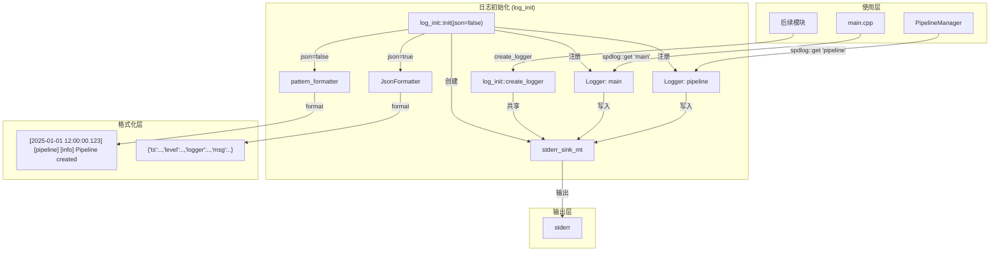
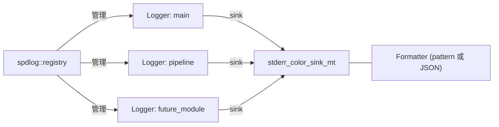

# 设计文档：Spec 1 — spdlog 结构化日志

## 概述

本设计为 device 模块引入 spdlog 结构化日志基础设施，替换现有的 `g_printerr` 调用。核心交付物包括：

1. **JsonFormatter** — 自定义 spdlog formatter，将日志输出为 JSON 单行格式（可选，通过 `--log-json` 启用）
2. **log_init 模块** — 日志系统初始化/关闭接口，管理共享 stderr sink 和命名 Logger，支持 pattern/JSON 格式切换
3. **现有代码迁移** — main.cpp 和 PipelineManager 中的 `g_printerr` 替换为 spdlog 调用

设计决策：

- **同步模式**：采用 `spdlog::logger`（非 `async_logger`），stderr 为 unbuffered I/O，同步写入无额外线程开销，Pi 5 上性能足够。后续有文件 sink 需求时再升级为异步模式。
- **FetchContent 集成**：spdlog v1.15.0 通过 CMake FetchContent 锁定版本，与 GTest 集成方式一致，无需手动安装。
- **默认 pattern 格式**：默认使用 spdlog 的 `pattern_formatter`，格式为 `[时间戳] [模块名] [级别] 消息`，人眼友好，与第三方库（如 KVS SDK）的日志风格接近。
- **可选 JSON 格式**：通过 `--log-json` 命令行参数切换为 JSON 单行格式，为后续 CloudWatch 集成做准备。JSON formatter 继承 `spdlog::formatter` 接口，手动拼接 JSON 字符串，不引入额外 JSON 库。
- **模块独立 Logger**：每个模块持有独立命名 Logger（如 `"main"`、`"pipeline"`），共享同一个 stderr sink。通过 `spdlog::get("name")` 全局获取，无需传递 Logger 指针。
- **工厂函数创建 Logger**：log_init 提供 `create_logger("name")` 工厂函数，后续模块可自行创建 Logger 并自动共享 sink 和格式。

## 架构



### 文件布局

```
device/
├── CMakeLists.txt              # 新增 spdlog FetchContent + log 库 target
├── src/
│   ├── json_formatter.h        # JsonFormatter 接口声明
│   ├── json_formatter.cpp      # JsonFormatter 实现
│   ├── log_init.h              # 日志初始化/关闭接口声明
│   ├── log_init.cpp            # 日志初始化/关闭实现
│   ├── pipeline_manager.h      # 不变
│   ├── pipeline_manager.cpp    # 新增 spdlog 诊断日志
│   └── main.cpp                # g_printerr → spdlog
└── tests/
    ├── smoke_test.cpp           # 不变（Spec 0 冒烟测试）
    └── log_test.cpp             # 新增：日志系统冒烟测试
```

## 组件与接口

### CMakeLists.txt 变更

在现有 FetchContent 区域新增 spdlog：

```cmake
# spdlog（FetchContent）
FetchContent_Declare(spdlog
    GIT_REPOSITORY https://github.com/gabime/spdlog.git
    GIT_TAG v1.15.0)
FetchContent_MakeAvailable(spdlog)
```

新增日志静态库 target：

```cmake
# 日志模块库
add_library(log_module STATIC
    src/json_formatter.cpp
    src/log_init.cpp)
target_include_directories(log_module PUBLIC src)
target_link_libraries(log_module PUBLIC spdlog::spdlog)
```

修改现有 target 的依赖：

```cmake
# pipeline_manager 链接 log_module
target_link_libraries(pipeline_manager PUBLIC ${GST_LIBRARIES} log_module)

# raspi-eye 链接 pipeline_manager（间接获得 log_module）
target_link_libraries(raspi-eye PRIVATE pipeline_manager)

# 日志测试
add_executable(log_test tests/log_test.cpp)
target_link_libraries(log_test PRIVATE log_module GTest::gtest_main)
add_test(NAME log_test COMMAND log_test)
```

设计决策：
- `log_module` 编译为独立静态库，`pipeline_manager` 和 `raspi-eye` 通过链接依赖获得 spdlog
- 日志测试 `log_test` 仅依赖 `log_module`，不依赖 GStreamer，可独立运行

### JsonFormatter 接口

```cpp
// json_formatter.h
#pragma once
#include <spdlog/formatter.h>
#include <spdlog/details/log_msg.h>
#include <memory>

// 自定义 JSON 单行格式化器
// 输出格式: {"ts":"2025-01-01T00:00:00.000Z","level":"info","logger":"main","msg":"..."}
class JsonFormatter final : public spdlog::formatter {
public:
    void format(const spdlog::details::log_msg& msg,
                spdlog::memory_buf_t& dest) override;
    std::unique_ptr<spdlog::formatter> clone() const override;
};
```

设计决策：
- 继承 `spdlog::formatter` 接口而非使用 `pattern_formatter` 自定义 flag，因为 JSON 格式需要完全控制输出结构
- `format()` 内部手动拼接 JSON 字符串到 `spdlog::memory_buf_t`（基于 `fmt::memory_buffer`），避免引入 nlohmann/json 等额外依赖
- JSON 转义处理：对 `msg` 字段中的 `"`、`\`、控制字符进行转义，确保输出为合法 JSON
- `clone()` 返回新实例，支持 spdlog 内部的 formatter 复制需求

### JsonFormatter 实现要点

```cpp
// json_formatter.cpp 核心逻辑伪代码
void JsonFormatter::format(const spdlog::details::log_msg& msg,
                           spdlog::memory_buf_t& dest) {
    // 1. 格式化时间戳为 ISO 8601
    //    使用 msg.time (std::chrono::system_clock::time_point)
    //    输出格式: "2025-01-01T12:00:00.123Z"

    // 2. 获取日志级别字符串
    //    spdlog::level::to_string_view(msg.level)

    // 3. 获取 logger 名称
    //    msg.logger_name

    // 4. 获取消息内容并进行 JSON 转义
    //    msg.payload — 需要转义 " \ 和控制字符

    // 5. 拼接 JSON 并追加换行符
    //    {"ts":"...","level":"...","logger":"...","msg":"..."}\n
    //    使用 fmt::format_to(std::back_inserter(dest), ...) 写入
}
```

JSON 转义规则：
- `"` → `\"`
- `\` → `\\`
- `\n` → `\\n`
- `\r` → `\\r`
- `\t` → `\\t`
- 其他控制字符（0x00-0x1F）→ `\\uXXXX`

### log_init 接口

```cpp
// log_init.h
#pragma once
#include <memory>
#include <string>

namespace spdlog { class logger; }

namespace log_init {

// 初始化日志系统：创建共享 stderr sink，注册 "main" 和 "pipeline" Logger
// json=true 时使用 JSON 单行格式，json=false（默认）使用 pattern 格式
// 默认日志级别为 info
// 必须在使用任何 Logger 之前调用
void init(bool json = false);

// 创建新的命名 Logger，共享同一个 stderr sink 和当前格式
// 返回 shared_ptr<spdlog::logger>，同时注册到 spdlog 全局 registry
// 后续可通过 spdlog::get(name) 获取
std::shared_ptr<spdlog::logger> create_logger(const std::string& name);

// 关闭日志系统：调用 spdlog::shutdown() 释放所有资源
// 幂等，可安全多次调用
void shutdown();

} // namespace log_init
```

设计决策：
- `init(bool json)` 通过参数控制格式选择，main.cpp 解析 `--log-json` 后传入
- 使用 namespace 而非 class，因为日志初始化是全局一次性操作，无需实例化
- `init()` 内部创建 `spdlog::sinks::stderr_color_sink_mt`（线程安全 stderr sink），根据 json 参数设置 JsonFormatter 或 pattern_formatter
- `create_logger()` 工厂函数供后续模块使用，自动共享 sink 和当前格式
- `shutdown()` 封装 `spdlog::shutdown()`，确保幂等性
- 头文件前向声明 `spdlog::logger`，避免使用方被迫 include spdlog 头文件

### log_init 实现要点

```cpp
// log_init.cpp 核心逻辑
#include "log_init.h"
#include "json_formatter.h"
#include <spdlog/spdlog.h>
#include <spdlog/sinks/stderr_color_sink.h>

namespace {
    // 模块级共享 sink（线程安全）
    std::shared_ptr<spdlog::sinks::stderr_color_sink_mt> g_sink;
}

namespace log_init {

void init(bool json) {
    if (g_sink) return;  // 幂等：已初始化则跳过

    // 创建共享 stderr sink
    g_sink = std::make_shared<spdlog::sinks::stderr_color_sink_mt>();

    if (json) {
        g_sink->set_formatter(std::make_unique<JsonFormatter>());
    } else {
        // 默认 pattern 格式：[时间戳] [模块名] [级别] 消息
        g_sink->set_formatter(
            std::make_unique<spdlog::pattern_formatter>(
                "[%Y-%m-%d %H:%M:%S.%e] [%n] [%l] %v"));
    }

    // 注册 "main" 和 "pipeline" Logger
    create_logger("main");
    create_logger("pipeline");
}

std::shared_ptr<spdlog::logger> create_logger(const std::string& name) {
    auto logger = std::make_shared<spdlog::logger>(name, g_sink);
    logger->set_level(spdlog::level::info);
    spdlog::register_logger(logger);
    return logger;
}

void shutdown() {
    spdlog::shutdown();
    g_sink.reset();
}

} // namespace log_init
```

设计决策：
- 使用 `stderr_color_sink_mt`（mt = multi-thread safe），虽然当前同步模式单线程写入，但为后续多线程场景预留安全性
- `g_sink` 作为匿名 namespace 内的模块级变量，生命周期由 `init()`/`shutdown()` 管理
- `shutdown()` 中 `g_sink.reset()` 确保 sink 引用计数归零，配合 `spdlog::shutdown()` 完全释放资源

### PipelineManager 日志集成

在 `pipeline_manager.cpp` 中添加诊断日志：

```cpp
#include <spdlog/spdlog.h>

// create() 成功时
spdlog::get("pipeline")->info("Pipeline created: {}", pipeline_desc);

// start() 成功时
spdlog::get("pipeline")->info("Pipeline started");

// start() 失败时
spdlog::get("pipeline")->error("Failed to start pipeline: {}", *error_msg);

// stop() 时
spdlog::get("pipeline")->info("Pipeline stopped");
```

### main.cpp 日志迁移

替换所有 `g_printerr` 为 spdlog 调用：

```cpp
#include "log_init.h"
#include <spdlog/spdlog.h>

// 在 run_pipeline() 开头，解析 --log-json 参数
bool use_json = false;
for (int i = 1; i < argc; ++i) {
    if (std::string(argv[i]) == "--log-json") use_json = true;
}
log_init::init(use_json);
auto logger = spdlog::get("main");

// bus_callback 中
case GST_MESSAGE_ERROR:
    logger->error("Error from {}: {}", element_name, error_message);
    logger->debug("Debug info: {}", debug_info);
    break;
case GST_MESSAGE_EOS:
    logger->info("End of stream");
    break;

// 管道创建失败
logger->error("Failed to create pipeline: {}", err_msg);

// 退出前
log_init::shutdown();
```

## 数据模型

本 Spec 不涉及持久化数据模型。核心运行时数据结构：

### 日志输出格式

支持两种格式，通过 `--log-json` 命令行参数切换：

#### 默认 Pattern 格式（人眼友好）

```
[2025-01-15 08:30:00.123] [pipeline] [info] Pipeline created: videotestsrc ! fakesink
[2025-01-15 08:30:00.456] [main] [error] Error from videotestsrc0: Internal data stream error.
```

#### JSON 格式（`--log-json`）

每条日志为一行 JSON 对象：

```json
{"ts":"2025-01-15T08:30:00.123Z","level":"info","logger":"pipeline","msg":"Pipeline created: videotestsrc ! fakesink"}
```

| 字段 | 类型 | 说明 |
|------|------|------|
| `ts` | string | ISO 8601 时间戳，UTC，毫秒精度 |
| `level` | string | 日志级别：trace/debug/info/warning/error/critical |
| `logger` | string | Logger 名称，即模块名 |
| `msg` | string | 日志消息内容，特殊字符已 JSON 转义 |

### spdlog 对象关系



### 日志级别过滤

spdlog 的级别过滤在 Logger 层面执行，每个 Logger 独立设置：

| 级别 | 数值 | 说明 |
|------|------|------|
| trace | 0 | 最详细，生产环境关闭 |
| debug | 1 | 调试信息 |
| info | 2 | 常规操作信息（默认级别） |
| warn | 3 | 警告 |
| err | 4 | 错误 |
| critical | 5 | 严重错误 |
| off | 6 | 关闭所有日志 |

当 Logger 级别设为 N 时，仅输出级别 ≥ N 的日志。例如设为 `warn`（3），则 `info`（2）、`debug`（1）、`trace`（0）被过滤。


## 正确性属性（Correctness Properties）

*正确性属性是在系统所有合法执行中都应成立的特征或行为——本质上是对系统行为的形式化陈述。属性是人类可读规格与机器可验证正确性保证之间的桥梁。*

本特性适合 PBT 的原因：JsonFormatter 是纯函数（输入 log_msg → 输出 JSON 字符串），输入空间大（任意字符串消息），存在明确的通用属性（合法 JSON、字段完整、单行）。日志级别过滤也是纯逻辑，输入空间为所有级别组合。

### Property 1: JSON 格式有效性

*For any* 日志消息（包含任意 UTF-8 字符串、双引号、反斜杠、控制字符、换行符），经 JsonFormatter 格式化后的输出 SHALL 满足：(a) 为合法的单行 JSON 对象（仅末尾有一个换行符），(b) 包含 `ts`、`level`、`logger`、`msg` 四个字段，(c) `msg` 字段的值经 JSON 反转义后与原始消息内容一致。

**Validates: Requirements 3.1, 3.2, 3.3**

### Property 2: 日志级别过滤正确性

*For any* Logger 级别 L 和消息级别 M 的组合，当 Logger 级别设为 L 时，消息 SHALL 出现在输出中当且仅当 M >= L；且修改一个 Logger 的级别 SHALL NOT 影响其他 Logger 的级别设置。

**Validates: Requirements 4.2, 4.3**

### Property 3: Logger 工厂函数正确性

*For any* 合法的 Logger 名称字符串（非空 ASCII），调用 `create_logger(name)` 后，`spdlog::get(name)` SHALL 返回非空的 Logger 实例，且该 Logger 的默认级别为 `info`。

**Validates: Requirements 2.4, 2.6, 4.1**

## 错误处理

### log_init::init() 错误处理

| 错误场景 | 处理方式 |
|---------|---------|
| 重复调用 init() | 幂等处理：如果 g_sink 已存在，直接返回不重复创建 |

### log_init::create_logger() 错误处理

| 错误场景 | 处理方式 |
|---------|---------|
| 名称已被注册 | spdlog::register_logger() 会抛出 spdlog_ex，由调用方处理 |
| init() 未调用（g_sink 为 nullptr） | 未定义行为，文档约束：必须先调用 init() |

### log_init::shutdown() 错误处理

| 错误场景 | 处理方式 |
|---------|---------|
| 重复调用 shutdown() | 幂等：spdlog::shutdown() 本身幂等，g_sink.reset() 对 nullptr 安全 |
| shutdown() 后继续使用 Logger | spdlog::get() 返回 nullptr，调用方需检查 |

### JsonFormatter::format() 错误处理

| 错误场景 | 处理方式 |
|---------|---------|
| 消息包含特殊字符 | JSON 转义处理，确保输出合法 |
| 消息为空字符串 | 正常输出 `"msg":""` |

## 测试策略

### 测试方法

本 Spec 采用 property-based testing + example-based 单元测试 + ASan 运行时检查的三重验证策略：

- **Property-based testing**：使用 [RapidCheck](https://github.com/emil-e/rapidcheck) 库（C++ PBT 框架，与 Google Test 集成），验证 JsonFormatter 和日志级别过滤的通用属性
- **单元测试**：Google Test 框架，验证初始化、Logger 注册、关闭等具体行为
- **内存安全**：Debug 构建开启 ASan，测试运行时自动检测内存问题

### PBT 库选择：RapidCheck

选择 RapidCheck 的原因：
- C++ 原生 PBT 库，与 Google Test 无缝集成（`RC_GTEST_PROP` 宏）
- 支持 `std::string` 等标准类型的自动生成器
- 通过 FetchContent 集成，与项目现有构建方式一致
- 每个 property test 配置为最少 100 次迭代

### Property Test 配置

```cmake
# RapidCheck（FetchContent）
FetchContent_Declare(rapidcheck
    GIT_REPOSITORY https://github.com/emil-e/rapidcheck.git
    GIT_TAG master)
set(RC_ENABLE_GTEST ON CACHE BOOL "" FORCE)
FetchContent_MakeAvailable(rapidcheck)

# 日志测试链接 RapidCheck
target_link_libraries(log_test PRIVATE log_module GTest::gtest_main rapidcheck rapidcheck_gtest)
```

### 测试用例设计

#### Property-Based Tests（log_test.cpp）

| 测试 | 对应属性 | 迭代次数 |
|------|---------|---------|
| `JsonFormatValidity` | Property 1: JSON 格式有效性 | 100+ |
| `LevelFilterCorrectness` | Property 2: 日志级别过滤正确性 | 100+ |
| `LoggerFactoryCorrectness` | Property 3: Logger 工厂函数正确性 | 100+ |

每个 property test 标注注释：
```cpp
// Feature: spdlog-logging, Property 1: JSON format validity
// For any log message, formatted output is valid single-line JSON with all required fields
```

#### Example-Based Tests（log_test.cpp）

| 测试用例 | 验证内容 | 对应需求 |
|---------|---------|---------|
| `InitCreatesLoggers` | init() 后 spdlog::get("main") 和 spdlog::get("pipeline") 非空 | 2.3, 2.4 |
| `DefaultPatternFormat` | init(false) 后日志输出包含时间戳、模块名、级别和消息 | 3.1 |
| `ShutdownIdempotent` | shutdown() 调用两次无崩溃 | 6.3 |
| `ShutdownCleanup` | init() + 使用 + shutdown()，ASan 无报告 | 6.1, 6.2 |

#### 回归测试

| 测试用例 | 验证内容 | 对应需求 |
|---------|---------|---------|
| Spec 0 `smoke_test` | PipelineManager 创建、启动、停止仍正常 | 7.6 |

### 测试实现要点

- 使用 `spdlog::sinks::ostream_sink_mt` 捕获日志输出到 `std::ostringstream`，避免依赖 stderr 重定向
- JSON 解析验证：手动检查 JSON 结构（查找 `{`、`}`、字段名），不引入额外 JSON 解析库
- 每个 property test 前调用 `spdlog::shutdown()` + `spdlog::drop_all()` 清理状态，确保测试隔离

### 测试约束

- 每个测试用例执行时间 ≤ 5 秒
- 所有测试通过 `ctest --test-dir device/build --output-on-failure` 统一运行
- Debug 构建下 ASan 自动生效
- Property test 最少 100 次迭代

### 验证命令

```bash
cmake -B device/build -S device -DCMAKE_BUILD_TYPE=Debug && cmake --build device/build && ctest --test-dir device/build --output-on-failure
```

预期结果：配置成功（spdlog + RapidCheck 自动下载）、编译无错误、所有测试通过（含 Spec 0 冒烟测试）、ASan 无报告。

### 禁止项（Design 层）

- SHALL NOT 在日志或错误输出中打印密钥、证书内容、token 等敏感信息
- SHALL NOT 在代码中硬编码 AWS 凭证、密钥、证书路径或任何 secret
- SHALL NOT 引入额外 JSON 解析库（如 nlohmann/json）——JsonFormatter 手动拼接 JSON，测试中手动验证 JSON 结构
