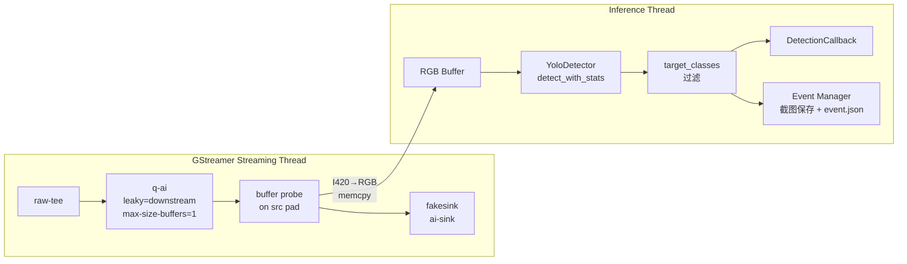
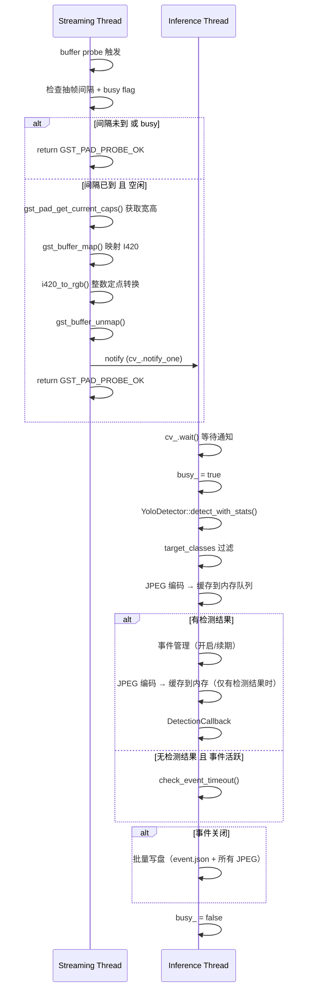
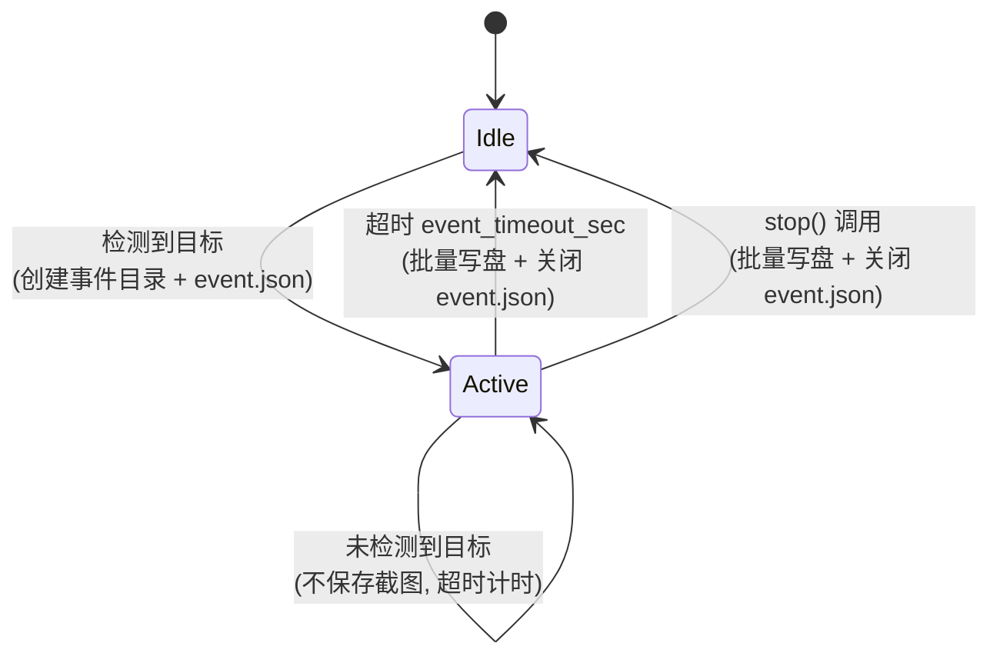

# 设计文档：Spec 10 — AI 推理管道集成

## 概述

本设计将 tee pipeline 的 AI 分支从 fakesink 占位替换为实际的 buffer probe 抽帧 + YoloDetector 异步推理管道。核心新增类 `AiPipelineHandler` 封装以下职责：

1. 在 `q-ai` 的 src pad 上安装 GstPad buffer probe
2. 按 `inference_fps` 配置的间隔抽取 I420 原始帧，整数定点 BT.601 转换为 RGB
3. 将 RGB 帧投递到独立推理线程，busy flag 跳帧，不阻塞 streaming
4. 推理完成后按 `target_classes` 过滤检测结果，触发 DetectionCallback
5. 管理检测事件会话：检测到目标开启事件 → 事件目录保存 JPEG 截图 → 超时关闭
6. 维护 `event.json` 元数据文件，供 Spec 11 S3 uploader 消费

设计原则：probe 回调零阻塞（仅 memcpy + I420→RGB ≤ 5ms），推理线程异步执行，JPEG 编码在推理线程同步完成但不写盘（缓存到内存），事件关闭时批量写盘（可在独立 I/O 线程）。管道拓扑不变（raw-tee → q-ai → fakesink），仅加 probe。

## 架构

### 数据流



### 线程模型



### 事件生命周期状态机



## 组件与接口

### 新增文件

| 文件 | 职责 |
|------|------|
| `device/src/ai_pipeline_handler.h` | AiPipelineHandler 类声明、AiConfig POD、DetectionCallback 类型 |
| `device/src/ai_pipeline_handler.cpp` | AiPipelineHandler 实现：probe 安装、I420→RGB、推理线程、事件管理 |
| `device/tests/ai_pipeline_test.cpp` | 单元测试 + PBT |

### 修改文件

| 文件 | 变更 |
|------|------|
| `device/src/pipeline_builder.h` | `build_tee_pipeline` 新增 `AiPipelineHandler*` 参数 |
| `device/src/pipeline_builder.cpp` | 当 ai_handler 非空时调用 `install_probe()` |
| `device/src/config_manager.h` | 新增 `AiConfig` 结构体、`parse_ai_config()` 函数声明 |
| `device/src/config_manager.cpp` | 实现 `parse_ai_config()`，`ConfigManager::load()` 解析 `[ai]` section |
| `device/src/app_context.cpp` | 集成 AiPipelineHandler 到 init/start/stop 生命周期 |
| `device/CMakeLists.txt` | 新增 ai_pipeline_module 库和 ai_pipeline_test |
| `device/config/config.toml` | 新增 `[ai]` section |
| `.gitignore` | 新增 `device/events/` 排除 |

### AiPipelineHandler 类接口

```cpp
// ai_pipeline_handler.h
#pragma once

#include <atomic>
#include <condition_variable>
#include <functional>
#include <memory>
#include <mutex>
#include <string>
#include <thread>
#include <vector>

#include <gst/gst.h>
#include "yolo_detector.h"

// AI 管道配置（POD）
struct AiConfig {
    std::string model_path;                    // ONNX 模型路径
    int inference_fps = 2;                     // 抽帧率（每秒帧数）
    float confidence_threshold = 0.25f;        // 全局置信度阈值
    std::string snapshot_dir = "device/events/"; // 事件截图根目录
    int event_timeout_sec = 15;                // 事件超时秒数
    int max_cache_mb = 16;                     // JPEG 内存缓存上限（MB），达到时中间 flush
    std::string device_id;                     // 设备标识（来自 aws.thing_name）

    // per-class 置信度覆盖
    struct TargetClass {
        std::string name;                      // COCO 类名
        float confidence = -1.0f;              // -1 表示使用全局阈值
    };
    std::vector<TargetClass> target_classes;
};

// 检测结果回调类型
using DetectionCallback = std::function<void(
    const std::vector<Detection>& detections,
    const InferenceStats& stats,
    const uint8_t* rgb_data,
    int frame_width,
    int frame_height)>;

class AiPipelineHandler {
public:
    // 工厂方法
    static std::unique_ptr<AiPipelineHandler> create(
        std::unique_ptr<YoloDetector> detector,
        const AiConfig& config,
        std::string* error_msg = nullptr);

    ~AiPipelineHandler();

    // 禁用拷贝
    AiPipelineHandler(const AiPipelineHandler&) = delete;
    AiPipelineHandler& operator=(const AiPipelineHandler&) = delete;

    // 在 pipeline 的 q-ai src pad 上安装 buffer probe
    // 如果已有旧 probe，先自动移除
    bool install_probe(GstElement* pipeline, std::string* error_msg = nullptr);

    // 移除已安装的 probe
    void remove_probe();

    // 启动推理线程
    bool start(std::string* error_msg = nullptr);

    // 停止推理线程（join 等待）
    void stop();

    // 注册检测结果回调
    void set_detection_callback(DetectionCallback cb);

private:
    AiPipelineHandler(std::unique_ptr<YoloDetector> detector,
                      const AiConfig& config);

    // probe 回调（static，通过 user_data 访问 this）
    static GstPadProbeReturn buffer_probe_cb(
        GstPad* pad, GstPadProbeInfo* info, gpointer user_data);

    // 推理线程主循环
    void inference_loop();

    // 事件管理
    void open_event(const std::vector<Detection>& detections);
    void close_event();  // 批量写盘：创建目录 + 写入所有 JPEG + event.json
    void encode_snapshot(const uint8_t* rgb_data, int width, int height);  // JPEG 编码到内存
    void update_detections_summary(const std::vector<Detection>& detections);
    void check_event_timeout();  // 在推理线程中定期检查事件超时

    // 成员
    std::unique_ptr<YoloDetector> detector_;
    AiConfig config_;
    DetectionCallback detection_cb_;

    // probe 状态
    GstPad* probe_pad_ = nullptr;
    gulong probe_id_ = 0;

    // 抽帧节流
    int64_t frame_interval_ms_ = 500;  // 1000 / inference_fps
    std::chrono::steady_clock::time_point last_sample_time_;

    // 推理线程同步
    std::thread inference_thread_;
    std::mutex mutex_;
    std::condition_variable cv_;
    std::atomic<bool> stop_flag_{false};
    bool frame_ready_ = false;
    std::atomic<bool> busy_{false};

    // 帧缓冲区（预分配）
    std::vector<uint8_t> rgb_buffer_;
    int frame_width_ = 0;
    int frame_height_ = 0;

    // 事件状态
    bool event_active_ = false;
    std::string event_id_;
    std::chrono::system_clock::time_point event_start_time_;
    std::chrono::steady_clock::time_point last_detection_time_;
    int frame_count_ = 0;

    // JPEG 内存缓存：事件期间累积，达到 max_cache_mb 时中间 flush，事件关闭时最终 flush
    struct CachedFrame {
        std::string filename;           // e.g. "20260412_153046_001.jpg"
        std::vector<uint8_t> jpeg_data; // JPEG 编码后的数据（~50-80KB/帧）
    };
    std::vector<CachedFrame> cached_frames_;  // 事件期间的所有帧
    size_t cached_bytes_ = 0;                 // 当前缓存总字节数，用于 flush 判断

    // detections_summary：内存累积，事件关闭时写盘
    struct ClassSummary {
        int count = 0;
        float max_confidence = 0.0f;
    };
    std::unordered_map<std::string, ClassSummary> detections_summary_;
};
```

### I420→RGB 独立转换函数

```cpp
// 在 ai_pipeline_handler.cpp 中，namespace 内的独立函数
// 整数定点 BT.601，输出值 clamp 到 [0, 255]
void i420_to_rgb(const uint8_t* y_plane, const uint8_t* u_plane,
                 const uint8_t* v_plane,
                 int width, int height, int y_stride, int uv_stride,
                 uint8_t* rgb_out);
```

为便于测试，此函数在头文件中声明（非类成员），测试可直接调用。

### target_classes 过滤独立函数

```cpp
// 纯函数，便于 PBT 测试
std::vector<Detection> filter_detections(
    const std::vector<Detection>& detections,
    const std::vector<AiConfig::TargetClass>& target_classes,
    float global_threshold);
```

### COCO 类名映射

```cpp
// 80 类 COCO 类名数组，class_id → name
const char* coco_class_name(int class_id);
```

### build_tee_pipeline 签名扩展

```cpp
// pipeline_builder.h — 新增最后一个参数
namespace PipelineBuilder {
GstElement* build_tee_pipeline(
    std::string* error_msg = nullptr,
    CameraSource::CameraConfig config = CameraSource::CameraConfig{},
    const KvsSinkFactory::KvsConfig* kvs_config = nullptr,
    const AwsConfig* aws_config = nullptr,
    WebRtcMediaManager* webrtc_media = nullptr,
    AiPipelineHandler* ai_handler = nullptr);  // 新增
}
```

### ConfigManager 扩展

```cpp
// config_manager.h — 新增
struct AiConfig;  // forward declare

bool parse_ai_config(
    const std::unordered_map<std::string, std::string>& kv,
    AiConfig& config,
    std::string* error_msg = nullptr);

// ConfigManager 新增
class ConfigManager {
public:
    // ... 现有接口 ...
    const AiConfig& ai_config() const { return ai_config_; }
private:
    AiConfig ai_config_;
};
```

`parse_toml_section` 返回的是扁平 kv map，无法直接解析 TOML table 数组（`[[ai.target_classes]]`）。`target_classes` 的解析需要在 `ConfigManager::load()` 中单独处理：逐行扫描 `[[ai.target_classes]]` 块，提取 name 和 confidence 字段。

### config.toml [ai] section

```toml
[ai]
model_path = "device/models/yolo11s.onnx"
inference_fps = 2
confidence_threshold = 0.25
snapshot_dir = "device/events/"
event_timeout_sec = 15
max_cache_mb = 16
target_classes = "bird:0.3,person:0.5,cat,dog"
```

## 数据模型

### event.json 结构

```json
{
    "event_id": "evt_20260412_153045",
    "device_id": "RaspiEyeAlpha",
    "start_time": "2026-04-12T15:30:45Z",
    "end_time": "2026-04-12T15:31:15Z",
    "status": "closed",
    "frame_count": 12,
    "detections_summary": {
        "bird": { "count": 8, "max_confidence": 0.92 },
        "cat": { "count": 3, "max_confidence": 0.78 }
    }
}
```

事件开启时写入：仅在内存中记录 `event_id`、`device_id`、`start_time`、`status: "active"`。不创建目录，不写盘。
事件关闭时批量写盘：创建事件目录 → 写入所有缓存的 JPEG 文件 → 写入 `event.json`（`status: "closed"`、`end_time`、`frame_count`、`detections_summary`）→ 清空内存缓存。
`detections_summary` 和 JPEG 数据均在内存中累积，仅关闭时一次性写盘。

### 内存预算分析

720p JPEG 质量 85% ≈ 50-80KB/帧。默认 max_cache_mb=16MB，约可缓存 200 帧。达到上限时中间 flush 写盘，清空缓存后继续。内存峰值始终 ≤ max_cache_mb + RGB 双缓冲区 5.5MB ≈ 21.5MB，在 50MB 预算内。

中间 flush 流程：
1. 创建事件目录（如果首次 flush）
2. 将 cached_frames_ 中所有 JPEG 写入事件目录
3. 清空 cached_frames_ + cached_bytes_ = 0
4. 事件继续，后续帧继续缓存

事件关闭时的最终 flush 与中间 flush 逻辑相同，额外写入 event.json。

### 事件目录结构

```
device/events/
└── evt_20260412_153045/
    ├── event.json
    ├── 20260412_153045_001.jpg
    ├── 20260412_153046_002.jpg
    └── 20260412_153047_003.jpg
```

### 抽帧节流决策逻辑

```
should_sample(elapsed_ms, inference_fps) =
    elapsed_ms >= (1000 / inference_fps)
```

当 `inference_fps = 2` 时，间隔为 500ms。probe 回调中仅检查时间间隔 + busy flag，两个条件都满足才抽帧。

## 正确性属性

*正确性属性是在系统所有有效执行中都应成立的特征或行为——本质上是对系统应做什么的形式化陈述。属性是人类可读规格与机器可验证正确性保证之间的桥梁。*

### Property 1: I420→RGB 转换输出不变量

*For any* 有效的 I420 输入（宽高均 > 0 且为偶数），`i420_to_rgb` 函数的输出缓冲区大小恒等于 `width × height × 3` 字节，且所有输出像素值在 [0, 255] 范围内。

**Validates: Requirements 3.2, 3.5**

### Property 2: 抽帧节流决策一致性

*For any* 非负的 `elapsed_ms` 和正整数 `inference_fps`（1 ≤ fps ≤ 30），`should_sample` 返回 true 当且仅当 `elapsed_ms >= 1000 / inference_fps`。

**Validates: Requirements 2.2, 2.3**

### Property 3: target_classes 过滤正确性

*For any* Detection 向量和 target_classes 配置，`filter_detections` 的输出中每个 Detection 的 class_name 必须在 target_classes 列表中（或 target_classes 为空时保留所有类），且 confidence 必须 ≥ 该类别的阈值（per-class 阈值优先，否则使用全局阈值）。输出是输入的子集（不新增、不修改元素）。

**Validates: Requirements 4.4, 8.2, 8.3**

## 错误处理

| 场景 | 处理策略 | 日志级别 |
|------|---------|---------|
| YoloDetector 为 nullptr | `create()` 返回 nullptr + error_msg | error |
| `q-ai` 元素未找到 | `install_probe()` 返回 false + error_msg | error |
| pad caps 获取失败 | 跳过本帧，不抽帧 | warn |
| I420 buffer map 失败 | 跳过本帧 | warn |
| YoloDetector 推理异常 | 捕获异常，记录日志，继续等待下一帧 | error |
| 事件目录创建失败 | 记录日志，不开启事件，推理继续 | warn |
| JPEG 编码/写入失败 | 记录日志，不中断推理，不终止事件 | warn |
| event.json 写入失败 | 记录日志，事件状态仅在内存中维护 | warn |
| 推理线程异常退出 | 记录日志，busy_ 重置为 false | error |
| model_path 为空或文件不存在 | AppContext 跳过 AI 管道创建 | info |

关键原则：AI 管道的任何错误都不应影响主 streaming 管道（KVS + WebRTC）的正常运行。

## 设计约束与 Review 修复

### 事件超时检测时机

推理线程在每次推理完成后（无论是否检测到目标）调用 `check_event_timeout()`。由于推理线程以 inference_fps 频率运行（默认 2 FPS，每 500ms 一帧），超时检测精度为 ±500ms，对于 15 秒超时完全可接受。不需要额外的定时器线程。

### rebuild 回调中的推理线程时序

rebuild 回调中必须按以下顺序操作：
1. `ai_handler->stop()` — 停止推理线程，join 等待
2. `build_tee_pipeline(... ai_handler)` — 构建新管道，内部调用 `install_probe()`（install_probe 会先 remove 旧 probe，但此时旧管道已销毁，所以 install_probe 中检测 `probe_pad_ != nullptr` 时仅重置状态，不调用 `gst_pad_remove_probe`）
3. `ai_handler->start()` — 重启推理线程

### probe_pad_ 悬空指针保护

`install_probe()` 中如果 `probe_pad_ != nullptr`，先检查 pad 是否仍属于活跃管道（通过 `GST_OBJECT_PARENT(probe_pad_)` 是否为 nullptr 判断）。如果旧管道已销毁，仅重置 `probe_pad_ = nullptr` 和 `probe_id_ = 0`，不调用 `gst_pad_remove_probe`。

### set_detection_callback 线程安全约束

`set_detection_callback()` 必须在 `start()` 之前调用。设计不在运行时加锁保护 `detection_cb_`，因为回调在 init 阶段设置后不再变更。在 `set_detection_callback()` 的文档注释中明确此约束。

### target_classes 配置格式简化

为避免 TOML table 数组（`[[ai.target_classes]]`）的解析复杂度，改用逗号分隔的字符串格式：

```toml
[ai]
target_classes = "bird:0.3,person:0.5,cat,dog"
```

格式：`name[:confidence]`，多个用逗号分隔。未指定 confidence 的使用全局 `confidence_threshold`。空字符串表示所有类别。解析逻辑简单：split by `,` → split by `:` → 构造 TargetClass 向量。

### stb_image_write.h 获取方式

通过 CMake FetchContent 下载 stb 仓库的单个头文件：

```cmake
FetchContent_Declare(stb
    URL https://raw.githubusercontent.com/nothings/stb/master/stb_image_write.h
    DOWNLOAD_NO_EXTRACT TRUE)
FetchContent_MakeAvailable(stb)
```

或直接将 `stb_image_write.h` 内嵌到 `device/third_party/stb/stb_image_write.h`（MIT 许可证，单文件 ~1600 行）。推荐内嵌方式，避免构建时网络依赖。

## 测试策略

### 测试框架

- Google Test + RapidCheck（PBT）
- 属性测试最少 100 次迭代
- 标签格式：`Feature: ai-pipeline, Property N: {property_text}`

### 属性测试（PBT）

| 属性 | 测试内容 | 生成器 |
|------|---------|--------|
| Property 1 | I420→RGB 输出大小 + 像素范围 | 随机偶数宽高 [2,1920]×[2,1080]，随机 Y/U/V 像素值 [0,255] |
| Property 2 | 抽帧节流决策 | 随机 elapsed_ms [0,5000]，随机 fps [1,30] |
| Property 3 | target_classes 过滤 | 随机 Detection 向量（0-20 个），随机 target_classes（0-5 个），随机阈值 |

### Example-based 测试

| 测试 | 内容 |
|------|------|
| I420→RGB 纯黑帧 | Y=0, U=128, V=128 → R≈0, G≈0, B≈0 |
| I420→RGB 纯白帧 | Y=255, U=128, V=128 → R≈255, G≈255, B≈255 |
| create() nullptr 输入 | 传入 nullptr detector → 返回 nullptr + error_msg |
| create() 有效输入 | 传入有效 detector → 返回非空 unique_ptr |
| 抽帧节流 | 间隔内连续调用只触发一次抽帧 |
| filter_detections 空 target_classes | 所有 detection 按全局阈值过滤 |
| filter_detections per-class 覆盖 | 特定类别使用 per-class 阈值 |

### 不在本 Spec 测试的内容

- GStreamer 管道集成测试（probe 安装 + 帧流动）：依赖完整管道环境，在 smoke_test 中验证
- JPEG 编码质量：stb_image_write 是成熟库，不单独测试编码质量
- 事件目录文件系统操作：在集成测试中验证

### CMake 条件编译

```cmake
if(ENABLE_YOLO AND OnnxRuntime_FOUND)
    add_library(ai_pipeline_module STATIC src/ai_pipeline_handler.cpp)
    target_link_libraries(ai_pipeline_module PUBLIC
        yolo_module pipeline_manager nlohmann_json::nlohmann_json)

    add_executable(ai_pipeline_test tests/ai_pipeline_test.cpp)
    target_link_libraries(ai_pipeline_test PRIVATE
        ai_pipeline_module GTest::gtest_main rapidcheck rapidcheck_gtest)
    add_test(NAME ai_pipeline_test COMMAND ai_pipeline_test)
endif()
```

`ENABLE_YOLO=OFF` 时完全跳过 `ai_pipeline_module` 和 `ai_pipeline_test` 的编译。

### stb_image_write.h 集成

stb_image_write.h 是 header-only 库。在 `ai_pipeline_handler.cpp` 中：

```cpp
#define STB_IMAGE_WRITE_IMPLEMENTATION
#include "stb_image_write.h"
```

头文件放置在 `device/src/stb_image_write.h`（或 `device/third_party/stb_image_write.h`）。仅在 `.cpp` 中定义 `STB_IMAGE_WRITE_IMPLEMENTATION`，避免多重定义。

### 验证命令

```bash
# macOS Debug + ASan
cmake -B device/build -S device -DCMAKE_BUILD_TYPE=Debug && \
cmake --build device/build && \
ctest --test-dir device/build --output-on-failure

# YOLO 禁用
cmake -B device/build -S device -DCMAKE_BUILD_TYPE=Debug -DENABLE_YOLO=OFF && \
cmake --build device/build && \
ctest --test-dir device/build --output-on-failure
```
