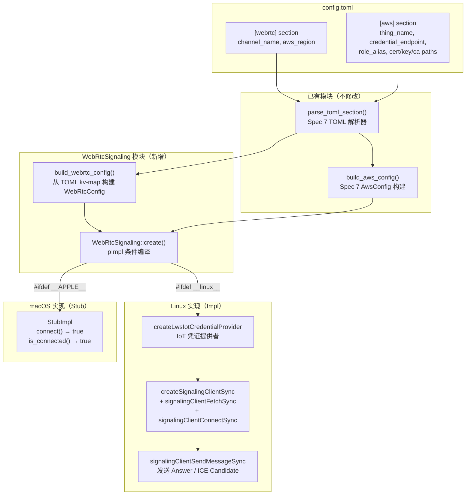

# 设计文档：Spec 12 — KVS WebRTC 信令通道

## 概述

本设计集成 KVS WebRTC C SDK 的信令客户端，实现设备端以 Master 角色连接到 KVS WebRTC 信令通道，完成 SDP Offer/Answer 和 ICE Candidate 的交换。

核心设计目标：
- **WebRtcSignaling 模块（pImpl 模式）**：封装 KVS WebRTC C SDK 的 SignalingClient 生命周期，通过 pImpl 隔离平台实现
- **平台条件编译**：Linux 链接 KVS WebRTC C SDK（`libkvsWebrtcSignalingClient.so`），macOS 使用 stub 实现
- **SDK 内置 IoT 凭证提供者**：使用 SDK 提供的 IoT 凭证提供者（`createLwsIotCredentialProvider` 或 `createCurlIotCredentialProvider`，取决于 SDK 编译配置）直接传入 IoT 证书路径，不通过 CredentialProvider（spec-7）中转
- **配置复用**：复用 Spec 7 的 `parse_toml_section()` + `build_xxx_config()` 模式读取新增的 `[webrtc]` section
- **C++ RAII 包装 C API**：SDK 的 C 风格资源（`PCredentialProvider`、`SIGNALING_CLIENT_HANDLE`）通过析构函数释放
- **provision 脚本扩展**：创建信令通道 + WebRTC IAM policy（和 KVS Stream 同模式）

设计决策：
- **pImpl 模式而非虚函数接口**：WebRtcSignaling 只有一个实现（Linux 真实 / macOS stub），不需要运行时多态。pImpl 隔离 SDK 头文件依赖，macOS 编译时完全不需要 SDK 头文件。
- **IoT 凭证提供者而非 CredentialProvider 中转**：与 kvssink（spec-8）同理，KVS WebRTC C SDK 原生支持 IoT 证书认证且内置凭证刷新。CredentialProvider（spec-7）保留给不支持 IoT 认证的组件。
- **signalingClientFetchSync + signalingClientConnectSync 两步连接**：SDK 的 `createSignalingClientSync` 只创建客户端对象，需要先 `signalingClientFetchSync`（执行 Describe/GetEndpoint/GetIceServerConfig）再 `signalingClientConnectSync`（建立 WebSocket 连接）。
- **thing name 作为 IoT 凭证提供者参数**：spec-8 的教训 — SDK 内部用 thing name 设置 `x-amzn-iot-thingname` header，必须传正确的 thing name。

## 架构

### 整体架构图



### 文件布局

```
device/
├── CMakeLists.txt              # 修改：添加 webrtc_module + webrtc_test + 条件查找 SDK
├── src/
│   ├── webrtc_signaling.h      # 新增：WebRtcConfig + WebRtcSignaling 类声明
│   ├── webrtc_signaling.cpp    # 新增：实现（pImpl，条件编译 Linux/macOS）
│   ├── credential_provider.h   # 不修改（复用 AwsConfig、parse_toml_section、build_aws_config）
│   └── ...
├── config/
│   ├── config.toml             # 修改：由 provision 脚本自动生成 [webrtc] section
│   └── config.toml.example     # 修改：新增 [webrtc] section 示例
└── tests/
    ├── webrtc_test.cpp         # 新增：WebRTC 配置加载 + stub 测试（含 PBT）
    └── ...                     # 现有测试不修改

scripts/
└── provision-device.sh         # 修改：新增信令通道创建 + WebRTC IAM 权限
```

## 组件与接口

### webrtc_signaling.h（新增）

```cpp
// webrtc_signaling.h
// KVS WebRTC signaling client with platform-conditional compilation (pImpl).
#pragma once

#include <functional>
#include <memory>
#include <string>
#include <unordered_map>
#include "credential_provider.h"  // AwsConfig, parse_toml_section

// WebRTC 信令配置（从 TOML [webrtc] section 解析）
struct WebRtcConfig {
    std::string channel_name;  // 信令通道名称
    std::string aws_region;    // AWS 区域
};

// 从 TOML key-value map 构建 WebRtcConfig
// 缺少必要字段时返回 false 并填充 error_msg（包含缺失字段名）
bool build_webrtc_config(
    const std::unordered_map<std::string, std::string>& kv,
    WebRtcConfig& config,
    std::string* error_msg = nullptr);

// KVS WebRTC 信令客户端
// - Linux：使用 KVS WebRTC C SDK 创建真实 SignalingClient
// - macOS：使用 stub 实现
class WebRtcSignaling {
public:
    using OfferCallback = std::function<void(const std::string& peer_id, const std::string& sdp)>;
    using IceCandidateCallback = std::function<void(const std::string& peer_id, const std::string& candidate)>;

    // 工厂方法：根据平台创建实例
    static std::unique_ptr<WebRtcSignaling> create(
        const WebRtcConfig& config,
        const AwsConfig& aws_config,
        std::string* error_msg = nullptr);

    // 连接到信令通道（Master 角色）
    bool connect(std::string* error_msg = nullptr);

    // 断开信令连接
    void disconnect();

    // 查询连接状态
    bool is_connected() const;

    // 重连（释放旧客户端，创建新客户端重新连接）
    bool reconnect(std::string* error_msg = nullptr);

    // 注册 SDP Offer 接收回调
    void set_offer_callback(OfferCallback cb);

    // 注册 ICE Candidate 接收回调
    void set_ice_candidate_callback(IceCandidateCallback cb);

    // 向指定 Viewer 发送 SDP Answer
    bool send_answer(const std::string& peer_id, const std::string& sdp_answer);

    // 向指定 Viewer 发送 ICE Candidate
    bool send_ice_candidate(const std::string& peer_id, const std::string& candidate);

    ~WebRtcSignaling();
    WebRtcSignaling(const WebRtcSignaling&) = delete;
    WebRtcSignaling& operator=(const WebRtcSignaling&) = delete;

private:
    WebRtcSignaling();
    struct Impl;
    std::unique_ptr<Impl> impl_;
};
```


### webrtc_signaling.cpp 实现要点

```cpp
// webrtc_signaling.cpp
#include "webrtc_signaling.h"
#include <spdlog/spdlog.h>
#include <vector>

// ============================================================
// build_webrtc_config — 与 build_kvs_config / build_aws_config 同模式
// ============================================================

bool build_webrtc_config(
    const std::unordered_map<std::string, std::string>& kv,
    WebRtcConfig& config,
    std::string* error_msg) {
    static const std::vector<std::pair<std::string, std::string WebRtcConfig::*>> fields = {
        {"channel_name", &WebRtcConfig::channel_name},
        {"aws_region",   &WebRtcConfig::aws_region},
    };

    std::vector<std::string> missing;
    for (const auto& [name, member_ptr] : fields) {
        auto it = kv.find(name);
        if (it == kv.end() || it->second.empty()) {
            missing.push_back(name);
        } else {
            config.*member_ptr = it->second;
        }
    }

    if (!missing.empty()) {
        if (error_msg) {
            std::string msg = "Missing required fields in [webrtc]: ";
            for (size_t i = 0; i < missing.size(); ++i) {
                if (i > 0) msg += ", ";
                msg += missing[i];
            }
            *error_msg = msg;
        }
        return false;
    }
    return true;
}

// ============================================================
// 平台条件编译：Linux 真实实现 / macOS stub
// ============================================================

#ifdef __linux__
// ---- Linux: KVS WebRTC C SDK 真实实现 ----

// SDK 头文件（仅 Linux 编译时需要）
extern "C" {
#include <com/amazonaws/kinesis/video/webrtcclient/Include.h>
}

struct WebRtcSignaling::Impl {
    WebRtcConfig config;
    AwsConfig aws_config;
    PCredentialProvider credential_provider = nullptr;
    SIGNALING_CLIENT_HANDLE signaling_handle = INVALID_SIGNALING_CLIENT_HANDLE_VALUE;
    bool connected = false;

    OfferCallback offer_cb;
    IceCandidateCallback ice_cb;

    // SDK 回调（C 函数，通过 customData 转发到 C++ 回调）
    static STATUS on_signaling_state_changed(UINT64 custom_data, SIGNALING_CLIENT_STATE_TYPE state) {
        auto* self = reinterpret_cast<Impl*>(custom_data);
        auto logger = spdlog::get("pipeline");
        if (state == SIGNALING_CLIENT_STATE_CONNECTED) {
            self->connected = true;
            if (logger) logger->info("Signaling client connected to channel: {}",
                                     self->config.channel_name);
        } else if (state == SIGNALING_CLIENT_STATE_DISCONNECTED) {
            self->connected = false;
            if (logger) logger->info("Signaling client disconnected from channel: {}",
                                     self->config.channel_name);
        }
        return STATUS_SUCCESS;
    }

    static STATUS on_signaling_message_received(UINT64 custom_data,
                                                 PReceivedSignalingMessage pMsg) {
        auto* self = reinterpret_cast<Impl*>(custom_data);
        auto logger = spdlog::get("pipeline");
        std::string peer_id(pMsg->signalingMessage.peerClientId);

        switch (pMsg->signalingMessage.messageType) {
            case SIGNALING_MESSAGE_TYPE_OFFER:
                if (logger) logger->info("Received SDP offer from peer: {}", peer_id);
                if (self->offer_cb) {
                    std::string sdp(pMsg->signalingMessage.payload,
                                    pMsg->signalingMessage.payloadLen);
                    self->offer_cb(peer_id, sdp);
                } else {
                    if (logger) logger->warn("No offer callback registered, discarding offer from: {}",
                                             peer_id);
                }
                break;
            case SIGNALING_MESSAGE_TYPE_ICE_CANDIDATE:
                if (logger) logger->info("Received ICE candidate from peer: {}", peer_id);
                if (self->ice_cb) {
                    std::string candidate(pMsg->signalingMessage.payload,
                                          pMsg->signalingMessage.payloadLen);
                    self->ice_cb(peer_id, candidate);
                } else {
                    if (logger) logger->warn("No ICE callback registered, discarding candidate from: {}",
                                             peer_id);
                }
                break;
            default:
                if (logger) logger->debug("Received signaling message type {} from peer: {}",
                                          static_cast<int>(pMsg->signalingMessage.messageType), peer_id);
                break;
        }
        return STATUS_SUCCESS;
    }

    bool init_credential_provider(std::string* error_msg) {
        STATUS status = createLwsIotCredentialProvider(
            aws_config.credential_endpoint.c_str(),
            aws_config.cert_path.c_str(),
            aws_config.key_path.c_str(),
            aws_config.ca_path.c_str(),
            aws_config.role_alias.c_str(),
            aws_config.thing_name.c_str(),
            &credential_provider);

        if (STATUS_FAILED(status)) {
            if (error_msg) {
                *error_msg = "Failed to create IoT credential provider, status: 0x"
                    + to_hex(status);
            }
            return false;
        }
        auto logger = spdlog::get("pipeline");
        if (logger) logger->info("IoT credential provider initialized for thing: {}",
                                 aws_config.thing_name);
        return true;
    }

    bool create_and_connect(std::string* error_msg) {
        // 配置回调
        SignalingClientCallbacks callbacks;
        MEMSET(&callbacks, 0, SIZEOF(SignalingClientCallbacks));
        callbacks.version = SIGNALING_CLIENT_CALLBACKS_CURRENT_VERSION;
        callbacks.customData = reinterpret_cast<UINT64>(this);
        callbacks.stateChangeFn = on_signaling_state_changed;
        callbacks.messageReceivedFn = on_signaling_message_received;

        // 客户端信息
        SignalingClientInfo client_info;
        MEMSET(&client_info, 0, SIZEOF(SignalingClientInfo));
        client_info.version = SIGNALING_CLIENT_INFO_CURRENT_VERSION;
        client_info.loggingLevel = LOG_LEVEL_WARN;
        STRCPY(client_info.clientId, "raspi-eye-master");

        // 通道信息
        ChannelInfo channel_info;
        MEMSET(&channel_info, 0, SIZEOF(ChannelInfo));
        channel_info.version = CHANNEL_INFO_CURRENT_VERSION;
        channel_info.pChannelName = const_cast<PCHAR>(config.channel_name.c_str());
        channel_info.pKmsKeyId = NULL;
        channel_info.tagCount = 0;
        channel_info.pTags = NULL;
        channel_info.channelType = SIGNALING_CHANNEL_TYPE_SINGLE_MASTER;
        channel_info.channelRoleType = SIGNALING_CHANNEL_ROLE_TYPE_MASTER;
        channel_info.cachingPolicy = SIGNALING_API_CALL_CACHE_TYPE_FILE;
        channel_info.pRegion = const_cast<PCHAR>(config.aws_region.c_str());

        // 创建信令客户端
        STATUS status = createSignalingClientSync(
            &client_info, &channel_info, &callbacks,
            credential_provider, &signaling_handle);
        if (STATUS_FAILED(status)) {
            if (error_msg) {
                *error_msg = "Failed to create signaling client for channel '"
                    + config.channel_name + "', status: 0x" + to_hex(status);
            }
            return false;
        }

        // Fetch（Describe/GetEndpoint/GetIceServerConfig）
        status = signalingClientFetchSync(signaling_handle);
        if (STATUS_FAILED(status)) {
            if (error_msg) {
                *error_msg = "Failed to fetch signaling channel '"
                    + config.channel_name + "', status: 0x" + to_hex(status);
            }
            freeSignalingClient(&signaling_handle);
            signaling_handle = INVALID_SIGNALING_CLIENT_HANDLE_VALUE;
            return false;
        }

        // 连接（建立 WebSocket）
        status = signalingClientConnectSync(signaling_handle);
        if (STATUS_FAILED(status)) {
            if (error_msg) {
                *error_msg = "Failed to connect signaling client for channel '"
                    + config.channel_name + "', status: 0x" + to_hex(status);
            }
            freeSignalingClient(&signaling_handle);
            signaling_handle = INVALID_SIGNALING_CLIENT_HANDLE_VALUE;
            return false;
        }

        return true;
    }

    void release_signaling_client() {
        if (IS_VALID_SIGNALING_CLIENT_HANDLE(signaling_handle)) {
            freeSignalingClient(&signaling_handle);
            signaling_handle = INVALID_SIGNALING_CLIENT_HANDLE_VALUE;
        }
        connected = false;
    }

    ~Impl() {
        release_signaling_client();
        if (credential_provider != nullptr) {
            freeIotCredentialProvider(&credential_provider);
            credential_provider = nullptr;
        }
    }

    static std::string to_hex(STATUS status) {
        char buf[16];
        snprintf(buf, sizeof(buf), "%08x", status);
        return std::string(buf);
    }
};

#else
// ---- macOS: Stub 实现 ----

struct WebRtcSignaling::Impl {
    WebRtcConfig config;
    AwsConfig aws_config;
    bool connected = false;

    OfferCallback offer_cb;
    IceCandidateCallback ice_cb;

    bool init_credential_provider(std::string* /*error_msg*/) {
        // macOS stub: 不需要真实凭证
        return true;
    }

    bool create_and_connect(std::string* /*error_msg*/) {
        connected = true;
        auto logger = spdlog::get("pipeline");
        if (logger) logger->info("WebRTC stub connected to channel: {}", config.channel_name);
        return true;
    }

    void release_signaling_client() {
        connected = false;
    }

    ~Impl() = default;
};

#endif  // __linux__ / __APPLE__

// ============================================================
// WebRtcSignaling 公共接口实现（平台无关）
// ============================================================

WebRtcSignaling::WebRtcSignaling() = default;
WebRtcSignaling::~WebRtcSignaling() = default;

std::unique_ptr<WebRtcSignaling> WebRtcSignaling::create(
    const WebRtcConfig& config,
    const AwsConfig& aws_config,
    std::string* error_msg) {
    auto obj = std::unique_ptr<WebRtcSignaling>(new WebRtcSignaling());
    obj->impl_ = std::make_unique<Impl>();
    obj->impl_->config = config;
    obj->impl_->aws_config = aws_config;

    if (!obj->impl_->init_credential_provider(error_msg)) {
        return nullptr;
    }

    auto logger = spdlog::get("pipeline");
#ifdef __linux__
    if (logger) logger->info("Created KVS WebRTC SignalingClient for channel: {}",
                             config.channel_name);
#else
    if (logger) logger->info("Created WebRTC stub for channel: {}", config.channel_name);
#endif

    return obj;
}

bool WebRtcSignaling::connect(std::string* error_msg) {
    return impl_->create_and_connect(error_msg);
}

void WebRtcSignaling::disconnect() {
    impl_->release_signaling_client();
    auto logger = spdlog::get("pipeline");
    if (logger) logger->info("Signaling client disconnected");
}

bool WebRtcSignaling::is_connected() const {
    return impl_->connected;
}

bool WebRtcSignaling::reconnect(std::string* error_msg) {
    impl_->release_signaling_client();
    return impl_->create_and_connect(error_msg);
}

void WebRtcSignaling::set_offer_callback(OfferCallback cb) {
    impl_->offer_cb = std::move(cb);
}

void WebRtcSignaling::set_ice_candidate_callback(IceCandidateCallback cb) {
    impl_->ice_cb = std::move(cb);
}

bool WebRtcSignaling::send_answer(const std::string& peer_id, const std::string& sdp_answer) {
    auto logger = spdlog::get("pipeline");
    if (!impl_->connected) {
        if (logger) logger->warn("Cannot send answer: signaling client not connected");
        return false;
    }
#ifdef __linux__
    if (sdp_answer.size() >= MAX_SIGNALING_MESSAGE_LEN) {
        if (logger) logger->error("SDP answer too large ({} bytes, max {})",
                                  sdp_answer.size(), MAX_SIGNALING_MESSAGE_LEN);
        return false;
    }
    SignalingMessage msg;
    MEMSET(&msg, 0, SIZEOF(SignalingMessage));
    msg.version = SIGNALING_MESSAGE_CURRENT_VERSION;
    msg.messageType = SIGNALING_MESSAGE_TYPE_ANSWER;
    STRNCPY(msg.peerClientId, peer_id.c_str(), MAX_SIGNALING_CLIENT_ID_LEN);
    STRNCPY(msg.payload, sdp_answer.c_str(), MAX_SIGNALING_MESSAGE_LEN);
    msg.payloadLen = static_cast<UINT32>(sdp_answer.size());

    STATUS status = signalingClientSendMessageSync(impl_->signaling_handle, &msg);
    if (STATUS_FAILED(status)) {
        if (logger) logger->error("Failed to send answer to peer {}, status: 0x{:08x}",
                                  peer_id, status);
        return false;
    }
    if (logger) logger->info("Sent SDP answer to peer: {}", peer_id);
#else
    if (logger) logger->info("Stub: sent SDP answer to peer: {}", peer_id);
#endif
    return true;
}

bool WebRtcSignaling::send_ice_candidate(const std::string& peer_id, const std::string& candidate) {
    auto logger = spdlog::get("pipeline");
    if (!impl_->connected) {
        if (logger) logger->warn("Cannot send ICE candidate: signaling client not connected");
        return false;
    }
#ifdef __linux__
    if (candidate.size() >= MAX_SIGNALING_MESSAGE_LEN) {
        if (logger) logger->error("ICE candidate too large ({} bytes, max {})",
                                  candidate.size(), MAX_SIGNALING_MESSAGE_LEN);
        return false;
    }
    SignalingMessage msg;
    MEMSET(&msg, 0, SIZEOF(SignalingMessage));
    msg.version = SIGNALING_MESSAGE_CURRENT_VERSION;
    msg.messageType = SIGNALING_MESSAGE_TYPE_ICE_CANDIDATE;
    STRNCPY(msg.peerClientId, peer_id.c_str(), MAX_SIGNALING_CLIENT_ID_LEN);
    STRNCPY(msg.payload, candidate.c_str(), MAX_SIGNALING_MESSAGE_LEN);
    msg.payloadLen = static_cast<UINT32>(candidate.size());

    STATUS status = signalingClientSendMessageSync(impl_->signaling_handle, &msg);
    if (STATUS_FAILED(status)) {
        if (logger) logger->error("Failed to send ICE candidate to peer {}, status: 0x{:08x}",
                                  peer_id, status);
        return false;
    }
    if (logger) logger->info("Sent ICE candidate to peer: {}", peer_id);
#else
    if (logger) logger->info("Stub: sent ICE candidate to peer: {}", peer_id);
#endif
    return true;
}
```

### CMakeLists.txt 修改

```cmake
# WebRTC 信令模块
add_library(webrtc_module STATIC src/webrtc_signaling.cpp)
target_include_directories(webrtc_module PUBLIC src)
target_link_libraries(webrtc_module PUBLIC spdlog::spdlog credential_module)

# Linux: 查找 KVS WebRTC C SDK
if(CMAKE_SYSTEM_NAME STREQUAL "Linux")
    # 尝试通过 pkg-config 或 find_library 查找 SDK
    # 用户可通过 -DKVS_WEBRTC_SDK_DIR=/path/to/sdk 指定 SDK 安装路径
    set(KVS_WEBRTC_SEARCH_PATHS /usr/local/lib /opt/kvs-webrtc/lib)
    set(KVS_WEBRTC_INCLUDE_SEARCH_PATHS /usr/local/include /opt/kvs-webrtc/include)
    if(KVS_WEBRTC_SDK_DIR)
        list(INSERT KVS_WEBRTC_SEARCH_PATHS 0 "${KVS_WEBRTC_SDK_DIR}/lib")
        list(INSERT KVS_WEBRTC_INCLUDE_SEARCH_PATHS 0 "${KVS_WEBRTC_SDK_DIR}/include")
    endif()

    find_library(KVS_WEBRTC_SIGNALING_LIB kvsWebrtcSignalingClient
        PATHS ${KVS_WEBRTC_SEARCH_PATHS}
        NO_DEFAULT_PATH)
    find_path(KVS_WEBRTC_INCLUDE_DIR
        com/amazonaws/kinesis/video/webrtcclient/Include.h
        PATHS ${KVS_WEBRTC_INCLUDE_SEARCH_PATHS}
        NO_DEFAULT_PATH)

    if(KVS_WEBRTC_SIGNALING_LIB AND KVS_WEBRTC_INCLUDE_DIR)
        target_include_directories(webrtc_module PRIVATE ${KVS_WEBRTC_INCLUDE_DIR})
        target_link_libraries(webrtc_module PRIVATE ${KVS_WEBRTC_SIGNALING_LIB})
        message(STATUS "WebRTC module: ENABLED (KVS WebRTC C SDK found)")
    else()
        message(WARNING "WebRTC module: KVS WebRTC C SDK not found, using stub on Linux")
        # 回退到 stub：不定义 __linux__ 的 SDK 部分，编译 stub 路径
        target_compile_definitions(webrtc_module PRIVATE WEBRTC_USE_STUB=1)
    endif()
else()
    message(STATUS "WebRTC module: using stub (non-Linux platform)")
endif()

# WebRTC 测试
add_executable(webrtc_test tests/webrtc_test.cpp)
target_link_libraries(webrtc_test PRIVATE
    webrtc_module
    GTest::gtest_main
    rapidcheck
    rapidcheck_gtest)
add_test(NAME webrtc_test COMMAND webrtc_test
    WORKING_DIRECTORY "${CMAKE_CURRENT_SOURCE_DIR}/..")
```

> 注意：条件编译策略需要细化。当 Linux 上找不到 SDK 时，不能简单地不定义 `__linux__`（因为 `__linux__` 是编译器内置宏）。实际实现中应使用自定义宏 `HAVE_KVS_WEBRTC_SDK`：
> - Linux + SDK 可用：定义 `HAVE_KVS_WEBRTC_SDK`，编译真实实现
> - Linux + SDK 不可用：不定义，编译 stub（和 macOS 相同路径）
> - macOS：不定义，编译 stub
>
> webrtc_signaling.cpp 中的条件编译改为 `#ifdef HAVE_KVS_WEBRTC_SDK` 而非 `#ifdef __linux__`。CMakeLists.txt 在找到 SDK 时 `target_compile_definitions(webrtc_module PRIVATE HAVE_KVS_WEBRTC_SDK=1)`。

### config.toml 新增内容

```toml
[webrtc]
channel_name = "RaspiEyeAlphaChannel"
aws_region = "ap-southeast-1"
```

### config.toml.example 新增内容

```toml
# KVS WebRTC signaling channel configuration
# channel_name: signaling channel name (must be pre-created via provision script or AWS CLI)
# aws_region: AWS region where the signaling channel is located
[webrtc]
channel_name = "<your-signaling-channel-name>"
aws_region = "<your-aws-region>"
```

## provision-device.sh 扩展设计

### 幂等设计原则

所有新增函数遵循现有脚本的幂等模式 — 先检查资源是否存在，已存在则跳过并记录日志：

| 函数 | 幂等检查方式 | 已存在时行为 |
|------|------------|------------|
| `create_signaling_channel()` | `aws kinesisvideo describe-signaling-channel` | 跳过，记录 "already exists" |
| `attach_webrtc_iam_policy()` | `aws iam get-role-policy` | 跳过，记录 "already attached" |
| `generate_toml_config()` [webrtc] | awk 删除旧 `[webrtc]` section 再追加新的 | 覆盖更新，不重复 |

### 新增参数

| 参数 | 必需 | 默认值 | 说明 |
|------|------|--------|------|
| `--signaling-channel-name` | 否 | `{thing-name}Channel` | 信令通道名称 |

### 新增函数

#### `create_signaling_channel()`（provision 模式）

```bash
create_signaling_channel() {
    local channel_name="${SIGNALING_CHANNEL_NAME}"
    log_info "Checking signaling channel '${channel_name}'..."
    if aws kinesisvideo describe-signaling-channel --channel-name "$channel_name" &>/dev/null; then
        log_info "Signaling channel '${channel_name}' already exists, skipping"
        return 0
    fi
    log_info "Creating signaling channel '${channel_name}'..."
    aws kinesisvideo create-signaling-channel \
        --channel-name "$channel_name" \
        --channel-type SINGLE_MASTER
    log_success "Created signaling channel '${channel_name}'"
}
```

#### `attach_webrtc_iam_policy()`（provision 模式）

IAM inline policy 名称：`{project-name}WebRtcPolicy`

权限范围限定到特定信令通道 ARN（最小权限原则）：

```json
{
    "Version": "2012-10-17",
    "Statement": [
        {
            "Effect": "Allow",
            "Action": [
                "kinesisvideo:DescribeSignalingChannel",
                "kinesisvideo:GetSignalingChannelEndpoint",
                "kinesisvideo:GetIceServerConfig",
                "kinesisvideo:ConnectAsMaster"
            ],
            "Resource": "arn:aws:kinesisvideo:{region}:{account-id}:channel/{channel-name}/*"
        }
    ]
}
```

```bash
attach_webrtc_iam_policy() {
    local policy_name="${PROJECT_NAME}WebRtcPolicy"
    log_info "Checking IAM inline policy '${policy_name}' on role '${ROLE_NAME}'..."
    if aws iam get-role-policy --role-name "$ROLE_NAME" --policy-name "$policy_name" &>/dev/null; then
        log_info "WebRTC IAM policy already attached, skipping"
        return 0
    fi
    local channel_arn="arn:aws:kinesisvideo:${AWS_REGION}:${AWS_ACCOUNT_ID}:channel/${SIGNALING_CHANNEL_NAME}/*"
    local policy_doc
    policy_doc=$(printf '{"Version":"2012-10-17","Statement":[{"Effect":"Allow","Action":["kinesisvideo:DescribeSignalingChannel","kinesisvideo:GetSignalingChannelEndpoint","kinesisvideo:GetIceServerConfig","kinesisvideo:ConnectAsMaster"],"Resource":"%s"}]}' "$channel_arn")
    log_info "Attaching WebRTC IAM policy to role '${ROLE_NAME}'..."
    aws iam put-role-policy \
        --role-name "$ROLE_NAME" \
        --policy-name "$policy_name" \
        --policy-document "$policy_doc"
    log_success "Attached WebRTC IAM policy '${policy_name}'"
}
```

#### `generate_toml_config()` 修改

在现有 `[kvs]` section 生成之后，追加 `[webrtc]` section。幂等处理沿用 awk "先删旧再写新"模式。

```bash
# 构建 [webrtc] section 内容
local webrtc_section=""
webrtc_section+="[webrtc]"
webrtc_section+='\n'
webrtc_section+="channel_name = \"${SIGNALING_CHANNEL_NAME}\""
webrtc_section+='\n'
webrtc_section+="aws_region = \"${AWS_REGION}\""

# 写入 config.toml（幂等：先删旧 [webrtc] section 再追加新的）
if [[ -f "$config_file" ]]; then
    local tmp_file="${config_file}.tmp"
    awk '/^\[webrtc\]/{skip=1; next} /^\[/{skip=0} !skip' "$config_file" > "$tmp_file"
    mv "$tmp_file" "$config_file"
fi
printf '\n%s\n' "$webrtc_section" >> "$config_file"
```

#### verify 模式扩展

新增两项检查：
- 信令通道存在性：`aws kinesisvideo describe-signaling-channel --channel-name "$SIGNALING_CHANNEL_NAME"`
- IAM inline policy 存在性：`aws iam get-role-policy --role-name "$ROLE_NAME" --policy-name "${PROJECT_NAME}WebRtcPolicy"`

#### cleanup 模式扩展

新增两项删除（在现有 KVS IAM policy 删除之后、证书 detach 之前执行，即 Step 0a/0b 之后）：
- 删除 WebRTC IAM inline policy：`aws iam delete-role-policy --role-name "$ROLE_NAME" --policy-name "${PROJECT_NAME}WebRtcPolicy"`
- 删除信令通道：先获取 ARN，再 `aws kinesisvideo delete-signaling-channel --channel-arn "$CHANNEL_ARN"`

> 注意：所有 IAM inline policy 必须在删除 IAM Role 之前删除，否则 Role 删不掉。

#### summary 输出扩展

新增一行：
```
[INFO] Signaling Channel:   {SIGNALING_CHANNEL_NAME}
```

### 调用顺序（provision 模式）

```
do_provision():
    create_thing
    create_certificate
    download_root_ca
    recover_cert_arn
    attach_cert_to_thing
    create_iot_policy
    attach_policy_to_cert
    create_iam_role
    create_role_alias
    create_kvs_stream
    attach_kvs_iam_policy
    create_signaling_channel      ← 新增
    attach_webrtc_iam_policy      ← 新增
    get_credential_endpoint
    generate_toml_config          ← 修改：追加 [webrtc] section
    print_summary                 ← 修改：追加信令通道信息
```

## 数据模型

### WebRtcConfig（TOML [webrtc] section）

| 字段 | 类型 | 来源 | 说明 |
|------|------|------|------|
| `channel_name` | `std::string` | config.toml `[webrtc]` | 信令通道名称（需预先创建） |
| `aws_region` | `std::string` | config.toml `[webrtc]` | AWS 区域（如 `ap-southeast-1`） |

### AwsConfig（已有，复用）

| 字段 | 类型 | 来源 | 说明 |
|------|------|------|------|
| `thing_name` | `std::string` | config.toml `[aws]` | IoT Thing 名称（传给 `createLwsIotCredentialProvider`） |
| `credential_endpoint` | `std::string` | config.toml `[aws]` | IoT Credentials Provider 端点 |
| `role_alias` | `std::string` | config.toml `[aws]` | IAM Role Alias |
| `cert_path` | `std::string` | config.toml `[aws]` | 客户端证书路径（PEM） |
| `key_path` | `std::string` | config.toml `[aws]` | 客户端私钥路径（PEM） |
| `ca_path` | `std::string` | config.toml `[aws]` | CA 证书路径 |

### TOML 配置文件完整格式

```toml
[aws]
thing_name = "RaspiEyeAlpha"
credential_endpoint = "c19imbvbcm8u20.credentials.iot.ap-southeast-1.amazonaws.com"
role_alias = "RaspiEyeRoleAlias"
cert_path = "device/certs/device-cert.pem"
key_path = "device/certs/device-private.key"
ca_path = "device/certs/root-ca.pem"

[kvs]
stream_name = "RaspiEyeAlphaStream"
aws_region = "ap-southeast-1"

[webrtc]
channel_name = "RaspiEyeAlphaChannel"
aws_region = "ap-southeast-1"
```


## 正确性属性（Correctness Properties）

*属性（Property）是在系统所有合法执行中都应成立的特征或行为——本质上是对系统行为的形式化陈述。属性是人类可读规格与机器可验证正确性保证之间的桥梁。*

### Prework 分析总结

从 10 个需求的验收标准中，识别出以下可作为 property-based testing 的候选：

| 来源 | 分类 | 说明 |
|------|------|------|
| 1.1 + 9.1 + 9.10 | PROPERTY | WebRTC 配置 round-trip：随机生成 channel_name/aws_region → 写入 TOML → 解析 → 验证一致 |
| 1.3 + 9.3 | PROPERTY | 缺失字段检测：随机移除 {channel_name, aws_region} 子集 → build_webrtc_config 返回 false → 错误信息包含字段名 |
| 1.2 + 9.2 | EXAMPLE | [webrtc] section 不存在 → 空 map → build_webrtc_config 失败 |
| 2.3 + 9.4 | EXAMPLE | macOS 创建 stub 实例，connect() 返回成功，is_connected() 返回 true |
| 9.5 | EXAMPLE | macOS stub disconnect() 将 is_connected() 设为 false |
| 6.3 + 9.6 | EXAMPLE | 未连接时 send_answer/send_ice_candidate 返回 false |
| 7.4 | EXAMPLE | macOS stub reconnect() 返回成功 |
| 8.1-8.8 | INTEGRATION | provision 脚本扩展（信令通道创建、IAM 权限、verify、cleanup）— 需要真实 AWS 环境手动验证 |
| 2.2, 3.1-3.2, 4.1-4.5, 5.3-5.5, 6.4, 7.2, 7.5 | INTEGRATION | Linux + KVS WebRTC SDK（需 Pi 5 + SDK） |
| 其余 | SMOKE | 编译约束、API 存在性、RAII、日志安全 |

### Property Reflection

- 1.1（WebRTC 配置 round-trip）测试 `build_webrtc_config` 的正常路径
- 1.3（缺失字段检测）测试 `build_webrtc_config` 的错误路径

这 2 个属性分别测试同一函数的不同路径（正常 vs 错误），无冗余，各自提供独立的验证价值。

与 spec-8 不同，本 spec 没有 `build_iot_certificate_string` 等额外的纯函数需要测试（IoT 凭证提供者通过 SDK 的 `createLwsIotCredentialProvider` 直接初始化，不构建中间字符串）。因此只有 2 个 property。

### Property 1: WebRTC 配置解析 round-trip

*For any* 非空 ASCII 字符串 channel_name 和 aws_region，将其序列化为 TOML `[webrtc]` section 格式（`channel_name = "..."` 和 `aws_region = "..."`），然后用 `parse_toml_section` 解析该 TOML 内容，再用 `build_webrtc_config` 构建 WebRtcConfig，结果的 `channel_name` 和 `aws_region` 应与原始值完全一致。

**Validates: Requirements 1.1, 9.1, 9.10**

### Property 2: WebRTC 配置缺失字段检测

*For any* {channel_name, aws_region} 的非空真子集被移除后，`build_webrtc_config()` 应返回 false，且错误信息应包含所有被移除字段的名称。

**Validates: Requirements 1.3, 9.3**

## 错误处理

### 配置加载错误

| 错误场景 | 处理方式 | 日志 |
|---------|---------|------|
| config.toml 不存在 | `parse_toml_section()` 返回空 map，error_msg 包含文件路径 | error: "Cannot open config file: {path}" |
| `[webrtc]` section 不存在 | 返回空 map，`build_webrtc_config()` 检测到缺失字段 | error: "Missing required fields in [webrtc]: channel_name, aws_region" |
| 缺少 `channel_name` | `build_webrtc_config()` 返回 false | error: "Missing required fields in [webrtc]: channel_name" |
| 缺少 `aws_region` | `build_webrtc_config()` 返回 false | error: "Missing required fields in [webrtc]: aws_region" |

### 信令客户端创建错误

| 错误场景 | 处理方式 | 日志 |
|---------|---------|------|
| macOS 平台 | 创建 stub，connect() 立即返回 true | info: "Created WebRTC stub for channel: {name}" |
| Linux + SDK 可用 | 创建真实 SignalingClient | info: "Created KVS WebRTC SignalingClient for channel: {name}" |
| Linux + SDK 不可用 | 编译时回退到 stub（`HAVE_KVS_WEBRTC_SDK` 未定义） | CMake WARNING: "KVS WebRTC C SDK not found, using stub on Linux" |
| IoT 凭证提供者创建失败 | `create()` 返回 nullptr，填充 error_msg | error: "Failed to create IoT credential provider, status: 0x{status}" |

### 信令连接错误

| 错误场景 | 处理方式 | 日志 |
|---------|---------|------|
| createSignalingClientSync 失败 | `connect()` 返回 false，填充 error_msg | error: "Failed to create signaling client for channel '{name}', status: 0x{status}" |
| signalingClientFetchSync 失败 | `connect()` 返回 false，释放已创建的客户端 | error: "Failed to fetch signaling channel '{name}', status: 0x{status}" |
| signalingClientConnectSync 失败 | `connect()` 返回 false，释放已创建的客户端 | error: "Failed to connect signaling client for channel '{name}', status: 0x{status}" |

### 消息发送错误

| 错误场景 | 处理方式 | 日志 |
|---------|---------|------|
| 未连接时发送 | 返回 false | warn: "Cannot send answer: signaling client not connected" |
| signalingClientSendMessageSync 失败 | 返回 false | error: "Failed to send answer to peer {peer_id}, status: 0x{status}" |

### 日志安全

- 允许输出：channel_name、aws_region、peer_id、消息类型、SDK 状态码
- 禁止输出：cert_path、key_path、ca_path、credential_endpoint、role_alias、SDP 完整内容、ICE Candidate 完整内容
- SHALL NOT 在任何日志级别输出证书路径和凭证信息

## 测试策略

### 测试方法

本 Spec 采用三重验证策略：

1. **Property-based testing（RapidCheck）**：验证 WebRTC 配置解析 round-trip、缺失字段检测
2. **Example-based 单元测试（Google Test）**：验证 macOS stub 创建/连接/断开、未连接时发送失败
3. **ASan 运行时检查**：Debug 构建自动检测内存错误

### Property-Based Testing 配置

- 框架：RapidCheck（已通过 FetchContent 引入）
- 每个属性最少 100 次迭代
- 标签格式：`Feature: webrtc-signaling, Property {N}: {description}`
- TOML 测试使用临时文件写入/读取（复用 spec-7/spec-8 的测试模式）

### 新增测试文件：webrtc_test.cpp

#### Property-Based Tests

| 测试用例 | 对应属性 | 验证内容 |
|---------|---------|---------|
| `WebRtcConfigRoundTrip` | Property 1 | 随机 channel_name/aws_region → TOML → 解析 → 验证一致 |
| `WebRtcConfigMissingFields` | Property 2 | 随机移除字段 → build_webrtc_config 失败 → 错误含字段名 |

#### Example-Based Tests

| 测试用例 | 验证内容 | 对应需求 |
|---------|---------|---------|
| `MissingSectionReturnsError` | [webrtc] section 不存在时 build_webrtc_config 返回 false | 1.2, 9.2 |
| `StubCreateAndConnect` | macOS stub 创建成功，connect() 返回 true，is_connected() 返回 true | 2.3, 9.4 |
| `StubDisconnect` | macOS stub disconnect() 将 is_connected() 设为 false | 9.5 |
| `SendFailsWhenNotConnected` | 未连接时 send_answer/send_ice_candidate 返回 false | 6.3, 9.6 |
| `StubReconnect` | macOS stub reconnect() 返回 true，is_connected() 恢复为 true | 7.4 |
| `SendSucceedsWhenConnected` | 连接后 send_answer/send_ice_candidate 返回 true（stub 场景） | 6.1, 6.2 |

### 现有测试回归

| 测试文件 | 预期 |
|---------|------|
| `smoke_test.cpp` | 全部通过，零修改 |
| `log_test.cpp` | 全部通过，零修改 |
| `tee_test.cpp` | 全部通过，零修改 |
| `camera_test.cpp` | 全部通过，零修改 |
| `health_test.cpp` | 全部通过，零修改 |
| `credential_test.cpp` | 全部通过，零修改 |
| `kvs_test.cpp` | 全部通过，零修改 |
| `yolo_test.cpp` | 全部通过，零修改（如 ONNX Runtime 可用） |

### 测试约束

- 每个测试用例执行时间 ≤ 5 秒
- 所有测试通过 `ctest --test-dir device/build --output-on-failure` 统一运行
- Debug 构建下 ASan 自动生效，任何内存错误会导致测试失败
- 所有测试使用 stub（macOS 环境），不需要真实 KVS WebRTC SDK
- Property tests 使用 RapidCheck，每个属性 100+ 迭代
- TOML 文件测试使用临时文件

### 验证命令

```bash
# macOS Debug 构建 + 测试（使用 stub，不需要 KVS WebRTC SDK）
cmake -B device/build -S device -DCMAKE_BUILD_TYPE=Debug
cmake --build device/build
ctest --test-dir device/build --output-on-failure

# Pi 5 Release 构建 + 测试
cmake -B device/build -S device -DCMAKE_BUILD_TYPE=Release
cmake --build device/build
ctest --test-dir device/build --output-on-failure
```

## 禁止项（Design 层）

- SHALL NOT 在代码中硬编码 AWS 凭证、密钥、证书路径或任何 secret（来源：安全基线）
- SHALL NOT 在日志或错误输出中打印密钥、证书内容、token、SDP 完整内容、ICE Candidate 完整内容等敏感信息（来源：安全基线）
- SHALL NOT 在 macOS 上尝试链接 KVS WebRTC C SDK（macOS 使用 stub 实现）
- SHALL NOT 修改现有测试文件（smoke_test、log_test、tee_test、camera_test、health_test、credential_test、kvs_test、yolo_test）
- SHALL NOT 在不确定 KVS WebRTC C SDK API 用法时凭猜测编写代码（来源：shall-not.md）
- SHALL NOT 通过 CredentialProvider（spec-7）中转凭证给 KVS WebRTC C SDK（SDK 原生 IoT 凭证提供者已内置凭证刷新）
- SHALL NOT 省略 `createLwsIotCredentialProvider` 的 thing_name 参数（来源：spec-8 教训 — SDK 内部用 thing name 设置 `x-amzn-iot-thingname` header）
