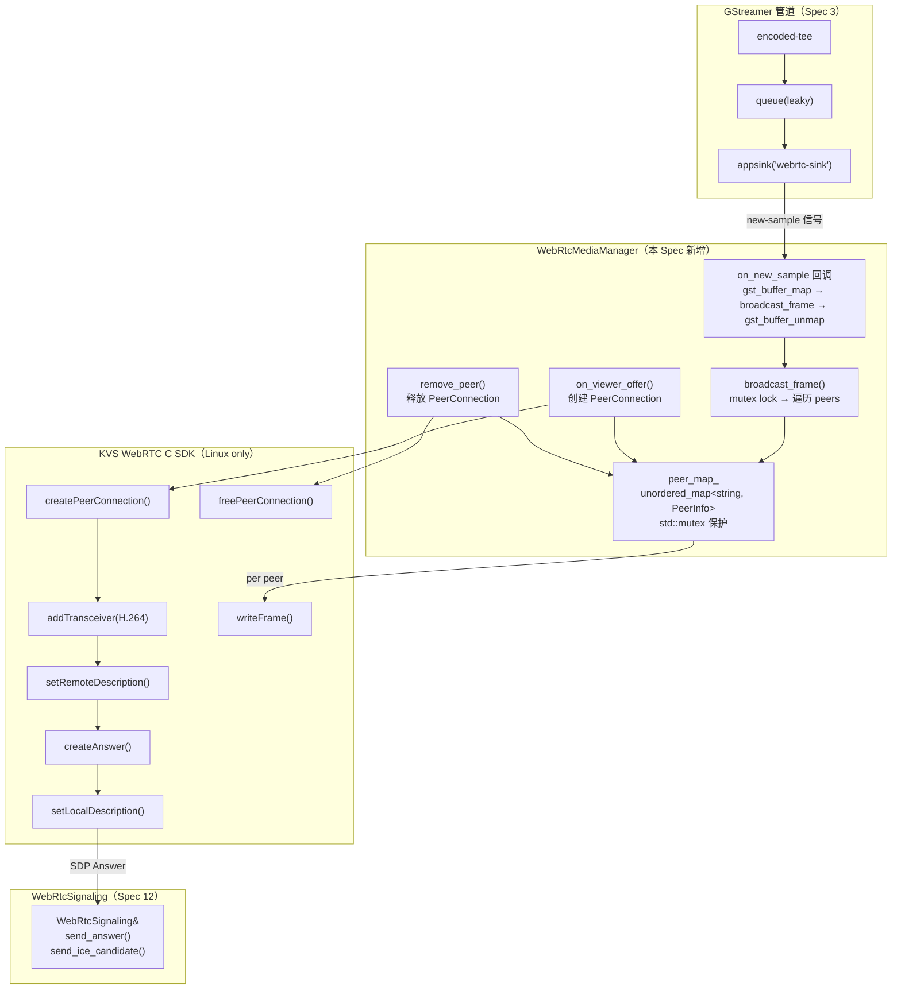
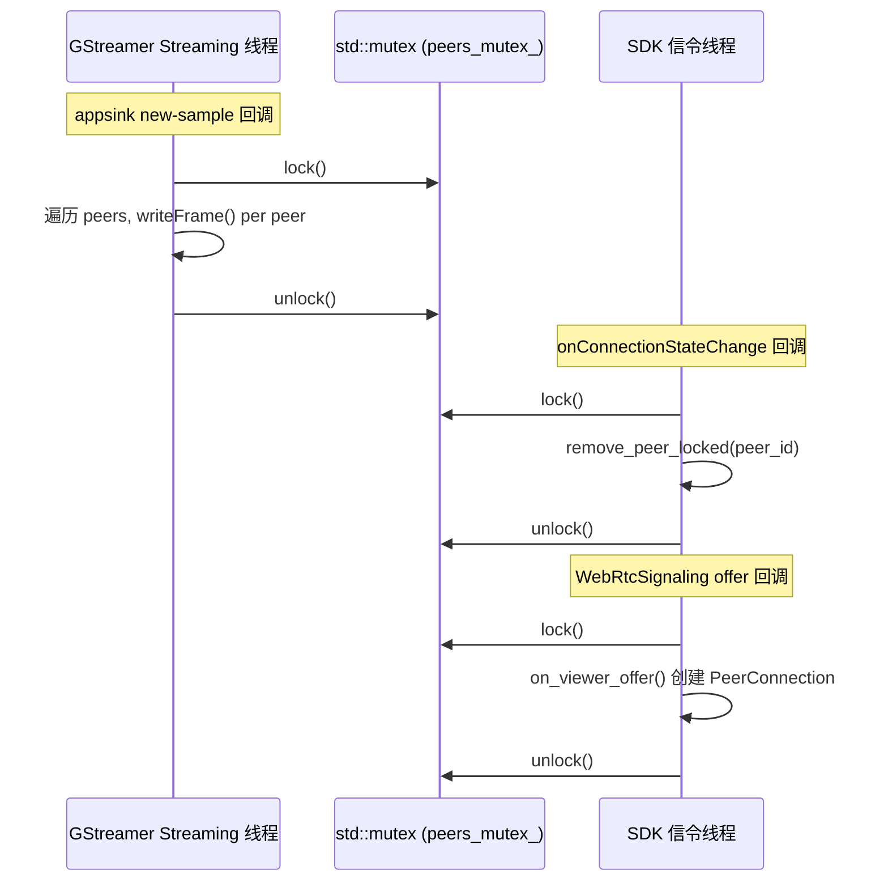

# 设计文档：Spec 13 — WebRTC 媒体流传输

## 概述

本设计在 Spec 12（信令层）基础上实现 WebRTC 媒体流传输，核心模块为 `WebRtcMediaManager`，负责：
1. 管理多个 PeerConnection 的生命周期（每个 Viewer 一个，最多 10 个）
2. 替换 pipeline_builder 中 webrtc 分支的 fakesink 为 appsink，从管道获取 H.264 帧
3. 将 H.264 帧通过 KVS WebRTC C SDK 的 `writeFrame()` 广播到所有已连接的 PeerConnection

核心设计决策：
- **pImpl 模式**：与 Spec 12 的 WebRtcSignaling 一致，通过 pImpl 隔离平台实现，macOS 编译时不需要 SDK 头文件
- **条件编译 `HAVE_KVS_WEBRTC_SDK`**：与 Spec 12 一致，Linux + SDK 可用时编译真实实现，否则编译 stub
- **std::mutex 保护 peer 映射**：`broadcast_frame()` 在 GStreamer streaming 线程调用，`remove_peer()` / `on_viewer_offer()` 可能在 SDK 信令线程调用，需要 mutex 保护 `std::unordered_map<string, PeerInfo>`
- **appsink new-sample 回调同步调用 broadcast_frame**：回调在 GStreamer streaming 线程中执行，`gst_buffer_map` → `broadcast_frame` → `gst_buffer_unmap` 是同步序列，buffer 生命周期安全
- **stub 实现**：维护 peer_id 集合和计数，`broadcast_frame()` 为空操作，用于 macOS 开发环境验证管道集成和 peer 管理逻辑
- **WebRtcMediaManager 生命周期短于 WebRtcSignaling**：持有 `WebRtcSignaling&` 引用，调用方需确保 signaling 对象先于 media manager 销毁
- **writeFrame 非阻塞假设**：KVS WebRTC C SDK 的 `writeFrame()` 内部将帧数据拷贝到 SRTP 发送缓冲区后立即返回，不等待网络 ACK。如果 Pi 5 端到端验证发现阻塞行为，Spec 14 需要改为异步帧分发
- **SDP 验证依赖 SDK**：不做应用层 SDP 格式验证，`setRemoteDescription()` 内部校验畸形 SDP 并返回错误码，由 `on_viewer_offer()` 的错误处理路径覆盖
- **writeFrame 连续失败自动清理**：每个 PeerInfo 维护 `consecutive_write_failures` 计数器，连续失败超过 `kMaxWriteFailures`（100）次后自动 remove_peer，防止僵尸连接

数据流路径：
```
encoded-tee → queue(leaky) → appsink("webrtc-sink")
                                  ↓ (GstBuffer → gst_buffer_map)
                            on_new_sample 回调（GStreamer streaming 线程）
                                  ↓ (data, size, timestamp, is_keyframe)
                            WebRtcMediaManager::broadcast_frame()
                                  ↓ (mutex lock → 遍历 peers → writeFrame per peer)
                            Viewer 1 ... Viewer N (最多 10)
```

## 架构

### 整体架构图



### 线程模型



### 文件布局

```
device/
├── CMakeLists.txt              # 修改：添加 gstreamer-app-1.0 依赖、webrtc_media_module、webrtc_media_test
├── src/
│   ├── webrtc_media.h          # 新增：WebRtcMediaManager 类声明
│   ├── webrtc_media.cpp        # 新增：实现（pImpl，条件编译 HAVE_KVS_WEBRTC_SDK / stub）
│   ├── pipeline_builder.h      # 修改：build_tee_pipeline 新增 WebRtcMediaManager* 参数
│   ├── pipeline_builder.cpp    # 修改：appsink 替换 fakesink + new-sample 回调
│   ├── webrtc_signaling.h      # 不修改（复用 WebRtcSignaling 接口）
│   └── ...
└── tests/
    ├── webrtc_media_test.cpp   # 新增：WebRtcMediaManager 测试（含 PBT）
    └── ...                     # 现有测试不修改
```

## 组件与接口

### webrtc_media.h（新增）

```cpp
// webrtc_media.h
// WebRTC media manager: PeerConnection lifecycle + H.264 frame broadcast (pImpl).
#pragma once

#include <cstddef>
#include <cstdint>
#include <memory>
#include <string>

class WebRtcSignaling;  // 前向声明，避免头文件依赖

// WebRTC 媒体管理器
// - HAVE_KVS_WEBRTC_SDK 定义时：真实 PeerConnection（KVS WebRTC C SDK）
// - 未定义时：stub 实现（维护 peer_id 集合，broadcast_frame 空操作）
class WebRtcMediaManager {
public:
    // 工厂方法：创建实例
    // signaling: WebRtcSignaling 引用（用于发送 SDP Answer 和 ICE Candidate）
    // 调用方需确保 signaling 生命周期长于 WebRtcMediaManager
    static std::unique_ptr<WebRtcMediaManager> create(
        WebRtcSignaling& signaling,
        std::string* error_msg = nullptr);

    // 处理 Viewer 的 SDP Offer（创建 PeerConnection，生成 Answer）
    // 返回 true 表示成功创建/替换 PeerConnection
    bool on_viewer_offer(const std::string& peer_id,
                         const std::string& sdp_offer,
                         std::string* error_msg = nullptr);

    // 处理 Viewer 的 ICE Candidate
    bool on_viewer_ice_candidate(const std::string& peer_id,
                                 const std::string& candidate,
                                 std::string* error_msg = nullptr);

    // 移除指定 Viewer 的 PeerConnection（幂等，不存在时忽略）
    void remove_peer(const std::string& peer_id);

    // 向所有已连接的 PeerConnection 广播一帧 H.264 数据
    // data: 帧数据指针（调用方保证生命周期覆盖本次调用）
    // size: 帧数据大小（字节）
    // timestamp_100ns: 时间戳（100ns 单位，与 KVS SDK HUNDREDS_OF_NANOS 一致）
    // is_keyframe: 是否为关键帧
    void broadcast_frame(const uint8_t* data, size_t size,
                         uint64_t timestamp_100ns, bool is_keyframe);

    // 返回当前活跃 PeerConnection 数量
    size_t peer_count() const;

    ~WebRtcMediaManager();
    WebRtcMediaManager(const WebRtcMediaManager&) = delete;
    WebRtcMediaManager& operator=(const WebRtcMediaManager&) = delete;

private:
    WebRtcMediaManager();
    struct Impl;
    std::unique_ptr<Impl> impl_;
};
```

### webrtc_media.cpp 实现要点

#### Stub 实现（macOS / Linux 无 SDK）

```cpp
// webrtc_media.cpp — stub 实现部分
#ifndef HAVE_KVS_WEBRTC_SDK

#include "webrtc_media.h"
#include "webrtc_signaling.h"
#include <spdlog/spdlog.h>
#include <mutex>
#include <unordered_set>

static constexpr size_t kMaxPeers = 10;
static constexpr size_t kMaxPeerIdLen = 256;

struct WebRtcMediaManager::Impl {
    WebRtcSignaling& signaling;
    std::unordered_set<std::string> peers;
    mutable std::mutex peers_mutex;

    explicit Impl(WebRtcSignaling& sig) : signaling(sig) {}
};

// create(): 创建 stub 实例
std::unique_ptr<WebRtcMediaManager> WebRtcMediaManager::create(
    WebRtcSignaling& signaling, std::string* /*error_msg*/) {
    auto obj = std::unique_ptr<WebRtcMediaManager>(new WebRtcMediaManager());
    obj->impl_ = std::make_unique<Impl>(signaling);
    auto logger = spdlog::get("pipeline");
    if (logger) logger->info("Created WebRtcMediaManager stub");
    return obj;
}

// on_viewer_offer(): stub — 维护 peer_id 集合
bool WebRtcMediaManager::on_viewer_offer(
    const std::string& peer_id, const std::string& /*sdp_offer*/,
    std::string* error_msg) {
    std::lock_guard<std::mutex> lock(impl_->peers_mutex);
    auto logger = spdlog::get("pipeline");

    // peer_id 长度检查
    if (peer_id.size() > kMaxPeerIdLen) {
        if (logger) logger->warn("Rejecting peer with oversized id ({} bytes, max {})",
                                 peer_id.size(), kMaxPeerIdLen);
        if (error_msg) *error_msg = "peer_id too long";
        return false;
    }

    // 同一 peer_id 已存在 → 替换（先移除再添加，计数不变）
    impl_->peers.erase(peer_id);

    if (impl_->peers.size() >= kMaxPeers) {
        if (logger) logger->warn("Max peers ({}) reached, rejecting peer: {}",
                                 kMaxPeers, peer_id);
        if (error_msg) *error_msg = "Max peer count reached";
        return false;
    }
    impl_->peers.insert(peer_id);
    if (logger) logger->info("Stub: added peer {}, count={}", peer_id, impl_->peers.size());
    return true;
}

// on_viewer_ice_candidate(): stub — 忽略
bool WebRtcMediaManager::on_viewer_ice_candidate(
    const std::string& /*peer_id*/, const std::string& /*candidate*/,
    std::string* /*error_msg*/) {
    return true;
}

// remove_peer(): stub — 从集合中移除（幂等）
void WebRtcMediaManager::remove_peer(const std::string& peer_id) {
    std::lock_guard<std::mutex> lock(impl_->peers_mutex);
    auto erased = impl_->peers.erase(peer_id);
    auto logger = spdlog::get("pipeline");
    if (logger && erased) {
        logger->info("Stub: removed peer {}, count={}", peer_id, impl_->peers.size());
    }
}

// broadcast_frame(): stub — 空操作
void WebRtcMediaManager::broadcast_frame(
    const uint8_t* /*data*/, size_t /*size*/,
    uint64_t /*timestamp_100ns*/, bool /*is_keyframe*/) {
    // stub: no-op
}

// peer_count(): 返回当前 peer 数量
size_t WebRtcMediaManager::peer_count() const {
    std::lock_guard<std::mutex> lock(impl_->peers_mutex);
    return impl_->peers.size();
}

WebRtcMediaManager::WebRtcMediaManager() = default;
WebRtcMediaManager::~WebRtcMediaManager() = default;

#endif  // !HAVE_KVS_WEBRTC_SDK
```

#### 真实实现要点（Linux + SDK，`#ifdef HAVE_KVS_WEBRTC_SDK`）

```cpp
// webrtc_media.cpp — 真实实现部分（概要）
#ifdef HAVE_KVS_WEBRTC_SDK

extern "C" {
#include <com/amazonaws/kinesis/video/webrtcclient/Include.h>
}

struct PeerInfo {
    PRtcPeerConnection peer_connection = nullptr;
    PRtcRtpTransceiver video_transceiver = nullptr;
    uint32_t consecutive_write_failures = 0;  // writeFrame 连续失败计数，超过 kMaxWriteFailures 自动清理
    // 连接状态由 SDK 回调更新
};

struct WebRtcMediaManager::Impl {
    WebRtcSignaling& signaling;
    std::unordered_map<std::string, PeerInfo> peers;
    mutable std::mutex peers_mutex;

    explicit Impl(WebRtcSignaling& sig) : signaling(sig) {}

    ~Impl() {
        // 析构时释放所有 PeerConnection
        std::lock_guard<std::mutex> lock(peers_mutex);
        for (auto& [id, info] : peers) {
            if (info.peer_connection) {
                freePeerConnection(&info.peer_connection);
            }
        }
        peers.clear();
    }
};

// on_viewer_offer() 真实实现流程：
// 1. lock mutex
// 2. 检查 peer_id 长度 > 256 → 拒绝
// 3. 如果 peer_id 已存在 → freePeerConnection 旧的
// 4. 检查 peers.size() >= 10 → 拒绝
// 5. createPeerConnection(&rtcConfig, &pPeerConnection)
// 6. addTransceiver(pPeerConnection, &videoTrack, NULL, &pTransceiver)
//    - videoTrack.codec = RTC_CODEC_H264_PROFILE_42E01F_LEVEL_ASYMMETRY_ALLOWED_PACKETIZATION_MODE
// 7. peerConnectionOnIceCandidate(pPeerConnection, customData, onIceCandidateHandler)
//    - 回调中通过 signaling.send_ice_candidate(peer_id, candidate)
// 8. peerConnectionOnConnectionStateChange(pPeerConnection, customData, onStateChange)
//    - FAILED/CLOSED → remove_peer(peer_id)
// 9. setRemoteDescription(pPeerConnection, &offerSdp)
// 10. createAnswer(pPeerConnection, &answerSdp)
// 11. setLocalDescription(pPeerConnection, &answerSdp)
// 12. signaling.send_answer(peer_id, answerSdp.sdp)
// 13. 存入 peers map
//
// 回滚策略：步骤 5-12 中任何 SDK API 失败时，必须 freePeerConnection 已创建的资源，
// 不将半初始化的 PeerInfo 存入 peers map。确保无资源泄漏。

// broadcast_frame() 真实实现：
// 1. lock mutex
// 2. 遍历 peers
// 3. 构造 Frame 结构体（零拷贝，直接使用 data 指针）
// 4. writeFrame(info.video_transceiver, &frame)
// 5. 成功时重置 consecutive_write_failures = 0
// 6. 失败时 consecutive_write_failures++，log warning
// 7. 如果 consecutive_write_failures > kMaxWriteFailures → 标记待清理
// 8. 遍历结束后，清理所有标记的 peer（避免遍历中修改 map）

#endif  // HAVE_KVS_WEBRTC_SDK
```

### pipeline_builder.h 修改

```cpp
// pipeline_builder.h — 新增 WebRtcMediaManager 参数
#pragma once
#include <gst/gst.h>
#include <string>
#include "camera_source.h"
#include "kvs_sink_factory.h"

class WebRtcMediaManager;  // 前向声明

namespace PipelineBuilder {

// 新增参数 webrtc_media：
// - 非 nullptr 时：创建 appsink 替代 fakesink，注册 new-sample 回调
// - nullptr 时：保持 fakesink 行为（向后兼容）
GstElement* build_tee_pipeline(
    std::string* error_msg = nullptr,
    CameraSource::CameraConfig config = CameraSource::CameraConfig{},
    const KvsSinkFactory::KvsConfig* kvs_config = nullptr,
    const AwsConfig* aws_config = nullptr,
    WebRtcMediaManager* webrtc_media = nullptr);

} // namespace PipelineBuilder
```

### pipeline_builder.cpp 修改要点

```cpp
// pipeline_builder.cpp — appsink 集成部分

#include <gst/app/gstappsink.h>  // 新增：appsink API
#include "webrtc_media.h"         // 新增：WebRtcMediaManager

// appsink new-sample 回调（在 GStreamer streaming 线程中执行）
static GstFlowReturn on_new_sample(GstElement* sink, gpointer user_data) {
    auto* manager = static_cast<WebRtcMediaManager*>(user_data);
    GstSample* sample = gst_app_sink_pull_sample(GST_APP_SINK(sink));
    if (!sample) return GST_FLOW_ERROR;

    GstBuffer* buffer = gst_sample_get_buffer(sample);
    GstMapInfo map;
    if (gst_buffer_map(buffer, &map, GST_MAP_READ)) {
        uint64_t pts = GST_BUFFER_PTS(buffer);
        bool is_keyframe = !GST_BUFFER_FLAG_IS_SET(buffer, GST_BUFFER_FLAG_DELTA_UNIT);
        // GStreamer PTS 单位 ns → KVS SDK 单位 100ns
        uint64_t timestamp_100ns = pts / 100;

        manager->broadcast_frame(map.data, map.size, timestamp_100ns, is_keyframe);

        gst_buffer_unmap(buffer, &map);
    }
    gst_sample_unref(sample);
    return GST_FLOW_OK;
}

// build_tee_pipeline 中 webrtc-sink 创建逻辑：
// if (webrtc_media != nullptr) {
//     web_sink = gst_element_factory_make("appsink", "webrtc-sink");
//     g_object_set(G_OBJECT(web_sink),
//         "emit-signals", TRUE,
//         "drop", TRUE,
//         "max-buffers", 1,
//         "sync", FALSE,
//         nullptr);
//     g_signal_connect(web_sink, "new-sample",
//                      G_CALLBACK(on_new_sample), webrtc_media);
// } else {
//     web_sink = gst_element_factory_make("fakesink", "webrtc-sink");
// }
```

### CMakeLists.txt 修改

```cmake
# GStreamer App 库（appsink 需要）
pkg_check_modules(GST_APP REQUIRED gstreamer-app-1.0)

# WebRTC 媒体模块
add_library(webrtc_media_module STATIC src/webrtc_media.cpp)
target_include_directories(webrtc_media_module PUBLIC src)
target_link_libraries(webrtc_media_module PUBLIC spdlog::spdlog webrtc_module)

# Linux + SDK 可用时：传递 HAVE_KVS_WEBRTC_SDK 和 SDK 头文件/库
if(KVS_WEBRTC_SIGNALING_LIB AND KVS_WEBRTC_INCLUDE_DIR)
    target_compile_definitions(webrtc_media_module PRIVATE HAVE_KVS_WEBRTC_SDK=1)
    target_include_directories(webrtc_media_module PRIVATE ${KVS_WEBRTC_INCLUDE_DIR})
    target_link_libraries(webrtc_media_module PRIVATE ${KVS_WEBRTC_SIGNALING_LIB})
endif()

# pipeline_manager 链接 webrtc_media_module + GST_APP
target_link_libraries(pipeline_manager PUBLIC webrtc_media_module)
target_include_directories(pipeline_manager PUBLIC ${GST_APP_INCLUDE_DIRS})
target_link_directories(pipeline_manager PUBLIC ${GST_APP_LIBRARY_DIRS})
target_link_libraries(pipeline_manager PUBLIC ${GST_APP_LIBRARIES})

# WebRTC 媒体测试
add_executable(webrtc_media_test tests/webrtc_media_test.cpp)
target_link_libraries(webrtc_media_test PRIVATE
    webrtc_media_module
    pipeline_manager
    GTest::gtest
    rapidcheck
    rapidcheck_gtest)
add_test(NAME webrtc_media_test COMMAND webrtc_media_test
    WORKING_DIRECTORY "${CMAKE_CURRENT_SOURCE_DIR}/..")
```

## 数据模型

### PeerInfo（内部结构，仅在 Impl 中使用）

| 字段 | 类型 | 说明 |
|------|------|------|
| `peer_connection` | `PRtcPeerConnection`（SDK 真实）/ 无（stub） | PeerConnection 句柄 |
| `video_transceiver` | `PRtcRtpTransceiver`（SDK 真实）/ 无（stub） | Video transceiver 句柄 |

### Stub 实现的 Impl 结构

| 字段 | 类型 | 说明 |
|------|------|------|
| `signaling` | `WebRtcSignaling&` | 信令客户端引用 |
| `peers` | `std::unordered_set<std::string>` | 活跃 peer_id 集合 |
| `peers_mutex` | `std::mutex` | 保护 peers 的互斥锁 |

### 真实实现的 Impl 结构

| 字段 | 类型 | 说明 |
|------|------|------|
| `signaling` | `WebRtcSignaling&` | 信令客户端引用 |
| `peers` | `std::unordered_map<std::string, PeerInfo>` | peer_id → PeerInfo 映射 |
| `peers_mutex` | `std::mutex` | 保护 peers 的互斥锁 |

### 关键常量

| 常量 | 值 | 说明 |
|------|-----|------|
| `kMaxPeers` | 10 | 最大并发 PeerConnection 数量（KVS WebRTC 服务限制） |
| `kMaxPeerIdLen` | 256 | peer_id 最大长度（字节），防止恶意超长 id 消耗内存 |
| `kMaxWriteFailures` | 100 | writeFrame 连续失败上限，超过后自动 remove_peer（自愈） |

### 线程安全策略

| 操作 | 调用线程 | 锁策略 |
|------|---------|--------|
| `broadcast_frame()` | GStreamer streaming 线程 | `lock_guard<mutex>` 保护 peers 遍历 |
| `on_viewer_offer()` | SDK 信令线程（通过 WebRtcSignaling 回调） | `lock_guard<mutex>` 保护 peers 修改 |
| `on_viewer_ice_candidate()` | SDK 信令线程 | `lock_guard<mutex>` 保护 peers 查找 |
| `remove_peer()` | SDK 信令线程（onConnectionStateChange 回调） | `lock_guard<mutex>` 保护 peers 删除 |
| `peer_count()` | 任意线程 | `lock_guard<mutex>` 保护 peers.size() |


## 正确性属性（Correctness Properties）

*属性（Property）是在系统所有合法执行中都应成立的特征或行为——本质上是对系统行为的形式化陈述。属性是人类可读规格与机器可验证正确性保证之间的桥梁。*

### Prework 分析总结

从 7 个需求的验收标准中，识别出以下分类：

| 来源 | 分类 | 说明 |
|------|------|------|
| 2.1, 2.6, 2.7, 5.1, 5.4, 6.2, 6.4, 6.5, 6.6, 6.10 | PROPERTY | peer_count 不变量：随机 add/remove 操作序列，peer_count 始终等于活跃 peer 集合大小且 ≤ 10 |
| 1.2, 6.1, 6.3, 6.7, 4.1, 4.2, 4.3 | EXAMPLE | stub 创建、broadcast_frame 空操作、appsink 替换、管道冒烟 |
| 2.2-2.5, 3.1, 3.3, 3.5, 5.2 | INTEGRATION | SDK 真实实现（Pi 5 端到端验证） |
| 1.1, 1.4, 1.5, 3.2, 3.4, 6.8, 6.9, 7.1-7.4 | SMOKE | 编译约束、API 签名、ASan、构建验证 |

### Property Reflection

初始识别的 PROPERTY 候选：
1. on_viewer_offer 增加 peer_count（2.1）
2. 达到 10 上限时拒绝（2.6）
3. 同一 peer_id 重复 offer 不增加 count（2.7）
4. remove_peer 减少 peer_count（5.1）
5. remove_peer 不存在的 peer_id 幂等（5.4）
6. 随机操作序列验证 peer_count 一致性（6.10）

**冗余分析：** 1-5 全部被 6 统一覆盖。6 是一个 model-based testing 属性：维护一个 reference `std::unordered_set<string>`，对随机操作序列（add/remove），验证 `peer_count()` 始终等于 reference set 的 `min(size, 10)`。这个属性隐含了：
- add 增加 count（reference set insert）
- 上限 10（min(size, 10)）
- 重复 peer_id 不增加 count（set 语义）
- remove 减少 count（set erase）
- remove 不存在的 id 幂等（set erase 返回 0）

**结论：** 合并为 1 个综合属性。

### Property 1: PeerConnection 管理不变量（Model-Based Testing）

*For any* 随机生成的操作序列（由 `on_viewer_offer(random_peer_id)` 和 `remove_peer(random_peer_id)` 组成），在每次操作后，`peer_count()` 应始终等于一个 reference `std::unordered_set<string>` 的大小（受 10 上限约束），且 `peer_count() ≤ 10`。

具体不变量：
- `on_viewer_offer(id)` 成功时：reference set 包含 id，peer_count == min(reference.size(), 10)
- `on_viewer_offer(id)` 在 count == 10 且 id 不在 set 中时返回 false
- `remove_peer(id)` 后：reference set 不包含 id
- 任何时刻：peer_count() == reference set 的实际大小

**Validates: Requirements 2.1, 2.6, 2.7, 5.1, 5.4, 6.2, 6.4, 6.5, 6.6, 6.10**

## 错误处理

### 错误分类与处理策略

| 错误场景 | 处理方式 | 日志级别 |
|---------|---------|---------|
| `create()` 失败（SDK 初始化错误） | 返回 nullptr，error_msg 填充原因 | ERROR |
| `on_viewer_offer()` 达到 10 上限 | 返回 false，丢弃 Offer | WARN |
| `on_viewer_offer()` peer_id 超过 256 字节 | 返回 false，拒绝连接 | WARN |
| `on_viewer_offer()` SDK API 失败 | 返回 false，freePeerConnection 回滚，error_msg 填充 SDK 状态码 | ERROR |
| `writeFrame()` 单个 peer 失败 | log warning，递增 consecutive_write_failures，继续下一个 peer | WARN |
| `writeFrame()` 连续失败超过 100 次 | 自动 remove_peer，记录自愈事件 | WARN |
| `remove_peer()` 不存在的 peer_id | 忽略，不报错（幂等） | — |
| PeerConnection 状态变为 FAILED/CLOSED | 自动 remove_peer，记录原因 | INFO |
| `broadcast_frame()` 无活跃 peer | 正常返回（空操作） | — |
| appsink pull_sample 返回 nullptr | 返回 GST_FLOW_ERROR | — |
| gst_buffer_map 失败 | 跳过本帧，unref sample | WARN |

### 禁止项（Design 层）

- SHALL NOT 在代码中硬编码 AWS 凭证、密钥、证书路径或任何 secret
- SHALL NOT 在日志或错误输出中打印密钥、证书内容、token 等敏感信息
- SHALL NOT 在 macOS 上尝试链接 KVS WebRTC C SDK
- SHALL NOT 修改现有测试文件
- SHALL NOT 在 appsink 的 new-sample 回调中执行同步磁盘 I/O 或阻塞网络请求
- SHALL NOT 在帧分发路径中分配堆内存（零拷贝）
- SHALL NOT 在不确定 KVS WebRTC C SDK API 用法时凭猜测编写代码

## 测试策略

### 测试框架

- **单元测试**：Google Test（example-based）
- **属性测试**：RapidCheck（property-based testing）
- **构建验证**：CMake + CTest

### 测试文件

`device/tests/webrtc_media_test.cpp`（新增，不修改现有测试文件）

### Example-Based 测试（6 个）

| # | 测试名称 | 验证内容 | 来源 |
|---|---------|---------|------|
| 1 | StubCreateSuccess | create() 返回非 nullptr，peer_count() == 0 | 6.1 |
| 2 | BroadcastFrameNoPeers | 无 peer 时 broadcast_frame 不崩溃 | 6.3 |
| 3 | AppsinkReplacesFakesink | 传入 WebRtcMediaManager 时管道中 webrtc-sink 是 appsink | 4.1 |
| 4 | FakesinkPreservedWhenNull | 不传入时管道中 webrtc-sink 是 fakesink | 4.2 |
| 5 | AppsinkProperties | appsink 的 emit-signals/drop/max-buffers/sync 属性正确 | 4.3 |
| 6 | PipelineSmokeWithAppsink | appsink 管道启动后能接收 buffer（冒烟测试，≤ 5 秒） | 6.7 |

### Property-Based 测试（1 个，最少 100 次迭代）

| # | 属性 | 验证内容 | 来源 |
|---|------|---------|------|
| 1 | PeerCountInvariant | 随机 add/remove 操作序列，peer_count 始终等于 reference set 大小且 ≤ 10 | Property 1 |

**PBT 配置：**
- 库：RapidCheck（已通过 FetchContent 引入）
- 最少迭代次数：100
- 标签格式：`Feature: spec-13-webrtc-media, Property 1: PeerConnection management invariant`
- 生成器：随机 ASCII peer_id 字符串 + 随机操作类型（add/remove）
- 超时：≤ 15 秒

### 测试执行

```bash
# macOS Debug 构建 + 测试
cmake -B device/build -S device -DCMAKE_BUILD_TYPE=Debug
cmake --build device/build
ctest --test-dir device/build --output-on-failure

# Pi 5 Release 构建 + 测试
cmake -B device/build -S device -DCMAKE_BUILD_TYPE=Release
cmake --build device/build
ctest --test-dir device/build --output-on-failure
```
