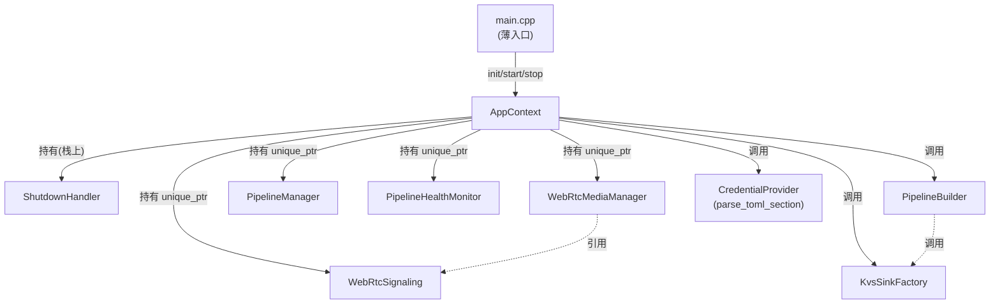
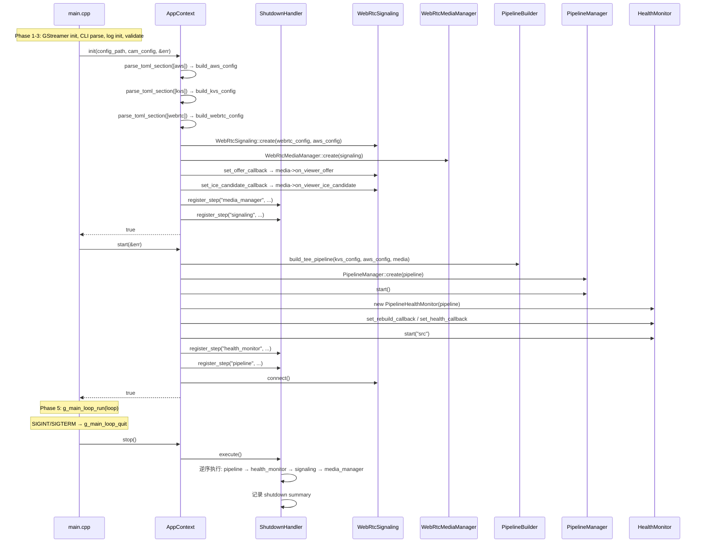

# 设计文档

## 概述

Spec 13.5 将 `main.cpp` 从"胶水代码集成"重构为"三阶段生命周期管理"架构。核心引入两个新类：

- **ShutdownHandler**：注册式逆序清理管理器，每步有超时保护和异常安全
- **AppContext**：应用上下文，封装所有模块的创建、连线、启动、停止逻辑

重构后 `main.cpp` 变薄为：GStreamer 初始化 → 命令行解析 → 日志初始化 → 参数验证 → `AppContext::init()` → `AppContext::start()` → 主循环 → `AppContext::stop()` → 日志关闭。后续 Spec（AI 管道 spec-10、systemd 看门狗 spec-19）只需在 `AppContext` 中添加模块，`main.cpp` 不再修改。

### 设计决策

1. **pImpl 模式**：ShutdownHandler 和 AppContext 均使用 pImpl，隐藏实现细节，减少头文件依赖传播
2. **注册式清理**：模块在 init/start 阶段注册清理步骤，shutdown 时按逆序执行，确保资源释放顺序正确
3. **三阶段接口**：`init()` → `start()` → `stop()` 分离配置加载、运行启动、清理关闭，职责清晰
4. **超时保护**：单步 5 秒 + 总计 30 秒，防止某个模块清理卡死导致整个进程挂起

## 架构

### 模块关系图



### 生命周期时序图



## 组件与接口

### ShutdownHandler

```cpp
// shutdown_handler.h
#pragma once
#include <functional>
#include <memory>
#include <string>

class ShutdownHandler {
public:
    ShutdownHandler();
    ~ShutdownHandler();

    // 禁用拷贝
    ShutdownHandler(const ShutdownHandler&) = delete;
    ShutdownHandler& operator=(const ShutdownHandler&) = delete;

    // 注册清理步骤（名称 + lambda）
    void register_step(const std::string& name, std::function<void()> fn);

    // 按注册逆序执行所有步骤
    void execute();

private:
    struct Impl;
    std::unique_ptr<Impl> impl_;
};
```

**实现要点**：
- `Impl` 内部用 `std::vector<std::pair<std::string, std::function<void()>>>` 存储步骤
- `execute()` 从 vector 尾部向头部遍历
- 每步用 `std::async(std::launch::async, fn)` + `future.wait_for(5s)` 实现超时
- 每步用 `try/catch(...)` 包裹，异常时记录 error 日志并继续
- 总超时 30 秒：记录 `execute()` 开始时间，每步执行前检查是否已超总时限
- 执行完毕后输出 shutdown summary：每步名称、结果（ok/timeout/exception）、耗时

### AppContext

```cpp
// app_context.h
#pragma once
#include <memory>
#include <string>
#include "camera_source.h"

class AppContext {
public:
    AppContext();
    ~AppContext();

    // 禁用拷贝
    AppContext(const AppContext&) = delete;
    AppContext& operator=(const AppContext&) = delete;

    // Phase 1: 配置加载 + 模块创建 + 回调注册 + shutdown step 注册
    bool init(const std::string& config_path,
              const CameraSource::CameraConfig& cam_config,
              std::string* error_msg = nullptr);

    // Phase 2: 管道构建 + 启动 + 信令连接 + 健康监控启动
    bool start(std::string* error_msg = nullptr);

    // Phase 3: 委托 ShutdownHandler::execute()
    void stop();

private:
    struct Impl;
    std::unique_ptr<Impl> impl_;
};
```

**Impl 内部成员（声明顺序决定析构顺序）**：

```cpp
struct AppContext::Impl {
    // 配置
    AwsConfig aws_config;
    KvsSinkFactory::KvsConfig kvs_config;
    WebRtcConfig webrtc_config;
    CameraSource::CameraConfig cam_config;

    // 模块（声明顺序：signaling 在 media_manager 之前，确保析构时 media 先析构）
    std::unique_ptr<WebRtcSignaling> signaling;
    std::unique_ptr<WebRtcMediaManager> media_manager;
    std::unique_ptr<PipelineManager> pipeline_manager;
    std::unique_ptr<PipelineHealthMonitor> health_monitor;

    // 清理管理器
    ShutdownHandler shutdown_handler;
};
```

### main.cpp 重构后

```cpp
static int run_pipeline(int argc, char* argv[]) {
    // Phase 1: 命令行解析（--log-json, --camera, --device, --config）
    // Phase 2: 日志初始化
    // Phase 3: 参数验证

    // Phase 4: AppContext
    AppContext ctx;
    std::string err;
    if (!ctx.init(config_path, cam_config, &err)) {
        logger->error("AppContext init failed: {}", err);
        log_init::shutdown();
        return 1;
    }

    loop = g_main_loop_new(nullptr, FALSE);
    std::signal(SIGINT, sigint_handler);
    std::signal(SIGTERM, sigint_handler);

    if (!ctx.start(&err)) {
        logger->error("AppContext start failed: {}", err);
        g_main_loop_unref(loop);
        loop = nullptr;
        log_init::shutdown();
        return 1;
    }

    // Phase 5: 主循环
    g_main_loop_run(loop);

    // Phase 6: 清理
    ctx.stop();
    g_main_loop_unref(loop);
    loop = nullptr;
    log_init::shutdown();
    return 0;
}
```

## 数据模型

### ShutdownStep 内部结构

| 字段 | 类型 | 说明 |
|------|------|------|
| name | `std::string` | 步骤名称（用于日志） |
| fn | `std::function<void()>` | 清理动作 lambda |

### ShutdownResult 内部结构（summary 用）

| 字段 | 类型 | 说明 |
|------|------|------|
| name | `std::string` | 步骤名称 |
| status | `enum {OK, TIMEOUT, EXCEPTION}` | 执行结果 |
| duration_ms | `int64_t` | 耗时（毫秒） |
| error_detail | `std::string` | 异常信息（仅 EXCEPTION 时有值） |

### AppContext::Impl 持有的配置

| 配置 | 类型 | 来源 |
|------|------|------|
| aws_config | `AwsConfig` | `parse_toml_section("aws")` → `build_aws_config` |
| kvs_config | `KvsSinkFactory::KvsConfig` | `parse_toml_section("kvs")` → `build_kvs_config` |
| webrtc_config | `WebRtcConfig` | `parse_toml_section("webrtc")` → `build_webrtc_config` |
| cam_config | `CameraSource::CameraConfig` | 从 `init()` 参数传入 |

### AppContext::Impl 持有的模块

| 模块 | 类型 | 创建时机 | 清理方式 |
|------|------|---------|---------|
| signaling | `unique_ptr<WebRtcSignaling>` | init() | ShutdownHandler: disconnect() |
| media_manager | `unique_ptr<WebRtcMediaManager>` | init() | ShutdownHandler: reset() |
| pipeline_manager | `unique_ptr<PipelineManager>` | start() | ShutdownHandler: stop() + reset() |
| health_monitor | `unique_ptr<PipelineHealthMonitor>` | start() | ShutdownHandler: stop() |


## 正确性属性

*属性（Property）是在系统所有合法执行中都应成立的特征或行为——本质上是对系统行为的形式化陈述。属性是人类可读规格说明与机器可验证正确性保证之间的桥梁。*

### PBT 适用性评估

**ShutdownHandler 适合 PBT**：
- `register_step` + `execute` 是纯逻辑操作（注册 lambda 到 vector，逆序执行）
- 输入空间大：步骤数量（0-N）、步骤名称、是否抛异常均可随机生成
- 核心不变量（逆序执行）适合用 property 验证
- 100 次迭代能覆盖各种步骤数量和异常组合

**AppContext 不适合 PBT**：
- 集成代码，依赖 GStreamer、WebRTC stub、文件系统等外部模块
- 行为不随输入有意义地变化（给定相同 config 文件，行为确定）
- 高成本（每次迭代需要创建/销毁 GStreamer 管道）
- 适合 example-based 集成测试和冒烟测试

### Property 1: 逆序执行不变量

*For any* 非空步骤序列（1 到 N 个步骤），当所有步骤注册到 ShutdownHandler 后调用 `execute()`，实际执行顺序应为注册顺序的严格逆序。

**Validates: Requirements 4.2**

### Property 2: 异常隔离不变量

*For any* 步骤序列（N 个步骤，其中 K 个会抛出异常，0 ≤ K ≤ N），当调用 `execute()` 时，所有 N 个步骤都应被尝试执行（不因某步异常而跳过后续步骤），且非异常步骤的执行顺序仍为注册顺序的逆序。

**Validates: Requirements 4.4**

## 错误处理

### AppContext::init() 错误处理

| 错误场景 | 处理方式 |
|---------|---------|
| config.toml 不存在或不可读 | `error_msg` 报告路径错误，返回 false |
| [aws] section 缺失或字段不全 | `error_msg` 报告缺失字段，返回 false |
| [kvs] section 缺失或字段不全 | `error_msg` 报告缺失字段，返回 false |
| [webrtc] section 缺失或字段不全 | `error_msg` 报告缺失字段，返回 false |
| WebRtcSignaling::create 返回 nullptr | `error_msg` 报告创建失败，返回 false |
| WebRtcMediaManager::create 返回 nullptr | `error_msg` 报告创建失败，返回 false |

### AppContext::start() 错误处理

| 错误场景 | 处理方式 |
|---------|---------|
| build_tee_pipeline 返回 nullptr | `error_msg` 报告管道构建失败，返回 false |
| PipelineManager::create 返回 nullptr | `error_msg` 报告管道创建失败，返回 false |
| PipelineManager::start 返回 false | `error_msg` 报告管道启动失败，返回 false |
| signaling->connect() 返回 false | 记录 warn 日志，**继续运行**（不返回 false） |

### ShutdownHandler::execute() 错误处理

| 错误场景 | 处理方式 |
|---------|---------|
| 单步执行超时（>5s） | 记录 warn 日志，继续下一步 |
| 单步抛出异常 | catch(...) 记录 error 日志，继续下一步 |
| 总时间超过 30s | 记录 warn 日志，跳过剩余步骤 |

### main.cpp 错误处理

| 错误场景 | 处理方式 |
|---------|---------|
| 无效 --camera 参数 | 记录 error 日志，退出码 1 |
| AppContext::init() 返回 false | 记录 error 日志，退出码 1 |
| AppContext::start() 返回 false | 记录 error 日志，退出码 1 |
| SIGINT/SIGTERM | 退出 GMainLoop，触发 ctx.stop() |

## 测试策略

### 双重测试方法

- **属性测试（PBT）**：验证 ShutdownHandler 的逆序执行和异常隔离不变量
- **单元测试（Example-based）**：验证 ShutdownHandler 的超时保护、空步骤等边界情况
- **集成测试**：通过现有测试回归 + macOS 冒烟运行验证 AppContext 集成正确性

### ShutdownHandler 测试

**PBT 测试**（使用 RapidCheck，最低 100 次迭代）：

1. **Property 1 测试**：逆序执行不变量
   - 生成随机步骤数量（1-20）和随机名称
   - 每步记录执行顺序到共享 vector
   - 验证执行顺序 == 注册顺序的 reverse
   - Tag: `Feature: main-integration, Property 1: 逆序执行不变量`

2. **Property 2 测试**：异常隔离不变量
   - 生成随机步骤数量（2-10）和随机异常位置
   - 异常步骤抛 `std::runtime_error`
   - 非异常步骤记录执行到共享 vector
   - 验证所有非异常步骤都被执行，且顺序为注册逆序
   - Tag: `Feature: main-integration, Property 2: 异常隔离不变量`

**Example-based 测试**：

3. 超时保护：注册一个 sleep(10s) 步骤 + 一个正常步骤，验证正常步骤仍被执行
4. 空步骤列表：execute() 不崩溃
5. 拷贝禁用：`static_assert(!std::is_copy_constructible_v<ShutdownHandler>)`

### AppContext 测试

**不新增测试文件**（需求约束：SHALL NOT 修改现有测试文件）。验证方式：

1. **编译验证**：`cmake --build device/build` 成功
2. **现有测试回归**：`ctest --test-dir device/build --output-on-failure` 全部通过
3. **macOS 冒烟运行**：手动运行 `./device/build/raspi-eye --config device/config/config.toml`，观察日志输出
4. **拷贝禁用**：在 ShutdownHandler 测试文件中添加 `static_assert(!std::is_copy_constructible_v<AppContext>)`

### 新增测试文件

- `device/tests/shutdown_test.cpp`：ShutdownHandler 的 PBT + example-based 测试
- 链接：`pipeline_manager`（间接获得 ShutdownHandler）+ `GTest` + `rapidcheck` + `rapidcheck_gtest`

### 测试配置

- PBT 最低 100 次迭代（RapidCheck 默认）
- 超时测试使用较短的超时值（测试中可能需要等待 ~5 秒）
- 测试超时分级：PBT 测试 ≤ 15 秒，超时测试 ≤ 15 秒
