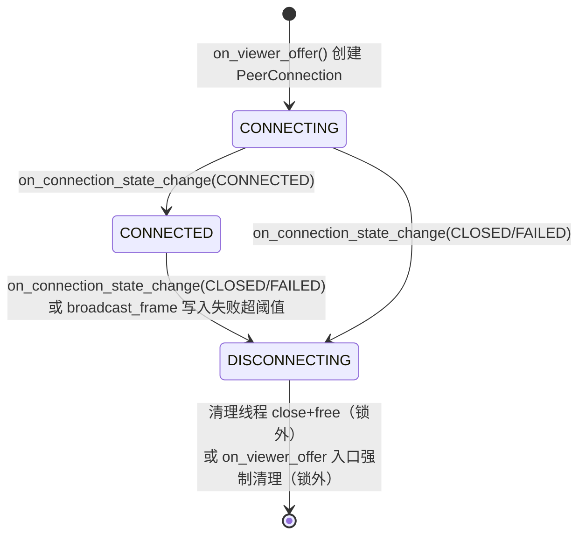
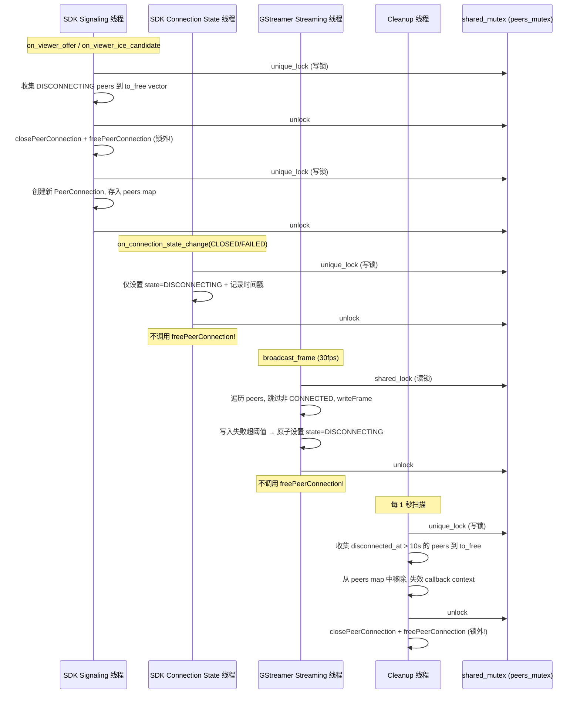
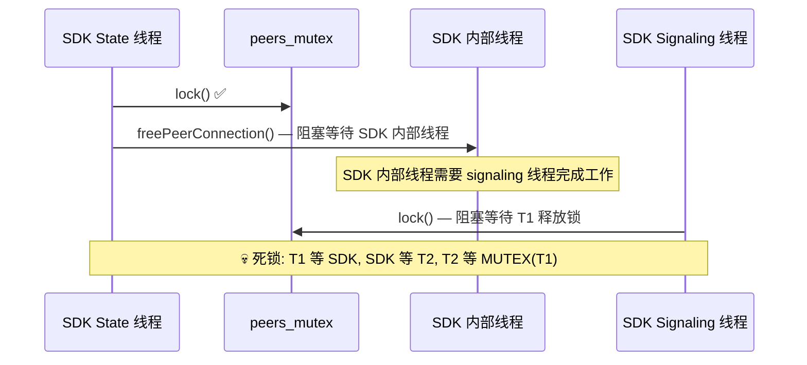
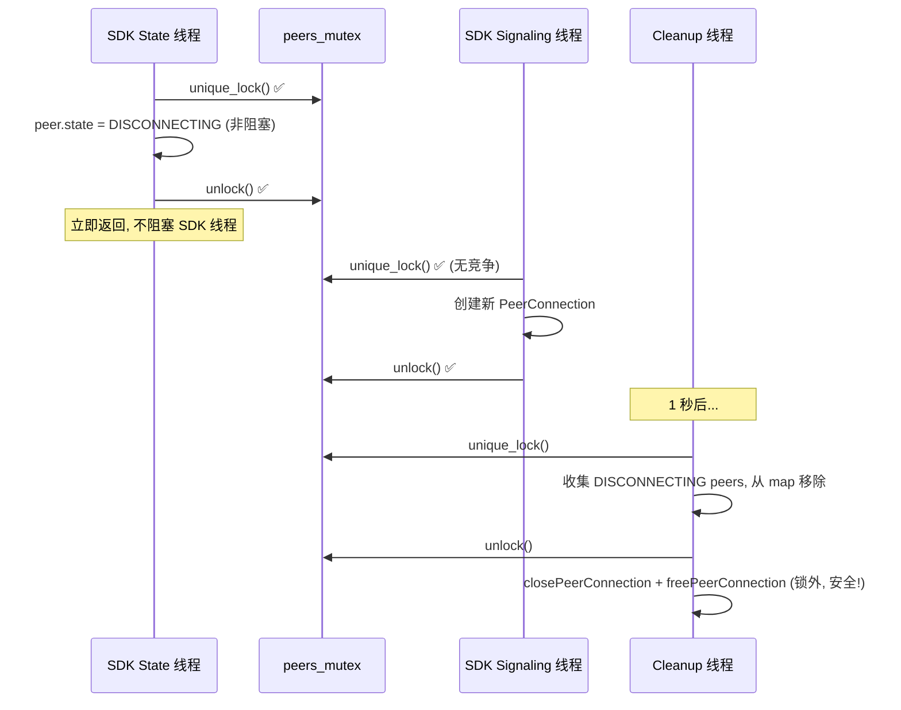

# WebRTC Peer 生命周期死锁修复 — Bugfix Design

## 概述

`webrtc_media.cpp` 中存在死锁：`on_connection_state_change(CLOSED/FAILED)` 回调在 SDK 内部线程上持有 `peers_mutex` 后调用阻塞式 `freePeerConnection()`，而新 viewer 的 `on_signaling_message_received` 在另一个 SDK 线程上等待 `peers_mutex`，形成死锁。`broadcast_frame()` 在 GStreamer 线程上也存在相同的死锁风险。

修复策略：引入 Peer 状态机（CONNECTING → CONNECTED → DISCONNECTING），将 `freePeerConnection()` 从所有锁持有路径中移出，改由独立清理线程或 `on_viewer_offer` 入口处延迟执行。用 `std::shared_mutex` 替换 `std::mutex`，让 `broadcast_frame()` 使用读锁减少帧发送对 offer 处理的阻塞。

修改范围：仅 `device/src/webrtc_media.cpp`（pImpl 隐藏所有变更）。
不修改：`device/src/webrtc_media.h`、`device/src/webrtc_signaling.cpp`。

参考实现：[raspi-ipc-sample/webrtc_agent.cpp](https://github.com/JerryCW/raspi-ipc-sample/blob/main/device/src/webrtc/webrtc_agent.cpp)

## 术语表

- **Bug_Condition (C)**: 在持有 `peers_mutex` 的情况下调用 `freePeerConnection()`，导致 SDK 内部线程死锁
- **Property (P)**: `freePeerConnection()` 和 `closePeerConnection()` 始终在不持有 `peers_mutex` 的情况下调用
- **Preservation**: 现有 peer 管理逻辑（创建、替换、移除、最大连接数限制、ICE candidate 缓存、帧广播）保持不变
- **PeerInfo**: 存储单个 PeerConnection 的句柄、transceiver、状态和元数据的内部结构
- **peers_mutex**: 保护 `peers` map 的读写锁（修复后为 `std::shared_mutex`）
- **DISCONNECTING**: peer 已断开但资源尚未释放的中间状态，等待清理线程处理

## Bug 详情

### Bug Condition

当 SDK 回调线程（`on_connection_state_change`）或 GStreamer 线程（`broadcast_frame`）在持有 `peers_mutex` 的情况下调用 `freePeerConnection()` 时，`freePeerConnection()` 阻塞等待 SDK 内部线程完成清理，而这些内部线程可能需要 signaling 线程完成工作，signaling 线程又被新 viewer 的 offer 处理阻塞在 `peers_mutex` 上，形成循环等待。

**形式化规约：**
```
FUNCTION isBugCondition(call_context)
  INPUT: call_context of type { holds_peers_mutex: bool, function_called: string, calling_thread: string }
  OUTPUT: boolean

  RETURN call_context.holds_peers_mutex == true
         AND call_context.function_called IN ['freePeerConnection', 'closePeerConnection']
         AND call_context.calling_thread IN ['sdk_connection_state_thread', 'gstreamer_streaming_thread', 'main_thread_destructor']
END FUNCTION
```

### 示例

- **示例 1（SDK 回调死锁）**: Viewer A 断开 → `on_connection_state_change(CLOSED)` 在 SDK 线程获取 `peers_mutex` → 调用 `remove_peer_locked()` → `freePeerConnection()` 阻塞等待 SDK 内部线程 → 同时 Viewer B 发送 offer → `on_viewer_offer()` 等待 `peers_mutex` → 死锁
- **示例 2（GStreamer 线程死锁）**: `broadcast_frame()` 在 GStreamer 线程持有 `peers_mutex` → 检测到 peer 写入失败超阈值 → 调用 `remove_peer_locked()` → `freePeerConnection()` 阻塞 → SDK 回调线程等待 `peers_mutex` → 死锁
- **示例 3（析构函数死锁）**: `~Impl()` 持有 `peers_mutex` → 遍历所有 peer 调用 `freePeerConnection()` → SDK 回调线程等待 `peers_mutex` → 死锁
- **示例 4（正常情况，不触发 bug）**: 鼠标点击 viewer 页面的断开按钮 → signaling 层处理 → `remove_peer()` 在无 SDK 回调竞争时正常完成（偶尔成功不代表无 bug）

## Expected Behavior

### Preservation Requirements

**不变行为：**
- macOS 开发环境编译（无 `HAVE_KVS_WEBRTC_SDK` 宏）使用 stub 实现，所有现有测试通过
- 多个 viewer 同时连接（≤ 10 个）正确管理 peer 生命周期
- peer 连接状态变为 FAILED 或 CLOSED 后最终清理 PeerConnection 资源和 callback context
- `broadcast_frame` 向所有 CONNECTED 状态的 peer 发送帧数据
- `on_viewer_offer` 收到已存在 peer_id 的新 offer 时替换旧 PeerConnection
- `on_viewer_ice_candidate` 在 offer 处理前收到 ICE candidate 时缓存并在 PeerConnection 创建后 flush
- `peer_count()` 返回当前活跃 peer 数量（仅计 CONNECTED 状态）

**范围：**
所有不涉及 `freePeerConnection` / `closePeerConnection` 调用时机的行为应完全不受此修复影响。包括：
- SDP offer/answer 协商流程
- ICE candidate 交换流程
- 帧数据编码和 `writeFrame` 调用
- 最大连接数限制逻辑
- peer_id 长度校验

## 假设根因分析

基于代码审查和死锁分析，根因是：

1. **`freePeerConnection` 在锁内调用**: `remove_peer_locked()` 在持有 `peers_mutex` 时调用 `freePeerConnection()`，该函数是阻塞式的，等待 SDK 内部线程完成清理
2. **SDK 内部线程依赖链**: `freePeerConnection()` 等待的 SDK 内部线程可能需要 signaling 线程完成工作（如发送 BYE 消息），而 signaling 线程可能正在处理新 viewer 的 offer 并等待 `peers_mutex`
3. **独占锁竞争**: `broadcast_frame()` 使用 `std::mutex`（独占锁），帧发送期间所有 offer 处理和 peer 管理操作被阻塞，高帧率场景下加剧锁竞争
4. **无状态机**: peer 只有 `connected` bool 标志，没有 DISCONNECTING 中间状态，无法实现"标记后延迟清理"模式

## Correctness Properties

Property 1: Bug Condition — freePeerConnection 不在持有锁时调用

_For any_ 调用 `freePeerConnection()` 或 `closePeerConnection()` 的代码路径，修复后的实现 SHALL 确保调用时不持有 `peers_mutex`。具体地：`on_connection_state_change` 回调仅标记 DISCONNECTING 状态；`broadcast_frame` 仅标记 DISCONNECTING 状态；清理线程和 `on_viewer_offer` 入口处在释放锁后才调用 `closePeerConnection` + `freePeerConnection`。

**Validates: Requirements 2.1, 2.2, 2.3, 2.7, 2.8**

Property 2: Preservation — Peer 管理不变量（Model-Based Testing）

_For any_ 随机生成的操作序列（由 `on_viewer_offer(random_peer_id)`、`mark_peer_disconnecting(random_peer_id)`、`cleanup_disconnecting_peers()` 组成），在每次操作后，`peer_count()` 应始终等于 CONNECTED 状态 peer 的数量，且 `peer_count() ≤ 10`。CONNECTING 和 DISCONNECTING 状态的 peer 不计入 `peer_count()`。

**Validates: Requirements 3.2, 3.3, 3.4, 3.5, 3.7**

## Fix Implementation

### Peer 状态机



### 线程模型



### 死锁场景对比

**修复前（死锁）：**



**修复后（安全）：**



### 数据结构变更

**PeerInfo 新增字段：**

```cpp
enum class PeerState { CONNECTING, CONNECTED, DISCONNECTING };

struct PeerInfo {
    PRtcPeerConnection peer_connection = nullptr;
    PRtcRtpTransceiver video_transceiver = nullptr;
    uint32_t consecutive_write_failures = 0;
    std::atomic<PeerState> state{PeerState::CONNECTING};  // 替换 bool connected
    std::chrono::steady_clock::time_point disconnected_at;  // DISCONNECTING 时记录
};
```

**Impl 结构变更：**

```cpp
struct WebRtcMediaManager::Impl {
    // ... 现有字段 ...
    mutable std::shared_mutex peers_mutex;  // 替换 std::mutex
    std::atomic<bool> running{true};        // 控制清理线程生命周期
    std::thread cleanup_thread;             // 独立清理线程
    std::atomic<size_t> viewer_count{0};    // CONNECTED 状态 peer 计数

    // 清理线程入口
    void cleanup_loop();

    // 标记 peer 为 DISCONNECTING（在锁内调用）
    void mark_peer_disconnecting(const std::string& peer_id);

    // 收集待释放的 peer（在锁内调用，返回后在锁外释放）
    struct PeerToFree {
        PRtcPeerConnection peer_connection;
        CallbackContext* callback_context;
        std::string peer_id;
    };
    std::vector<PeerToFree> collect_disconnecting_peers(
        std::chrono::seconds min_age = std::chrono::seconds(10));
};
```

### 锁策略

| 操作 | 调用线程 | 锁类型 | 是否调用 freePeerConnection |
|------|---------|--------|---------------------------|
| `broadcast_frame()` | GStreamer streaming | `shared_lock`（读锁） | ❌ 仅标记 DISCONNECTING |
| `on_viewer_offer()` | SDK signaling | `unique_lock`（写锁） | ❌ 锁外调用 |
| `on_viewer_ice_candidate()` | SDK signaling | `unique_lock`（写锁） | ❌ |
| `on_connection_state_change()` | SDK connection state | `unique_lock`（写锁） | ❌ 仅标记 DISCONNECTING |
| `remove_peer()` | 外部调用 | `unique_lock`（写锁） | ❌ 锁外调用 |
| `peer_count()` | 任意线程 | `shared_lock`（读锁） | ❌ |
| `cleanup_loop()` | cleanup 线程 | `unique_lock`（写锁） | ❌ 锁外调用 |
| `~Impl()` | main 线程 | 无锁（cleanup 线程已停止） | ✅ 但在锁外 |

### 具体变更

**文件**: `device/src/webrtc_media.cpp`

**函数**: `Impl` 结构体 + 所有成员函数

**具体变更：**

1. **PeerInfo 状态机**: 将 `bool connected` 替换为 `std::atomic<PeerState> state`，新增 `disconnected_at` 时间戳

2. **shared_mutex 替换 mutex**: `mutable std::shared_mutex peers_mutex` 替换 `mutable std::mutex peers_mutex`

3. **cleanup 线程**: `Impl` 构造时启动 `cleanup_thread`，每 1 秒扫描 DISCONNECTING 状态超过 10 秒的 peer，收集到本地 vector 后释放锁，在锁外调用 `closePeerConnection` + `freePeerConnection`

4. **on_connection_state_change 重构**:
   - CONNECTED: 设置 `state = CONNECTED`，递增 `viewer_count`
   - CLOSED/FAILED: 调用 `mark_peer_disconnecting()`（设置 `state = DISCONNECTING` + 记录时间戳 + 递减 `viewer_count`），不调用 `freePeerConnection`

5. **on_viewer_offer 重构**:
   - 第一阶段（unique_lock）：收集所有 DISCONNECTING peers + 旧同 peer_id peer 到 `to_free` vector，从 map 中移除，失效 callback context
   - 释放锁
   - 第二阶段（无锁）：对 `to_free` 中的每个 peer 调用 `closePeerConnection` + `freePeerConnection`
   - 第三阶段（unique_lock）：创建新 PeerConnection（原有流程不变），存入 peers map

6. **broadcast_frame 重构**:
   - 使用 `std::shared_lock`（读锁）
   - 跳过 `state != CONNECTED` 的 peer
   - 写入失败超阈值：原子设置 `state = DISCONNECTING`（`std::atomic` 无需升级锁），记录 `disconnected_at`

7. **peer_count 重构**:
   - 使用 `std::shared_lock`（读锁）
   - 仅计算 `state == CONNECTED` 的 peer（或直接返回 `viewer_count.load()`）

8. **remove_peer 重构**:
   - `unique_lock` 内：从 map 中移除 peer，收集到 `to_free`，失效 callback context
   - 释放锁
   - 锁外：`closePeerConnection` + `freePeerConnection`

9. **~Impl 重构**:
   - 设置 `running = false`，join `cleanup_thread`
   - `unique_lock` 内：对所有 peer 调用 `closePeerConnection()`，收集所有 peer_connection 到 `to_free`，清空 map
   - 释放锁
   - sleep 1 秒（等待 SDK 内部线程完成）
   - 锁外：对所有收集的 peer 调用 `freePeerConnection()`
   - 清理所有 callback context

### 关键常量

| 常量 | 值 | 说明 |
|------|-----|------|
| `kMaxPeers` | 10 | 最大并发 PeerConnection 数量（不变） |
| `kMaxPeerIdLen` | 256 | peer_id 最大长度（不变） |
| `kMaxWriteFailures` | 100 | writeFrame 连续失败上限（不变） |
| `kCleanupIntervalMs` | 1000 | 清理线程扫描间隔（新增） |
| `kDisconnectGracePeriodSec` | 10 | DISCONNECTING 状态最小保持时间（新增） |
| `kShutdownDrainSec` | 1 | 析构时 close 后等待 free 的间隔（新增） |

## Testing Strategy

### 验证方法

测试策略分两阶段：先在未修复代码上验证 bug 存在（探索性测试），再验证修复后行为正确且不引入回归。

### Exploratory Bug Condition Checking

**目标**: 在修复前验证死锁条件存在，确认根因分析正确。

**测试计划**: 编写模拟多线程竞争的测试，在未修复代码上观察死锁或超时。

**测试用例**:
1. **SDK 回调死锁复现**: 模拟 `on_connection_state_change(CLOSED)` 在持有锁时调用 `freePeerConnection`，同时另一线程尝试获取锁（未修复代码会超时/死锁）
2. **broadcast_frame 死锁复现**: 模拟 `broadcast_frame` 在持有锁时触发 peer 清理，同时 SDK 回调线程等待锁（未修复代码会超时/死锁）
3. **析构函数死锁复现**: 模拟析构时持有锁调用 `freePeerConnection`，同时 SDK 回调线程等待锁（未修复代码会超时/死锁）

**预期反例**:
- 未修复代码中，`freePeerConnection` 在锁内被调用，导致线程阻塞超时
- 可能原因：`remove_peer_locked()` 直接调用 `freePeerConnection()`，`~Impl()` 在锁内遍历调用 `freePeerConnection()`

### Fix Checking

**目标**: 验证修复后，所有触发 bug condition 的输入都产生正确行为。

**伪代码：**
```
FOR ALL call_context WHERE isBugCondition(call_context) DO
  result := fixed_implementation(call_context)
  ASSERT freePeerConnection 在锁外调用
  ASSERT peer 状态正确转换为 DISCONNECTING
  ASSERT 资源最终被清理（无泄漏）
END FOR
```

### Preservation Checking

**目标**: 验证修复后，所有不触发 bug condition 的输入产生与原实现相同的结果。

**伪代码：**
```
FOR ALL input WHERE NOT isBugCondition(input) DO
  ASSERT original_behavior(input) == fixed_behavior(input)
END FOR
```

**测试方法**: Property-based testing 推荐用于 preservation checking，因为：
- 自动生成大量随机操作序列覆盖 peer 管理的各种组合
- 捕获手动测试可能遗漏的边界情况
- 强保证所有非 bug 输入的行为不变

**测试计划**: 在未修复代码上观察 stub 实现的 peer 管理行为，然后编写 PBT 验证修复后行为一致。

**测试用例**:
1. **Peer 计数 Preservation**: 验证随机 add/remove/disconnect 操作序列后 `peer_count()` 始终等于 CONNECTED 状态 peer 数量
2. **最大连接数 Preservation**: 验证达到 10 上限时拒绝新连接
3. **Peer 替换 Preservation**: 验证同一 peer_id 的新 offer 正确替换旧连接
4. **ICE Candidate 缓存 Preservation**: 验证 offer 前到达的 ICE candidate 被正确缓存和 flush

### Unit Tests

- 测试 PeerState 状态机转换（CONNECTING → CONNECTED → DISCONNECTING）
- 测试 `mark_peer_disconnecting()` 正确设置状态和时间戳
- 测试 `collect_disconnecting_peers()` 仅收集超过 grace period 的 peer
- 测试 `peer_count()` 仅计算 CONNECTED 状态的 peer
- 测试 `on_viewer_offer` 入口处清理 DISCONNECTING peer
- 测试析构函数安全关闭（不死锁）

### Property-Based Tests

- 随机操作序列（add/mark_disconnecting/cleanup）验证 `peer_count()` 不变量
- 随机 peer 状态组合验证 `broadcast_frame` 仅向 CONNECTED peer 发送
- 随机并发操作验证无死锁（超时检测）

### Integration Tests

- Pi 5 端到端：viewer 连接 → 断开 → 新 viewer 连接（验证不死锁）
- Pi 5 端到端：多 viewer 同时连接和断开（压力测试）
- Pi 5 端到端：高帧率下 viewer 断开不影响其他 viewer 的帧接收
