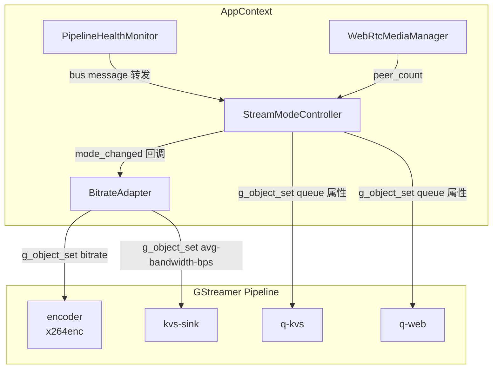
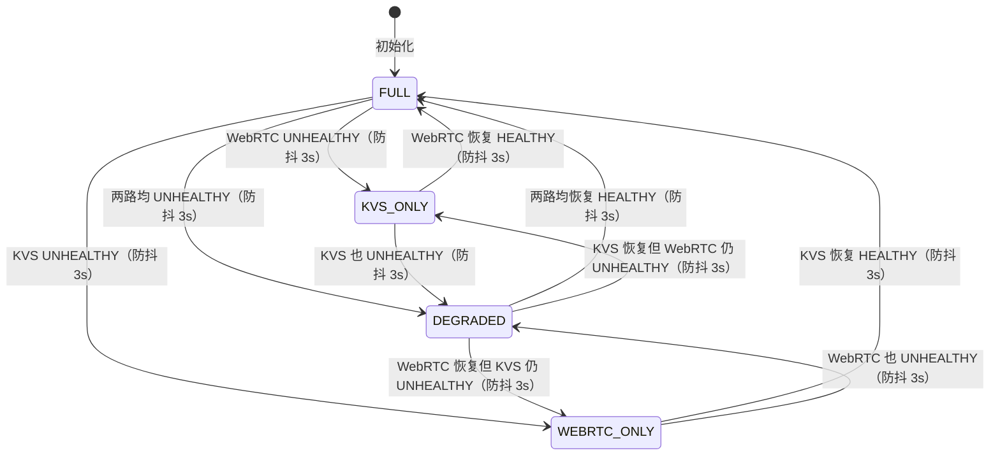

# 设计文档：自适应码率控制 + 流模式切换

## 概述

本设计为 Smart Camera 设备端引入两个新模块：**StreamModeController**（流模式状态机）和 **BitrateAdapter**（码率控制器），在不重建 GStreamer pipeline 的前提下，通过动态调整 element 属性实现自适应流控。

核心设计决策：
- **不重建 pipeline**：通过 `g_object_set` 动态修改 queue 和 encoder 属性，避免 pipeline 重建带来的中断
- **不持有额外 element 指针**：所有 element 访问通过 `gst_bin_get_by_name` 按需获取，避免悬空指针风险
- **与 PipelineHealthMonitor 协作**：PipelineHealthMonitor 负责管道级错误检测和重建，StreamModeController 负责分支级流模式切换，两者职责正交
- **防抖机制**：分支状态变化后等待 3 秒确认稳定才触发模式切换，避免网络波动导致频繁切换

## 架构

### 模块关系图



### 数据流方向

```
分支健康信号 → StreamModeController → 模式切换 → 调整 queue 属性
                                    ↓
                              BitrateAdapter → 调整 encoder bitrate
```

### 职责划分

| 模块 | 职责 | 输入 | 输出 |
|------|------|------|------|
| StreamModeController | 流模式状态机 + 分支数据流控制 | KVS/WebRTC 健康信号 | 模式切换回调 + queue 属性调整 |
| BitrateAdapter | 码率评估 + encoder/kvssink 参数调整 | 流模式变化 + KVS 健康信号 | encoder bitrate 调整 |
| PipelineHealthMonitor | 管道级错误检测 + 重建 | bus message + buffer probe | 管道重建 |

## 组件与接口

### StreamModeController

```cpp
// stream_mode_controller.h

// 流模式枚举
enum class StreamMode {
    FULL,           // KVS + WebRTC 均正常
    KVS_ONLY,       // 仅 KVS，WebRTC 分支丢弃数据
    WEBRTC_ONLY,    // 仅 WebRTC，KVS 分支丢弃数据
    DEGRADED        // 两路均异常，最低码率保 KVS
};

// 分支健康状态
enum class BranchStatus { HEALTHY, UNHEALTHY };

// 模式切换回调：旧模式、新模式、触发原因
using ModeChangeCallback = std::function<void(StreamMode old_mode,
                                               StreamMode new_mode,
                                               const std::string& reason)>;

class StreamModeController {
public:
    // pipeline: 不持有所有权，必须在 controller 生命周期内有效
    explicit StreamModeController(GstElement* pipeline);
    ~StreamModeController();

    // 禁止拷贝
    StreamModeController(const StreamModeController&) = delete;
    StreamModeController& operator=(const StreamModeController&) = delete;

    // 分支健康上报（由外部定时器或回调调用）
    void report_kvs_status(BranchStatus status);
    void report_webrtc_status(BranchStatus status);

    // 注册模式切换回调
    void set_mode_change_callback(ModeChangeCallback cb);

    // 查询当前模式
    StreamMode current_mode() const;

    // 启动/停止（管理内部定时器）
    void start();
    void stop();

    // pipeline 重建后更新指针
    void set_pipeline(GstElement* new_pipeline);

private:
    struct Impl;
    std::unique_ptr<Impl> impl_;
};
```

### BitrateAdapter

```cpp
// bitrate_adapter.h

struct BitrateConfig {
    int min_kbps = 1000;       // 最低码率
    int max_kbps = 4000;       // 最高码率
    int step_kbps = 500;       // 档位间距
    int default_kbps = 2500;   // 默认码率
    int eval_interval_sec = 5; // 评估周期（秒）
    int rampup_interval_sec = 30; // 码率提升间隔（秒）
};

class BitrateAdapter {
public:
    // pipeline: 不持有所有权
    explicit BitrateAdapter(GstElement* pipeline,
                            const BitrateConfig& config = BitrateConfig{});
    ~BitrateAdapter();

    // 禁止拷贝
    BitrateAdapter(const BitrateAdapter&) = delete;
    BitrateAdapter& operator=(const BitrateAdapter&) = delete;

    // 流模式变化通知（由 StreamModeController 回调触发）
    void on_mode_changed(StreamMode old_mode, StreamMode new_mode);

    // KVS 分支健康上报（用于码率升降决策）
    void report_kvs_health(BranchStatus status);

    // 查询当前码率
    int current_bitrate_kbps() const;

    // 启动/停止（管理内部定时器）
    void start();
    void stop();

    // pipeline 重建后更新指针
    void set_pipeline(GstElement* new_pipeline);

private:
    struct Impl;
    std::unique_ptr<Impl> impl_;
};
```

### 与现有模块的集成点

**AppContext::Impl 新增成员：**
```cpp
std::unique_ptr<StreamModeController> stream_controller;
std::unique_ptr<BitrateAdapter> bitrate_adapter;
```

**AppContext::start() 集成流程：**
1. 构建 pipeline（已有）
2. 创建 PipelineHealthMonitor（已有）
3. 创建 StreamModeController，传入 pipeline 指针
4. 创建 BitrateAdapter，传入 pipeline 指针
5. 注册 StreamModeController 的模式切换回调 → 通知 BitrateAdapter
6. 安装 KVS bus message 监听（复用 PipelineHealthMonitor 的 bus watch，或独立安装）
7. 启动 WebRTC peer_count 定时轮询
8. 启动 StreamModeController 和 BitrateAdapter

**KVS 健康检测实现：**
- 在 PipelineHealthMonitor 的 `bus_watch_cb` 中，检查 message source 是否为 `kvs-sink`
- 匹配 ERROR/WARNING 中的 "timeout"、"connection" 关键词
- 连续 3 次匹配 → 调用 `stream_controller->report_kvs_status(UNHEALTHY)`
- 10 秒无错误 → 调用 `stream_controller->report_kvs_status(HEALTHY)`
- 实现方式：StreamModeController 内部维护 KVS 错误计数器和最后错误时间，通过 `g_timeout_add` 定时检查

**WebRTC 健康检测实现：**
- StreamModeController 内部通过 `g_timeout_add` 每秒轮询 `WebRtcMediaManager::peer_count()`
- `peer_count() == 0` 持续 5 秒 → 内部标记 WebRTC UNHEALTHY
- `peer_count() > 0` → 立即标记 WebRTC HEALTHY
- 需要 StreamModeController 持有 `WebRtcMediaManager*` 指针（不持有所有权）

### StreamModeController 状态机



### 防抖机制设计

```
report_kvs_status(UNHEALTHY)
  → 记录 pending_kvs_status = UNHEALTHY, pending_kvs_time = now
  → 3 秒后定时器触发 evaluate()
  → evaluate() 检查：pending_kvs_status 是否仍为 UNHEALTHY 且距 pending_kvs_time ≥ 3s
  → 是 → 确认状态变化，计算目标模式，执行切换
  → 否 → 忽略（状态已恢复）
```

### 分支数据流控制

通过 `gst_bin_get_by_name` + `g_object_set` 动态调整 queue 属性：

| 模式 | q-kvs | q-web |
|------|-------|-------|
| FULL | max-size-buffers=1, leaky=0 | max-size-buffers=1, leaky=2 |
| KVS_ONLY | max-size-buffers=1, leaky=0 | max-size-buffers=0, leaky=2（丢弃全部） |
| WEBRTC_ONLY | max-size-buffers=0, leaky=2（丢弃全部） | max-size-buffers=1, leaky=2 |
| DEGRADED | max-size-buffers=1, leaky=0（最低码率） | max-size-buffers=0, leaky=2（丢弃全部） |

**关键实现细节：**
- `max-size-buffers=0` + `leaky=downstream` 的组合效果：queue 容量为 0，所有进入的 buffer 立即被丢弃
- 恢复时设回原始值即可，无需 pad probe 阻塞

### BitrateAdapter 码率调整逻辑

```
每 5 秒评估一次：
  IF 流模式 == DEGRADED:
    目标码率 = min_kbps (1000)
  ELSE IF 最近收到 KVS UNHEALTHY:
    目标码率 = max(当前码率 - step_kbps, min_kbps)
  ELSE IF KVS 持续 HEALTHY ≥ 30 秒 且 当前码率 < max_kbps:
    目标码率 = min(当前码率 + step_kbps, max_kbps)
  ELSE:
    不调整

  IF 目标码率 != 当前码率:
    g_object_set(encoder, "bitrate", 目标码率, nullptr)
    尝试 g_object_set(kvs-sink, "avg-bandwidth-bps", 目标码率 * 1000, nullptr)
    记录日志
```

## 数据模型

### 配置参数（未来从 config.toml 加载，本 Spec 使用默认值）

```toml
[streaming]
# 防抖时间（秒）
debounce_sec = 3

# 码率范围（kbps）
bitrate_min = 1000
bitrate_max = 4000
bitrate_step = 500
bitrate_default = 2500

# 评估周期（秒）
bitrate_eval_interval = 5
bitrate_rampup_interval = 30

# KVS 健康检测
kvs_error_threshold = 3
kvs_healthy_timeout_sec = 10

# WebRTC 健康检测
webrtc_no_peer_timeout_sec = 5
```

### 内部状态

**StreamModeController::Impl 关键字段：**

| 字段 | 类型 | 说明 |
|------|------|------|
| current_mode_ | StreamMode | 当前流模式 |
| kvs_confirmed_ | BranchStatus | 已确认的 KVS 状态 |
| webrtc_confirmed_ | BranchStatus | 已确认的 WebRTC 状态 |
| pending_kvs_ | BranchStatus | 待确认的 KVS 状态 |
| pending_webrtc_ | BranchStatus | 待确认的 WebRTC 状态 |
| pending_kvs_time_ | steady_clock::time_point | KVS 状态变化时间 |
| pending_webrtc_time_ | steady_clock::time_point | WebRTC 状态变化时间 |
| pipeline_ | GstElement* | pipeline 指针（不持有所有权） |
| webrtc_media_ | WebRtcMediaManager* | WebRTC 管理器指针（用于 peer_count 轮询） |
| mutex_ | std::mutex | 线程安全保护 |

**BitrateAdapter::Impl 关键字段：**

| 字段 | 类型 | 说明 |
|------|------|------|
| current_bitrate_kbps_ | int | 当前目标码率 |
| current_mode_ | StreamMode | 当前流模式（由回调更新） |
| last_kvs_unhealthy_time_ | steady_clock::time_point | 最近一次 KVS UNHEALTHY 时间 |
| last_kvs_healthy_time_ | steady_clock::time_point | 最近一次 KVS HEALTHY 时间 |
| kvs_status_ | BranchStatus | 当前 KVS 健康状态 |
| pipeline_ | GstElement* | pipeline 指针（不持有所有权） |
| config_ | BitrateConfig | 码率配置 |
| eval_timer_id_ | guint | 评估定时器 ID |
| mutex_ | std::mutex | 线程安全保护 |


## 正确性属性

*正确性属性是在系统所有合法执行中都应成立的特征或行为——本质上是对系统行为的形式化陈述。属性是人类可读的规格说明与机器可验证的正确性保证之间的桥梁。*

### Property 1: 模式决策正确性

*For any* KVS 分支状态 kvs ∈ {HEALTHY, UNHEALTHY} 和 WebRTC 分支状态 webrtc ∈ {HEALTHY, UNHEALTHY} 的组合，`compute_target_mode(kvs, webrtc)` 应返回唯一确定的 StreamMode：
- (HEALTHY, HEALTHY) → FULL
- (HEALTHY, UNHEALTHY) → KVS_ONLY
- (UNHEALTHY, HEALTHY) → WEBRTC_ONLY
- (UNHEALTHY, UNHEALTHY) → DEGRADED

**Validates: Requirements 1.3, 1.4, 1.5, 1.6**

### Property 2: 防抖过滤

*For any* 分支状态变化序列，如果某分支在报告 UNHEALTHY 后不到 3 秒内恢复为 HEALTHY，则 StreamModeController 不应触发模式切换。等价地：只有持续 ≥ 3 秒的状态变化才会导致模式切换。

**Validates: Requirements 1.9**

### Property 3: Queue 参数映射正确性

*For any* StreamMode，`compute_queue_params(mode)` 返回的 (q-kvs, q-web) 参数组合应与预定义映射表完全一致：
- FULL → q-kvs(max=1, leaky=0), q-web(max=1, leaky=2)
- KVS_ONLY → q-kvs(max=1, leaky=0), q-web(max=0, leaky=2)
- WEBRTC_ONLY → q-kvs(max=0, leaky=2), q-web(max=1, leaky=2)
- DEGRADED → q-kvs(max=1, leaky=0), q-web(max=0, leaky=2)

**Validates: Requirements 2.1, 2.2, 2.3, 2.4**

### Property 4: 码率范围不变量与调整方向

*For any* 码率调整操作序列（包括 UNHEALTHY 降档、HEALTHY 升档、DEGRADED 强制最低），调整后的码率值始终满足：
1. min_kbps ≤ bitrate ≤ max_kbps
2. (bitrate - min_kbps) % step_kbps == 0
3. UNHEALTHY 事件后码率 ≤ 调整前码率
4. HEALTHY 持续 ≥ rampup_interval 后码率 ≥ 调整前码率

**Validates: Requirements 3.1, 3.2, 3.3, 3.4**

### Property 5: KVS 健康判定

*For any* 来自 kvs-sink 的 bus message 序列，KVS 分支健康状态应满足：
1. 连续 ≥ 3 条含 "timeout" 或 "connection" 关键词的 ERROR/WARNING → UNHEALTHY
2. UNHEALTHY 后 ≥ 10 秒无匹配错误 → HEALTHY
3. 非 kvs-sink 来源的 message 不影响 KVS 健康判定

**Validates: Requirements 4.1, 4.2**

### Property 6: WebRTC 健康判定

*For any* peer_count 时间序列，WebRTC 分支健康状态应满足：
1. peer_count == 0 持续 ≥ 5 秒 → UNHEALTHY
2. peer_count > 0 → 立即 HEALTHY（无需等待）
3. peer_count 在 5 秒内从 0 变为 > 0 → 不触发 UNHEALTHY

**Validates: Requirements 5.1, 5.2, 5.4**

## 错误处理

### GStreamer element 获取失败

- `gst_bin_get_by_name` 返回 nullptr 时（element 不存在或 pipeline 已销毁）：
  - StreamModeController: 记录 warn 日志，跳过 queue 属性调整，不改变当前模式
  - BitrateAdapter: 记录 warn 日志，跳过码率调整，保持当前码率值
  - 两者均不抛异常，不影响其他模块运行

### g_object_set 失败

- kvssink 的 `avg-bandwidth-bps` 可能不支持运行时修改：
  - 使用 `g_object_class_find_property` 先检查属性是否存在
  - 不存在或设置失败时记录 info 日志，不产生错误

### Pipeline 重建后的状态恢复

- PipelineHealthMonitor 触发 pipeline 重建时：
  - AppContext 的 rebuild 回调中调用 `stream_controller->set_pipeline(new_pipeline)` 和 `bitrate_adapter->set_pipeline(new_pipeline)`
  - StreamModeController 重新应用当前模式对应的 queue 参数
  - BitrateAdapter 重新设置当前码率到新 encoder

### 线程安全

- StreamModeController 和 BitrateAdapter 的所有公共方法通过 `std::mutex` 保护
- GStreamer 回调（bus watch、g_timeout_add）在 GLib main loop 线程执行
- `report_kvs_status` / `report_webrtc_status` 可能从不同线程调用，需要 mutex 保护
- 回调通知在 mutex 外执行，避免死锁（与 PipelineHealthMonitor 相同模式）

## 测试策略

### 属性测试（Property-Based Testing）

使用 RapidCheck 库（已通过 FetchContent 引入），每个属性测试最少 100 次迭代。

| 属性 | 测试方法 | 生成器 |
|------|---------|--------|
| Property 1: 模式决策 | 提取 `compute_target_mode` 为纯函数，生成随机 (BranchStatus, BranchStatus) | `rc::gen::element(HEALTHY, UNHEALTHY)` × 2 |
| Property 2: 防抖过滤 | 模拟状态变化序列 + 时间戳，验证防抖逻辑 | 生成随机 (status, duration_ms) 序列 |
| Property 3: Queue 参数映射 | 提取 `compute_queue_params` 为纯函数，生成随机 StreamMode | `rc::gen::element(FULL, KVS_ONLY, WEBRTC_ONLY, DEGRADED)` |
| Property 4: 码率不变量 | 模拟随机健康事件序列，验证码率始终在合法范围 | 生成随机 (event_type, count) 序列 |
| Property 5: KVS 健康判定 | 模拟随机 bus message 序列，验证健康判定逻辑 | 生成随机 (source, type, content) 序列 |
| Property 6: WebRTC 健康判定 | 模拟随机 peer_count 时间序列，验证健康判定逻辑 | 生成随机 (peer_count, duration_ms) 序列 |

每个属性测试标注格式：`// Feature: spec-15-adaptive-streaming, Property N: {property_text}`

### 单元测试（Example-Based）

| 测试 | 验证内容 |
|------|---------|
| 初始状态 | StreamModeController 初始化后 current_mode() == FULL |
| 初始码率 | BitrateAdapter 初始化后 current_bitrate_kbps() == default_kbps |
| DEGRADED 恢复 | DEGRADED → FULL 后码率从 min 开始逐步恢复 |
| macOS fakesink | kvssink 不可用时 KVS 始终 HEALTHY |
| 回调通知 | 模式切换时回调参数包含旧模式、新模式、原因 |

### 集成测试

- 使用 `videotestsrc` + `fakesink` 构建测试 pipeline，验证 queue 属性动态修改生效
- 验证 encoder bitrate 动态修改生效（通过 `g_object_get` 读回验证）

### 测试文件

- `device/tests/stream_mode_test.cpp` — StreamModeController 属性测试 + 单元测试
- `device/tests/bitrate_test.cpp` — BitrateAdapter 属性测试 + 单元测试

### 设计可测试性

为支持 PBT，核心决策逻辑提取为纯函数：

```cpp
// 纯函数：根据分支状态计算目标模式（无副作用，可直接 PBT）
StreamMode compute_target_mode(BranchStatus kvs, BranchStatus webrtc);

// 纯函数：根据模式计算 queue 参数（无副作用，可直接 PBT）
struct QueueParams { int max_size_buffers; int leaky; };
struct BranchQueueParams { QueueParams kvs; QueueParams web; };
BranchQueueParams compute_queue_params(StreamMode mode);

// 纯函数：根据当前码率和事件计算新码率（无副作用，可直接 PBT）
int compute_next_bitrate(int current_kbps, BranchStatus kvs_status,
                         bool rampup_eligible, const BitrateConfig& config);
```

这些纯函数从 StreamModeController / BitrateAdapter 的 Impl 中提取出来，既作为内部实现使用，也暴露给测试。

## 禁止项（SHALL NOT）

- SHALL NOT 在 StreamModeController 或 BitrateAdapter 中持有 GstElement* 的额外引用（来源：设计约束）
  - 原因：pipeline 重建后旧 element 指针悬空，导致 use-after-free
  - 建议：每次操作通过 `gst_bin_get_by_name` 获取，用完 `gst_object_unref`

- SHALL NOT 在 GStreamer 回调（bus watch、timer）中持有 mutex 时调用用户回调（来源：PipelineHealthMonitor 经验）
  - 原因：用户回调可能反向调用本模块方法，导致死锁
  - 建议：先在 mutex 内复制回调和参数，释放 mutex 后再调用

- SHALL NOT 在高频路径（buffer probe、每帧回调）中调用 `gst_bin_get_by_name`（来源：性能约束）
  - 原因：`gst_bin_get_by_name` 遍历 bin 子元素，O(n) 复杂度，高频调用影响性能
  - 建议：仅在模式切换（低频，秒级）时调用
