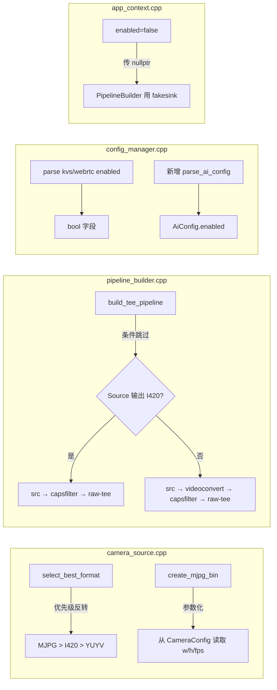

# 设计文档

## 概述

本设计解决 raspi-eye 在 Pi 5 上 CPU 占用 ~106% 的问题。根因是 IMX678 USB 摄像头被选为 YUYV 格式，`videoconvert` 做 YUYV→I420 全帧像素转换极其吃 CPU。方案包含两个核心变更：

1. **格式优先级反转**：`select_best_format` 从 `I420 > YUYV > MJPG` 改为 `MJPG > I420 > YUYV`，让 MJPG + jpegdec 路径取代 YUYV + videoconvert 路径，预期 CPU 从 ~106% 降到 ~40%
2. **videoconvert 条件跳过**：当 Source Bin 已输出 I420（MJPG+jpegdec 或原生 I420）时，跳过冗余的 videoconvert
3. **三路 enable 开关**：在 config.toml 的 `[kvs]`、`[webrtc]`、`[ai]` section 中添加 `enabled` 字段，方便逐路诊断 CPU 占用

## 架构

### 变更影响范围



### 管道拓扑变更

变更前（YUYV 路径）：
```
v4l2src(YUYV) → videoconvert(YUYV→I420) → capsfilter(I420) → raw-tee → ...
```

变更后（MJPG 路径）：
```
[Source Bin: v4l2src → capsfilter(image/jpeg) → jpegdec] → capsfilter(I420) → raw-tee → ...
                                                          ↑ 跳过 videoconvert（已是 I420）
```

## 组件与接口

### 1. camera_source.cpp — 格式优先级与 MJPG Bin 参数化

#### 1.1 select_best_format 优先级变更

```cpp
// 变更前：I420 > YUYV > MJPG
// 变更后：MJPG > I420 > YUYV
V4L2Format select_best_format(const std::vector<V4L2Format>& formats) {
    for (auto fmt : formats) {
        if (fmt == V4L2Format::MJPG) return V4L2Format::MJPG;
    }
    for (auto fmt : formats) {
        if (fmt == V4L2Format::I420) return V4L2Format::I420;
    }
    for (auto fmt : formats) {
        if (fmt == V4L2Format::YUYV) return V4L2Format::YUYV;
    }
    return V4L2Format::UNKNOWN;
}
```

这是一个纯函数变更，不影响函数签名。

#### 1.2 create_mjpg_bin 参数化

当前 `create_mjpg_bin` 硬编码 `1920x1080@15fps`，改为接收 `CameraConfig` 参数：

```cpp
// 变更前
GstElement* create_mjpg_bin(const std::string& device_path, std::string* error_msg);

// 变更后
GstElement* create_mjpg_bin(const CameraConfig& config, std::string* error_msg);
```

内部使用 `config.device`、`config.width`、`config.height`、`config.framerate` 设置 capsfilter。当 width/height/framerate 为 0（未设置）时，不在 capsfilter 中设置对应字段，让 GStreamer 自动协商（与 pipeline_builder 中 capsfilter 的处理逻辑一致）。

#### 1.3 Source Bin 输出格式标记

为了让 PipelineBuilder 知道 Source Bin 的输出格式（决定是否跳过 videoconvert），在 `CameraConfig` 中新增一个输出格式枚举：

```cpp
// camera_source.h 新增
enum class SourceOutputFormat {
    UNKNOWN,  // 需要 videoconvert（videotestsrc、libcamerasrc）
    I420,     // 已是 I420（MJPG+jpegdec、原生 I420）
    YUYV      // 需要 videoconvert 转换
};
```

`create_source` 签名变更，新增 `out_format` 输出参数：

```cpp
// camera_source.h 变更
GstElement* create_source(const CameraConfig& config,
                          std::string* error_msg = nullptr,
                          SourceOutputFormat* out_format = nullptr);
```

注意：`out_format` 放在 `error_msg` 之后，保持现有调用方（只传 config + error_msg）的兼容性。所有现有调用点无需修改，只有 `build_tee_pipeline` 内部调用时额外传 `&out_format`。

各路径的输出格式：
- `videotestsrc` → `UNKNOWN`（保守，保留 videoconvert）
- `libcamerasrc` → `UNKNOWN`（保守，保留 videoconvert）
- V4L2 MJPG → `I420`（jpegdec 输出 I420）
- V4L2 I420 → `I420`
- V4L2 YUYV → `YUYV`
- V4L2 无 device → `UNKNOWN`（保守）

### 2. pipeline_builder.cpp — videoconvert 条件跳过

`build_tee_pipeline` 签名不变。内部调用 `create_source` 时传入 `&src_format` 获取输出格式，自行决定是否跳过 videoconvert：

```cpp
// build_tee_pipeline 内部逻辑（签名不变）
GstElement* build_tee_pipeline(
    std::string* error_msg = nullptr,
    CameraSource::CameraConfig config = CameraSource::CameraConfig{},
    const KvsSinkFactory::KvsConfig* kvs_config = nullptr,
    const AwsConfig* aws_config = nullptr,
    WebRtcMediaManager* webrtc_media = nullptr);
```

内部变更：
```cpp
CameraSource::SourceOutputFormat src_format;
GstElement* src = CameraSource::create_source(config, error_msg, &src_format);

// 当 src_format == I420 时：跳过 videoconvert，直接 src → capsfilter → raw-tee
// 其他情况：保留 src → videoconvert → capsfilter → raw-tee
bool need_convert = (src_format != CameraSource::SourceOutputFormat::I420);
```

跳过 videoconvert 时，通过 spdlog 记录 info 日志：`"Skipping videoconvert: source already outputs I420"`。保留 videoconvert 时同样记录：`"Using videoconvert: source format={}"`.

rebuild_callback 中的 `build_tee_pipeline` 调用无需修改（签名不变），重建时会重新走格式探测和条件跳过逻辑。

### 3. config_manager — 三路 enable 开关

#### 3.1 数据模型

KVS 和 WebRTC 的 `enabled` 字段直接添加到现有结构体：

```cpp
// kvs_sink_factory.h 中 KvsConfig 新增
struct KvsConfig {
    std::string stream_name;
    std::string aws_region;
    bool enabled = true;  // 新增，默认 true
};

// webrtc_signaling.h 中 WebRtcConfig 新增
struct WebRtcConfig {
    std::string channel_name;
    std::string aws_region;
    bool enabled = true;  // 新增，默认 true
};
```

AI 分支需要新增配置结构体（当前无 `[ai]` section）：

```cpp
// config_manager.h 新增
struct AiConfig {
    bool enabled = true;  // 默认 true
};
```

#### 3.2 解析逻辑

KVS 和 WebRTC 的 `enabled` 字段在各自现有的 `build_kvs_config` / `build_webrtc_config` 中解析。

AI 配置新增 `parse_ai_config` 纯函数：

```cpp
bool parse_ai_config(
    const std::unordered_map<std::string, std::string>& kv,
    AiConfig& config,
    std::string* error_msg = nullptr);
```

布尔值解析规则：接受 `"true"` / `"false"`（大小写不敏感），其他值返回错误。

#### 3.3 ConfigManager 扩展

```cpp
class ConfigManager {
public:
    // 新增 accessor
    const AiConfig& ai_config() const { return ai_config_; }
    // ... 现有 accessors 不变
private:
    AiConfig ai_config_;  // 新增
    // ... 现有成员不变
};
```

`ConfigManager::load` 新增解析 `[ai]` section（可选，缺失时使用默认值）。

### 4. app_context.cpp — enable 开关传递

复用现有的 nullptr 机制。在 `init()` 阶段根据 `enabled` 决定是否创建模块：

```cpp
// app_context.cpp init() 中
bool AppContext::init(const std::string& config_path, ...) {
    // ... load config ...

    // WebRTC: enabled=false 时跳过 signaling 和 media_manager 创建
    if (impl_->webrtc_config.enabled) {
        impl_->signaling = WebRtcSignaling::create(...);
        impl_->media_manager = WebRtcMediaManager::create(...);
        // ... register callbacks ...
    }
    // impl_->media_manager 保持 nullptr，start() 中自然传 nullptr 给 PipelineBuilder
}
```

```cpp
// app_context.cpp start() 中
bool AppContext::start(std::string* error_msg) {
    // KVS: enabled=false 时传 nullptr（PipelineBuilder 用 fakesink）
    const KvsSinkFactory::KvsConfig* kvs_ptr =
        impl_->kvs_config.enabled ? &impl_->kvs_config : nullptr;
    const AwsConfig* aws_ptr =
        impl_->kvs_config.enabled ? &impl_->aws_config : nullptr;

    // WebRTC: init 阶段已决定，直接用 media_manager 指针（可能为 nullptr）
    WebRtcMediaManager* webrtc_ptr = impl_->media_manager.get();

    GstElement* pipeline = PipelineBuilder::build_tee_pipeline(
        error_msg, impl_->cam_config, kvs_ptr, aws_ptr, webrtc_ptr);
    // ...
}
```

KVS `enabled=false` 时不需要 AWS 凭证验证，signaling 不受影响（signaling 属于 WebRTC）。

### 5. config.toml 变更

```toml
[kvs]
stream_name = "RaspiEyeAlphaStream"
aws_region = "ap-southeast-1"
enabled = true   # 新增

[webrtc]
channel_name = "RaspiEyeAlphaChannel"
aws_region = "ap-southeast-1"
enabled = true   # 新增

[ai]              # 新增 section
enabled = true
```

## 数据模型

### SourceOutputFormat 枚举

| 值 | 含义 | videoconvert |
|----|------|-------------|
| UNKNOWN | 未知输出格式（保守路径） | 保留 |
| I420 | 已输出 I420（MJPG+jpegdec 或原生 I420） | 跳过 |
| YUYV | 输出 YUYV（需要格式转换） | 保留 |

### AiConfig 结构体

| 字段 | 类型 | 默认值 | 说明 |
|------|------|--------|------|
| enabled | bool | true | AI 分支是否启用 |

### KvsConfig.enabled / WebRtcConfig.enabled

| 字段 | 类型 | 默认值 | 说明 |
|------|------|--------|------|
| enabled | bool | true | 对应分支是否启用 |

### 格式选择优先级

| 优先级 | 格式 | CPU 开销 | 说明 |
|--------|------|---------|------|
| 1（最高） | MJPG | 低（jpegdec 解码开销小，整条管道含编码+推流约 40% CPU） | USB 3.0 带宽充足，MJPG 压缩后传输量小 |
| 2 | I420 | 无（零转换） | 理想但 IMX678 不支持 |
| 3（最低） | YUYV | 高（videoconvert ~106% CPU） | 全帧像素转换，仅作回退 |

## 正确性属性

*属性是在系统所有合法执行中都应成立的特征或行为——本质上是对系统应做什么的形式化陈述。属性是人类可读规格与机器可验证正确性保证之间的桥梁。*

### Property 1: 格式选择优先级不变式

*For any* 非空的 V4L2Format 向量（不含 UNKNOWN），`select_best_format` 的返回值 SHALL 满足以下优先级规则：
- 若向量包含 MJPG，返回值为 MJPG
- 若向量不含 MJPG 但包含 I420，返回值为 I420
- 若向量仅包含 YUYV，返回值为 YUYV

**Validates: Requirements 1.1, 1.2, 1.3, 1.4, 1.5**

### Property 2: 非法布尔值被拒绝

*For any* 非空字符串，若该字符串（大小写不敏感）不等于 "true" 或 "false"，则 `parse_bool_field` SHALL 返回解析失败。

**Validates: Requirements 4.8**

## 错误处理

### 格式探测失败

- `probe_v4l2_formats` 返回空向量时，`create_source` 返回 nullptr 并设置 error_msg（现有行为不变）
- `select_best_format` 返回 UNKNOWN 时，`create_source` 返回 nullptr（现有行为不变）

### MJPG Bin 创建失败

- `create_mjpg_bin` 内部任何 GStreamer 元素创建失败时，清理已创建的元素并返回 nullptr（现有行为不变）
- jpegdec 插件不可用时，返回 nullptr 并设置 error_msg

### videoconvert 跳过后的 caps 协商失败

- 当 Source Bin 声称输出 I420 但实际输出其他格式时，capsfilter 的 caps 协商会失败
- GStreamer 会通过 bus message 报告错误，PipelineHealthMonitor 会触发重建
- 这是一个防御性场景，正常情况下不应发生

### 配置解析错误

- `enabled` 字段值不是合法布尔值时，`parse_*_config` 返回 false 并设置 error_msg，包含字段名和非法值
- `[ai]` section 缺失时，使用默认值（enabled=true），不报错

### enable=false 时的模块跳过

- KVS `enabled=false`：跳过 signaling 不受影响（signaling 是 WebRTC 的），PipelineBuilder 收到 kvs_config=nullptr 时用 fakesink
- WebRTC `enabled=false`：init 阶段跳过 signaling 和 media_manager 创建，start 阶段传 nullptr 给 PipelineBuilder
- AI `enabled=false`：当前 AI 分支已是 fakesink，此开关为 spec-10 集成后预留

## 测试策略

### 属性测试（Property-Based Testing）

使用 RapidCheck 库，每个属性测试最少 100 次迭代。

**Property 1: 格式选择优先级不变式**
- 标签：`Feature: pipeline-cpu-optimization, Property 1: 格式选择优先级不变式`
- 生成器：随机生成非空 V4L2Format 向量（从 {MJPG, I420, YUYV} 中随机选取 1-10 个元素，允许重复）
- 断言：返回值符合 MJPG > I420 > YUYV 优先级
- 注意：`select_best_format` 是 anonymous namespace 中的函数，需要提取为可测试的命名空间函数，或在测试中重新实现相同逻辑进行对比测试。推荐方案：将 `select_best_format` 和 `V4L2Format` 移到 `CameraSource` 命名空间中暴露给测试。

**Property 2: 非法布尔值被拒绝**
- 标签：`Feature: pipeline-cpu-optimization, Property 2: 非法布尔值被拒绝`
- 生成器：随机生成非空字符串，前置条件排除 "true"/"false"（大小写不敏感）
- 断言：解析函数返回 false

### 单元测试（Example-Based）

**camera_source 测试（camera_test.cpp 扩展）：**
- `select_best_format` 优先级：MJPG+YUYV → MJPG、MJPG+I420 → MJPG、仅 YUYV → YUYV、仅 I420 → I420
- 空向量 → UNKNOWN

**pipeline_builder 测试（tee_test.cpp 扩展）：**
- `src_format=I420` 时 pipeline 不含 "convert" 元素
- `src_format=YUYV` 时 pipeline 包含 "convert" 元素
- `src_format=UNKNOWN`（默认）时 pipeline 包含 "convert" 元素（向后兼容）
- 三种 src_format 下 pipeline 均能达到 PLAYING/PAUSED 状态

**config_manager 测试（config_test.cpp 扩展）：**
- `parse_ai_config` 空 map → enabled=true
- `parse_ai_config` enabled="true" → enabled=true
- `parse_ai_config` enabled="false" → enabled=false
- `parse_ai_config` enabled="invalid" → 返回 false
- KvsConfig/WebRtcConfig enabled 字段解析（同上模式）
- 现有 config 测试不受影响（向后兼容）

### 回归测试

- 所有现有 macOS 测试必须通过（`ctest --test-dir device/build --output-on-failure`）
- 特别关注 `tee_test.cpp` 和 `camera_test.cpp` 中的现有测试不受影响

### 可测试性设计决策

`select_best_format` 和 `V4L2Format` 当前在 `camera_source.cpp` 的 anonymous namespace 中，无法从测试直接调用。为支持 PBT，需要将它们移到 `CameraSource` 命名空间中并在 `camera_source.h` 中声明。这是一个合理的重构：格式选择逻辑是 CameraSource 的核心职责，应该是公开接口的一部分。

