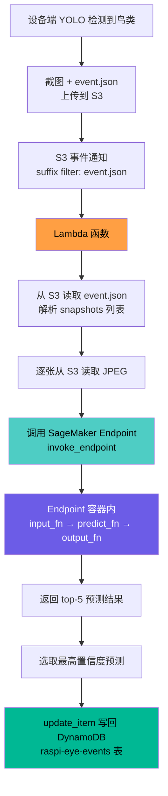
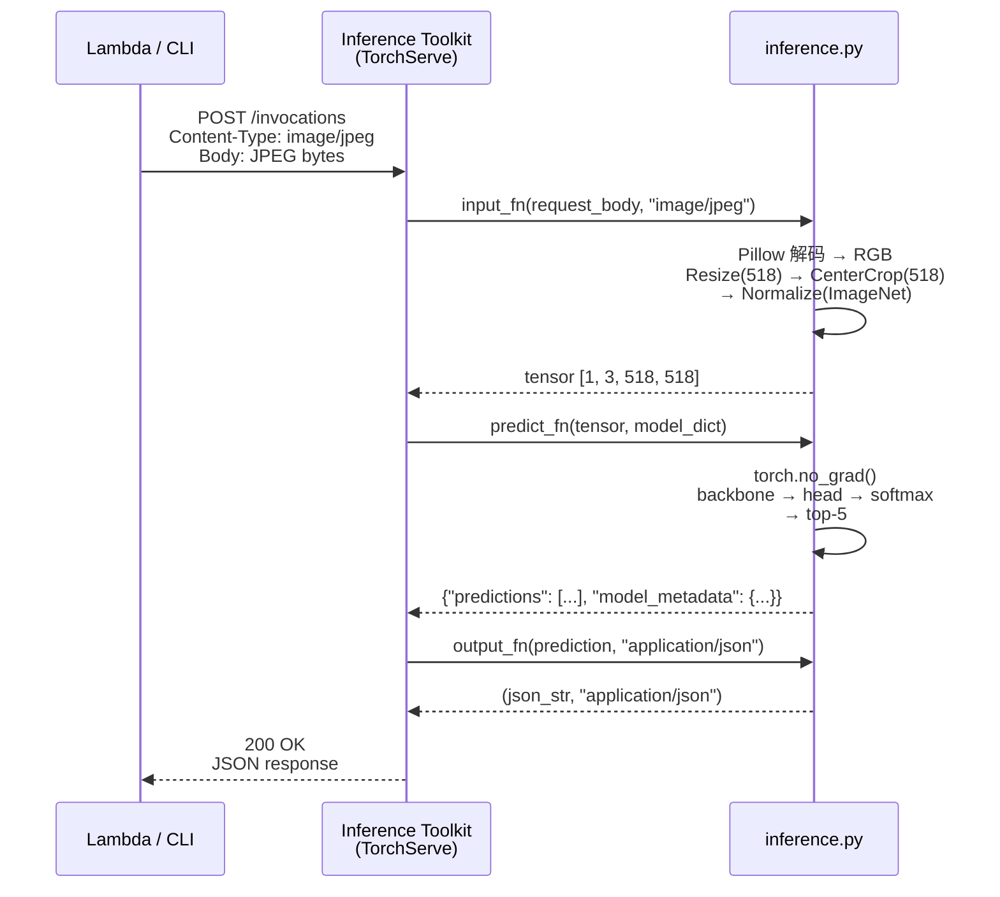
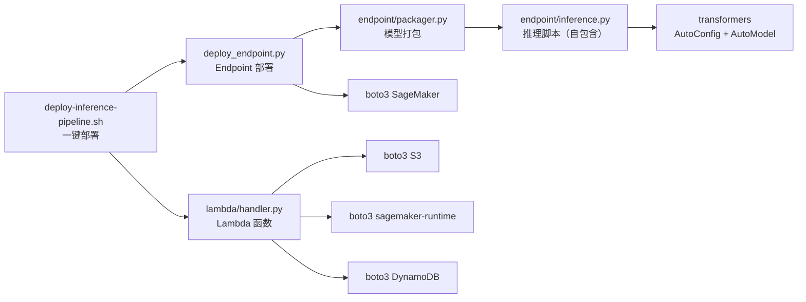

# 设计文档：Spec 17 — 云端推理链路（SageMaker Endpoint + Lambda + DynamoDB）

## 概述

本设计实现完整的云端推理链路：S3 event.json 上传 → Lambda 触发 → 读取截图 → 调用 SageMaker Serverless endpoint 推理 → 结果写入 DynamoDB。系统分为五个核心组件：

1. **推理脚本（inference.py）**：实现 SageMaker PyTorch Inference Toolkit 的四个钩子函数，完全自包含（内联 `_get_val_transform`、`_BirdClassifier`、`_create_backbone_offline`），不依赖 training 模块
2. **模型打包（packager.py）**：将 .pt 模型文件 + 推理代码打包为 model.tar.gz，上传到 S3
3. **Endpoint 部署脚本（deploy_endpoint.py）**：boto3 三步部署 SageMaker endpoint，支持 Serverless + Real-time 双模式，自动从 Secrets Manager 获取 HF_TOKEN 注入容器环境变量
4. **Lambda 函数（handler.py）**：S3 事件触发，编排 S3 读取 → SageMaker 调用 → DynamoDB update_item 写回 raspi-eye-events 表
5. **一键部署脚本（deploy-inference-pipeline.sh）**：按序部署全部 AWS 资源（4 步，不含 DynamoDB 表创建）

### 设计决策

| 决策 | 选择 | 理由 |
|------|------|------|
| 推理容器 | PyTorch 2.6 CPU 预构建容器 | Serverless Inference 仅支持 CPU；预构建容器内置 Inference Toolkit，自动处理 model_fn/input_fn/predict_fn/output_fn 调度 |
| Serverless 内存 | 6144 MB | DINOv3 ViT-L/16 模型约 1.2GB，加载后内存占用约 3-4GB，6GB 是 Serverless 最大可选值，冷启动约 56 秒 |
| 部署模式 | Serverless + Real-time 双模式 | Serverless 适合生产（按调用计费），Real-time（ml.m5.large）适合调试和低延迟场景 |
| Serverless 并发 | 5 | 鸟类检测事件频率低（每天几十次），5 并发足够 |
| Lambda 触发方式 | S3 事件通知（suffix filter: event.json） | event.json 是事件的最后一个文件，上传完成意味着所有截图已就绪；避免每张 JPEG 都触发 |
| Lambda 不做图片处理 | 仅编排 S3 读取 + SageMaker invoke + DynamoDB 写入 | 图片预处理和推理全部在 SageMaker 容器内完成，Lambda 保持轻量（256MB） |
| DynamoDB 写回 | update_item 写回 raspi-eye-events 表 | 不创建新表，复用设备端已有的事件表，推理结果字段加 inference_ 前缀 |
| Lambda 错误处理 | 记录错误但不抛异常 | 避免 S3 事件通知重试风暴（S3 会对失败的 Lambda 调用重试） |
| HF_TOKEN 获取 | deploy_endpoint.py 从 Secrets Manager 获取并注入 SageMaker Model 环境变量 | inference.py 通过环境变量读取，避免容器内访问 Secrets Manager |
| 推理代码架构 | 完全自包含（内联 backbone 创建、分类器、预处理） | SageMaker 容器内 model.tar.gz 的 code/ 目录没有 training 模块文件 |
| 模型加载方式 | AutoConfig.from_pretrained + AutoModel.from_config + load_state_dict | 避免 from_pretrained 下载完整 1.2GB 权重，只下载几 KB 的 config.json |
| PBT 框架 | Hypothesis | 与 Spec 29 一致，Python 生态最成熟的 PBT 库 |

### 与其他 Spec 的边界

- **Spec 29（训练）**：只读依赖。inference.py 不直接 import training 模块，而是内联了等效的 backbone 创建和分类器逻辑，保持预处理参数与训练一致
- **Spec 11（S3 上传）**：只读依赖。Lambda 读取 Spec 11 上传的 event.json 和 JPEG 截图，不修改上传逻辑
- **Spec 10（AI Pipeline）**：只读依赖。event.json 格式由 Spec 10 定义，Lambda 按该格式解析
- **DynamoDB raspi-eye-events 表**：写回依赖。Lambda 通过 update_item 写回推理结果，不创建或管理表结构

### 禁止项（Design 层）

- SHALL NOT 在代码中硬编码 AWS 凭证、密钥、Role ARN 或 HF_TOKEN（通过环境变量或 Secrets Manager 获取）
- SHALL NOT 在日志中打印 HF_TOKEN、AWS 凭证等敏感信息
- SHALL NOT 使用 `ContainerEntrypoint` 覆盖 SageMaker 预构建容器的默认入口脚本（来源：spec-29 经验，覆盖会导致 Inference Toolkit 不初始化）
- SHALL NOT 在推理脚本中使用 OpenCV 做图片处理（使用 Pillow + torchvision transforms，保持与 Spec 29 一致）
- SHALL NOT 在 Lambda 中使用 SageMaker Python SDK（仅用 boto3 的 `sagemaker-runtime` 调用 `invoke_endpoint`，Lambda 部署包保持轻量）

## 架构

### 整体数据流



### SageMaker Endpoint 内部流程



### 一键部署流程


### 模块依赖



## 组件与接口

### 1. endpoint/inference.py — 推理脚本（SageMaker 容器内执行，完全自包含）

```python
def model_fn(model_dir: str) -> dict:
    """加载模型。
    
    1. 从 model_dir/bird_classifier.pt 加载 checkpoint
    2. 读取 metadata（backbone_name, input_size, class_names 等）
    3. 通过环境变量获取 HF_TOKEN（由 deploy_endpoint.py 从 Secrets Manager 注入）
    4. 使用内联的 _create_backbone_offline：AutoConfig.from_pretrained（下载 config.json）
       + AutoModel.from_config（创建空模型结构，不下载权重）
    5. 重建内联的 _BirdClassifier，加载 state_dict，设为 eval 模式
    6. 返回 {"model": model, "transform": val_transform, "class_names": [...], "metadata": {...}}
    """

def input_fn(request_body: bytes, content_type: str) -> torch.Tensor:
    """反序列化输入。
    
    接受 image/jpeg 或 application/x-image。
    Pillow 解码 → RGB → get_val_transform(input_size) → unsqueeze(0)。
    不支持的 content_type 或损坏图片抛出 ValueError。
    """

def predict_fn(input_data: torch.Tensor, model_dict: dict) -> dict:
    """执行推理。
    
    torch.no_grad() → model(input_data) → softmax → top-5。
    返回 {"predictions": [{"species": str, "confidence": float}, ...], 
           "model_metadata": {"backbone": str, "num_classes": int}}
    """

def output_fn(prediction: dict, accept: str) -> tuple[str, str]:
    """序列化输出。
    
    JSON 序列化 prediction dict。
    返回 (json_string, "application/json")。
    """
```

### 2. endpoint/packager.py — 模型打包

```python
def package_model(
    model_path: str,           # 本地 .pt 文件路径或 S3 URI
    class_names_path: str,     # class_names.json 路径或 S3 URI
    output_dir: str,           # 本地输出目录
    s3_bucket: str | None,     # 上传目标 bucket
    backbone_name: str,        # backbone 名称（决定 S3 路径）
) -> str:
    """打包 model.tar.gz 并可选上传到 S3。
    
    tar.gz 内部结构：
    ├── bird_classifier.pt
    ├── class_names.json
    └── code/
        ├── inference.py
        └── requirements.txt
    
    返回 S3 URI 或本地路径。
    """
```

### 3. deploy_endpoint.py — Endpoint 部署脚本

```python
def main():
    """CLI 入口。
    
    支持参数：
    --backbone (default: dinov3-vitl16)
    --s3-bucket (default: raspi-eye-model-data)
    --role (required)
    --region (default: ap-southeast-1)
    --memory-size (default: 6144)
    --max-concurrency (default: 5)
    --endpoint-name (default: raspi-eye-bird-classifier)
    --skip-package  # 跳过打包步骤
    --wait          # 等待 InService
    --test          # 部署后测试
    --update        # 更新现有 endpoint
    --delete        # 删除 endpoint
    """
```

### 4. lambda/handler.py — Lambda 函数

```python
def handler(event: dict, context) -> dict:
    """Lambda 入口。
    
    1. 遍历 event["Records"]，提取 bucket + key
    2. 过滤非 event.json 的 key
    3. 从 S3 读取 event.json，解析元数据
    4. 从 snapshots 数组构造完整 S3 key
    5. 逐张读取 JPEG → invoke_endpoint
    6. 选取最高置信度预测
    7. update_item 写回 DynamoDB raspi-eye-events 表（inference_ 前缀字段）
    8. 错误处理：SageMaker 调用失败记录到 inference_error 字段，不抛异常
    """

def parse_event_json(event_data: dict) -> dict:
    """解析 event.json，提取必需字段。"""

def build_snapshot_keys(event_key: str, snapshots: list[str]) -> list[str]:
    """从 event.json 所在目录前缀 + snapshot 文件名构造完整 S3 key。"""

def select_best_prediction(results: list[dict]) -> dict:
    """从多张图片的推理结果中选取最高置信度预测。"""
```

### 5. deploy-inference-pipeline.sh — 一键部署脚本

```bash
#!/bin/bash
# 部署顺序：
# 1. SageMaker Endpoint（调用 deploy_endpoint.py）
# 2. Lambda IAM 角色（aws iam create-role + put-role-policy）
# 3. Lambda 函数（zip + aws lambda create-function）
# 4. S3 事件通知（aws lambda add-permission + s3api put-bucket-notification-configuration）
#
# 注意：DynamoDB 使用已有的 raspi-eye-events 表，不创建新表。
#
# 支持参数：
# --skip-endpoint  跳过 SageMaker endpoint 部署
# --delete         逆序删除所有资源（不删除 DynamoDB 表）
# --e2e-test       端到端验证
```

## 数据模型

### model.tar.gz 内部结构

```
model.tar.gz
├── bird_classifier.pt          # state_dict + metadata
├── class_names.json            # {"0": "Passer montanus", ...}
└── code/
    ├── inference.py            # 推理钩子函数
    └── requirements.txt        # transformers>=4.56, Pillow
```

### SageMaker Model 环境变量

```python
{
    "SAGEMAKER_PROGRAM": "inference.py",
    "SAGEMAKER_SUBMIT_DIRECTORY": "/opt/ml/model/code",
    "SAGEMAKER_MODEL_SERVER_TIMEOUT": "300",
    "HF_TOKEN": "<从 Secrets Manager 获取，由 deploy_endpoint.py 注入>",
}
```

### PyTorch Inference Container 镜像 URI

```python
PYTORCH_INFERENCE_IMAGE_URIS = {
    "ap-southeast-1": (
        "763104351884.dkr.ecr.ap-southeast-1.amazonaws.com/"
        "pytorch-inference:2.6.0-cpu-py312-ubuntu22.04-sagemaker"
    ),
}
```

### inference.py 输出 JSON 格式

```json
{
    "predictions": [
        {"species": "Passer montanus", "confidence": 0.92},
        {"species": "Pycnonotus sinensis", "confidence": 0.05},
        {"species": "Zosterops japonicus", "confidence": 0.02},
        {"species": "Passer cinnamomeus", "confidence": 0.005},
        {"species": "Lonchura striata", "confidence": 0.003}
    ],
    "model_metadata": {
        "backbone": "dinov3-vitl16",
        "num_classes": 46
    }
}
```

### DynamoDB 写回设计（raspi-eye-events 表）

Lambda 通过 `update_item` 写回已有的 `raspi-eye-events` 表，推理结果字段加 `inference_` 前缀：

| 属性 | 类型 | 说明 |
|------|------|------|
| device_id (PK-HASH) | String | 设备 ID（已有字段） |
| start_time (PK-RANGE) | String | ISO 8601 时间戳（已有字段） |
| inference_species | String | 最高置信度物种名 |
| inference_confidence | Number | 最高置信度值 |
| inference_image_key | String | 最高置信度对应的 S3 图片 key |
| inference_top5 | List | top-5 预测列表 |
| inference_latency_ms | Number | 推理耗时（毫秒） |
| inference_error | String / Null | 错误信息（正常为 null） |

### Lambda 环境变量

| 变量 | 值 |
|------|-----|
| ENDPOINT_NAME | raspi-eye-bird-classifier |
| TABLE_NAME | raspi-eye-events |

### Lambda IAM 权限

```json
{
    "Version": "2012-10-17",
    "Statement": [
        {
            "Effect": "Allow",
            "Action": "s3:GetObject",
            "Resource": "arn:aws:s3:::raspi-eye-captures-014498626607-ap-southeast-1-an/*"
        },
        {
            "Effect": "Allow",
            "Action": "sagemaker:InvokeEndpoint",
            "Resource": "arn:aws:sagemaker:ap-southeast-1:014498626607:endpoint/raspi-eye-bird-classifier"
        },
        {
            "Effect": "Allow",
            "Action": "dynamodb:UpdateItem",
            "Resource": "arn:aws:dynamodb:ap-southeast-1:014498626607:table/raspi-eye-events"
        },
        {
            "Effect": "Allow",
            "Action": ["logs:CreateLogGroup", "logs:CreateLogStream", "logs:PutLogEvents"],
            "Resource": "arn:aws:logs:ap-southeast-1:014498626607:*"
        }
    ]
}
```

### S3 事件通知配置

```json
{
    "LambdaFunctionConfigurations": [
        {
            "LambdaFunctionArn": "arn:aws:lambda:ap-southeast-1:014498626607:function:raspi-eye-inference",
            "Events": ["s3:ObjectCreated:*"],
            "Filter": {
                "Key": {
                    "FilterRules": [
                        {"Name": "suffix", "Value": "event.json"}
                    ]
                }
            }
        }
    ]
}
```


## Correctness Properties

*A property is a characteristic or behavior that should hold true across all valid executions of a system—essentially, a formal statement about what the system should do. Properties serve as the bridge between human-readable specifications and machine-verifiable correctness guarantees.*

### Property 1: input_fn 输出 shape 不变量

*For any* 合法 JPEG 图片（随机尺寸，宽高 ∈ [32, 2048]），经过 `input_fn` 预处理后，输出张量的 shape 恒为 `(1, 3, input_size, input_size)`，其中 `input_size` 由模型元数据决定（DINOv3 为 518）。

**Validates: Requirements 1.3, 5.2**

### Property 2: input_fn 拒绝非法 content_type

*For any* 不属于 `{"image/jpeg", "application/x-image"}` 的 content_type 字符串，`input_fn` 应抛出 `ValueError`。

**Validates: Requirements 1.4**

### Property 3: 推理 round-trip（input_fn → predict_fn → output_fn）

*For any* 合法 JPEG 图片（随机尺寸，宽高 ∈ [32, 2048]），经过 `input_fn` → `predict_fn` → `output_fn` 完整链路后：
- 输出为合法 JSON 字符串
- JSON 包含 `predictions` 列表，长度 ∈ [1, 5]
- 每项包含 `species`（非空字符串）和 `confidence`（∈ (0.0, 1.0]）
- 所有 `confidence` 之和 ≤ 1.0（softmax 属性）
- JSON 包含 `model_metadata`，含 `backbone`（非空字符串）和 `num_classes`（正整数）

**Validates: Requirements 1.3, 1.6, 1.7, 5.3, 5.4, 5.6**

### Property 4: 事件解析与 snapshot key 构造不变量

*For any* 合法的 event.json S3 key（格式 `{device_id}/{date}/{event_id}/event.json`）和任意 snapshots 文件名列表，`build_snapshot_keys` 构造的完整 S3 key 应满足：
- 每个 key 以 event.json 所在目录为前缀
- 每个 key 以对应的 snapshot 文件名为后缀
- key 数量等于 snapshots 列表长度

**Validates: Requirements 6.2, 6.3, 12.2**

### Property 5: 最佳预测选择不变量

*For any* 非空的推理结果列表（每个结果包含 top-5 预测，每项含 species 和 confidence ∈ (0.0, 1.0]），`select_best_prediction` 选出的最终结果的 `confidence` 恒等于所有图片所有预测中的最大值。

**Validates: Requirements 6.5, 12.6**

## Error Handling

### 推理脚本（inference.py）

| 错误场景 | 处理策略 |
|----------|----------|
| model_dir 中找不到 bird_classifier.pt | 抛出 FileNotFoundError，打印 model_dir 内容 |
| .pt 文件格式错误（缺少 metadata） | 抛出 KeyError，打印期望的格式 |
| backbone_name 不在 BACKBONE_REGISTRY 中 | 抛出 ValueError，列出可用 backbone |
| Secrets Manager 获取 HF_TOKEN 失败 | 打印警告，回退到环境变量 HF_TOKEN |
| 环境变量 HF_TOKEN 也不存在 | 继续执行（backbone 可能不需要 token），加载 backbone 时再报错 |
| input_fn 收到不支持的 content_type | 抛出 ValueError，列出支持的类型 |
| input_fn 收到损坏的图片数据 | 抛出 ValueError，打印错误信息 |
| predict_fn 推理过程中 OOM | 由 SageMaker 容器处理，返回 500 错误 |

### Lambda 函数（handler.py）

| 错误场景 | 处理策略 |
|----------|----------|
| S3 GetObject 失败（权限/不存在） | 记录错误日志，跳过该事件 |
| event.json 格式不符合预期（缺少必需字段） | 记录警告日志，跳过该事件 |
| snapshots 数组为空 | 记录警告日志，跳过该事件（无图片可推理） |
| 某张 JPEG 图片 S3 GetObject 失败 | 记录警告，跳过该图片，继续处理其余图片 |
| SageMaker invoke_endpoint 超时 | 记录错误，将 error 信息写入 DynamoDB 记录的 inference_error 字段，不抛异常 |
| SageMaker endpoint 不存在 | 记录错误，将 error 信息写入 DynamoDB 记录的 inference_error 字段，不抛异常 |
| SageMaker 返回非 200 响应 | 记录错误，将 error 信息写入 DynamoDB 记录的 inference_error 字段，不抛异常 |
| DynamoDB UpdateItem 失败 | 记录错误日志，不抛异常（避免 S3 事件重试） |
| 所有图片推理都失败 | 写入 DynamoDB 记录，inference_species 为空，inference_error 字段记录失败原因 |

### 部署脚本

| 错误场景 | 处理策略 |
|----------|----------|
| SageMaker create_model 失败 | 打印完整错误信息和 CloudWatch Logs 链接，退出 |
| Endpoint 已存在且未指定 --update | 打印提示信息，建议使用 --update 或 --delete |
| Lambda 角色已存在 | 跳过创建，更新内联策略，打印提示 |
| S3 事件通知配置失败 | 打印错误信息，提示检查 Lambda 权限 |
| --e2e-test 180 秒超时 | 打印 Lambda CloudWatch Logs 链接，报告验证失败 |

## Testing Strategy

### 测试框架

- **单元测试**：pytest
- **属性测试**：Hypothesis（PBT），每个属性最少 100 次迭代
- **测试目录**：`model/tests/`
- **测试文件**：`test_endpoint.py`（推理脚本 + 打包）、`test_lambda.py`（Lambda 函数）
- **运行命令**：
  ```bash
  source .venv-raspi-eye/bin/activate
  pytest model/tests/test_endpoint.py -v
  pytest model/tests/test_lambda.py -v
  ```

### 双测试策略

| 测试类型 | 覆盖范围 | 工具 |
|----------|----------|------|
| 属性测试（PBT） | input_fn shape 不变量、非法 content_type 拒绝、推理 round-trip、事件解析 + key 构造、最佳预测选择 | Hypothesis |
| 单元测试（Example） | model_fn 加载、HF_TOKEN 回退、model.tar.gz 打包结构、Lambda 事件解析、SageMaker mock 调用、DynamoDB mock 写入、错误处理 | pytest + mock |

### 属性测试配置

- 每个属性测试最少 100 次迭代（`@settings(max_examples=100)`）
- 使用 MockBackbone 替代真实 backbone（不依赖 GPU/网络）
- Tag 格式：`Feature: sagemaker-endpoint, Property {N}: {description}`

### 测试用 MockBackbone

复用 Spec 29 测试中的 MockBackbone 模式：

```python
class MockBackbone(nn.Module):
    """测试用小型 backbone，随机初始化，不依赖网络。"""
    def __init__(self, feature_dim: int = 64):
        super().__init__()
        self.proj = nn.Linear(3 * 32 * 32, feature_dim)
    
    def forward(self, x):
        return self.proj(x.flatten(1))
```

测试中通过 monkey-patch `BACKBONE_REGISTRY` 注入 MockBackbone 配置，确保：
- 不下载真实模型权重（DINOv3 约 1.2GB）
- 不依赖 GPU
- 不依赖网络（无 HuggingFace 下载）
- CPU 上快速运行

### test_endpoint.py 测试清单

1. **model_fn 加载测试**：MockBackbone 创建 .pt → model_fn 加载 → 验证返回字典结构
2. **HF_TOKEN 回退测试**：Mock Secrets Manager 失败 → 验证从环境变量获取
3. **input_fn shape 不变量（PBT）**：随机尺寸 JPEG → 验证输出 shape
4. **input_fn 非法 content_type（PBT）**：随机非法 content_type → 验证 ValueError
5. **input_fn 损坏图片**：随机字节流 → 验证 ValueError
6. **推理 round-trip（PBT）**：随机 JPEG → input_fn → predict_fn → output_fn → 验证格式和数值
7. **model.tar.gz 打包结构**：创建临时文件 → 打包 → 解压验证结构

### test_lambda.py 测试清单

1. **S3 事件解析**：构造 S3 事件 → 验证提取 bucket 和 key
2. **event.json 解析**：构造 event.json → 验证提取所有字段
3. **snapshot key 构造（PBT）**：随机目录前缀 + 文件名 → 验证拼接正确
4. **最佳预测选择（PBT）**：随机推理结果 → 验证选出全局最大 confidence
5. **SageMaker 调用 mock**：Mock invoke_endpoint → 验证请求参数和响应解析
6. **DynamoDB 写入 mock**：Mock update_item → 验证记录包含所有必需字段（inference_ 前缀）
7. **SageMaker 调用失败**：Mock 抛出异常 → 验证不抛异常且 inference_error 字段有值
8. **event.json 格式错误**：传入缺少字段的 JSON → 验证跳过且不抛异常
