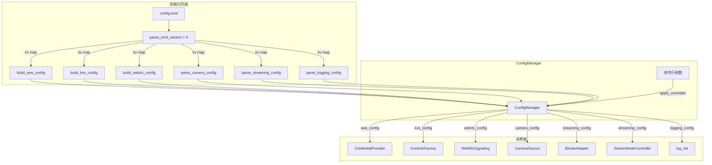
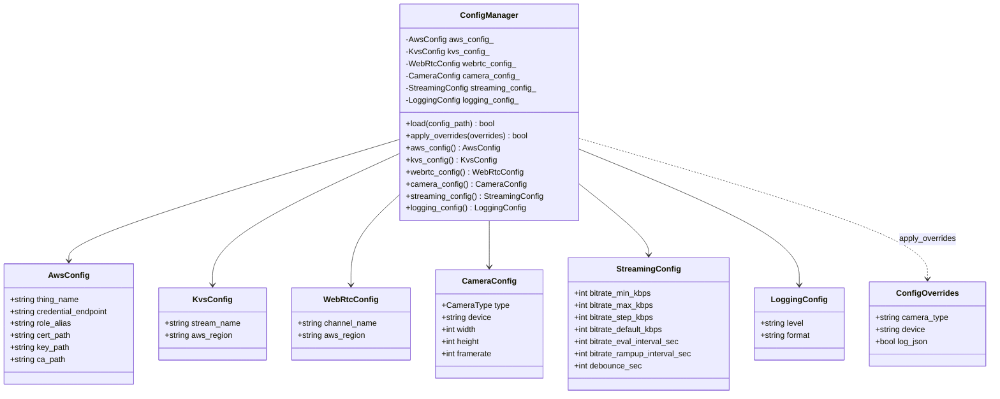

# 设计文档

## 概述

ConfigManager 是一个统一配置加载模块，负责一次性解析 config.toml 的所有 section，并提供类型安全的配置结构体访问接口。它是一个简单的值类型（非 pImpl），因为只在 `AppContext::init()` 阶段使用一次，不需要运行时多态。

设计核心思路：
1. 复用现有 `parse_toml_section` 函数逐 section 解析 TOML
2. 复用现有 `build_aws_config`、`build_kvs_config`、`build_webrtc_config` 函数（向后兼容）
3. 新增纯函数 `parse_camera_config`、`parse_streaming_config`、`parse_logging_config` 处理新 section
4. 命令行覆盖通过 `apply_overrides` 方法在 load 之后调用
5. AppContext::init() 改为先创建 ConfigManager，再从中获取各模块配置

## 架构



设计决策：
- **值类型而非 pImpl**：ConfigManager 只在 init 阶段使用，不需要运行时多态或 ABI 稳定性，值类型更简单直接
- **复用现有 build_* 函数**：保持向后兼容，现有的 `build_aws_config`、`build_kvs_config`、`build_webrtc_config` 保留不删除
- **纯函数解析新 section**：`parse_camera_config`、`parse_streaming_config`、`parse_logging_config` 是纯函数，接收 kv map 返回结构体，便于单元测试和 PBT
- **三层优先级**：命令行参数 > 配置文件 > 平台默认值，通过先 load 再 apply_overrides 实现

## 组件与接口

### 新增文件

- `device/src/config_manager.h` — ConfigManager 类定义 + 新增结构体 + 纯函数声明
- `device/src/config_manager.cpp` — ConfigManager 实现
- `device/tests/config_test.cpp` — 单元测试 + PBT

### ConfigManager 类

```cpp
// config_manager.h
#pragma once

#include <string>
#include <unordered_map>
#include "camera_source.h"
#include "credential_provider.h"  // AwsConfig, parse_toml_section
#include "kvs_sink_factory.h"     // KvsSinkFactory::KvsConfig
#include "webrtc_signaling.h"     // WebRtcConfig

// --- 新增结构体 ---

struct StreamingConfig {
    int bitrate_min_kbps = 1000;
    int bitrate_max_kbps = 4000;
    int bitrate_step_kbps = 500;
    int bitrate_default_kbps = 2500;
    int bitrate_eval_interval_sec = 5;
    int bitrate_rampup_interval_sec = 30;
    int debounce_sec = 3;
};

struct LoggingConfig {
    std::string level = "info";    // trace|debug|info|warn|error
    std::string format = "text";   // text|json
};

// --- 纯函数（可独立测试 / PBT） ---

// 从 kv map 解析 camera 配置，缺失字段使用平台默认值
// 返回 false 时 error_msg 包含错误原因（如无效 type）
bool parse_camera_config(
    const std::unordered_map<std::string, std::string>& kv,
    CameraSource::CameraConfig& config,
    std::string* error_msg = nullptr);

// 从 kv map 解析 streaming 配置，缺失字段使用默认值
// 返回 false 时 error_msg 包含错误原因（如 min > max）
bool parse_streaming_config(
    const std::unordered_map<std::string, std::string>& kv,
    StreamingConfig& config,
    std::string* error_msg = nullptr);

// 从 kv map 解析 logging 配置，缺失字段使用默认值
// 返回 false 时 error_msg 包含错误原因（如无效 level）
bool parse_logging_config(
    const std::unordered_map<std::string, std::string>& kv,
    LoggingConfig& config,
    std::string* error_msg = nullptr);

// 验证 streaming 配置一致性：min <= default <= max
bool validate_streaming_config(
    const StreamingConfig& config,
    std::string* error_msg = nullptr);

// --- 命令行覆盖参数 ---

struct ConfigOverrides {
    std::string camera_type;   // 非空时覆盖 [camera].type
    std::string device;        // 非空时覆盖 [camera].device
    bool log_json = false;     // true 时覆盖 [logging].format 为 "json"
};

// --- ConfigManager ---

class ConfigManager {
public:
    // 从 config.toml 加载所有 section
    // 返回 false 时 error_msg 包含错误原因
    bool load(const std::string& config_path,
              std::string* error_msg = nullptr);

    // 应用命令行覆盖（在 load 之后调用）
    // 返回 false 时 error_msg 包含错误原因（如无效 camera type）
    bool apply_overrides(const ConfigOverrides& overrides,
                         std::string* error_msg = nullptr);

    // 访问各模块配置（const 引用）
    const AwsConfig& aws_config() const { return aws_config_; }
    const KvsSinkFactory::KvsConfig& kvs_config() const { return kvs_config_; }
    const WebRtcConfig& webrtc_config() const { return webrtc_config_; }
    const CameraSource::CameraConfig& camera_config() const { return camera_config_; }
    const StreamingConfig& streaming_config() const { return streaming_config_; }
    const LoggingConfig& logging_config() const { return logging_config_; }

private:
    AwsConfig aws_config_;
    KvsSinkFactory::KvsConfig kvs_config_;
    WebRtcConfig webrtc_config_;
    CameraSource::CameraConfig camera_config_;
    StreamingConfig streaming_config_;
    LoggingConfig logging_config_;
};
```

### CameraConfig 扩展

现有 `CameraSource::CameraConfig` 需要扩展 width/height/framerate 字段：

```cpp
// camera_source.h 中修改
struct CameraConfig {
    CameraType type = default_camera_type();
    std::string device;
    int width = 1280;       // 新增
    int height = 720;       // 新增
    int framerate = 15;     // 新增
};
```

### ConfigManager::load() 流程

```
1. 调用 parse_toml_section(path, "aws") → kv_aws
2. 调用 build_aws_config(kv_aws, aws_config_) → 失败则返回 false
3. 调用 parse_toml_section(path, "kvs") → kv_kvs
4. 调用 build_kvs_config(kv_kvs, kvs_config_) → 失败则返回 false
5. 调用 parse_toml_section(path, "webrtc") → kv_webrtc
6. 调用 build_webrtc_config(kv_webrtc, webrtc_config_) → 失败则返回 false
7. 调用 parse_toml_section(path, "camera") → kv_camera（可能为空 map）
8. 调用 parse_camera_config(kv_camera, camera_config_) → 失败则返回 false
9. 调用 parse_toml_section(path, "streaming") → kv_streaming（可能为空 map）
10. 调用 parse_streaming_config(kv_streaming, streaming_config_) → 失败则返回 false
11. 调用 validate_streaming_config(streaming_config_) → 失败则返回 false
12. 调用 parse_toml_section(path, "logging") → kv_logging（可能为空 map）
13. 调用 parse_logging_config(kv_logging, logging_config_) → 失败则返回 false
14. 返回 true
```

注意：步骤 7/9/12 中，`parse_toml_section` 对不存在的 section 返回空 map 但会设置 error_msg。对于可选 section，load() 需要传入临时 error_msg（或 nullptr）而非主 error_msg，避免可选 section 缺失被误报为错误。空 map 传给 `parse_*_config` 后使用默认值。

### ConfigManager::apply_overrides() 流程

```
1. 如果 overrides.camera_type 非空：
   a. 调用 CameraSource::parse_camera_type(overrides.camera_type, type)
   b. 失败则返回 false
   c. 成功则设置 camera_config_.type = type
2. 如果 overrides.device 非空：
   a. 设置 camera_config_.device = overrides.device
3. 如果 overrides.log_json 为 true：
   a. 设置 logging_config_.format = "json"
4. 返回 true
```

### AppContext::init() 改造

```cpp
bool AppContext::init(const std::string& config_path,
                     const ConfigOverrides& overrides,
                     std::string* error_msg) {
    // 1. 创建 ConfigManager 并加载
    ConfigManager config;
    if (!config.load(config_path, error_msg)) return false;
    if (!config.apply_overrides(overrides, error_msg)) return false;

    // 2. 从 ConfigManager 获取各模块配置
    impl_->aws_config = config.aws_config();
    impl_->kvs_config = config.kvs_config();
    impl_->webrtc_config = config.webrtc_config();
    impl_->cam_config = config.camera_config();
    impl_->streaming_config = config.streaming_config();  // 新增
    impl_->logging_config = config.logging_config();      // 新增

    // 3. 后续模块创建不变...
}
```

注意：`AppContext::init()` 的签名需要调整，将 `CameraConfig cam_config` 参数替换为 `ConfigOverrides overrides`。`main.cpp` 中的命令行解析逻辑保持不变，解析结果填入 `ConfigOverrides` 传给 `AppContext::init()`。

### StreamModeController debounce 参数传入

StreamModeController 当前构造函数只接受 `GstElement* pipeline`，debounce 时间硬编码为 3000ms。需要新增构造函数重载或在现有构造函数中增加 `int debounce_ms = 3000` 默认参数：

```cpp
// stream_mode_controller.h 修改
explicit StreamModeController(GstElement* pipeline, int debounce_ms = 3000);
```

AppContext::start() 中创建时传入：
```cpp
impl_->stream_controller = std::make_unique<StreamModeController>(
    impl_->pipeline_manager->pipeline(),
    impl_->streaming_config.debounce_sec * 1000);
```

### log_init 集成

`log_init::init()` 当前签名为 `init(bool json)`。spec-19 扩展为接受 LoggingConfig：

```cpp
// log_init.h 新增重载
void init(const LoggingConfig& config);
```

内部实现：根据 `config.format` 决定 JSON/text 格式，根据 `config.level` 设置 spdlog 全局日志级别。原有 `init(bool json)` 保留不删除（向后兼容）。

main.cpp 中改为：
```cpp
log_init::init(config.logging_config());
```

### CameraConfig 扩展说明

CameraConfig 新增的 width/height/framerate 字段在 spec-19 中只做解析和存储。pipeline_builder 中 capsfilter 的实际使用留给后续 Spec（当前 pipeline 不限制分辨率，由摄像头源决定）。

// StreamingConfig → BitrateConfig 转换（纯函数，声明在 config_manager.h）
BitrateConfig to_bitrate_config(const StreamingConfig& sc);
```

### StreamingConfig → BitrateConfig 转换

```cpp
BitrateConfig to_bitrate_config(const StreamingConfig& sc) {
    return BitrateConfig{
        sc.bitrate_min_kbps,
        sc.bitrate_max_kbps,
        sc.bitrate_step_kbps,
        sc.bitrate_default_kbps,
        sc.bitrate_eval_interval_sec,
        sc.bitrate_rampup_interval_sec
    };
}
```

## 数据模型

### 配置结构体关系



### TOML section 到结构体的映射

| TOML Section | 结构体 | 必填 | 解析函数 |
|---|---|---|---|
| `[aws]` | `AwsConfig` | 是 | `build_aws_config`（现有） |
| `[kvs]` | `KvsSinkFactory::KvsConfig` | 是 | `build_kvs_config`（现有） |
| `[webrtc]` | `WebRtcConfig` | 是 | `build_webrtc_config`（现有） |
| `[camera]` | `CameraSource::CameraConfig` | 否 | `parse_camera_config`（新增） |
| `[streaming]` | `StreamingConfig` | 否 | `parse_streaming_config`（新增） |
| `[logging]` | `LoggingConfig` | 否 | `parse_logging_config`（新增） |

### 字段默认值汇总

| 结构体 | 字段 | 默认值 |
|---|---|---|
| CameraConfig | type | macOS: TEST, Linux: V4L2 |
| CameraConfig | device | "/dev/video0" |
| CameraConfig | width | 1280 |
| CameraConfig | height | 720 |
| CameraConfig | framerate | 15 |
| StreamingConfig | bitrate_min_kbps | 1000 |
| StreamingConfig | bitrate_max_kbps | 4000 |
| StreamingConfig | bitrate_step_kbps | 500 |
| StreamingConfig | bitrate_default_kbps | 2500 |
| StreamingConfig | bitrate_eval_interval_sec | 5 |
| StreamingConfig | bitrate_rampup_interval_sec | 30 |
| StreamingConfig | debounce_sec | 3 |
| LoggingConfig | level | "info" |
| LoggingConfig | format | "text" |

### 三层优先级

```
命令行参数 (ConfigOverrides)
    ↓ 覆盖
配置文件 (config.toml)
    ↓ 覆盖
平台默认值 (结构体初始化)
```

实现方式：
1. 结构体成员初始化为平台默认值
2. `parse_*_config` 从 kv map 中读取存在的字段覆盖默认值
3. `apply_overrides` 从命令行参数覆盖配置文件值


## 正确性属性

*属性（Property）是在系统所有有效执行中都应成立的特征或行为——本质上是对系统应做什么的形式化陈述。属性是人类可读规格与机器可验证正确性保证之间的桥梁。*

### Property 1: parse_camera_config 解析保真

*对于任意* 有效字段的 kv map 子集（type ∈ {test, v4l2, libcamera}，width/height/framerate 为正整数字符串），调用 `parse_camera_config` 后，map 中存在的字段应被正确解析到 CameraConfig 对应字段，map 中缺失的字段应保持平台默认值。

**Validates: Requirements 2.1, 2.3**

### Property 2: 无效 camera type 拒绝

*对于任意* 不属于 {test, v4l2, libcamera} 的字符串作为 kv map 中的 type 值，`parse_camera_config` 应返回 false。

**Validates: Requirements 2.4**

### Property 3: parse_streaming_config 解析保真

*对于任意* 有效字段的 kv map 子集（所有值为非负整数字符串），调用 `parse_streaming_config` 后，map 中存在的字段应被正确解析到 StreamingConfig 对应字段，map 中缺失的字段应保持默认值。

**Validates: Requirements 3.1, 3.3**

### Property 4: validate_streaming_config 一致性验证

*对于任意* StreamingConfig，`validate_streaming_config` 返回 true 当且仅当 `min_kbps <= default_kbps <= max_kbps`。

**Validates: Requirements 3.4, 3.5**

### Property 5: parse_logging_config 解析保真

*对于任意* 有效字段的 kv map 子集（level ∈ {trace, debug, info, warn, error}，format ∈ {text, json}），调用 `parse_logging_config` 后，map 中存在的字段应被正确解析到 LoggingConfig 对应字段，map 中缺失的字段应保持默认值。

**Validates: Requirements 4.1, 4.3**

### Property 6: 无效 logging 值拒绝

*对于任意* 不属于有效集合的字符串（level 不在 {trace, debug, info, warn, error} 中，或 format 不在 {text, json} 中），`parse_logging_config` 应返回 false。

**Validates: Requirements 4.4, 4.5**

### Property 7: 命令行覆盖优先级

*对于任意* 有效的配置文件值和有效的命令行覆盖值，`apply_overrides` 后 ConfigManager 返回的配置应满足：有覆盖值的字段等于覆盖值，无覆盖值的字段保持配置文件值（或默认值）。

**Validates: Requirements 5.1, 5.2, 5.4**

### Property 8: StreamingConfig → BitrateConfig 转换保真

*对于任意* StreamingConfig，`to_bitrate_config` 转换后的 BitrateConfig 各字段应与 StreamingConfig 中对应的 bitrate_* 字段值一致。

**Validates: Requirements 6.3**

## 错误处理

### 错误传播策略

所有错误通过 `std::string* error_msg` 输出参数传播，与现有代码风格一致。

| 错误场景 | 处理方式 | error_msg 内容 |
|---|---|---|
| 配置文件无法打开 | `load()` 返回 false | 文件路径 + 系统错误 |
| 必填 section 缺少必填字段 | `load()` 返回 false | section 名 + 缺失字段名 |
| 无效 camera type | `parse_camera_config()` 返回 false | 无效的 type 值 |
| streaming 码率范围无效 | `validate_streaming_config()` 返回 false | min/max/default 的实际值 |
| 无效 logging level/format | `parse_logging_config()` 返回 false | 无效的值 |
| 命令行 camera type 无效 | `apply_overrides()` 返回 false | 无效的 type 值 |

### 日志规范

- 错误路径输出配置字段名和无效值，不输出敏感信息（证书路径内容等）
- 成功加载后输出资源标识（stream_name、channel_name），不输出凭证内容

## 测试策略

### 双重测试方法

- **单元测试（Example-based）**：验证特定场景、边界条件、错误路径
- **属性测试（Property-based）**：验证纯函数在所有有效输入上的通用属性

### PBT 配置

- 库：RapidCheck（已通过 FetchContent 引入）
- 每个 property test 最少 100 次迭代
- 每个 property test 注释引用设计文档中的 property 编号
- 标签格式：`Feature: config-file, Property {N}: {property_text}`

### 测试文件

`device/tests/config_test.cpp`

### 纯函数 PBT 覆盖

| Property | 被测函数 | 生成器 |
|---|---|---|
| 1 | `parse_camera_config` | 随机 kv map 子集（有效值） |
| 2 | `parse_camera_config` | 随机无效 type 字符串 |
| 3 | `parse_streaming_config` | 随机 kv map 子集（有效整数值） |
| 4 | `validate_streaming_config` | 随机 StreamingConfig |
| 5 | `parse_logging_config` | 随机 kv map 子集（有效枚举值） |
| 6 | `parse_logging_config` | 随机无效 level/format 字符串 |
| 7 | `ConfigManager::apply_overrides` | 随机有效覆盖值 |
| 8 | `to_bitrate_config` | 随机 StreamingConfig |

### Example-based 单元测试覆盖

| 场景 | 验证内容 |
|---|---|
| 有效完整 TOML 文件 | load 成功，所有字段正确 |
| 仅必填 section 的 TOML 文件 | load 成功，可选 section 使用默认值 |
| 文件不存在 | load 返回 false，error_msg 包含路径 |
| 必填字段缺失 | load 返回 false，error_msg 包含字段名 |
| 未知 section | load 成功，忽略未知 section |
| --log-json 覆盖 | apply_overrides 后 format == "json" |
| 空 kv map 默认值 | 各 parse_*_config 返回默认值 |

## 禁止项

- SHALL NOT 在代码中硬编码 AWS 凭证、密钥、证书路径或任何 secret（来源：安全基线）
- SHALL NOT 在日志或错误输出中打印密钥、证书内容、token 等敏感信息（来源：安全基线）
- SHALL NOT 引入新的 TOML 解析库，必须复用现有 `parse_toml_section`（来源：设计约束）
- SHALL NOT 删除现有 `build_aws_config`、`build_kvs_config`、`build_webrtc_config` 函数（来源：向后兼容）
