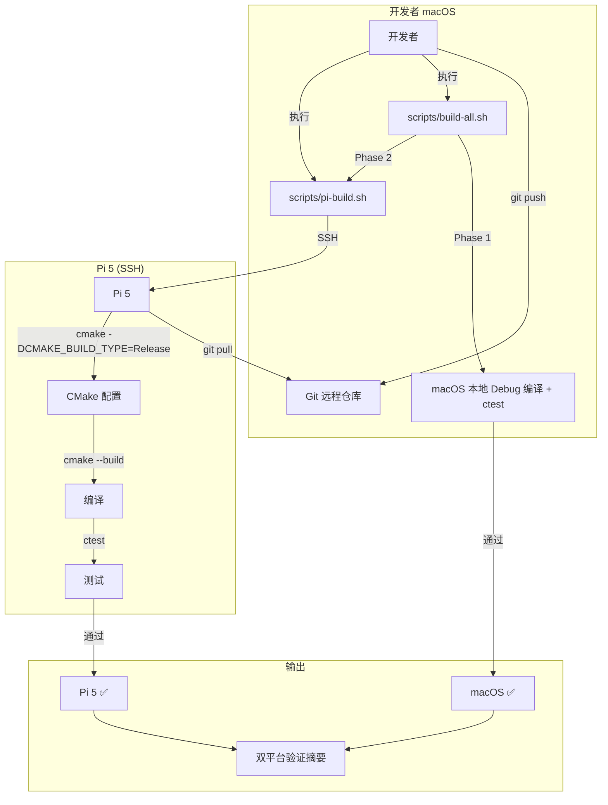

# 设计文档：Spec 2 — Pi 5 原生编译 + 双平台验证

## 概述

本设计为 device 模块搭建 Pi 5 原生编译流程和双平台验证基础设施。核心交付物包括：

1. **pi-build.sh** — SSH 远程构建脚本，从 macOS 一键触发 Pi 5 上的 git pull → cmake 配置 → 编译 → ctest
2. **build-all.sh** — 双平台验证脚本，依次执行 macOS 本地 Debug 编译测试和 Pi 5 远程 Release 编译测试
3. **docs/pi-setup.md** — Pi 5 环境配置文档，记录 apt 依赖安装、git clone、首次构建验证、SSH 免密配置步骤
4. **CMakeLists.txt 平台适配验证** — 确认现有 CMakeLists.txt 在 Pi 5 上无需修改即可编译通过

设计决策：

- **Pi 5 原生编译而非交叉编译**：当前项目代码量 < 1000 行，Pi 5 的 4 核 A76 + 4GB RAM 编译速度完全可接受（预计 < 1 分钟）。原生编译无需维护 sysroot、toolchain 文件、交叉编译器，维护成本远低于交叉编译。后续编译时间超过 5 分钟时再考虑交叉编译。
- **git pull 源码同步而非 rsync 二进制传输**：Pi 5 上通过 git pull 获取最新代码后原生编译，保证 Pi 5 上的构建环境与 macOS 完全独立，避免二进制兼容性问题。
- **环境变量配置而非硬编码**：Pi 5 的主机名、用户名、仓库路径通过环境变量传入（`PI_HOST`、`PI_USER`、`PI_REPO_DIR`），提供合理默认值，不同开发者无需修改脚本。
- **Pi 5 不可达时优雅降级**：`build-all.sh` 在 Pi 5 不可达时跳过远程编译步骤并输出警告，允许在没有 Pi 5 的环境中仅运行 macOS 编译验证。
- **CMakeLists.txt 零修改目标**：现有 CMakeLists.txt 已使用 pkg-config 发现 GStreamer、FetchContent 管理依赖、条件编译隔离平台差异（`#ifdef __APPLE__`），理论上 Pi 5 上无需修改即可编译。设计阶段不预设修改，实际构建时如遇问题再最小化修改。

## 架构



### 文件布局

```
raspi-eye/
├── scripts/
│   ├── pi-build.sh         # SSH 远程构建脚本（新增）
│   └── build-all.sh        # 双平台验证脚本（新增）
├── docs/
│   ├── pi-setup.md          # Pi 5 环境配置文档（新增）
│   ├── development-trace.md # 已有
│   └── spec-backlog.md      # 已有
└── device/
    ├── CMakeLists.txt        # 已有（预期无修改或最小化修改）
    ├── src/                  # 已有（不修改）
    └── tests/                # 已有（不修改）
```

## 组件与接口

### pi-build.sh — SSH 远程构建脚本

```bash
#!/usr/bin/env bash
# pi-build.sh — Build and test on Pi 5 via SSH
set -euo pipefail

# 环境变量（带默认值）
PI_HOST="${PI_HOST:-raspberrypi.local}"
PI_USER="${PI_USER:-pi}"
PI_REPO_DIR="${PI_REPO_DIR:-~/raspi-eye}"

echo "[pi-build] Starting build on ${PI_HOST}..."

# SSH 连接检测
ssh -o ConnectTimeout=5 -o BatchMode=yes "${PI_USER}@${PI_HOST}" true || {
    echo "[pi-build] ERROR: Cannot connect to ${PI_USER}@${PI_HOST}" >&2
    exit 1
}

# 远程执行：git pull + cmake + build + ctest
ssh "${PI_USER}@${PI_HOST}" bash -s -- "${PI_REPO_DIR}" <<'REMOTE'
    set -euo pipefail
    REPO_DIR="$1"
    cd "${REPO_DIR}"

    echo "[pi-build] git pull..."
    git pull

    echo "[pi-build] cmake configure (Release)..."
    cmake -B device/build -S device -DCMAKE_BUILD_TYPE=Release

    echo "[pi-build] cmake build..."
    cmake --build device/build

    echo "[pi-build] ctest..."
    ctest --test-dir device/build --output-on-failure
REMOTE

echo "[pi-build] All steps passed."
```

脚本执行流程：

1. 读取环境变量 `PI_HOST`、`PI_USER`、`PI_REPO_DIR`，使用默认值兜底
2. 输出开始信息 `[pi-build] Starting build on {PI_HOST}...`
3. SSH 连接检测：`ssh -o ConnectTimeout=5 -o BatchMode=yes` 测试连通性，失败则输出错误信息并退出（exit 1）
4. 通过 SSH 在 Pi 5 上依次执行：
   - `git pull` — 拉取最新代码
   - `cmake -B device/build -S device -DCMAKE_BUILD_TYPE=Release` — 配置 Release 构建
   - `cmake --build device/build` — 编译
   - `ctest --test-dir device/build --output-on-failure` — 运行测试
5. 远程命令块使用 `set -euo pipefail`，任一步骤失败立即退出，SSH 返回非零退出码
6. 全部成功后输出 `[pi-build] All steps passed.`

设计决策：
- **SSH heredoc 传递命令**：使用 `bash -s -- "${PI_REPO_DIR}" <<'REMOTE'` 将整个构建流程作为一个 SSH 会话执行，通过位置参数 `$1` 传递仓库路径，heredoc 使用单引号防止本地展开
- **`-o BatchMode=yes` 连接检测**：禁止交互式密码提示，如果 SSH key 未配置会立即失败而非挂起
- **`-o ConnectTimeout=5`**：5 秒超时，避免 Pi 5 不可达时长时间等待
- **不使用 `-t` 伪终端**：heredoc 方式下 `-t` 会导致 `Pseudo-terminal will not be allocated` 警告，去掉后输出仍然实时回显

### build-all.sh — 双平台验证脚本

```bash
#!/usr/bin/env bash
# build-all.sh — Build and test on both macOS and Pi 5
set -euo pipefail

SCRIPT_DIR="$(cd "$(dirname "${BASH_SOURCE[0]}")" && pwd)"
PROJECT_ROOT="$(cd "${SCRIPT_DIR}/.." && pwd)"
cd "${PROJECT_ROOT}"

PI_HOST="${PI_HOST:-raspberrypi.local}"
PI_USER="${PI_USER:-pi}"
PI_REACHABLE=false

# Check Pi 5 reachability once
if ssh -o ConnectTimeout=5 -o BatchMode=yes "${PI_USER}@${PI_HOST}" true 2>/dev/null; then
    PI_REACHABLE=true
fi

# ── Phase 1: macOS Debug build + test ──
echo "[build-all] Phase 1: macOS Debug build + test"
cmake -B device/build -S device -DCMAKE_BUILD_TYPE=Debug
cmake --build device/build
ctest --test-dir device/build --output-on-failure
echo "[build-all] Phase 1 passed: macOS Debug ✅"

# ── Phase 2: Pi 5 Release build + test ──
echo "[build-all] Phase 2: Pi 5 Release build + test"

if [ "${PI_REACHABLE}" = true ]; then
    "${SCRIPT_DIR}/pi-build.sh"
    echo "[build-all] Phase 2 passed: Pi 5 Release ✅"
else
    echo "[build-all] WARNING: Pi 5 (${PI_HOST}) not reachable, skipping Phase 2" >&2
fi

# ── Summary ──
echo "[build-all] =============================="
echo "[build-all] macOS Debug:   PASSED"
if [ "${PI_REACHABLE}" = true ]; then
    echo "[build-all] Pi 5 Release:  PASSED"
else
    echo "[build-all] Pi 5 Release:  SKIPPED (not reachable)"
fi
echo "[build-all] =============================="
```

脚本执行流程：

1. 确定脚本所在目录（`SCRIPT_DIR`），用于定位 `pi-build.sh`
2. **Phase 1 — macOS 本地 Debug 编译 + 测试**：
   - `cmake -B device/build -S device -DCMAKE_BUILD_TYPE=Debug` — 配置 Debug 构建（含 ASan）
   - `cmake --build device/build` — 编译
   - `ctest --test-dir device/build --output-on-failure` — 运行测试
   - 任一步骤失败立即退出（`set -euo pipefail`），不继续 Phase 2
3. **Phase 2 — Pi 5 远程 Release 编译 + 测试**：
   - 先检测 Pi 5 可达性（SSH 连接测试）
   - 可达：调用 `scripts/pi-build.sh` 执行远程构建
   - 不可达：输出警告信息，跳过 Phase 2（不报错退出）
4. **摘要输出**：显示两个平台的编译测试状态

设计决策：
- **Phase 1 失败阻断 Phase 2**：macOS 编译失败说明代码有问题，无需浪费时间在 Pi 5 上编译
- **Pi 5 不可达时优雅降级**：输出 WARNING 而非 ERROR，脚本以零退出码退出。这允许在没有 Pi 5 的环境中仅运行 macOS 验证
- **复用 pi-build.sh**：Phase 2 直接调用 `pi-build.sh`，避免重复实现远程构建逻辑
- **`SCRIPT_DIR` + `PROJECT_ROOT` 定位**：通过 `${BASH_SOURCE[0]}` 获取脚本路径，推导项目根目录并 `cd` 过去，确保从任意目录执行都能正确工作
- **Pi 5 可达性检测只做一次**：开头检测一次并缓存到 `PI_REACHABLE` 变量，避免摘要输出时重复 SSH 连接

### docs/pi-setup.md — Pi 5 环境配置文档

文档结构设计（英文编写）：

```markdown
# Pi 5 Build Environment Setup

## Prerequisites
- Raspberry Pi 5 (4GB+ RAM) running Debian Bookworm (64-bit)
- Network connectivity (for apt install and git clone)
- SSH access from development machine

## 1. Install Build Dependencies

sudo apt update && sudo apt install -y \
    build-essential \
    cmake \
    pkg-config \
    libgstreamer1.0-dev \
    libgstreamer-plugins-base1.0-dev \
    libglib2.0-dev \
    git

## 2. Clone Repository

git clone <repo-url> ~/raspi-eye
cd ~/raspi-eye

## 3. First Build Verification

cmake -B device/build -S device -DCMAKE_BUILD_TYPE=Release
cmake --build device/build
ctest --test-dir device/build --output-on-failure

## 4. SSH Key Setup (for pi-build.sh)

# On macOS (development machine):
ssh-copy-id pi@raspberrypi.local

# Verify passwordless login:
ssh pi@raspberrypi.local "echo OK"
```

文档内容要点：
- 所有 apt 依赖列在一条命令中，可直接复制执行
- 首次构建验证命令与 `pi-build.sh` 中的远程命令一致（Release 构建）
- SSH 免密配置使用 `ssh-copy-id`，最简单的方式
- 仓库 URL 使用占位符 `<repo-url>`，由用户替换

### CMakeLists.txt 平台适配分析

现有 `device/CMakeLists.txt` 的平台兼容性分析：

| 特性 | macOS (Apple Clang) | Pi 5 (GCC, Linux aarch64) | 兼容性 |
|------|-------------------|--------------------------|--------|
| C++17 | ✅ Apple Clang 支持 | ✅ GCC 支持 | 无需修改 |
| ASan (Debug only) | ✅ `-fsanitize=address` | ✅ GCC 支持（但 Release 不开启） | 无需修改 |
| pkg-config GStreamer | ✅ Homebrew 安装 | ✅ apt 安装 | 无需修改 |
| FetchContent (GTest) | ✅ | ✅ 需联网首次下载 | 无需修改 |
| FetchContent (spdlog) | ✅ | ✅ 需联网首次下载 | 无需修改 |
| FetchContent (RapidCheck) | ✅ | ✅ 需联网首次下载 | 无需修改 |
| `target_link_directories` | ✅ | ✅ | 无需修改 |

源码平台兼容性分析：

| 文件 | 平台相关代码 | Pi 5 兼容性 |
|------|------------|------------|
| `main.cpp` | `#ifdef __APPLE__` → `gst_macos_main` | ✅ Linux 走 `else` 分支直接调用 `run_pipeline` |
| `pipeline_manager.cpp` | 无平台相关代码 | ✅ 完全兼容 |
| `log_init.cpp` | 无平台相关代码 | ✅ 完全兼容 |
| `json_formatter.cpp` | 无平台相关代码 | ✅ 完全兼容 |

结论：**现有 CMakeLists.txt 和源码预期在 Pi 5 上无需修改即可编译通过。** 如果实际构建时遇到问题，按最小化修改原则处理（仅添加必要的平台条件编译）。

潜在风险点：
- GCC 对 C++17 特性的支持可能与 Apple Clang 有细微差异（如 `std::filesystem`），但当前代码未使用这些特性
- Pi 5 上 GStreamer 版本可能与 macOS Homebrew 版本不同（Debian Bookworm 的 GStreamer 1.22 vs macOS 的 1.28），但 `gst_parse_launch` 等基础 API 在两个版本间兼容
- RapidCheck 在 aarch64 上的编译兼容性：RapidCheck 是纯 C++ 库，无平台特定代码，预期兼容

## 数据模型

本 Spec 不涉及持久化数据模型或运行时数据结构。核心交互模型为脚本的输入/输出：

### 环境变量

| 变量 | 默认值 | 说明 | 使用位置 |
|------|--------|------|---------|
| `PI_HOST` | `raspberrypi.local` | Pi 5 主机名或 IP | pi-build.sh, build-all.sh |
| `PI_USER` | `pi` | Pi 5 用户名 | pi-build.sh, build-all.sh |
| `PI_REPO_DIR` | `~/raspi-eye` | Pi 5 上仓库路径 | pi-build.sh |

### 脚本退出码

| 脚本 | 退出码 0 | 退出码非零 |
|------|---------|-----------|
| pi-build.sh | SSH 连接成功 + git pull + cmake + build + ctest 全部通过 | SSH 连接失败，或任一构建/测试步骤失败 |
| build-all.sh | macOS 编译测试通过 + Pi 5 编译测试通过（或 Pi 5 不可达时跳过） | macOS 编译测试失败，或 Pi 5 可达但编译测试失败 |

### 构建类型对照

| 平台 | 构建类型 | ASan | 编译器 | 触发方式 |
|------|---------|------|--------|---------|
| macOS | Debug | 开启 | Apple Clang | `build-all.sh` Phase 1 |
| Pi 5 | Release | 关闭 | GCC | `pi-build.sh` / `build-all.sh` Phase 2 |

## 正确性属性（Correctness Properties）

本 Spec 不包含正确性属性部分。

原因：本 Spec 的交付物是 Bash 脚本和文档，不涉及可进行 property-based testing 的纯函数或数据转换逻辑。脚本的正确性通过实际执行验证（SSH 连接、cmake 编译、ctest 运行），属于集成测试范畴。100 次迭代不会比 1 次实际执行发现更多 bug。

适合的测试策略：手动执行验证 + 脚本行为检查（退出码、输出信息）。

## 错误处理

### pi-build.sh 错误处理

| 错误场景 | 处理方式 | 输出 |
|---------|---------|------|
| SSH 连接失败（Pi 5 不可达） | 立即退出，exit 1 | `[pi-build] ERROR: Cannot connect to {PI_USER}@{PI_HOST}` |
| SSH 连接超时（> 5 秒） | 立即退出，exit 1 | 同上 |
| SSH key 未配置（需要密码） | `BatchMode=yes` 导致连接失败，exit 1 | 同上 |
| git pull 失败（网络问题或冲突） | `set -euo pipefail` 触发退出，SSH 返回非零 | git 原生错误信息 |
| cmake 配置失败（缺少依赖） | `set -euo pipefail` 触发退出 | cmake 原生错误信息 |
| cmake 编译失败（编译错误） | `set -euo pipefail` 触发退出 | 编译器原生错误信息 |
| ctest 失败（测试不通过） | `set -euo pipefail` 触发退出 | ctest `--output-on-failure` 输出失败详情 |

### build-all.sh 错误处理

| 错误场景 | 处理方式 | 输出 |
|---------|---------|------|
| macOS cmake 配置失败 | 立即退出，exit 非零，不执行 Phase 2 | cmake 原生错误信息 |
| macOS 编译失败 | 立即退出，exit 非零，不执行 Phase 2 | 编译器原生错误信息 |
| macOS ctest 失败 | 立即退出，exit 非零，不执行 Phase 2 | ctest 失败详情 |
| Pi 5 不可达 | 跳过 Phase 2，输出警告，exit 0 | `[build-all] WARNING: Pi 5 ({PI_HOST}) not reachable, skipping Phase 2` |
| Pi 5 可达但构建/测试失败 | pi-build.sh 返回非零，build-all.sh 退出非零 | pi-build.sh 的错误输出 |

### 错误处理设计原则

- **fail-fast**：`set -euo pipefail` 确保任何命令失败立即退出，不执行后续步骤
- **信息充分**：错误信息包含主机名、失败阶段，便于定位问题
- **优雅降级**：Pi 5 不可达时不报错退出，允许仅 macOS 验证
- **英文输出**：所有脚本输出使用英文，遵循禁止项约束

## 测试策略

### 测试方法

本 Spec 不适用 PBT（property-based testing）。原因：交付物是 Bash 脚本和文档，不涉及可进行 PBT 的纯函数或数据转换逻辑。脚本行为依赖外部环境（SSH 连接、Pi 5 硬件、网络），属于集成测试范畴。

本 Spec 采用以下验证策略：

### 验证层次

| 层次 | 验证内容 | 方法 |
|------|---------|------|
| 脚本语法 | pi-build.sh 和 build-all.sh 语法正确 | `bash -n scripts/pi-build.sh` |
| macOS 回归 | 现有代码在 macOS 上编译测试通过 | `cmake + build + ctest`（本地执行） |
| Pi 5 编译 | 代码在 Pi 5 上 Release 编译通过 | `scripts/pi-build.sh`（需 Pi 5 可达） |
| 双平台验证 | macOS + Pi 5 双平台通过 | `scripts/build-all.sh` |
| 脚本行为 | 退出码、输出信息、错误处理 | 手动验证 |

### 验证命令

```bash
# 1. 脚本语法检查（无需 Pi 5）
bash -n scripts/pi-build.sh
bash -n scripts/build-all.sh

# 2. macOS 本地编译回归验证（无需 Pi 5）
cmake -B device/build -S device -DCMAKE_BUILD_TYPE=Debug && cmake --build device/build && ctest --test-dir device/build --output-on-failure

# 3. Pi 5 远程一键构建（需 Pi 5 可达）
scripts/pi-build.sh

# 4. 双平台一键验证（需 Pi 5 可达）
scripts/build-all.sh
```

### 脚本行为验证清单

**pi-build.sh：**
- [ ] `set -euo pipefail` 在脚本开头
- [ ] 环境变量有默认值（PI_HOST=raspberrypi.local, PI_USER=pi, PI_REPO_DIR=~/raspi-eye）
- [ ] SSH 连接失败时输出错误信息并以非零退出码退出
- [ ] 构建开始时输出 `[pi-build] Starting build on {PI_HOST}...`
- [ ] 全部成功时输出 `[pi-build] All steps passed.`
- [ ] 远程命令使用 Release 构建类型
- [ ] 远程 ctest 使用 `--output-on-failure`

**build-all.sh：**
- [ ] `set -euo pipefail` 在脚本开头
- [ ] Phase 1 输出 `[build-all] Phase 1: macOS Debug build + test`
- [ ] Phase 2 输出 `[build-all] Phase 2: Pi 5 Release build + test`
- [ ] macOS 失败时不执行 Phase 2
- [ ] Pi 5 不可达时输出 WARNING 并跳过，exit 0
- [ ] 两平台都通过时输出摘要

**docs/pi-setup.md：**
- [ ] 包含所有必需 apt 依赖包
- [ ] apt install 命令可直接复制执行
- [ ] 包含 git clone 命令示例
- [ ] 包含首次构建验证命令
- [ ] 包含 SSH 免密配置步骤（ssh-copy-id）

### 测试约束

- 所有 C++ 测试通过 `ctest --test-dir device/build --output-on-failure` 统一运行
- macOS Debug 构建开启 ASan，Pi 5 Release 构建不开启 ASan
- 脚本文件需要 `chmod +x` 设置可执行权限

## 禁止项（Design 层）

- SHALL NOT 引入交叉编译工具链、sysroot、toolchain 文件
  - 原因：当前项目规模小，Pi 5 原生编译完全够用，交叉编译维护成本高

- SHALL NOT 修改现有 `device/CMakeLists.txt` 中已验证通过的 target 定义和依赖关系的核心逻辑
  - 原因：Spec 0 和 Spec 1 的功能已验证通过，平台适配应通过条件编译最小化修改

- SHALL NOT 在脚本中硬编码 Pi 5 的 IP 地址、用户名或仓库路径
  - 原因：不同用户的 Pi 5 网络配置不同，硬编码导致不可移植

- SHALL NOT 在脚本中使用 rsync 传输编译产物到 Pi 5
  - 原因：本 Spec 采用 git pull 原生编译方式，不传输二进制文件

- SHALL NOT 在代码中硬编码 AWS 凭证、密钥、证书路径或任何 secret（来源：安全基线）

- SHALL NOT 在日志或错误输出中打印密钥、证书内容、token 等敏感信息（来源：安全基线）
