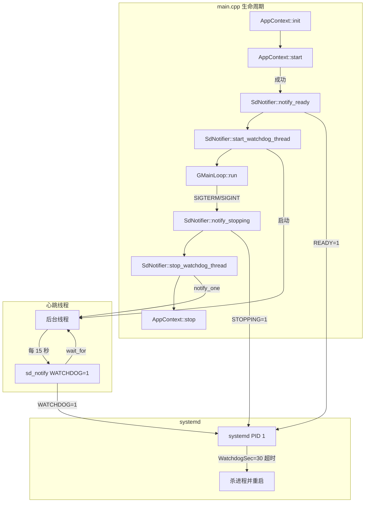
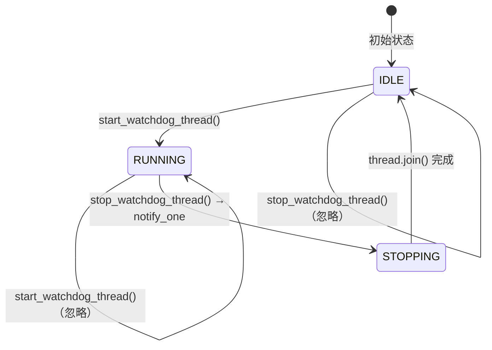

# 设计文档

## 概述

SdNotifier 是一个跨平台的 systemd 通知封装模块，为 raspi-eye 提供进程级看门狗和生命周期通知能力。在 Linux 上通过 `HAVE_SYSTEMD` 条件编译宏链接 libsystemd 调用真实的 `sd_notify()` API，在 macOS 或 libsystemd 不可用时提供空实现（no-op）。

设计核心思路：
1. 静态方法类 `SdNotifier`，无实例状态，所有方法为 static
2. 心跳线程使用 `std::condition_variable::wait_for` 实现定时等待，`stop_watchdog_thread()` 通过 notify 快速唤醒线程退出
3. main.cpp 集成点：`AppContext::start()` 成功后调用 `notify_ready()` + `start_watchdog_thread()`，信号处理进入关闭流程时调用 `notify_stopping()` + `stop_watchdog_thread()`
4. systemd unit 文件配置 `Type=notify` + `WatchdogSec=30` + 安全加固选项
5. CMake 在 Linux 上通过 `pkg_check_modules` 查找 libsystemd，可选依赖

## 架构



设计决策：
- **静态方法类而非单例**：SdNotifier 不持有外部资源引用，只管理一个心跳线程和一个 stop flag，静态方法更简洁，避免单例的生命周期问题
- **condition_variable::wait_for 而非 sleep_for**：`sleep_for` 无法被中断，`stop_watchdog_thread()` 需要等待整个 sleep 周期才能退出。`wait_for` 配合 stop flag 可在毫秒级唤醒线程退出
- **心跳间隔 = WatchdogSec / 2**：systemd 官方推荐在超时时间的一半发送心跳，确保在超时前至少发送一次。WatchdogSec=30 → 心跳间隔 15 秒
- **sd_notify 错误不中断应用**：`sd_notify()` 返回负值时记录 warn 日志但继续运行，因为看门狗是增强功能而非核心功能
- **main.cpp 集成而非 AppContext 内部**：notify_ready/notify_stopping 是进程级生命周期事件，放在 main.cpp 中更清晰，与 AppContext 的模块级生命周期分离

## 组件与接口

### 新增文件

- `device/src/sd_notifier.h` — SdNotifier 类声明
- `device/src/sd_notifier.cpp` — SdNotifier 实现（条件编译）
- `device/tests/sd_notifier_test.cpp` — 单元测试 + PBT
- `scripts/raspi-eye.service` — systemd service unit 文件

### SdNotifier 类

```cpp
// sd_notifier.h
// 跨平台 systemd 通知封装：Linux 调用 libsystemd，macOS 空实现。
#pragma once

class SdNotifier {
public:
    // 禁止实例化
    SdNotifier() = delete;

    // 通知 systemd 服务启动完成（READY=1）
    // Linux + HAVE_SYSTEMD: 调用 sd_notify(0, "READY=1")
    // 其他平台: no-op
    static void notify_ready();

    // 发送看门狗心跳（WATCHDOG=1）
    // Linux + HAVE_SYSTEMD: 调用 sd_notify(0, "WATCHDOG=1")
    // 其他平台: no-op
    static void notify_watchdog();

    // 通知 systemd 服务正在关闭（STOPPING=1）
    // Linux + HAVE_SYSTEMD: 调用 sd_notify(0, "STOPPING=1")
    // 其他平台: no-op
    static void notify_stopping();

    // 启动后台心跳线程，每 interval_sec 秒发送一次 WATCHDOG=1
    // 如果线程已在运行，则忽略调用
    // interval_sec: 心跳间隔（秒），默认 15（WatchdogSec=30 的一半）
    static void start_watchdog_thread(int interval_sec = 15);

    // 停止后台心跳线程，通过 condition_variable 快速唤醒
    // 如果线程未运行，则忽略调用
    static void stop_watchdog_thread();

    // 查询心跳线程是否正在运行（线程安全）
    static bool watchdog_running();
};
```

### sd_notifier.cpp 条件编译结构

```cpp
// sd_notifier.cpp
#include "sd_notifier.h"
#include <spdlog/spdlog.h>
#include <atomic>
#include <chrono>
#include <condition_variable>
#include <mutex>
#include <thread>

#ifdef HAVE_SYSTEMD
#include <systemd/sd-daemon.h>
#endif

// --- 静态成员 ---
static std::mutex s_mtx;
static std::condition_variable s_cv;
static std::atomic<bool> s_stop{false};
static std::thread s_thread;
static std::atomic<bool> s_running{false};

// --- notify 方法 ---
void SdNotifier::notify_ready() {
#ifdef HAVE_SYSTEMD
    int r = sd_notify(0, "READY=1");
    auto logger = spdlog::get("app");
    if (r < 0) {
        if (logger) logger->warn("sd_notify READY=1 failed: {}", r);
    } else {
        if (logger) logger->info("sd_notify: READY=1 sent");
    }
#endif
}

// notify_watchdog() 和 notify_stopping() 结构类似

// --- 心跳线程 ---
void SdNotifier::start_watchdog_thread(int interval_sec) {
    if (s_running.load()) return;  // 已在运行
    s_stop.store(false);
    s_thread = std::thread([interval_sec]() {
        auto logger = spdlog::get("app");
        if (logger) logger->info("watchdog thread started, interval={}s", interval_sec);
        try {
            std::unique_lock<std::mutex> lock(s_mtx);
            while (!s_stop.load()) {
                s_cv.wait_for(lock, std::chrono::seconds(interval_sec),
                              []{ return s_stop.load(); });
                if (!s_stop.load()) {
                    notify_watchdog();
                }
            }
        } catch (const std::exception& e) {
            auto lg = spdlog::get("app");
            if (lg) lg->error("watchdog thread exception: {}", e.what());
        } catch (...) {
            auto lg = spdlog::get("app");
            if (lg) lg->error("watchdog thread unknown exception");
        }
        if (logger) logger->info("watchdog thread stopped");
    });
    s_running.store(true);
}

void SdNotifier::stop_watchdog_thread() {
    if (!s_running.load()) return;
    s_stop.store(true);
    s_cv.notify_one();
    if (s_thread.joinable()) {
        s_thread.join();
    }
    s_running.store(false);
}

bool SdNotifier::watchdog_running() {
    return s_running.load();
}
```

### main.cpp 集成点

```cpp
// main.cpp 中的改动（伪代码）
#include "sd_notifier.h"

static int run_pipeline(int argc, char* argv[]) {
    // ... 现有 init 逻辑 ...

    // Phase 5: AppContext start
    if (!ctx.start(&err)) {
        // 启动失败，不发送 READY=1，以非零退出码退出
        // systemd 将根据 Restart=on-failure 自动重启
        return 1;
    }

    // Phase 5.5: 通知 systemd 启动完成 + 启动看门狗
    SdNotifier::notify_ready();
    SdNotifier::start_watchdog_thread();

    // Phase 6: Run main loop
    g_main_loop_run(loop);

    // Phase 6.5: 通知 systemd 正在关闭 + 停止看门狗
    SdNotifier::notify_stopping();
    SdNotifier::stop_watchdog_thread();

    // Phase 7: Cleanup
    auto summary = ctx.stop();
    // ...
}
```

### systemd service unit 文件

```ini
# scripts/raspi-eye.service
# systemd service unit for raspi-eye smart camera application

[Unit]
Description=RaspiEye Smart Camera Service
After=network-online.target
Wants=network-online.target
StartLimitBurst=5
StartLimitIntervalSec=60

[Service]
Type=notify
ExecStart=/home/pi/raspi-eye/device/build/raspi-eye --config /home/pi/raspi-eye/device/config/config.toml
Restart=on-failure
RestartSec=5
WatchdogSec=30
TimeoutStartSec=60
TimeoutStopSec=35
StandardOutput=journal
StandardError=journal
SyslogIdentifier=raspi-eye
WorkingDirectory=/home/pi/raspi-eye
User=pi
Group=pi
SupplementaryGroups=video

# 安全加固
NoNewPrivileges=true
ProtectSystem=strict
ProtectHome=read-only
PrivateTmp=true
ReadWritePaths=/home/pi/raspi-eye/device/config

[Install]
WantedBy=multi-user.target
```

### CMake 集成

```cmake
# device/CMakeLists.txt 中新增（Linux 部分）

# libsystemd（Linux only，可选依赖）
if(CMAKE_SYSTEM_NAME STREQUAL "Linux")
    pkg_check_modules(SYSTEMD libsystemd)
    if(SYSTEMD_FOUND)
        message(STATUS "systemd module: ENABLED (libsystemd found)")
    else()
        message(WARNING "libsystemd not found, sd_notify will be no-op on Linux")
    endif()
else()
    message(STATUS "systemd module: no-op (non-Linux platform)")
endif()

# SdNotifier 模块
add_library(sd_notifier_module STATIC src/sd_notifier.cpp)
target_include_directories(sd_notifier_module PUBLIC src)
target_link_libraries(sd_notifier_module PUBLIC spdlog::spdlog)
if(SYSTEMD_FOUND)
    target_compile_definitions(sd_notifier_module PRIVATE HAVE_SYSTEMD=1)
    target_include_directories(sd_notifier_module PRIVATE ${SYSTEMD_INCLUDE_DIRS})
    target_link_libraries(sd_notifier_module PRIVATE ${SYSTEMD_LIBRARIES})
endif()

# 链接到主程序
target_link_libraries(raspi-eye PRIVATE sd_notifier_module)
```

## 数据模型

本模块不引入新的持久化数据模型。核心状态为心跳线程的运行时状态：

### 心跳线程状态机



### 状态变量

| 变量 | 类型 | 初始值 | 说明 |
|------|------|--------|------|
| `s_stop` | `std::atomic<bool>` | false | 停止信号，true 时心跳线程退出循环 |
| `s_running` | `std::atomic<bool>` | false | 线程运行状态标记 |
| `s_mtx` | `std::mutex` | — | 保护 condition_variable |
| `s_cv` | `std::condition_variable` | — | 定时等待 + 快速唤醒 |
| `s_thread` | `std::thread` | — | 心跳线程句柄 |

### main.cpp 生命周期时序

```
main()
  ├── gst_init()
  ├── ConfigManager::load()
  ├── log_init::init()
  ├── AppContext::init()
  ├── sigaction(SIGINT/SIGTERM)
  ├── AppContext::start()
  │   └── 成功 → SdNotifier::notify_ready()     ← READY=1
  │            → SdNotifier::start_watchdog_thread() ← 心跳开始
  ├── g_main_loop_run()                           ← 阻塞运行
  │   └── 信号触发 g_main_loop_quit()
  ├── SdNotifier::notify_stopping()               ← STOPPING=1
  ├── SdNotifier::stop_watchdog_thread()           ← 心跳停止
  ├── AppContext::stop()                           ← ShutdownHandler 执行
  ├── g_main_loop_unref()
  └── log_init::shutdown()
```

## 正确性属性

*属性（Property）是在系统所有有效执行中都应成立的特征或行为——本质上是对系统应做什么的形式化陈述。属性是人类可读规格与机器可验证正确性保证之间的桥梁。*

### Property 1: 心跳线程 start/stop 往返一致性

*对于任意*正整数间隔 interval_sec（1-60），调用 `start_watchdog_thread(interval_sec)` 后 `watchdog_running()` 应返回 true，随后调用 `stop_watchdog_thread()` 后 `watchdog_running()` 应返回 false。

**Validates: Requirements 2.4, 2.5, 3.1, 3.3**

### Property 2: stop_watchdog_thread 快速响应

*对于任意*正整数间隔 interval_sec（1-60），调用 `start_watchdog_thread(interval_sec)` 后立即调用 `stop_watchdog_thread()`，stop 应在 1 秒内返回（不需要等待完整的 sleep 周期），证明使用了 condition_variable::wait_for 而非 sleep_for。

**Validates: Requirements 3.5**

### Property 3: start_watchdog_thread 幂等性

*对于任意*正整数间隔 interval_sec（1-60），连续调用两次 `start_watchdog_thread(interval_sec)` 不应崩溃、不应创建第二个线程，`watchdog_running()` 仍返回 true，随后单次 `stop_watchdog_thread()` 即可停止。

**Validates: Requirements 2.4**

### Property 4: notify 方法不崩溃

*对于任意*调用序列（从 {notify_ready, notify_watchdog, notify_stopping} 中随机选择 1-10 次调用），所有调用均应正常返回，不抛异常、不 abort。

**Validates: Requirements 2.1, 2.2, 2.3, 2.6, 2.9**

## 错误处理

### 错误处理策略

SdNotifier 采用"尽力而为"策略：所有 sd_notify 调用失败时记录 warn 日志但不中断应用运行。看门狗是增强功能，不应因为 systemd 通知失败而影响核心视频管道。

| 错误场景 | 处理方式 | 日志级别 |
|---|---|---|
| sd_notify() 返回负值 | 记录日志，继续运行 | warn |
| 心跳线程内部异常 | catch 并记录日志，线程退出，systemd 将在 WatchdogSec 超时后重启 | error |
| start_watchdog_thread 重复调用 | 忽略，返回 | — |
| stop_watchdog_thread 未运行时调用 | 忽略，返回 | — |
| NOTIFY_SOCKET 环境变量不存在 | sd_notify 返回 0（非错误），正常运行 | — |

### 日志规范

- `notify_ready()` 成功：info 级别，"sd_notify: READY=1 sent"
- `notify_stopping()` 成功：info 级别，"sd_notify: STOPPING=1 sent"
- `notify_watchdog()` 成功：不记录日志（每 15 秒一次，避免日志刷屏）
- 任何 sd_notify 失败：warn 级别，包含返回值
- 心跳线程启动/停止：info 级别
- 心跳线程异常：error 级别

## 测试策略

### 双重测试方法

- **单元测试（Example-based）**：验证 SdNotifier API 的基本行为、错误路径、集成点
- **属性测试（Property-based）**：验证心跳线程在任意间隔下的 start/stop 一致性和快速响应

### PBT 配置

- 库：RapidCheck（已通过 FetchContent 引入）
- 每个 property test 最少 100 次迭代
- 每个 property test 注释引用设计文档中的 property 编号
- 标签格式：`Feature: systemd-watchdog, Property {N}: {property_text}`

### 测试文件

`device/tests/sd_notifier_test.cpp`

### Property-based 测试覆盖

| Property | 被测方法 | 生成器 |
|---|---|---|
| 1 | start/stop_watchdog_thread, watchdog_running | 随机正整数 interval_sec ∈ [1, 60] |
| 2 | start/stop_watchdog_thread | 随机正整数 interval_sec ∈ [1, 60]，计时 stop 耗时 |
| 3 | start_watchdog_thread（连续两次） | 随机正整数 interval_sec ∈ [1, 60] |
| 4 | notify_ready/watchdog/stopping | 随机调用序列（1-10 次，随机选择方法） |

### Example-based 单元测试覆盖

| 场景 | 验证内容 |
|---|---|
| notify_ready 不崩溃 | macOS no-op 正常返回 |
| notify_watchdog 不崩溃 | macOS no-op 正常返回 |
| notify_stopping 不崩溃 | macOS no-op 正常返回 |
| 初始状态 watchdog_running == false | 未启动时状态正确 |
| stop 未运行的线程不崩溃 | 幂等性 |
| 心跳线程实际运行 | 短间隔启动，等待后验证线程仍在运行 |

### 不在单元测试范围内的验证

以下需要在 Pi 5 上手动验证：
- systemd service unit 文件的实际部署效果
- journalctl 日志集成
- WatchdogSec 超时后的自动重启
- READY=1 通知后 systemctl status 显示 active (running)
- STOPPING=1 通知后 systemd 不误判为卡死

## 禁止项

- SHALL NOT 在代码中硬编码 AWS 凭证、密钥、证书路径或任何 secret（来源：安全基线）
- SHALL NOT 在日志或错误输出中打印密钥、证书内容、token 等敏感信息（来源：安全基线）
- SHALL NOT 在 macOS 上链接 libsystemd 或调用任何 systemd API（来源：跨平台隔离规则）
- SHALL NOT 在心跳线程中执行任何阻塞 I/O 或耗时操作（来源：看门狗可靠性要求）
- SHALL NOT 使用 sleep_for 实现心跳定时（来源：需求 3.5，必须使用 condition_variable::wait_for 以支持快速停止）

