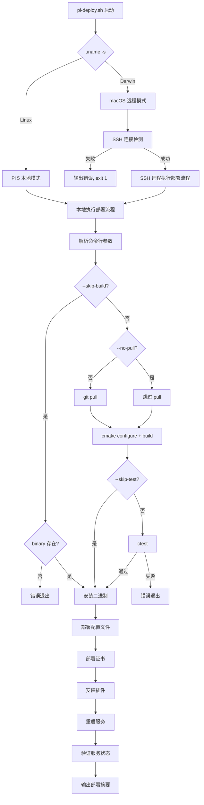
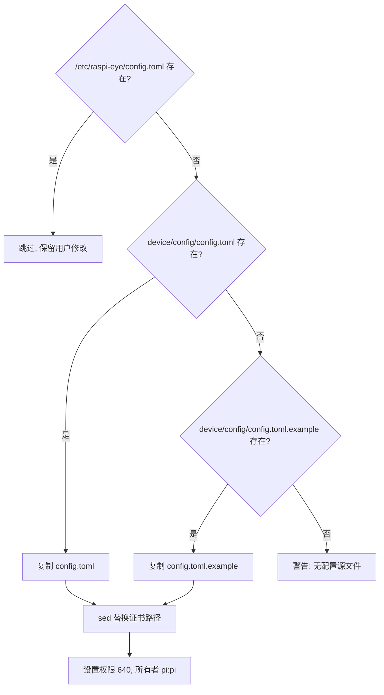

# 设计文档

## 概述

`scripts/pi-deploy.sh` 是 raspi-eye 项目的自动化部署脚本，实现从编译到服务重启的完整部署流程。脚本复用 `pi-build.sh` 的双模式架构（macOS SSH 远程 / Pi 5 本地），在编译和测试通过后，将二进制、配置文件、证书、GStreamer 插件安装到系统路径，并重启 systemd 服务。

核心设计原则：
- **幂等性**：重复执行不出错，目录已存在跳过创建，二进制/插件覆盖更新，config.toml 不覆盖
- **最小权限**：服务以 pi 用户运行，所有部署文件 owner 为 pi:pi
- **快速失败**：`set -euo pipefail` + 编译/测试失败立即终止，不执行部署步骤
- **可跳过步骤**：`--skip-build`、`--skip-test`、`--no-pull` 支持灵活的部署场景

## 架构

### 双模式执行架构



### 远程模式 SSH 执行策略

macOS 远程模式通过 SSH 将完整部署逻辑发送到 Pi 5 执行。与 `pi-build.sh` 一致，使用 `ssh ... bash -s` + heredoc 传递脚本内容，避免依赖远程文件系统上的脚本版本。（注：此处 heredoc 用于 SSH 传递脚本，非写入文件，不违反禁止项中的 "SHALL NOT 使用 cat << heredoc 方式写入文件"）

命令行参数在 macOS 端解析后，通过 SSH 参数传递给远程脚本。

## 组件与接口

### 脚本内部结构

脚本采用函数化组织，每个部署步骤封装为独立函数：

```
pi-deploy.sh
├── 全局变量与默认值
│   ├── PI_HOST / PI_USER / PI_REPO_DIR（环境变量，与 pi-build.sh 一致）
│   ├── SKIP_BUILD / SKIP_TEST / NO_PULL（命令行参数标志）
│   └── 系统路径常量
├── 日志函数
│   └── log()  — 统一 [pi-deploy] 前缀输出
├── 参数解析
│   └── parse_args()  — 解析 --skip-build / --skip-test / --no-pull
├── 编译阶段
│   ├── do_pull()     — git pull（受 --no-pull 控制）
│   ├── do_build()    — cmake configure + build（受 --skip-build 控制）
│   └── do_test()     — ctest（受 --skip-test 控制）
├── 部署阶段
│   ├── install_binary()    — 复制二进制到 /usr/local/bin/
│   ├── deploy_config()     — 部署配置文件到 /etc/raspi-eye/
│   ├── deploy_certs()      — 部署证书到 /etc/raspi-eye/certs/
│   ├── install_plugins()   — 安装插件到 /usr/local/lib/raspi-eye/plugins/
│   ├── restart_service()   — daemon-reload + restart + verify
│   └── print_summary()     — 输出部署摘要
└── 主流程
    ├── macOS 远程模式入口
    └── Linux 本地模式入口（调用上述函数）
```

### 系统路径常量

| 常量 | 值 | 用途 |
|------|---|------|
| `INSTALL_BIN` | `/usr/local/bin/raspi-eye` | 二进制安装路径 |
| `CONFIG_DIR` | `/etc/raspi-eye` | 配置文件目录 |
| `CERTS_DIR` | `/etc/raspi-eye/certs` | 证书目录 |
| `PLUGINS_DIR` | `/usr/local/lib/raspi-eye/plugins` | GStreamer 插件目录 |
| `SERVICE_NAME` | `raspi-eye.service` | systemd 服务名 |

### 命令行接口

```
用法: pi-deploy.sh [OPTIONS]

选项:
  --skip-build    跳过 git pull / cmake / build / ctest，直接使用已有二进制部署
  --skip-test     跳过 ctest 测试步骤
  --no-pull       跳过 git pull，使用当前工作区代码编译

环境变量:
  PI_HOST         Pi 5 主机名/IP（默认: raspberrypi.local）
  PI_USER         Pi 5 用户名（默认: pi）
  PI_REPO_DIR     Pi 5 上的仓库路径（默认: ~/raspi-eye）
```

### 与外部组件的依赖关系

| 外部组件 | 关系 | 说明 |
|---------|------|------|
| `pi-build.sh` | 参考（不调用） | 复用双模式架构设计，但不直接调用 pi-build.sh |
| `provision-device.sh` | 无直接依赖 | provision 在开发机上运行（需 AWS AKSK），Pi 5 上不调用。部署脚本只复制仓库中已有的 config.toml 和证书 |
| `raspi-eye.service` | 运行时依赖 | 由 spec-20 创建，本脚本只做 restart + verify |
| `device/build/raspi-eye` | 编译产物 | cmake build 的输出，部署到系统路径 |

## 数据模型

### 部署文件映射

| 源路径（仓库内） | 目标路径（系统） | 权限 | 所有者 | 覆盖策略 |
|----------------|----------------|------|--------|---------|
| `device/build/raspi-eye` | `/usr/local/bin/raspi-eye` | 755 | root:root | 始终覆盖 |
| `device/config/config.toml` | `/etc/raspi-eye/config.toml` | 640 | pi:pi | 仅首次（不覆盖已有） |
| `device/config/config.toml.example` | `/etc/raspi-eye/config.toml`（备选） | 640 | pi:pi | 仅首次且 config.toml 不存在 |
| `device/certs/*.pem` | `/etc/raspi-eye/certs/*.pem` | 644 | pi:pi | 始终覆盖 |
| `device/certs/*.key` | `/etc/raspi-eye/certs/*.key` | 600 | pi:pi | 始终覆盖 |
| `device/plugins/*.so` | `/usr/local/lib/raspi-eye/plugins/*.so` | 755 | root:root | 始终覆盖 |

### 配置文件部署决策树



### 证书路径替换规则

首次部署配置文件时，使用 `sed` 将开发环境的相对路径替换为系统绝对路径：

| 字段 | 替换前（开发路径） | 替换后（系统路径） |
|------|------------------|------------------|
| `cert_path` | `device/certs/device-cert.pem` | `/etc/raspi-eye/certs/device-cert.pem` |
| `key_path` | `device/certs/device-private.key` | `/etc/raspi-eye/certs/device-private.key` |
| `ca_path` | `device/certs/root-ca.pem` | `/etc/raspi-eye/certs/root-ca.pem` |

替换使用 `sed -i` 原地修改，匹配模式为 `s|device/certs/|/etc/raspi-eye/certs/|g`，一条 sed 命令同时替换三个字段。

### 部署摘要状态追踪

脚本使用 shell 变量追踪每个步骤的执行结果，在最终摘要中输出：

```bash
SUMMARY_BINARY="installed"          # installed
SUMMARY_CONFIG="new" | "kept"       # new = 首次部署, kept = 保留已有
SUMMARY_CERTS="deployed" | "skipped (no certs found)"
SUMMARY_PLUGINS="installed" | "skipped (no .so files)"
SUMMARY_SERVICE="restarted" | "skipped (service not found)"
```

## 错误处理

### 快速失败策略

- `set -euo pipefail`：任何命令失败立即终止
- 编译失败 → 输出 cmake/make 错误信息，exit 1，不执行部署
- 测试失败 → 输出 ctest 失败信息，exit 1，不执行部署
- SSH 连接失败 → 输出连接错误，exit 1

### 非致命警告（不终止脚本）

| 场景 | 处理方式 |
|------|---------|
| `device/certs/` 不存在或为空 | 输出警告，跳过证书部署 |
| `device/plugins/` 不存在或无 .so 文件 | 输出警告，跳过插件安装 |
| `raspi-eye.service` 不存在 | 输出警告提示需先创建 service（spec-20），跳过服务重启 |

### 致命错误（终止脚本）

| 场景 | 处理方式 |
|------|---------|
| `--skip-build` 但 `device/build/raspi-eye` 不存在 | 输出错误，exit 1 |
| cmake configure/build 失败 | 自动终止（set -e） |
| ctest 失败 | 输出失败测试，exit 1 |
| 服务重启后状态非 active | 输出最近 20 行 journalctl，exit 1 |
| SSH 连接失败（macOS 模式） | 输出连接错误，exit 1 |

### 服务状态验证

```bash
# 重启后等待 3 秒
sudo systemctl daemon-reload
sudo systemctl restart raspi-eye.service
sleep 3

# 检查状态
if systemctl is-active --quiet raspi-eye.service; then
    log "Service raspi-eye.service is active"
else
    log "ERROR: Service failed to start"
    journalctl -u raspi-eye.service -n 20 --no-pager
    exit 1
fi
```

## 测试策略

### PBT 适用性评估

本 Spec 是纯 bash 部署脚本，所有操作都是副作用（文件复制、权限设置、systemctl 命令、SSH 远程执行）。不存在纯函数、数据转换、序列化/反序列化等适合 property-based testing 的逻辑。

**结论：PBT 不适用于本 Spec。** 原因：
1. 脚本操作全部是副作用（文件系统写入、进程管理）
2. 没有可以用 "for all inputs X, property P(X) holds" 表达的通用属性
3. 测试需要真实的 Pi 5 环境（sudo、systemctl、文件系统路径）

### 测试方法

由于脚本的副作用性质，采用以下测试策略：

1. **手动集成测试**（主要）：在 Pi 5 上实际运行脚本，验证部署结果
   - 首次部署：验证所有文件正确安装、权限正确、服务启动
   - 重复部署：验证幂等性（config.toml 不被覆盖、二进制/插件正确更新）
   - 参数组合：`--skip-build`、`--skip-test`、`--no-pull` 各种组合

2. **代码审查检查点**：
   - `set -euo pipefail` 在脚本开头
   - 所有 `sudo` 操作使用正确的权限和所有者
   - 日志输出不包含敏感信息（证书内容、密钥）
   - 证书路径替换仅在首次部署时执行
   - 幂等性：目录创建使用 `mkdir -p`，文件复制使用 `cp`（覆盖）

3. **ShellCheck 静态分析**：对脚本运行 `shellcheck scripts/pi-deploy.sh` 检查常见 shell 脚本问题

### 验证清单

| 验证项 | 验证方法 | 预期结果 |
|--------|---------|---------|
| 首次部署 | 清空系统路径后运行脚本 | 所有文件正确安装，服务启动 |
| 重复部署 | 连续运行两次 | 第二次 config.toml 保留，其他文件更新 |
| --skip-build | 已有 binary 时使用 | 跳过编译，直接部署 |
| --skip-build 无 binary | 无 binary 时使用 | 错误退出 |
| --skip-test | 使用该参数 | 跳过 ctest，编译后直接部署 |
| --no-pull | 使用该参数 | 跳过 git pull |
| 无证书目录 | 删除 device/certs/ 后运行 | 警告并跳过证书部署 |
| 无插件 | 删除 device/plugins/*.so 后运行 | 警告并跳过插件安装 |
| 无 service 文件 | service 不存在时运行 | 警告并跳过服务重启 |
| macOS 远程模式 | 从 macOS 运行 | SSH 到 Pi 5 执行完整部署 |
| 文件权限 | 部署后检查 | binary 755, config 640, key 600, pem 644, so 755 |
| 文件所有者 | 部署后检查 | /etc/raspi-eye/ 下为 pi:pi |
| 证书路径替换 | 首次部署后检查 config.toml | cert_path 等指向 /etc/raspi-eye/certs/ |
