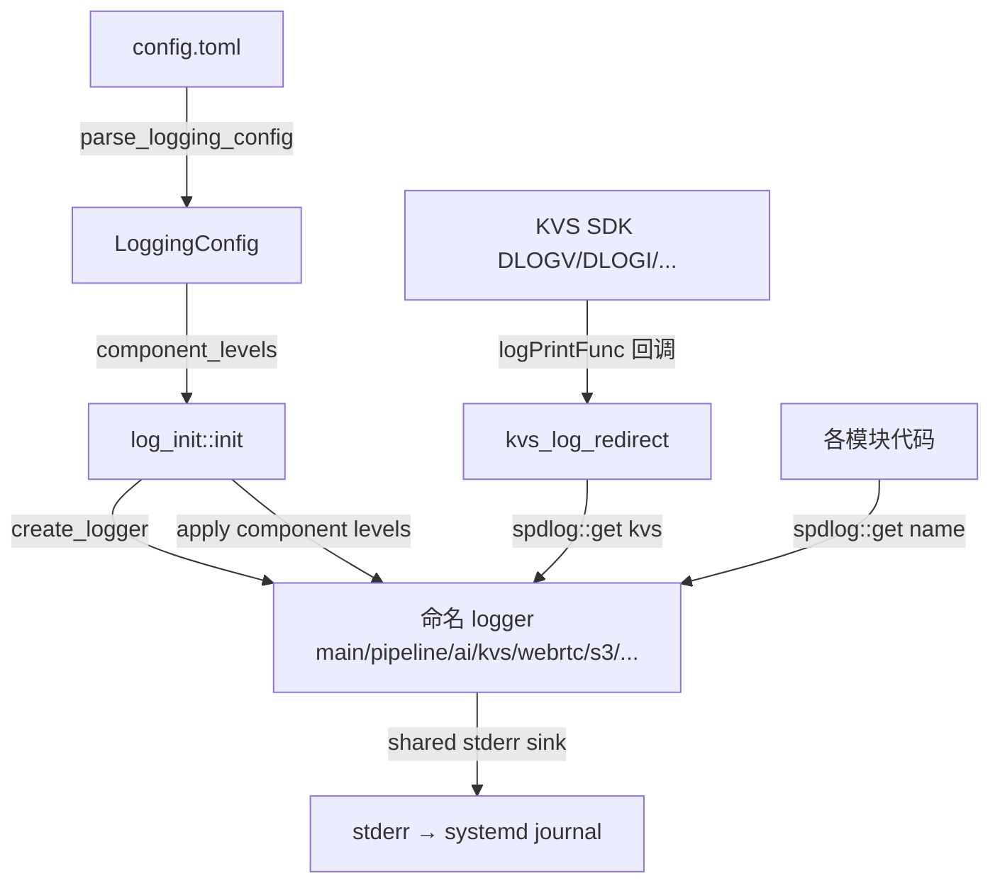

# 设计文档：Spec 23 — 统一日志管理

## 概述

本设计实现三个核心改进：

1. **Per-component 日志级别**：扩展 `LoggingConfig` 和 `log_init`，支持通过 `component_levels` 字段为每个命名 logger 设置独立级别
2. **KVS SDK 日志重定向**：通过条件编译注册 PIC 库的 `logPrintFunc` 全局回调，将 KVS SDK 内部日志转发到 `"kvs"` spdlog logger
3. **AI 检测结果日志调整**：将检测到目标时的推理结果从 debug 提升到 info，未检测到时保持 debug

所有改动仅涉及日志相关代码，不修改核心业务逻辑。

## 架构

### 数据流



### 改动范围

| 文件 | 改动类型 | 说明 |
|------|---------|------|
| `config_manager.h` | 修改 | `LoggingConfig` 新增 `component_levels` 字段 |
| `config_manager.cpp` | 修改 | `parse_logging_config` 解析 `component_levels` |
| `log_init.h` | 修改 | `init(const LoggingConfig&)` 签名不变，内部处理 component_levels |
| `log_init.cpp` | 修改 | 初始化时创建所有命名 logger 并应用 component_levels |
| `ai_pipeline_handler.cpp` | 修改 | 使用 `"ai"` logger，调整检测结果日志级别 |
| `s3_uploader.cpp` | 修改 | 使用 `"s3"` logger 替代 `spdlog::info/warn/error` |
| `config.toml.example` | 修改 | 新增 `component_levels` 示例 |
| `log_test.cpp` | 修改 | 新增 per-component 级别测试 |
| `config_test.cpp` | 修改 | 新增 `component_levels` 解析测试 |

## 组件与接口

### 1. LoggingConfig 扩展

```cpp
// config_manager.h
struct LoggingConfig {
    std::string level = "info";
    std::string format = "text";
    std::unordered_map<std::string, std::string> component_levels;  // 新增
};
```

### 2. parse_logging_config 扩展

解析 `component_levels = "ai:debug,kvs:warn,webrtc:info"` 格式：

```cpp
// 伪代码
if (auto* val = find_value(kv, "component_levels")) {
    // 按逗号分割，每个 token 按冒号分割为 name:level
    // trim 空格，校验 level 合法性
    // 无效 level → 返回 false + error_msg
    // 空字符串 → 保持 component_levels 为空（向后兼容）
}
```

### 3. log_init 扩展

`init(const LoggingConfig& config)` 改动：

1. 调用 `init(config.format == "json")` 创建 sink（已有逻辑）
2. 创建所有标准命名 logger：`main`、`pipeline`、`app`、`config`、`stream`、`ai`、`kvs`、`webrtc`、`s3`
3. 设置全局级别 `spdlog::set_level(lvl)`
4. 遍历 `config.component_levels`，对每个条目：
   - 通过 `spdlog::get(name)` 查找 logger
   - 存在 → 设置该 logger 的独立级别
   - 不存在 → warn 日志记录未知组件名

新增辅助函数：

```cpp
namespace log_init {
    // 将字符串转为 spdlog level enum，无效返回 nullopt
    std::optional<spdlog::level::level_enum> parse_level(const std::string& level_str);
}
```

### 4. KVS SDK 日志重定向

在 `log_init.cpp` 中新增条件编译块：

```cpp
#ifdef HAVE_KVS_WEBRTC_SDK
#include <com/amazonaws/kinesis/video/common/PlatformUtils.h>

namespace {
// KVS PIC 库的 logPrintFunc 回调签名：
//   void logPrintFunc(UINT32 level, PCHAR tag, PCHAR fmt, ...)
// 全局函数指针，可直接赋值覆盖
void kvs_log_callback(UINT32 level, PCHAR tag, PCHAR fmt, ...) {
    auto logger = spdlog::get("kvs");
    if (!logger) return;

    // 格式化消息
    char buf[1024];
    va_list args;
    va_start(args, fmt);
    vsnprintf(buf, sizeof(buf), fmt, args);
    va_end(args);

    // 去除尾部换行符
    std::string msg(buf);
    while (!msg.empty() && (msg.back() == '\n' || msg.back() == '\r')) {
        msg.pop_back();
    }

    // KVS SDK 级别映射到 spdlog
    // LOG_LEVEL_VERBOSE(1) → trace, LOG_LEVEL_DEBUG(2) → debug,
    // LOG_LEVEL_INFO(3) → info, LOG_LEVEL_WARN(4) → warn,
    // LOG_LEVEL_ERROR(5) → error
    spdlog::level::level_enum spdlog_level;
    switch (level) {
        case 1: spdlog_level = spdlog::level::trace; break;
        case 2: spdlog_level = spdlog::level::debug; break;
        case 3: spdlog_level = spdlog::level::info; break;
        case 4: spdlog_level = spdlog::level::warn; break;
        default: spdlog_level = spdlog::level::err; break;
    }
    logger->log(spdlog_level, "[{}] {}", tag ? tag : "", msg);
}
}  // namespace

namespace log_init {
void setup_kvs_log_redirect() {
    // 覆盖 PIC 库的全局 logPrintFunc 函数指针
    globalCustomLogPrintFn = kvs_log_callback;
}
}
#else
namespace log_init {
void setup_kvs_log_redirect() {
    // macOS stub: no-op
}
}
#endif
```

设计决策：
- 使用 PIC 库的 `globalCustomLogPrintFn` 全局函数指针（定义在 `PlatformUtils.h`），这是 KVS SDK 官方支持的自定义日志回调机制
- 回调内部使用栈上 1024 字节缓冲区格式化消息，避免堆分配
- 去除尾部换行符确保 spdlog 单行输出
- macOS 无 KVS SDK 时编译为空函数

### 5. AI 检测结果日志调整

`ai_pipeline_handler.cpp` 的 `inference_loop()` 中：

```cpp
auto ai_log = spdlog::get("ai");
if (!ai_log) ai_log = spdlog::default_logger();

if (!filtered.empty()) {
    // 检测到目标 → info 级别输出摘要
    std::string summary;
    for (const auto& d : filtered) {
        if (!summary.empty()) summary += ", ";
        summary += fmt::format("{}({:.2f})", coco_class_name(d.class_id), d.confidence);
    }
    ai_log->info("Inference: {}ms, detected: {}", duration_ms, summary);
} else {
    // 未检测到 → debug 级别
    ai_log->debug("Inference: {}ms, {} raw detections, 0 after filter",
                  duration_ms, detections.size());
}
```

### 6. 模块 Logger 迁移策略

各模块将 `spdlog::info/warn/error(...)` 替换为命名 logger 调用：

```cpp
// 之前
spdlog::info("S3Uploader created: ...");

// 之后
auto logger = spdlog::get("s3");
if (logger) logger->info("S3Uploader created: ...");
```

对于已经使用 `spdlog::get("pipeline")` 的模块（webrtc_media、webrtc_signaling、pipeline_health 等），无需改动。

需要迁移的模块：
- `ai_pipeline_handler.cpp`：`spdlog::*` → `spdlog::get("ai")`
- `s3_uploader.cpp`：`spdlog::*` → `spdlog::get("s3")`
- `yolo_detector.cpp`：`spdlog::*` → `spdlog::get("ai")`

## 数据模型

### LoggingConfig 变更

```
LoggingConfig {
    level: string           // 全局默认级别（已有）
    format: string          // text | json（已有）
    component_levels: map   // 组件名 → 级别字符串（新增）
}
```

### component_levels 解析格式

输入：`"ai:debug, kvs:warn , webrtc : info"`
输出：`{"ai": "debug", "kvs": "warn", "webrtc": "info"}`

规则：
- 逗号分隔多个条目
- 冒号分隔组件名和级别
- 前后空格自动 trim
- 空字符串 → 空 map
- 无效级别 → 解析失败

### 命名 Logger 注册表

| Logger 名称 | 模块 | 创建时机 |
|------------|------|---------|
| `main` | main.cpp | log_init::init() |
| `pipeline` | pipeline_*.cpp, kvs_sink_factory.cpp | log_init::init() |
| `app` | app_context.cpp | log_init::init() |
| `config` | config_manager.cpp | log_init::init() |
| `stream` | stream_mode_controller.cpp | log_init::init() |
| `ai` | ai_pipeline_handler.cpp, yolo_detector.cpp | log_init::init() |
| `kvs` | KVS SDK 日志重定向 | log_init::init() |
| `webrtc` | webrtc_signaling.cpp, webrtc_media.cpp | log_init::init() |
| `s3` | s3_uploader.cpp | log_init::init() |


## 正确性属性

*属性是在系统所有有效执行中都应成立的特征或行为——本质上是关于系统应该做什么的形式化陈述。属性是人类可读规范与机器可验证正确性保证之间的桥梁。*

### Property 1: component_levels 解析往返

*For any* 有效的组件名到级别的映射表（组件名为非空小写字母字符串，级别为 trace/debug/info/warn/error 之一），将其序列化为 `"name:level,name:level"` 格式字符串（可包含随机空格），再通过 `parse_logging_config` 解析，得到的 `component_levels` 映射表应与原始映射表完全一致。

**Validates: Requirements 1.1, 2.3, 6.1, 6.2**

### Property 2: Per-component 级别应用

*For any* 有效的 `LoggingConfig`（包含全局级别和 component_levels 映射），调用 `log_init::init(config)` 后：
- 在 `component_levels` 中指定的每个已注册 logger，其级别应等于 component_levels 中指定的级别
- 未在 `component_levels` 中指定的已注册 logger，其级别应等于全局 `level`

**Validates: Requirements 1.2, 1.3, 3.4**

### Property 3: 无效级别拒绝

*For any* `component_levels` 字符串，其中至少一个条目的级别值不在 `{trace, debug, info, warn, error}` 集合中，`parse_logging_config` 应返回 `false` 并通过 `error_msg` 报告错误。

**Validates: Requirements 1.5**

## 错误处理

| 场景 | 处理方式 |
|------|---------|
| `component_levels` 包含无效级别 | `parse_logging_config` 返回 false，error_msg 包含无效级别和组件名 |
| `component_levels` 包含未注册组件名 | `log_init` 忽略该条目，warn 日志记录 |
| `component_levels` 格式错误（缺少冒号） | `parse_logging_config` 返回 false，error_msg 描述格式错误 |
| `spdlog::get("name")` 返回 nullptr | 模块回退到默认 logger 或跳过日志输出，不崩溃 |
| KVS SDK 日志回调中格式化失败 | 截断到 1024 字节缓冲区，不崩溃 |
| `component_levels` 为空字符串 | 视为无配置，所有 logger 使用全局级别 |

## 测试策略

### 双重测试方法

**Property-Based Tests（PBT）**：
- 使用 RapidCheck 库（已集成）
- 每个 property test 最少 100 次迭代
- 标签格式：`Feature: log-management, Property {N}: {描述}`

**Unit Tests（示例测试）**：
- 验证具体场景：空 component_levels、未知组件名、向后兼容
- 验证 KVS 日志级别映射（5 个固定映射）
- 验证 AI 检测结果日志级别调整
- 验证所有命名 logger 在 init 后存在

### PBT 配置

```cpp
// Property 1: component_levels 解析往返
// Feature: log-management, Property 1: component_levels parsing round-trip
RC_GTEST_PROP(ComponentLevelsParsing, RoundTrip, ()) {
    // 生成随机 component_levels map
    // 序列化为字符串（含随机空格）
    // 解析
    // 验证 map 一致
}

// Property 2: Per-component 级别应用
// Feature: log-management, Property 2: per-component level application
RC_GTEST_PROP(PerComponentLevel, AppliesCorrectly, ()) {
    // 生成随机全局级别 + component_levels
    // 调用 log_init::init(config)
    // 验证每个 logger 的级别
}

// Property 3: 无效级别拒绝
// Feature: log-management, Property 3: invalid level rejection
RC_GTEST_PROP(InvalidLevelRejection, ReturnsFalse, ()) {
    // 生成包含至少一个无效级别的 component_levels
    // 验证 parse_logging_config 返回 false
}
```

### 示例测试清单

| 测试 | 验证内容 | 对应需求 |
|------|---------|---------|
| `InitCreatesAllLoggers` | init 后所有 9 个命名 logger 存在 | 5.1 |
| `EmptyComponentLevels` | 空 component_levels 不影响全局级别 | 1.6, 7.1 |
| `UnknownComponentIgnored` | 未知组件名被忽略，不崩溃 | 1.4 |
| `MissingLoggingSection` | 缺少 [logging] section 使用默认值 | 7.2 |
| `LogJsonOverride` | --log-json 覆盖行为不变 | 7.3 |
| `ComponentLevelIsolation` | 设置 ai=debug 后 ai 输出 debug，其他 logger 不输出 | 8.3 |
| `EmptyStringComponentLevels` | 空字符串视为无配置 | 6.3 |
| `MalformedEntry` | 缺少冒号的条目返回 false | 错误处理 |
