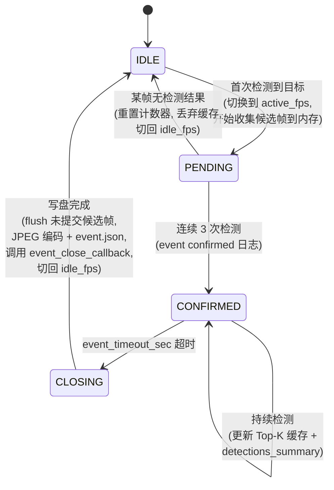
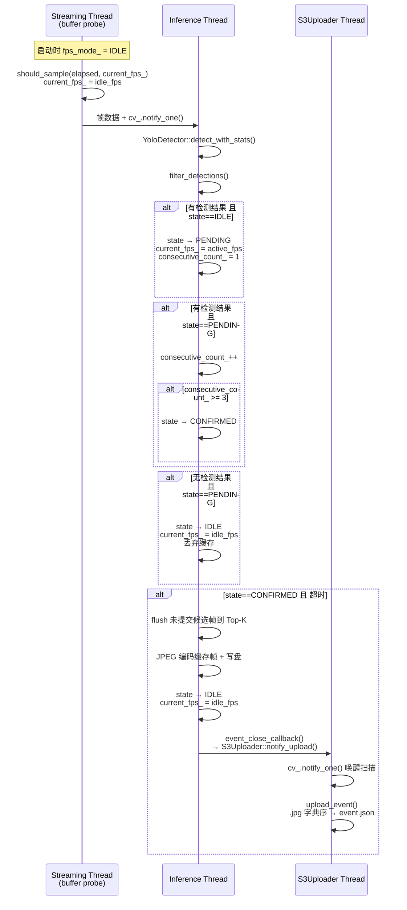
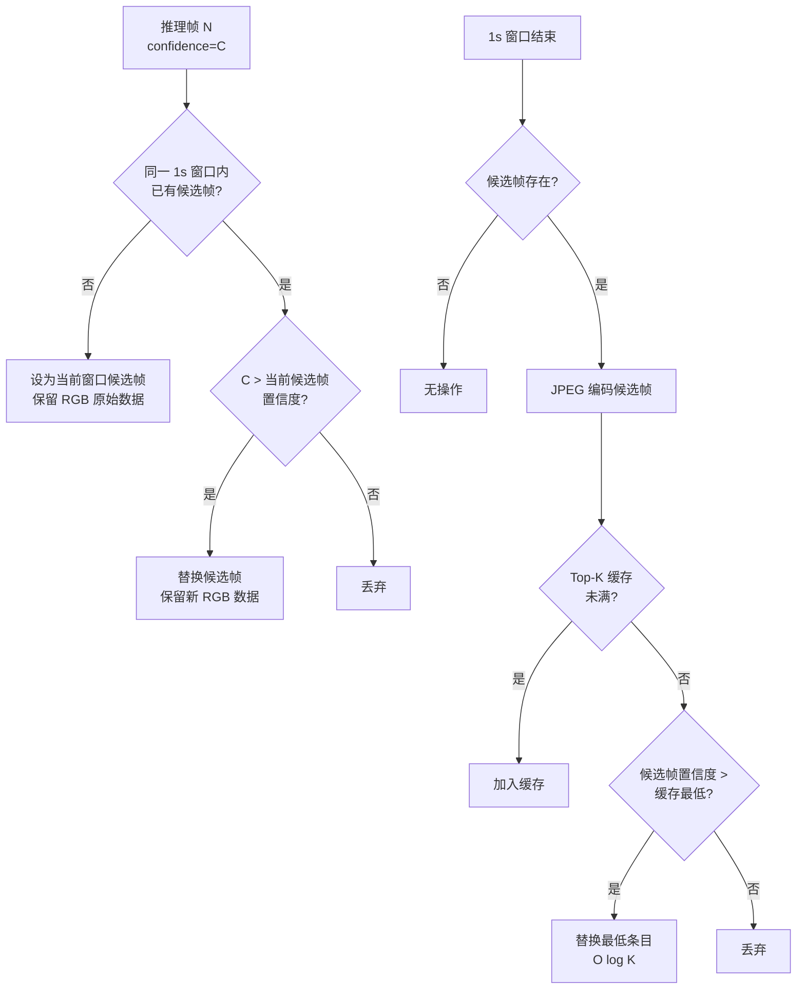

# 设计文档：Spec 24 — 事件管道优化

## 概述

本设计对 AI 推理管道（AiPipelineHandler）和 S3 上传器（S3Uploader）进行端到端优化，涵盖五个核心改进：

1. **自适应推理频率**：空闲时以 idle_fps（默认 1）采样节省 CPU，检测到目标后自动切换到 active_fps（默认 3）
2. **S3 事件驱动上传**：事件关闭后通过 `notify_upload()` 立即唤醒 S3 扫描线程，消除最长 30 秒的轮询延迟
3. **S3 上传顺序优化**：先上传所有 .jpg 文件（字典序），最后上传 event.json，确保云端 Lambda 触发时所有截图就绪
4. **智能截图选择**：每秒滑动窗口选最高置信度帧，Top-K min-heap 缓存（默认 K=10），JPEG 编码仅在候选帧提交到缓存时进行
5. **两阶段事件确认**：首次检测进入"准事件"→ 连续 3 次检测升级为"确认事件"→ 仅确认事件写盘和上传

设计原则：所有改动限定在 AiPipelineHandler、S3Uploader、ConfigManager 和 AppContext 四个文件内，不修改 GStreamer 管道拓扑，不引入新依赖。

## 架构

### 事件状态机（核心变更）



### 自适应 FPS 数据流



### 智能截图选择流程



## 组件与接口

### 修改文件清单

| 文件 | 变更内容 |
|------|---------|
| `device/src/ai_pipeline_handler.h` | AiConfig 新增 idle_fps/active_fps/max_snapshots_per_event；新增事件状态枚举 EventState；新增 Top-K 缓存、滑动窗口、事件关闭回调等成员 |
| `device/src/ai_pipeline_handler.cpp` | 重构 inference_loop 支持两阶段事件确认 + 自适应 fps + 智能截图选择 |
| `device/src/s3_uploader.h` | 新增 `notify_upload()` 公共方法 |
| `device/src/s3_uploader.cpp` | 实现 `notify_upload()`；重构 `upload_event()` 支持 .jpg 优先上传 |
| `device/src/config_manager.cpp` | `parse_ai_config()` 新增 idle_fps/active_fps/max_snapshots_per_event 解析 + 向后兼容逻辑 |
| `device/src/app_context.cpp` | init 阶段连接 event_close_callback → S3Uploader::notify_upload() |
| `device/config/config.toml` | [ai] section 新增 idle_fps/active_fps/max_snapshots_per_event 字段 |
| `device/tests/ai_pipeline_test.cpp` | 新增 Top-K 缓存、fps 配置解析、事件状态机相关测试 |
| `device/tests/s3_test.cpp` | 新增 upload 顺序、notify_upload 相关测试 |
| `device/tests/config_test.cpp` | 新增 idle_fps/active_fps 解析和验证测试 |

### AiConfig 扩展

```cpp
struct AiConfig {
    // ... 现有字段 ...

    // 新增：自适应推理频率
    int idle_fps = 1;                            // 空闲模式采样率（1-10）
    int active_fps = 3;                          // 活跃模式采样率（1-30）

    // 新增：智能截图选择
    int max_snapshots_per_event = 10;            // Top-K 缓存大小
};
```

向后兼容规则：
- 同时存在 `idle_fps` + `active_fps` → 使用新字段，忽略 `inference_fps`
- 仅存在 `inference_fps` → `active_fps = inference_fps`，`idle_fps = 1`
- 三者都缺失 → `idle_fps = 1`，`active_fps = 3`

### EventState 枚举

```cpp
enum class EventState {
    IDLE,       // 无活跃事件，以 idle_fps 采样
    PENDING,    // 准事件：首次检测到目标，等待连续确认
    CONFIRMED,  // 确认事件：连续 3 次检测，允许写盘
    CLOSING     // 关闭中：超时触发，正在写盘
};
```

### AiPipelineHandler 新增/变更成员

```cpp
class AiPipelineHandler {
public:
    // 新增：事件关闭回调
    using EventCloseCallback = std::function<void()>;
    void set_event_close_callback(EventCloseCallback cb);

private:
    // 自适应 fps
    std::atomic<int> current_fps_;          // 当前生效的 fps（idle 或 active）
    // 注意：fps_mode 不需要单独的原子变量，current_fps_ 本身即可区分模式

    // 两阶段事件确认
    EventState event_state_ = EventState::IDLE;
    int consecutive_detection_count_ = 0;
    static constexpr int kConfirmationThreshold = 3;

    // 智能截图选择 — 1 秒滑动窗口
    struct WindowCandidate {
        std::vector<uint8_t> rgb_data;      // RGB 原始帧（用于延迟 JPEG 编码）
        int width = 0;
        int height = 0;
        float confidence = 0.0f;            // 该帧最高检测置信度
        std::chrono::system_clock::time_point timestamp;
    };
    std::optional<WindowCandidate> window_candidate_;
    std::chrono::steady_clock::time_point window_start_;

    // 智能截图选择 — Top-K min-heap 缓存
    struct SnapshotEntry {
        std::string filename;
        std::vector<uint8_t> jpeg_data;     // JPEG 编码后数据
        float confidence;
        std::chrono::system_clock::time_point timestamp;
    };
    // min-heap：堆顶为最低置信度，替换时 O(log K)
    std::vector<SnapshotEntry> snapshot_heap_;

    // 事件关闭回调
    EventCloseCallback event_close_cb_;
};
```

### Top-K 缓存操作（独立纯函数，便于测试）

```cpp
// 尝试将候选帧提交到 Top-K 缓存
// 返回 true 表示候选帧被接受（新增或替换），false 表示被丢弃
// 当返回 true 时，调用方应对候选帧进行 JPEG 编码后加入缓存
bool try_submit_to_topk(
    std::vector<SnapshotEntry>& heap,
    int max_k,
    float candidate_confidence);

// 比较器：min-heap 按 confidence 排序
struct SnapshotMinHeapCmp {
    bool operator()(const SnapshotEntry& a, const SnapshotEntry& b) const {
        return a.confidence > b.confidence;  // min-heap: 最低置信度在堆顶
    }
};
```

### S3Uploader 新增接口

```cpp
class S3Uploader {
public:
    // 新增：事件驱动上传通知
    // 线程安全，可从任意线程调用
    // stop() 后调用无效果
    void notify_upload();

    // ... 现有接口不变 ...
};
```

实现：

```cpp
void S3Uploader::notify_upload() {
    // 不获取 mutex_，直接 notify
    // 如果 scan_loop 正在 cv_.wait_for()，会被唤醒
    // 如果 scan_loop 正在处理上传，notify 会在下次 wait_for 时被消费
    cv_.notify_one();
}
```

### upload_event() 重构

```cpp
bool S3Uploader::upload_event(const std::string& event_dir) {
    // 1. 解析 event.json 获取 date_str 和 event_id（不变）

    // 2. 收集并排序文件
    std::vector<std::string> jpg_files;
    std::string event_json_file;
    for (const auto& file_entry : fs::directory_iterator(event_dir)) {
        auto filename = file_entry.path().filename().string();
        if (filename == ".uploaded") continue;
        if (filename == "event.json") {
            event_json_file = filename;
        } else if (filename.ends_with(".jpg") || filename.ends_with(".jpeg")) {
            jpg_files.push_back(filename);
        }
    }
    std::sort(jpg_files.begin(), jpg_files.end());  // 字典序

    // 3. 先上传所有 .jpg
    for (const auto& jpg : jpg_files) {
        if (!upload_file(...)) return false;  // 任何失败立即中止
    }

    // 4. 最后上传 event.json
    if (!event_json_file.empty()) {
        if (!upload_file(...)) return false;
    }

    // 5. 写 .uploaded marker + 删除目录（不变）
}
```

### AppContext 回调连接

```cpp
// app_context.cpp — init() 阶段，在 ai_handler_ 和 s3_uploader_ 都创建成功后
#ifdef ENABLE_YOLO
if (impl_->ai_handler_ && impl_->s3_uploader_) {
    impl_->ai_handler_->set_event_close_callback([this]() {
        impl_->s3_uploader_->notify_upload();
    });
}
#endif
```

### config.toml 变更

```toml
[ai]
model_path = "device/models/yolo11s.onnx"
# inference_fps = 2          # 已废弃，保留向后兼容
idle_fps = 1                  # 空闲模式采样率（1-10，默认 1）
active_fps = 3                # 活跃模式采样率（1-30，默认 3）
confidence_threshold = 0.25
snapshot_dir = "device/events/"
event_timeout_sec = 15
max_cache_mb = 16
max_snapshots_per_event = 10  # Top-K 缓存大小（默认 10）
target_classes = "bird:0.3,person:0.5,cat,dog"
```

## 数据模型

### event.json 结构（变更）

```json
{
    "event_id": "evt_20260412_153045",
    "device_id": "RaspiEyeAlpha",
    "start_time": "2026-04-12T15:30:45Z",
    "end_time": "2026-04-12T15:31:15Z",
    "status": "closed",
    "frame_count": 8,
    "detections_summary": {
        "bird": { "count": 12, "max_confidence": 0.92 },
        "cat": { "count": 3, "max_confidence": 0.78 }
    }
}
```

关键变更：
- `frame_count` 现在反映实际写盘的截图数量（Top-K 缓存大小），而非总推理帧数
- `detections_summary` 包含从触发准事件的首次检测开始的所有检测结果（含准事件阶段）

### 内存模型

| 数据结构 | 内存占用 | 说明 |
|---------|---------|------|
| WindowCandidate.rgb_data | ~2.7MB（720p） | 1 秒窗口内最佳帧的 RGB 原始数据，窗口结束后释放 |
| SnapshotEntry.jpeg_data | ~50-80KB/帧 | JPEG 编码后数据，Top-K 缓存最多 10 帧 ≈ 0.5-0.8MB |
| snapshot_heap_ | ≤ K × 80KB ≈ 0.8MB | min-heap，最多 max_snapshots_per_event 条目 |
| RGB 双缓冲区 | ~5.5MB | 现有，不变 |
| **总峰值** | **≈ 9MB** | 远低于原设计的 16MB max_cache_mb |

智能截图选择大幅降低了内存使用：原方案每帧都 JPEG 编码并缓存（可能数百帧），新方案最多缓存 K=10 帧 JPEG + 1 帧 RGB 候选。

### Top-K min-heap 操作复杂度

| 操作 | 复杂度 | 说明 |
|------|--------|------|
| 插入（缓存未满） | O(log K) | push_heap |
| 替换最低（缓存已满） | O(log K) | pop_heap + push_heap |
| 查询最低置信度 | O(1) | heap front |
| 关闭时排序写盘 | O(K log K) | sort_heap by timestamp |

## 正确性属性

*正确性属性是在系统所有有效执行中都应成立的特征或行为——本质上是对系统应做什么的形式化陈述。属性是人类可读规格与机器可验证正确性保证之间的桥梁。*

### Property 1: FPS 配置解析正确性

*For any* 有效的 idle_fps 值（1-10）和 active_fps 值（1-30）且 idle_fps < active_fps，`parse_ai_config` 应将它们正确存入 AiConfig 对应字段，且返回 true。

**Validates: Requirements 1.1, 1.2**

### Property 2: FPS 范围验证

*For any* idle_fps 值不在 [1,10] 范围内，或 active_fps 值不在 [1,30] 范围内，`parse_ai_config` 应返回 false 并设置非空 error_msg。

**Validates: Requirements 1.5, 1.6**

### Property 3: idle_fps < active_fps 交叉验证

*For any* idle_fps 和 active_fps 值对，若 idle_fps >= active_fps，`parse_ai_config` 应返回 false 并设置包含描述性信息的 error_msg。

**Validates: Requirements 1.7**

### Property 4: S3 上传顺序不变量

*For any* 包含 N 个 .jpg 文件和 1 个 event.json 的事件目录（N ≥ 0），`upload_event()` 应按以下顺序上传：所有 .jpg 文件按文件名字典序排列，最后上传 event.json。

**Validates: Requirements 5.1, 5.3**

### Property 5: S3 上传失败中止

*For any* 事件目录中的 .jpg 文件上传失败，`upload_event()` 应立即返回 false，且 event.json 不被上传。

**Validates: Requirements 5.2**

### Property 6: 1 秒窗口最佳帧选择

*For any* 1 秒时间窗口内的帧序列（每帧有置信度值），窗口结束时选出的候选帧应具有该窗口内的最高置信度。

**Validates: Requirements 6.1**

### Property 7: Top-K 缓存不变量

*For any* Top-K 缓存状态（大小 ≤ K）和新候选帧，操作后缓存应满足：(a) 大小 ≤ K；(b) 若操作前大小 < K，候选帧被加入；(c) 若操作前大小 = K 且候选帧置信度 > 缓存最低，最低被替换；(d) 若操作前大小 = K 且候选帧置信度 ≤ 缓存最低，缓存不变。

**Validates: Requirements 6.3, 6.4, 6.5**

### Property 8: frame_count 一致性

*For any* 已关闭的事件，event.json 中的 `frame_count` 值应等于事件目录中实际写入的 .jpg 文件数量。

**Validates: Requirements 6.9**

### Property 9: 准事件无副作用

*For any* 处于 PENDING 状态的事件，若连续检测计数器未达到 3 即被中断（某帧无检测结果），则不应产生任何磁盘 I/O、S3 上传或 detection_callback 调用。

**Validates: Requirements 7.4, 7.5, 7.6**

## 错误处理

| 场景 | 处理策略 | 日志级别 |
|------|---------|---------|
| idle_fps/active_fps 超出范围 | `parse_ai_config()` 返回 false + error_msg | error（由 ConfigManager 传播） |
| idle_fps >= active_fps | `parse_ai_config()` 返回 false + error_msg | error |
| max_snapshots_per_event < 1 | 使用默认值 10 + warn 日志 | warn |
| JPEG 编码失败（候选帧提交时） | 跳过该候选帧，不加入 Top-K 缓存 | warn |
| close_event() 磁盘写入失败 | 跳过 event_close_callback 调用，记录日志 | warn |
| close_event() 磁盘写入成功 | 调用 event_close_callback（如已注册） | — |
| notify_upload() 在 stop() 后调用 | 忽略，cv_.notify_one() 无接收者 | — |
| .jpg 上传失败 | 中止整个事件上传，不上传 event.json | warn |
| 准事件被中断（无检测） | 丢弃内存缓存，切回 idle_fps | debug |
| 准事件升级为确认事件 | 记录 info 日志 | info |
| fps 模式切换 | 记录 info 日志：`Inference fps: {old} -> {new}, reason={reason}` | info |

关键原则不变：AI 管道的任何错误都不应影响主 streaming 管道（KVS + WebRTC）的正常运行。

## 测试策略

### 测试框架

- Google Test + RapidCheck（PBT）
- 属性测试最少 100 次迭代
- 标签格式：`Feature: event-pipeline-optimization, Property N: {property_text}`

### 属性测试（PBT）

| 属性 | 测试内容 | 生成器 |
|------|---------|--------|
| Property 1 | fps 配置解析正确性 | 随机 idle_fps [1,10]，随机 active_fps [idle_fps+1, 30] |
| Property 2 | fps 范围验证 | 随机 idle_fps ∈ {<1, >10}，随机 active_fps ∈ {<1, >30} |
| Property 3 | idle >= active 交叉验证 | 随机 (idle, active) 对，idle >= active |
| Property 4 | S3 上传顺序 | 随机生成 0-20 个 .jpg 文件名 + event.json，mock put 记录顺序 |
| Property 5 | S3 上传失败中止 | 随机生成事件目录，随机选择失败位置，验证 event.json 未上传 |
| Property 6 | 1 秒窗口最佳帧 | 随机生成 1-30 个 (timestamp, confidence) 对，验证选出最高 |
| Property 7 | Top-K 缓存不变量 | 随机 K [1,20]，随机操作序列（插入 0-50 个候选），验证堆性质 |
| Property 8 | frame_count 一致性 | 随机生成 Top-K 缓存内容，模拟 close_event，验证 frame_count = jpg 数 |
| Property 9 | 准事件无副作用 | 随机生成 1-2 次检测后中断，验证无磁盘 I/O |

### Example-based 测试

| 测试 | 内容 |
|------|------|
| idle_fps 缺失默认值 | kv map 无 idle_fps → AiConfig.idle_fps == 1 |
| active_fps 缺失默认值 | kv map 无 active_fps → AiConfig.active_fps == 3 |
| 向后兼容：仅 inference_fps | kv map 仅有 inference_fps=5 → active_fps=5, idle_fps=1 |
| 向后兼容：三字段共存 | idle_fps + active_fps + inference_fps → 忽略 inference_fps |
| max_snapshots_per_event 默认值 | kv map 无该字段 → 默认 10 |
| notify_upload() 在 stop() 后 | 调用不崩溃 |
| 事件目录仅 event.json | 无 .jpg 文件时正常上传 |
| close_event() 无回调 | 未注册回调时正常关闭 |
| 准事件 → 确认事件 | 连续 3 次检测后状态升级 |
| 准事件中断 | 第 2 次检测后无检测 → 重置 |
| 窗口结束时 flush 候选帧 | close_event() 时未提交的候选帧被提交 |

### 不在本 Spec 测试的内容

- GStreamer 管道集成测试（probe 安装 + 帧流动）：在 smoke_test 中验证
- S3 真实上传：依赖 AWS 凭证，在 Pi 5 端到端验证
- 云端 Lambda 触发逻辑：后续 Spec 范围

### 验证命令

```bash
cmake -B device/build -S device -DCMAKE_BUILD_TYPE=Debug && \
cmake --build device/build && \
ctest --test-dir device/build --output-on-failure
```
