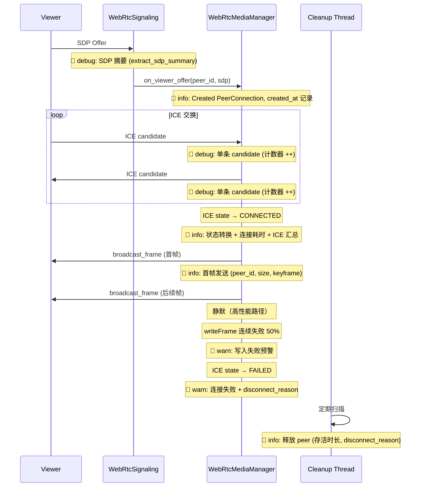

# 设计文档：Spec 25 — WebRTC 日志可观测性优化

## 概述

本 Spec 优化 WebRTC 模块（`webrtc_signaling.cpp`、`webrtc_media.cpp`）的日志可观测性，解决 Pi 5 生产日志审查中发现的五个问题：ICE candidate 日志过于啰嗦、缺少状态转换里程碑、SDP 缺少摘要、连接期间静默、cleanup 信息不足。

核心设计原则：
- **只改日志，不改功能逻辑** — 所有变更仅涉及日志输出，不修改 WebRTC 连接、信令、媒体流的行为
- **stub 和 real 同步更新** — 两套实现维护相同的 PeerInfo 扩展字段和日志格式
- **高性能路径保护** — `broadcast_frame` 中仅在首帧和异常时输出日志

## 架构

本 Spec 不引入新模块或新架构，仅在现有 `webrtc_media.cpp` 和 `webrtc_signaling.cpp` 中增强日志输出。

### 变更范围

```
device/src/webrtc_media.cpp   — PeerInfo 扩展 + 日志增强（stub + real）
device/src/webrtc_signaling.cpp — ICE candidate / SDP 日志级别调整
device/src/webrtc_media.h     — 无变更（pImpl 隔离，PeerInfo 在 .cpp 内部）
```

### 日志级别策略

| 级别 | 使用场景 |
|------|---------|
| debug | 单条 ICE candidate 收发、SDP 摘要、writeFrame SRTP 跳过 |
| info | 连接建立/正常断开里程碑、ICE 汇总、首帧发送、cleanup 释放、状态转换 |
| warn | 连接 FAILED、writeFrame 连续失败预警（50% 阈值） |

### 数据流（日志增强点）



## 组件与接口

### PeerInfo 结构体扩展

在 `webrtc_media.cpp` 内部的 `PeerInfo` 结构体中新增以下字段（stub 和 real 实现均需添加）：

```cpp
struct PeerInfo {
    // --- 现有字段 ---
    PRtcPeerConnection peer_connection = nullptr;      // real only
    PRtcRtpTransceiver video_transceiver = nullptr;    // real only
    uint32_t consecutive_write_failures = 0;
    std::atomic<PeerState> state{PeerState::CONNECTING};
    std::chrono::steady_clock::time_point disconnected_at;

    // --- 新增字段（Spec 25）---
    std::chrono::steady_clock::time_point created_at;  // PeerConnection 创建时间
    bool first_frame_sent = false;                     // 首帧发送标记
    std::string disconnect_reason;                     // 断开原因
    uint32_t sent_candidates = 0;                      // 发送的 ICE candidate 计数
    uint32_t received_candidates = 0;                  // 接收的 ICE candidate 计数
};
```

对于 stub 实现，当前使用 `std::unordered_map<std::string, PeerState>` 管理 peer 状态，需要改为使用包含扩展字段的结构体。stub 的 PeerInfo 不需要 `peer_connection` 和 `video_transceiver` 指针字段，但需要包含所有日志相关字段：

```cpp
// stub PeerInfo
struct PeerInfo {
    PeerState state = PeerState::CONNECTING;
    std::chrono::steady_clock::time_point created_at;
    std::chrono::steady_clock::time_point disconnected_at;
    bool first_frame_sent = false;
    std::string disconnect_reason;
    uint32_t sent_candidates = 0;
    uint32_t received_candidates = 0;
};
```

注意：stub 的 PeerInfo 不使用 `std::atomic<PeerState>`（stub 中无 SDK 回调线程），避免 GCC 12 对 `std::atomic` 不可拷贝的严格检查问题。

### extract_sdp_summary 纯函数

新增独立辅助函数，定义在 `webrtc_media.cpp` 内部（文件作用域，非类成员）：

```cpp
// 从 SDP 文本中提取 codec 摘要。
// 扫描 "a=rtpmap:" 行，提取 codec 名称（如 H264、opus）。
// 返回逗号分隔的 codec 列表字符串，如 "H264, opus"。
// 输入为空或无 rtpmap 行时返回空字符串。
static std::string extract_sdp_summary(const std::string& sdp);
```

实现策略：
1. 按行分割 SDP 文本（`\r\n` 或 `\n`）
2. 查找以 `a=rtpmap:` 开头的行
3. 从 `a=rtpmap:<payload_type> <codec_name>/<clock_rate>` 格式中提取 `<codec_name>`
4. 去重后用逗号连接返回
5. 任何解析异常（空字符串、格式不匹配）返回空字符串，不抛异常

此函数为纯函数，无副作用，便于单元测试和 property-based testing。

### 日志变更清单

#### webrtc_signaling.cpp

| 位置 | 当前 | 变更后 |
|------|------|--------|
| `on_signaling_message_received` — OFFER | `info("Received SDP offer from peer: {}")` | `info("Received SDP offer from peer: {}")` + `debug("SDP summary for peer {}: {}", peer_id, extract_sdp_summary(sdp))` |
| `on_signaling_message_received` — ICE_CANDIDATE | `info("Received ICE candidate from peer: {}")` | `debug("Received ICE candidate from peer: {}")` |
| `send_answer` — 成功 | `info("Sent SDP answer to peer: {}")` | `info("Sent SDP answer to peer: {}")` + `debug("Answer SDP summary for peer {}: {}", peer_id, extract_sdp_summary(sdp_answer))` |
| `send_ice_candidate` — 成功 | `info("Sent ICE candidate to peer: {}")` | `debug("Sent ICE candidate to peer: {}")` |

注意：`extract_sdp_summary` 定义在 `webrtc_media.cpp` 中，`webrtc_signaling.cpp` 需要访问它。有两个选择：
- **方案 A**：将 `extract_sdp_summary` 声明在 `webrtc_media.h` 中作为自由函数
- **方案 B**：在 `webrtc_signaling.cpp` 中重复定义（违反 DRY）

选择方案 A：在 `webrtc_media.h` 中添加声明，实现放在 `webrtc_media.cpp` 中（去掉 `static`）。这样两个文件都能使用，且函数可被测试直接调用。

#### webrtc_media.cpp — stub 实现

| 位置 | 当前 | 变更后 |
|------|------|--------|
| `on_viewer_offer` — 创建 peer | `info("Stub: added peer {}, count={}")` | `info("Stub: added peer {}, count={}", ...)` + 设置 `created_at = now()` |
| `on_viewer_offer` — 清理 DISCONNECTING | `info("Stub on_viewer_offer: freed peer {}")` | `info("Freed stale peer {} (alive={:.1f}s, reason={})", id, alive_sec, reason)` |
| `on_viewer_ice_candidate` | 直接返回 true | `debug("Stub: received ICE candidate for peer {}")` + `received_candidates++` |
| `remove_peer` | `info("Stub: removed peer {}")` | `info("Removed peer {} (alive={:.1f}s, reason=manual_remove)")` + 设置 disconnect_reason |
| `broadcast_frame` | 静默遍历 | 首帧时 `info("First frame sent to peer {} (size={}, keyframe={})")` |
| `cleanup_loop` — 释放 | `info("Stub cleanup: freed expired DISCONNECTING peer {}")` | `info("Cleanup: freed peer {} (alive={:.1f}s, reason={})")` |
| `~Impl` — 释放 | `info("Stub ~Impl: freed peer {}")` | `info("Shutdown: freed peer {} (alive={:.1f}s, state={})")` |

#### webrtc_media.cpp — real 实现

| 位置 | 当前 | 变更后 |
|------|------|--------|
| `on_viewer_offer` — 创建 peer | 设置 `state = CONNECTING` | + 设置 `created_at = now()` |
| `on_viewer_offer` — 清理 DISCONNECTING | `info("on_viewer_offer: freed stale peer {}")` | `info("Freed stale peer {} (alive={:.1f}s, reason={})")` |
| `on_viewer_offer` — SDP 处理 | 无 SDP 摘要 | `debug("Offer SDP summary for peer {}: {}")` |
| `on_viewer_ice_candidate` — 已有 peer | `debug("Added ICE candidate for peer: {}")` | + `received_candidates++` |
| `on_viewer_ice_candidate` — 缓存 | `info("Buffered early ICE candidate...")` | `debug("Buffered early ICE candidate...")` |
| `on_ice_candidate_handler` | `debug("Sending ICE candidate to peer: {}")` | + `sent_candidates++`（需通过 peers_mutex 访问 PeerInfo） |
| `on_connection_state_change` — CONNECTED | `info("Peer {} connected")` | `info("Peer {} connected (elapsed={:.1f}s, ice_sent={}, ice_recv={})")` |
| `on_connection_state_change` — FAILED | `info("Peer {} state changed to DISCONNECTING: connection_failed")` | `warn("Peer {} connection FAILED, marking DISCONNECTING")` + 设置 disconnect_reason |
| `on_connection_state_change` — CLOSED | `info("Peer {} state changed to DISCONNECTING: connection_closed")` | `info("Peer {} connection closed, marking DISCONNECTING")` + 设置 disconnect_reason |
| `broadcast_frame` — 首帧成功 | 无 | `info("First frame sent to peer {} (size={}, keyframe={})")` + `first_frame_sent = true` |
| `broadcast_frame` — SRTP 跳过 | 静默 continue | `debug("writeFrame skipped for peer {}: SRTP not ready")` |
| `broadcast_frame` — 50% 阈值 | 无 | `warn("writeFrame failing for peer {}: {}/{} consecutive failures")` |
| `cleanup_loop` — 释放 | `info("Cleanup thread: freed expired peer {}")` | `info("Cleanup: freed peer {} (alive={:.1f}s, reason={})")` |
| `~Impl` — 释放 | 无详细信息 | `info("Shutdown: freed peer {} (alive={:.1f}s, state={})")` |
| `remove_peer` | `info("Removed peer {}, reason=manual_remove")` | `info("Removed peer {} (alive={:.1f}s, reason=manual_remove)")` + 设置 disconnect_reason |

## 数据模型

本 Spec 不引入新的持久化数据模型。所有新增字段（`created_at`、`first_frame_sent`、`disconnect_reason`、ICE candidate 计数器）均为内存中的运行时状态，随 PeerInfo 生命周期管理。

### 存活时长计算

```cpp
auto alive_sec = std::chrono::duration<double>(
    std::chrono::steady_clock::now() - info.created_at).count();
```

### disconnect_reason 取值

| 值 | 触发场景 |
|----|---------|
| `"connection_failed"` | SDK 回调 `RTC_PEER_CONNECTION_STATE_FAILED` |
| `"connection_closed"` | SDK 回调 `RTC_PEER_CONNECTION_STATE_CLOSED` |
| `"max_write_failures"` | `broadcast_frame` 中连续失败超过 `kMaxWriteFailures` |
| `"manual_remove"` | 显式调用 `remove_peer` |
| `""` (空) | 默认值，peer 尚未断开 |


## 正确性属性

*正确性属性是在系统所有有效执行中都应成立的特征或行为——本质上是对系统应做什么的形式化陈述。属性是人类可读规格与机器可验证正确性保证之间的桥梁。*

本 Spec 的核心可测试逻辑集中在 `extract_sdp_summary` 纯函数上。PeerInfo 字段扩展的正确性通过现有 PBT 回归验证（peer_count 不变量不受影响）。日志级别和格式的正确性属于集成测试范畴（Pi 5 端到端验证）。

### Property 1: SDP 摘要提取 round-trip

*For any* 由随机 codec 名称（纯字母数字）构成的 `a=rtpmap:<pt> <codec>/<rate>` 行集合，将这些行嵌入合法 SDP 文本后调用 `extract_sdp_summary`，返回的 codec 列表应包含所有生成的 codec 名称（去重后）。

**Validates: Requirements 3.5, 7.3**

### Property 2: extract_sdp_summary 鲁棒性

*For any* 任意字符串（包括空字符串、纯随机字节、不含 `a=rtpmap:` 的文本），调用 `extract_sdp_summary` 不崩溃，且返回值为有效的 `std::string`（可能为空）。

**Validates: Requirements 3.3, 7.3**

## 错误处理

本 Spec 不引入新的错误路径。所有日志增强均为"尽力输出"模式：

1. **logger 为 nullptr**：所有日志调用前已有 `if (logger)` 守卫，保持现有模式
2. **extract_sdp_summary 解析失败**：返回空字符串，调用方回退到输出 peer_id + SDP 长度
3. **created_at 未初始化**：使用 `steady_clock::time_point{}` 默认值（epoch），存活时长计算结果为极大值，不影响功能
4. **ICE candidate 计数器溢出**：`uint32_t` 最大值 ~43 亿，单次连接不可能达到

## 测试策略

### 双重测试方法

- **Property-based tests (PBT)**：验证 `extract_sdp_summary` 的通用正确性
- **Example-based tests**：验证具体 SDP 格式、边界条件
- **回归测试**：现有 `webrtc_test` + `webrtc_media_test` 全部通过，确认日志改动未破坏功能

### Property-based testing 配置

- 库：RapidCheck（已在项目中使用）
- 每个 property 最少 100 次迭代
- 标签格式：`Feature: webrtc-log-observability, Property N: <property_text>`

### 测试用例规划

| 测试类型 | 测试内容 | 验证目标 |
|---------|---------|---------|
| PBT | extract_sdp_summary round-trip | Property 1: 随机 codec 名称正确提取 |
| PBT | extract_sdp_summary 鲁棒性 | Property 2: 任意输入不崩溃 |
| Example | extract_sdp_summary 空字符串 → 空 | 需求 3.3 |
| Example | extract_sdp_summary 真实 SDP → "H264, opus" | 需求 3.5 |
| Example | extract_sdp_summary 无 rtpmap 行 → 空 | 需求 3.3 |
| 回归 | 现有 webrtc_test 全部通过 | 需求 7.1 |
| 回归 | 现有 webrtc_media_test 全部通过（含 PBT） | 需求 7.1, 7.2 |
| 冒烟 | ctest 全量运行 + ASan 无报告 | 需求 7.4 |

### 测试文件

新增测试放在现有 `device/tests/webrtc_media_test.cpp` 中（`extract_sdp_summary` 测试），无需创建新测试文件。

### 验证命令

```bash
cmake -B device/build -S device -DCMAKE_BUILD_TYPE=Debug && cmake --build device/build && ctest --test-dir device/build --output-on-failure
```

## 禁止项

### Design 层

- SHALL NOT 在日志或错误输出中打印密钥、证书内容、token 等敏感信息
- SHALL NOT 在 SDP 摘要日志中输出完整 SDP 文本（SDP 可能包含 IP 地址等信息，且文本过长）
- SHALL NOT 在非 pipeline 模块中使用 `spdlog::get("pipeline")` logger
- SHALL NOT 对含 `std::atomic` 成员的结构体使用 `unordered_map::emplace` 或 `insert`（stub 中 PeerInfo 不使用 atomic，避免此问题）

### Tasks 层

- SHALL NOT 在 `broadcast_frame` 的每帧调用中输出 info 级别日志
- SHALL NOT 在日志消息中使用非 ASCII 字符
- SHALL NOT 修改 WebRTC 连接建立、信令交换、媒体流传输的功能逻辑
