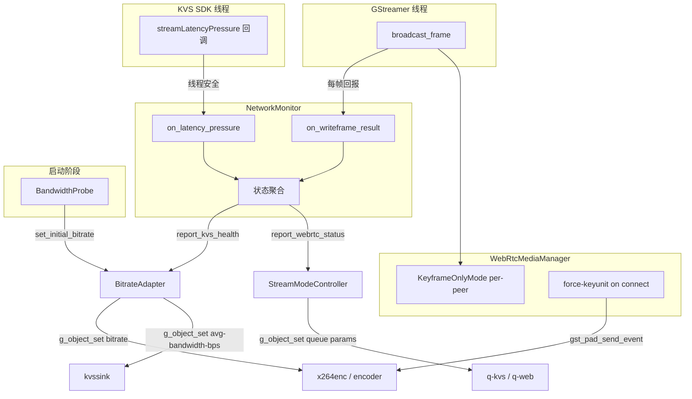
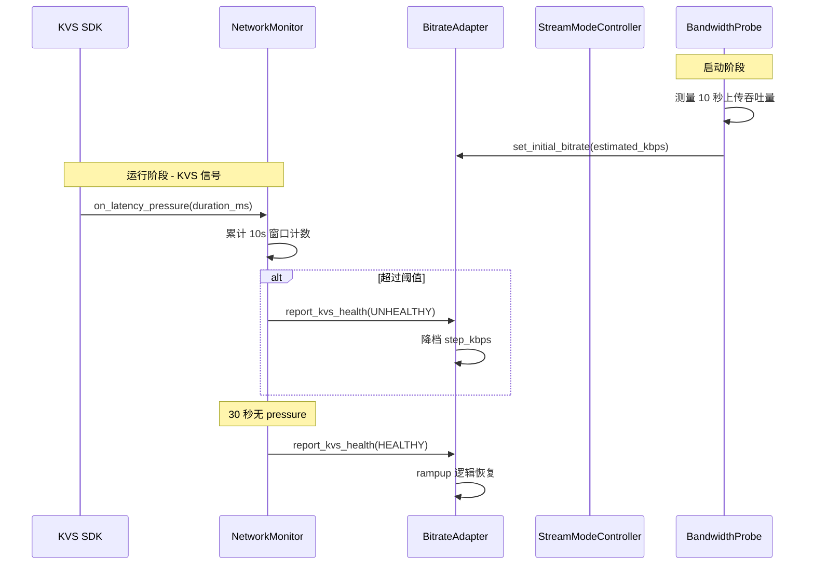
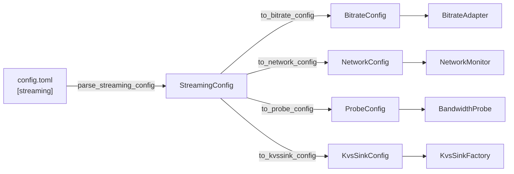

# 设计文档：网络自适应码率控制

## 概述

本设计在 Spec 15（adaptive-streaming）已建立的 BitrateAdapter + StreamModeController 架构基础上，补齐网络感知信号通路。核心变更：

1. **新增 NetworkMonitor 模块**：聚合 KVS latency pressure 和 WebRTC writeFrame 失败率两路网络信号，统一向 BitrateAdapter / StreamModeController 报告
2. **新增 BandwidthProbe 模块**：启动时轻量级带宽估算，设置合理初始码率
3. **扩展 KvsSinkFactory**：设置 avg-bandwidth-bps 和 buffer-duration 属性
4. **扩展 WebRtcMediaManager**：per-peer 仅关键帧模式 + 新 peer 连接后 force-keyunit
5. **扩展 StreamingConfig**：新增 6 个网络自适应配置字段

### 设计决策

- **NetworkMonitor 作为独立模块**：不侵入 BitrateAdapter 和 StreamModeController 的现有逻辑，通过已有的 `report_kvs_health()` 和 `report_webrtc_status()` 接口注入信号
- **纯函数优先**：所有核心计算逻辑（码率计算、阈值判断、状态转换）提取为纯函数，便于 PBT 测试
- **per-peer 状态**：仅关键帧模式为每个 peer 独立维护，避免一个 peer 的网络问题影响其他 peer

## 架构

### 信号流向图



### 模块交互时序



## 组件与接口

### 1. NetworkMonitor（新增）

```cpp
// network_monitor.h
#pragma once
#include "stream_mode_controller.h"  // BranchStatus
#include <chrono>
#include <cstdint>
#include <memory>

class BitrateAdapter;
class StreamModeController;

// 网络自适应配置（POD，从 StreamingConfig 转换）
struct NetworkConfig {
    int latency_pressure_threshold = 5;      // 10 秒内触发次数阈值
    int latency_pressure_cooldown_sec = 30;  // pressure 停止后恢复等待秒数
    int writeframe_fail_threshold = 10;      // writeFrame 连续失败阈值
    int writeframe_recovery_count = 50;      // writeFrame 连续成功恢复阈值
};

// --- 纯函数（PBT 友好）---

// Latency pressure 状态判断：给定 10 秒窗口内的 pressure 次数和 cooldown 状态，
// 返回应报告给 BitrateAdapter 的 BranchStatus。
BranchStatus compute_kvs_network_status(
    int pressure_count_in_window,
    int threshold,
    bool cooldown_expired);

// WriteFrame 健康状态判断：给定连续失败/成功计数，返回 WebRTC 分支状态。
BranchStatus compute_webrtc_network_status(
    int consecutive_failures,
    int consecutive_successes,
    int fail_threshold,
    int recovery_count);

class NetworkMonitor {
public:
    explicit NetworkMonitor(const NetworkConfig& config = NetworkConfig{});
    ~NetworkMonitor();

    // KVS latency pressure 回调入口（从 KVS SDK 线程调用，线程安全）
    void on_latency_pressure(uint64_t buffer_duration_ms);

    // WebRTC writeFrame 结果回报（从 GStreamer 线程调用）
    void on_writeframe_result(bool success);

    // 连接 BitrateAdapter 和 StreamModeController（启动前调用）
    void set_bitrate_adapter(BitrateAdapter* adapter);
    void set_stream_mode_controller(StreamModeController* controller);

    // 启动/停止内部定时器
    void start();
    void stop();

    // 查询当前状态（线程安全，用于测试和日志）
    BranchStatus kvs_network_status() const;
    BranchStatus webrtc_network_status() const;

private:
    struct Impl;
    std::unique_ptr<Impl> impl_;
};
```

**关键设计点：**
- `on_latency_pressure()` 使用 `std::mutex` 保护内部状态，确保 KVS SDK 线程安全
- 10 秒滑动窗口使用 `std::deque<time_point>` 记录 pressure 事件时间戳
- cooldown 计时从最后一次 pressure 事件开始
- `compute_kvs_network_status()` 和 `compute_webrtc_network_status()` 为纯函数，便于 PBT

### 2. BandwidthProbe（新增）

```cpp
// bandwidth_probe.h
#pragma once
#include "bitrate_adapter.h"  // BitrateConfig
#include <gst/gst.h>
#include <memory>

// --- 纯函数（PBT 友好）---

// 根据估算带宽计算初始码率：
// - 取估算带宽的 80%
// - 向下取整到最近的 step 档位
// - clamp 到 [min_kbps, max_kbps]
int compute_initial_bitrate(int estimated_bandwidth_kbps,
                            const BitrateConfig& config);

class BandwidthProbe {
public:
    struct ProbeConfig {
        bool enabled = true;
        int duration_sec = 10;
    };

    explicit BandwidthProbe(const ProbeConfig& config = ProbeConfig{});
    ~BandwidthProbe();

    // 启动探测（异步，在 pipeline 启动后调用）
    // pipeline: 用于查找 kvs-sink 元素获取字节计数
    // bitrate_adapter: 探测完成后设置初始码率
    void start_probe(GstElement* pipeline,
                     BitrateAdapter* adapter,
                     const BitrateConfig& bitrate_config);

    // 查询探测结果（探测完成后有效）
    int estimated_bandwidth_kbps() const;
    bool probe_completed() const;

private:
    struct Impl;
    std::unique_ptr<Impl> impl_;
};
```

**探测机制：**
- 在 pipeline 启动后，通过 GStreamer pad probe 或 kvssink 的字节计数统计 10 秒内的上传数据量
- 计算公式：`estimated_bw = bytes_sent * 8 / duration_sec / 1000`（kbps）
- 探测期间使用 default_kbps 编码，探测完成后调整到 `compute_initial_bitrate()` 的结果
- 如果 kvssink 不可用（fakesink），探测失败，使用 default_kbps

### 3. KvsSinkFactory 扩展

在现有 `create_kvs_sink()` 中增加两个属性设置：

```cpp
// kvs_sink_factory.h 新增参数
struct KvsSinkConfig {
    int avg_bandwidth_bps = 2500000;  // default_kbps * 1000
    int buffer_duration_sec = 180;     // 从 StreamingConfig 获取
};

// create_kvs_sink() 签名扩展（新增可选参数）
GstElement* create_kvs_sink(
    const KvsConfig& kvs_config,
    const AwsConfig& aws_config,
    const KvsSinkConfig* sink_config = nullptr,  // 新增
    std::string* error_msg = nullptr);
```

在 Linux kvssink 创建后设置：
```cpp
if (sink_config) {
    GObjectClass* klass = G_OBJECT_GET_CLASS(sink);
    if (g_object_class_find_property(klass, "avg-bandwidth-bps")) {
        g_object_set(sink, "avg-bandwidth-bps",
                     static_cast<guint>(sink_config->avg_bandwidth_bps), nullptr);
    }
    if (g_object_class_find_property(klass, "buffer-duration")) {
        g_object_set(sink, "buffer-duration",
                     static_cast<guint64>(sink_config->buffer_duration_sec) * GST_SECOND,
                     nullptr);
    }
    if (pl) pl->info("kvssink configured: avg-bandwidth-bps={}, buffer-duration={}s",
                     sink_config->avg_bandwidth_bps, sink_config->buffer_duration_sec);
}
```

### 4. WebRtcMediaManager 扩展

#### 4a. Per-peer 仅关键帧模式

在 `PeerInfo` 中新增字段：

```cpp
struct PeerInfo {
    // ... 现有字段 ...
    bool keyframe_only_mode = false;       // 仅关键帧模式
    int keyframe_mode_success_count = 0;   // 仅关键帧模式下连续成功计数
};
```

`broadcast_frame()` 中的逻辑变更：

```cpp
for (auto& [id, info] : peers) {
    if (info.state != PeerState::CONNECTED) continue;

    // 仅关键帧模式：跳过非关键帧
    if (info.keyframe_only_mode && !is_keyframe) {
        continue;  // 跳过，debug 日志仅在模式切换时输出
    }

    STATUS ret = writeFrame(info.video_transceiver, &frame);
    if (STATUS_FAILED(ret)) {
        info.consecutive_write_failures++;
        info.keyframe_mode_success_count = 0;
        if (info.consecutive_write_failures >= writeframe_fail_threshold
            && !info.keyframe_only_mode) {
            info.keyframe_only_mode = true;
            // info 日志：切换到仅关键帧模式
        }
    } else {
        info.consecutive_write_failures = 0;
        if (info.keyframe_only_mode) {
            info.keyframe_mode_success_count++;
            if (info.keyframe_mode_success_count >= 10) {
                info.keyframe_only_mode = false;
                info.keyframe_mode_success_count = 0;
                // info 日志：恢复正常模式
            }
        }
    }
}
```

#### 4b. 新 peer 连接后 force-keyunit

在 `on_connection_state_change` 回调中，当状态变为 CONNECTED 时：

```cpp
if (new_state == RTC_PEER_CONNECTION_STATE_CONNECTED) {
    // ... 现有逻辑 ...
    // 请求关键帧（需要 pipeline 引用）
    if (ctx->impl->pipeline_) {
        GstElement* encoder = gst_bin_get_by_name(
            GST_BIN(ctx->impl->pipeline_), "encoder");
        if (encoder) {
            GstEvent* event = gst_video_event_new_upstream_force_key_unit(
                GST_CLOCK_TIME_NONE, TRUE, 0);
            gst_element_send_event(encoder, event);
            gst_object_unref(encoder);
            // info 日志
        }
    }
}
```

WebRtcMediaManager 需要新增 `set_pipeline()` 方法持有 pipeline 引用。

### 5. StreamingConfig 扩展

```cpp
// config_manager.h 中 StreamingConfig 新增字段
struct StreamingConfig {
    // ... 现有字段 ...
    int buffer_duration_sec = 180;              // kvssink buffer-duration
    int latency_pressure_threshold = 5;         // 10 秒内 pressure 次数阈值
    int latency_pressure_cooldown_sec = 30;     // pressure 停止后恢复等待秒数
    bool bandwidth_probe_enabled = true;        // 是否启用启动带宽探测
    int bandwidth_probe_duration_sec = 10;      // 探测持续秒数
    int writeframe_fail_threshold = 10;         // WebRTC writeFrame 连续失败阈值
};
```

`parse_streaming_config()` 扩展解析这 6 个新字段，缺失时使用默认值，无效值（负数、零）返回错误。

### 6. 转换函数

```cpp
// config_manager.h 新增
NetworkConfig to_network_config(const StreamingConfig& sc);
BandwidthProbe::ProbeConfig to_probe_config(const StreamingConfig& sc);
KvsSinkConfig to_kvssink_config(const StreamingConfig& sc, const BitrateConfig& bc);
```

## 数据模型

### 配置数据流



### NetworkMonitor 内部状态

```
NetworkMonitor::Impl {
    // KVS latency pressure 状态
    std::deque<time_point> pressure_timestamps;  // 10 秒滑动窗口
    time_point last_pressure_time;               // 最后一次 pressure 时间
    BranchStatus kvs_status = HEALTHY;           // 当前 KVS 网络状态

    // WebRTC writeFrame 状态
    int consecutive_failures = 0;                // 连续失败计数
    int consecutive_successes = 0;               // 连续成功计数
    BranchStatus webrtc_status = HEALTHY;        // 当前 WebRTC 网络状态

    // 连接的下游模块
    BitrateAdapter* bitrate_adapter = nullptr;
    StreamModeController* stream_controller = nullptr;

    // 配置
    NetworkConfig config;
    std::mutex mutex;
}
```

### config.toml 新增字段示例

```toml
[streaming]
# ... 现有字段 ...
buffer_duration_sec = 180
latency_pressure_threshold = 5
latency_pressure_cooldown_sec = 30
bandwidth_probe_enabled = true
bandwidth_probe_duration_sec = 10
writeframe_fail_threshold = 10
```

## 禁止项（SHALL NOT）

- SHALL NOT 在 NetworkMonitor 的 `on_latency_pressure()` 中执行任何阻塞操作（来源：需求 1.4）
  - 原因：该函数从 KVS SDK 内部线程调用，阻塞会导致 SDK 内部 buffer 管理异常
  - 建议：仅做 mutex lock + 状态更新 + 条件触发，不做 I/O 或 GStreamer API 调用

- SHALL NOT 在 NetworkMonitor 中使用 `spdlog::get("pipeline")` logger（来源：shall-not.md）
  - 建议：使用 `spdlog::get("network")` logger

- SHALL NOT 在 BandwidthProbe 中硬编码带宽估算参数（来源：需求 5）
  - 建议：所有参数从 StreamingConfig 获取

- SHALL NOT 在 force-keyunit 事件中修改编码器的 key-int-max 设置（来源：需求 9.5）
  - 原因：force-keyunit 仅插入一个额外 IDR，不应改变 GOP 周期
  - 建议：使用 `gst_video_event_new_upstream_force_key_unit()` 的 all_headers=TRUE, count=0

## 正确性属性

*正确性属性是在系统所有有效执行中都应成立的特征或行为——本质上是对系统应做什么的形式化陈述。属性是人类可读规格与机器可验证正确性保证之间的桥梁。*

### 属性 1：Latency pressure 状态机不变量

*对于任意* pressure 事件序列（包含时间戳和 10 秒窗口内的计数），`compute_kvs_network_status()` 的返回值应满足：
- 当窗口内 pressure 次数 ≥ threshold 时，返回 UNHEALTHY
- 当窗口内 pressure 次数 < threshold 且 cooldown 已过期时，返回 HEALTHY
- 当窗口内 pressure 次数 < threshold 且 cooldown 未过期时，返回 UNHEALTHY（保持）

**验证：需求 1.1, 1.2, 1.3**

### 属性 2：writeFrame 健康状态转换

*对于任意* writeFrame 成功/失败序列，`compute_webrtc_network_status()` 的返回值应满足：
- 当连续失败次数 ≥ fail_threshold 时，返回 UNHEALTHY
- 当连续成功次数 ≥ recovery_count 时，返回 HEALTHY
- 状态转换是单调的：从 HEALTHY 到 UNHEALTHY 需要连续失败达到阈值，从 UNHEALTHY 到 HEALTHY 需要连续成功达到恢复阈值

**验证：需求 3.1, 3.2**

### 属性 3：带宽探测码率计算

*对于任意* 估算带宽值（0 ~ 100000 kbps）和有效的 BitrateConfig，`compute_initial_bitrate()` 的返回值应满足：
- 结果 ∈ [min_kbps, max_kbps]
- 结果 ≤ estimated_bandwidth_kbps × 0.8（除非 estimated × 0.8 < min_kbps）
- (结果 - min_kbps) % step_kbps == 0（对齐到 step 档位）

**验证：需求 4.2, 4.3, 4.4**

### 属性 4：配置解析 round-trip

*对于任意* 有效的 StreamingConfig（所有新增字段在合法范围内），将其序列化为 kv map 后再通过 `parse_streaming_config()` 解析，应得到等价的 StreamingConfig。

**验证：需求 5.1, 5.2**

### 属性 5：无效配置拒绝

*对于任意* 包含无效值（负数、零）的 kv map，`parse_streaming_config()` 应返回 false 且 error_msg 非空。

**验证：需求 5.3**

### 属性 6：仅关键帧模式状态转换

*对于任意* per-peer 的帧序列（每帧包含 is_keyframe 和 writeFrame 成功/失败），仅关键帧模式的状态转换应满足：
- 连续失败 ≥ writeframe_fail_threshold 后进入仅关键帧模式
- 仅关键帧模式下连续成功 ≥ 10 次后恢复正常模式
- 仅关键帧模式下，非关键帧被跳过（不调用 writeFrame）

**验证：需求 7.1, 7.2**

### 属性 7：多 peer 仅关键帧模式独立性

*对于任意* 多个 peer 的帧序列，每个 peer 的仅关键帧模式状态应独立维护：一个 peer 进入仅关键帧模式不影响其他 peer 的帧发送行为。

**验证：需求 7.4**

### 属性 8：kvssink 属性初始化

*对于任意* 有效的 StreamingConfig 和 BitrateConfig，`to_kvssink_config()` 生成的 KvsSinkConfig 应满足：
- avg_bandwidth_bps == default_kbps × 1000
- buffer_duration_sec == StreamingConfig.buffer_duration_sec

**验证：需求 2.1, 2.2**

## 错误处理

### NetworkMonitor

| 错误场景 | 处理方式 |
|---------|---------|
| KVS SDK 线程回调异常 | mutex 保护，不阻塞 SDK 线程，异常计入 pressure 计数 |
| BitrateAdapter 指针为 null | 跳过信号转发，输出 warn 日志 |
| StreamModeController 指针为 null | 跳过信号转发，输出 warn 日志 |
| kvssink 不可用（macOS） | 不注册 latency pressure 回调，跳过 KVS 网络监控 |

### BandwidthProbe

| 错误场景 | 处理方式 |
|---------|---------|
| kvssink 不可用（fakesink） | 探测失败，使用 default_kbps |
| 探测期间 pipeline 崩溃 | 探测失败，使用 default_kbps |
| 探测结果为 0（无数据传输） | 使用 default_kbps |
| 探测被禁用（配置） | 跳过探测，使用 default_kbps |

### WebRtcMediaManager 扩展

| 错误场景 | 处理方式 |
|---------|---------|
| force-keyunit 时 pipeline 引用为 null | 跳过，输出 warn 日志 |
| force-keyunit 时 encoder 元素未找到 | 跳过，输出 warn 日志 |
| 仅关键帧模式下关键帧也失败 | 继续累计失败计数，达到 kMaxWriteFailures 后标记 DISCONNECTING |

### 配置解析

| 错误场景 | 处理方式 |
|---------|---------|
| 新增字段缺失 | 使用默认值，不报错 |
| 字段值为负数或零 | 返回 false，填充 error_msg |
| 字段值非整数 | 返回 false，填充 error_msg |

## 测试策略

### 测试框架

- **单元测试**：Google Test（example-based）
- **属性测试**：RapidCheck（property-based），每个属性最少 100 次迭代
- **测试文件**：`device/tests/network_monitor_test.cpp`（新增）、`device/tests/bitrate_test.cpp`（扩展）、`device/tests/config_test.cpp`（扩展）

### 属性测试配置

每个属性测试必须：
- 运行最少 100 次迭代（RapidCheck 默认）
- 标注对应的设计文档属性编号
- 标签格式：**Feature: network-adaptive-bitrate, Property {number}: {property_text}**

### 测试分类

| 测试类型 | 覆盖范围 | 文件 |
|---------|---------|------|
| PBT - 属性 1 | compute_kvs_network_status 纯函数 | network_monitor_test.cpp |
| PBT - 属性 2 | compute_webrtc_network_status 纯函数 | network_monitor_test.cpp |
| PBT - 属性 3 | compute_initial_bitrate 纯函数 | bitrate_test.cpp |
| PBT - 属性 4 | parse_streaming_config round-trip | config_test.cpp |
| PBT - 属性 5 | parse_streaming_config 无效输入 | config_test.cpp |
| PBT - 属性 6 | 仅关键帧模式状态机纯函数 | network_monitor_test.cpp |
| PBT - 属性 7 | 多 peer 独立性 | network_monitor_test.cpp |
| PBT - 属性 8 | to_kvssink_config 纯函数 | config_test.cpp |
| Example | NetworkMonitor 集成（with mock） | network_monitor_test.cpp |
| Example | BandwidthProbe 失败回退 | bitrate_test.cpp |
| Example | force-keyunit 事件发送 | webrtc_media_test.cpp |
| Example | kvssink 属性设置 | kvs_test.cpp |

### 纯函数提取策略

为了最大化 PBT 覆盖，以下逻辑提取为纯函数：

1. `compute_kvs_network_status()` — 无副作用，输入为计数和配置，输出为 BranchStatus
2. `compute_webrtc_network_status()` — 无副作用，输入为计数，输出为 BranchStatus
3. `compute_initial_bitrate()` — 无副作用，输入为带宽和配置，输出为码率
4. `to_kvssink_config()` — 无副作用，输入为配置，输出为 KvsSinkConfig
5. 仅关键帧模式状态转换逻辑 — 提取为纯函数，输入为当前状态和帧结果，输出为新状态

### 不适用 PBT 的测试

以下验收标准使用 example-based 测试：
- 需求 1.4（线程安全）：代码审查 + TSan
- 需求 1.5（macOS 跳过）：平台条件测试
- 需求 2.3（已有逻辑确认）：已有测试覆盖
- 需求 6.x（日志输出）：example-based 验证
- 需求 8.x（已有逻辑确认）：已有测试覆盖
- 需求 9.x（force-keyunit）：GStreamer 集成测试
