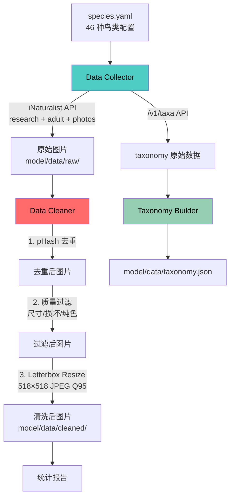
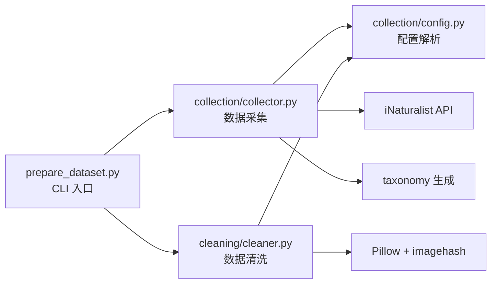

# 设计文档：Spec 27 — iNaturalist 鸟类数据采集与清洗

## 概述

本设计实现一个 Python 数据管道，从 iNaturalist 公开 API 批量采集 46 种目标鸟类的 research grade 成鸟观察照片，经过两层清洗（元数据硬过滤 + 视觉信号初筛）和 pHash 去重后，产出按物种分目录的清洗后图片池及 taxonomy 映射表。

### 设计决策

| 决策 | 选择 | 理由 |
|------|------|------|
| 图片处理库 | Pillow（PIL） | 轻量、无 OpenCV 依赖、满足 resize/质量检查需求 |
| 哈希去重 | imagehash（pHash） | 成熟库、感知哈希对视觉相似度敏感、Hamming distance 可配置阈值 |
| 配置格式 | YAML | 可读性好、支持注释、适合物种列表这种层级结构 |
| 并发下载 | concurrent.futures.ThreadPoolExecutor | 标准库、IO 密集型任务适合线程池、默认 10 线程 |
| API 限速 | time.sleep + 简单计时 | iNaturalist 官方建议 1 req/s，无需复杂令牌桶 |
| PBT 框架 | Hypothesis | Python 生态最成熟的 PBT 库、与 pytest 无缝集成 |
| 成鸟过滤 | term_id=1&term_value_id=2 | iNaturalist 注解系统：term_id=1 为 Life Stage，term_value_id=2 为 Adult |
| Resize 策略 | Letterbox（等比缩放 + 黑色填充） | 保持宽高比不变形，视觉模型对变形敏感 |

### 与 Spec 28 的边界

本 Spec 负责：
- 第一层：元数据硬过滤（API 参数级：research grade + 成鸟 + 有照片）
- 第二层：视觉信号初筛（短边 ≥ 800px、非纯色、可正常打开）
- pHash 去重（Hamming distance ≤ 8）
- 统一 letterbox resize 到 518×518
- taxonomy.json 生成

Spec 28 负责：
- 第三层：DINOv3 特征空间去噪（embedding 离群点检测 + 余弦相似度去重）
- 第四层：YOLO 裁切 + 数据增强

## 架构

### 数据流



### 模块依赖



## 组件与接口

### 模块划分（5 个源文件 + 1 个入口）

```
model/
├── config/
│   └── species.yaml          # 物种配置（46 种）
├── collection/
│   ├── __init__.py
│   ├── config.py             # 配置解析与验证
│   ├── collector.py          # iNaturalist API 采集 + taxonomy 获取
│   └── verify_taxon_ids.py   # taxon ID 验证工具
├── cleaning/
│   └── cleaner.py            # pHash 去重 + 质量过滤 + resize
├── tests/
│   ├── __init__.py
│   ├── conftest.py           # pytest fixtures（测试图片生成等）
│   ├── test_config.py        # 配置解析测试
│   ├── test_cleaner.py       # 清洗逻辑测试（含 PBT）
│   └── test_taxonomy.py      # taxonomy 格式验证测试
├── prepare_dataset.py        # CLI 入口（采集 + 清洗）
└── data/                     # 数据目录（.gitignore 排除）
    ├── raw/                  # 原始下载图片
    ├── cleaned/              # 清洗后图片（spec-27 最终产出，供 spec-28 使用）
    └── taxonomy.json         # 物种分类映射表
```

### config.py — 配置解析

```python
from dataclasses import dataclass, field

@dataclass
class GlobalConfig:
    image_size: int = 518
    phash_threshold: int = 8
    rate_limit: float = 1.0
    random_seed: int = 42
    download_threads: int = 10

@dataclass
class SpeciesEntry:
    taxon_id: int
    scientific_name: str
    common_name_cn: str = ""
    max_images: int = 200

@dataclass
class DatasetConfig:
    global_config: GlobalConfig
    species: list[SpeciesEntry]

def load_config(config_path: str) -> DatasetConfig:
    """加载并验证 species.yaml 配置文件。
    
    Raises:
        FileNotFoundError: 配置文件不存在
        ValueError: YAML 格式无效或缺少必填字段
    Returns:
        DatasetConfig: 解析后的配置对象（跳过缺少必填字段的物种并打印警告）
    """
    ...
```

### collector.py — 数据采集

```python
@dataclass
class CollectStats:
    """单物种采集统计"""
    species: str
    target: int
    downloaded: int = 0
    skipped: int = 0    # 断点续传跳过
    failed: int = 0

class DataCollector:
    def __init__(self, config: DatasetConfig, output_dir: str = "model/data/raw"):
        ...
    
    def collect_species(self, entry: SpeciesEntry) -> CollectStats:
        """采集单个物种的图片。
        
        流程：
        1. 分页调用 /v1/observations API（taxon_id + research + adult + photos）
        2. 提取每个 observation 的第一张照片 URL，替换为 original 尺寸
        3. 多线程并发下载图片到 raw/{scientific_name}/
        4. 支持断点续传（跳过已存在文件）
        """
        ...
    
    def fetch_taxonomy(self, entry: SpeciesEntry) -> dict:
        """调用 /v1/taxa/{taxon_id} 获取物种分类层级。
        
        返回包含 family、order、common_name_en 等字段的字典。
        缺少中文名时用英文名填充。
        """
        ...
    
    def collect_all(self, species_filter: str | None = None) -> list[CollectStats]:
        """采集所有物种（或指定物种），返回统计列表。"""
        ...
```

**iNaturalist API 调用参数**：

```python
# /v1/observations 查询参数
params = {
    "taxon_id": entry.taxon_id,
    "quality_grade": "research",
    "photos": "true",
    "per_page": 200,           # 每页最大 200
    "page": page,
    "order": "desc",
    "order_by": "votes",       # 高票数优先（质量更好）
    "term_id": 1,              # Life Stage 注解
    "term_value_id": 2,        # Adult（成鸟）
}

# /v1/taxa/{taxon_id} 获取分类层级
# 返回 results[0].ancestors 数组，每个元素含 rank、name、preferred_common_name
```

**照片 URL 处理**：
```python
# iNaturalist 照片 URL 格式示例：
# https://inaturalist-open-data.s3.amazonaws.com/photos/12345/square.jpg
# 替换 "square" 为 "original"（优先）或 "large"
url = photo["url"].replace("square", "original")
```

### cleaner.py — 数据清洗

```python
@dataclass
class CleanStats:
    """单物种清洗统计"""
    species: str
    input_count: int = 0
    after_dedup: int = 0
    removed_corrupt: int = 0
    removed_small: int = 0
    removed_lowvar: int = 0
    after_filter: int = 0
    output_count: int = 0      # resize 后最终数量

class DataCleaner:
    def __init__(self, config: DatasetConfig,
                 raw_dir: str = "model/data/raw",
                 cleaned_dir: str = "model/data/cleaned"):
        ...
    
    def deduplicate(self, image_paths: list[str], threshold: int) -> list[str]:
        """pHash 去重：计算所有图片的 pHash，移除 Hamming distance ≤ threshold 的重复图片。
        
        重复组中保留文件尺寸最大的一张。
        返回去重后的图片路径列表。
        """
        ...
    
    def filter_quality(self, image_paths: list[str]) -> tuple[list[str], dict]:
        """质量过滤：
        - 无法打开 → 移除
        - 短边 < 800px → 移除
        - 灰度图且标准差 < 10 → 移除
        
        返回 (通过的路径列表, 各原因移除计数字典)
        """
        ...
    
    def letterbox_resize(self, image: Image.Image, target_size: int) -> Image.Image:
        """Letterbox resize：等比缩放 + 黑色填充到 target_size × target_size。
        
        不变量：输出尺寸恒为 (target_size, target_size)。
        """
        ...
    
    def clean_species(self, species_name: str) -> CleanStats:
        """清洗单个物种：去重 → 质量过滤 → resize → 保存到 cleaned/"""
        ...
    
    def clean_all(self) -> list[CleanStats]:
        """清洗所有物种，返回统计列表。"""
        ...
```

### prepare_dataset.py — CLI 入口

```python
"""
用法：
    python model/prepare_dataset.py --config model/config/species.yaml
    python model/prepare_dataset.py --config model/config/species.yaml --skip-download
    python model/prepare_dataset.py --config model/config/species.yaml --species "Passer montanus"
"""
import argparse
import time

def main():
    parser = argparse.ArgumentParser(description="iNaturalist 鸟类数据采集与清洗")
    parser.add_argument("--config", required=True, help="物种配置文件路径")
    parser.add_argument("--skip-download", action="store_true", help="跳过下载，直接清洗")
    parser.add_argument("--species", type=str, help="指定单个物种（scientific_name）")
    args = parser.parse_args()
    
    # 1. 加载配置
    # 2. 采集（除非 --skip-download）
    # 3. 清洗（去重 → 质量过滤 → resize）
    # 4. 生成 taxonomy.json
    # 5. 打印统计报告
```

## 数据模型

### species.yaml 配置结构

```yaml
global:
  image_size: 518          # 目标图片尺寸（正方形边长）
  phash_threshold: 8       # pHash 去重阈值（Hamming distance）
  rate_limit: 1.0          # API 请求间隔（秒）
  random_seed: 42          # 随机种子（划分可复现）
  download_threads: 10     # 图片下载并发线程数

species:
  - taxon_id: 144814                          # iNaturalist taxon ID
    scientific_name: "Pterorhinus sannio"     # 学名（目录名）
    common_name_cn: "白颊噪鹛"                # 中文名
    max_images: 2000                          # 最大采集数量（A 类）
  # ... 共 46 个物种
```

### taxonomy.json 输出结构

```json
{
  "species": {
    "Pterorhinus sannio": {
      "taxon_id": 144814,
      "scientific_name": "Pterorhinus sannio",
      "common_name_cn": "白颊噪鹛",
      "common_name_en": "White-browed Laughingthrush",
      "family": "Leiothrichidae",
      "family_cn": "噪鹛科",
      "order": "Passeriformes",
      "order_cn": "雀形目",
      "class_label": 0
    }
  },
  "label_to_species": {
    "0": "Pterorhinus sannio"
  }
}
```

### 目录结构

```
model/data/
├── raw/                              # 原始下载（按学名分目录）
│   ├── Pterorhinus sannio/
│   │   ├── 123456_789.jpg            # {observation_id}_{photo_id}.jpg
│   │   └── ...
│   └── Passer montanus/
├── cleaned/                          # 清洗后（去重 + 过滤 + resize），spec-27 最终产出
│   ├── Pterorhinus sannio/
│   └── Passer montanus/
└── taxonomy.json                     # 物种分类映射表
```


## 正确性属性

*正确性属性是在系统所有有效执行中都应成立的特征或行为——本质上是对系统应做什么的形式化陈述。属性是人类可读规格与机器可验证正确性保证之间的桥梁。*

### Property 1: 去重后不变量

*For any* 图片集合经过 pHash 去重后，结果集中同一物种内任意两张图片的 pHash Hamming distance SHALL 大于 `phash_threshold`。

**Validates: Requirements 3.5**

### Property 2: 质量过滤尺寸规则

*For any* 随机尺寸的有效图片，经过 `filter_quality` 后，短边 < 800px 的图片 SHALL 被移除，短边 ≥ 800px 且非损坏/非纯色的图片 SHALL 被保留。

**Validates: Requirements 4.2**

### Property 3: Letterbox resize 输出不变量

*For any* 随机宽高（≥ 1px）的输入图片和任意 target_size，`letterbox_resize` 的输出尺寸 SHALL 恒为 `(target_size, target_size)`，且输出图片中非填充区域的宽高比 SHALL 与原图宽高比一致（容差 ±1px）。

**Validates: Requirements 5.1, 5.2, 5.4**

### Property 4: Taxonomy 结构一致性

*For any* 物种列表（长度 ≥ 1），`build_taxonomy` 生成的 taxonomy 中 `class_label` SHALL 从 0 开始连续编号，且 `label_to_species[str(label)]` SHALL 等于对应物种的 `scientific_name`（双向映射一致）。

**Validates: Requirements 7.2, 7.4**

## 错误处理

| 错误场景 | 处理策略 | 对应需求 |
|----------|---------|---------|
| species.yaml 不存在 | 打印错误信息，`sys.exit(1)` | 1.4 |
| species.yaml 格式无效（非法 YAML） | 打印解析错误详情，`sys.exit(1)` | 1.4 |
| 物种缺少 taxon_id 或 scientific_name | 跳过该物种，打印警告，继续处理其他物种 | 1.5 |
| iNaturalist API 请求失败（网络/5xx） | 重试 3 次（指数退避），全部失败则跳过当前页，记录错误 | 2.5 |
| 单张图片下载失败（超时/4xx/5xx） | 记录错误日志，`failed += 1`，继续下一张 | 2.5 |
| API 返回结果不足 max_images | 下载所有可用结果，打印实际数量 | 2.7 |
| 图片文件损坏（Pillow 无法打开） | 移除该图片，`removed_corrupt += 1` | 4.1 |
| 图片短边 < 800px | 移除该图片，`removed_small += 1` | 4.2 |
| 图片为纯色/低方差 | 移除该图片，`removed_lowvar += 1` | 4.3 |
| 某物种清洗后图片数 < 30 | 打印警告，继续划分 | 6.5 |
| 某物种最终图片数为 0 | 打印错误信息，跳过该物种，继续处理其他物种 | 9.5 |
| taxa API 缺少中文名 | 用英文名填充 common_name_cn，打印警告 | 7.5 |
| 磁盘空间不足 | 捕获 OSError，打印错误信息并退出 | — |

### 重试策略

API 请求失败时采用指数退避重试：

```python
import time

def retry_request(func, max_retries=3, base_delay=2.0):
    for attempt in range(max_retries):
        try:
            return func()
        except requests.RequestException as e:
            if attempt == max_retries - 1:
                raise
            delay = base_delay * (2 ** attempt)
            logging.warning(f"请求失败，{delay}s 后重试 ({attempt+1}/{max_retries}): {e}")
            time.sleep(delay)
```

## 测试策略

### 双轨测试方法

- **单元测试（pytest）**：验证具体例子、边界条件、错误处理
- **属性测试（Hypothesis + pytest）**：验证通用属性在所有输入上成立

两者互补：单元测试捕获具体 bug，属性测试验证通用正确性。

### PBT 配置

- 框架：[Hypothesis](https://hypothesis.readthedocs.io/)（Python 生态最成熟的 PBT 库）
- 每个属性测试最少 100 次迭代：`@settings(max_examples=100)`
- 每个属性测试必须用注释引用设计文档中的属性编号
- 标签格式：`# Feature: inat-data-collection, Property {N}: {property_text}`

### 依赖

```
# requirements.txt 新增
requests>=2.31
Pillow>=10.0
imagehash>=4.3
PyYAML>=6.0
hypothesis>=6.0    # PBT
```

### 测试文件划分

| 测试文件 | 覆盖内容 | 测试类型 |
|---------|---------|---------|
| test_config.py | 配置解析：有效/无效/缺字段 | 单元测试（EXAMPLE + EDGE_CASE） |
| test_cleaner.py | pHash 去重、质量过滤、letterbox resize | 单元测试 + PBT（Property 1, 2, 3） |
| test_taxonomy.py | taxonomy 字段验证、反向映射一致性 | 单元测试 + PBT（Property 4） |

### 属性测试实现示例

```python
# test_cleaner.py
from hypothesis import given, settings
from hypothesis.strategies import integers, tuples

# Feature: inat-data-collection, Property 3: Letterbox resize 输出不变量
@given(
    size=tuples(integers(min_value=1, max_value=4000), integers(min_value=1, max_value=4000)),
    target=integers(min_value=32, max_value=1024)
)
@settings(max_examples=100)
def test_letterbox_resize_output_size(size, target):
    """对于任意尺寸输入，letterbox_resize 输出恒为 target × target"""
    img = Image.new("RGB", size, color="red")
    result = letterbox_resize(img, target)
    assert result.size == (target, target)
```

### 离线测试保证

所有测试 SHALL NOT 依赖网络：
- iNaturalist API 调用使用 `unittest.mock.patch` 或 `responses` 库 mock
- 图片文件使用 `Pillow` 在内存中生成测试图片（`Image.new()`）
- 文件系统操作使用 `tmp_path` fixture（pytest 内置）

### 验证命令

```bash
# 激活 venv
source .venv-raspi-eye/bin/activate

# 运行全部测试（离线）
pytest model/tests/ -v

# 仅运行 PBT 测试
pytest model/tests/ -v -k "hypothesis or property"

# 端到端采集（需要网络，在 EC2 上运行）
python model/prepare_dataset.py --config model/config/species.yaml
```
