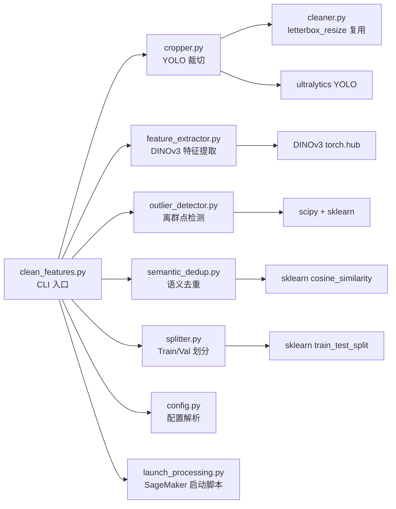

# 设计文档：Spec 28 — DINOv3 特征空间深度清洗

## 概述

本设计实现一个四层 Python 数据清洗管道，对 Spec 27 产出的清洗后图片池进行特征空间级别的深度清洗：

1. **YOLO 裁切**（物理聚焦）：YOLOv11 检测鸟体 → 裁切 + 20% padding → letterbox resize 518×518
2. **DINOv3 特征提取**（神经编码）：frozen ViT-L/16 backbone → class token 特征向量 → .npy 持久化
3. **离群点检测 + 语义去重**（空间净化）：per-class Mahalanobis distance 离群点移除 + 余弦相似度语义去重
4. **Train/Val 划分**（分流）：80/20 分层随机划分 → ImageFolder 格式输出

管道运行在 SageMaker Processing Job（ml.g4dn.xlarge GPU 实例）上，同时支持本地运行（自动检测 `/opt/ml/processing/`）。

### 设计决策

| 决策 | 选择 | 理由 |
|------|------|------|
| DINOv3 变体 | `dinov3_vitl16`（ViT-L/16，300M 参数） | patch size 16，输入 518×518，特征质量高且显存可控（ml.g4dn.xlarge 16GB） |
| DINOv3 加载方式 | `torch.hub.load(REPO_DIR, 'dinov3_vitl16', source='local', weights=...)` | 官方推荐方式，需本地 clone repo + 下载权重文件 |
| YOLO 模型 | `yolo11x.pt`（ultralytics） | COCO 预训练，class 14 = bird，x 版本精度最高 |
| 离群点检测 | per-class Mahalanobis distance + PCA 降维保护 | 考虑特征分布协方差，比欧氏距离更适合高维空间 |
| 语义去重保留策略 | 距类中心最近的样本 | 比文件大小更合理，距中心近 = 更具代表性 |
| 混合精度推理 | `torch.autocast('cuda')` | 提升吞吐量、降低显存占用 |
| 特征持久化 | `.npy` 文件 | numpy 原生格式，读写快，支持 `--skip-extract` 复用 |
| PBT 框架 | Hypothesis | Python 生态最成熟的 PBT 库，与 pytest 无缝集成 |
| 图片处理库 | Pillow + torchvision transforms | 与 Spec 27 一致，不引入 OpenCV |

### 与 Spec 27 的边界

- **输入**：Spec 27 产出的 `model/data/cleaned/{species}/*.jpg`（518×518）和 `model/data/taxonomy.json`（只读）
- **输出**：`model/data/train/{species}/*.jpg` + `model/data/val/{species}/*.jpg`（ImageFolder 格式）
- **复用**：Spec 27 的 `letterbox_resize` 函数（`model/cleaning/cleaner.py`）

### 禁止项（Design 层）

- SHALL NOT 对 DINOv3 backbone 做任何参数更新（frozen，仅用于特征提取）
- SHALL NOT 使用 DINOv2 替代 DINOv3（用户明确要求 `facebookresearch/dinov3`）
- SHALL NOT 使用 OpenCV 做图片处理（使用 Pillow + torchvision transforms）
- SHALL NOT 在特征提取时使用 patch tokens 或 register tokens（仅使用 class token）
- SHALL NOT 使用全局 Mahalanobis distance（必须 per-class 计算）
- SHALL NOT 在代码中硬编码 AWS 凭证、密钥或 Role ARN
- SHALL NOT 在日志中打印密钥、证书内容、token 等敏感信息

## 架构

### 数据流

```mermaid
flowchart TD
    A[model/data/cleaned/<br/>Spec 27 产出<br/>518×518 JPEG] --> B[YOLO 裁切<br/>yolo11x.pt]
    B -->|检测到鸟体<br/>裁切+20%padding<br/>→ letterbox 518×518| C[裁切后图片<br/>model/data/cropped/]
    B -->|未检测到鸟体<br/>conf < 0.3| D[丢弃列表]
    C --> E[DINOv3 特征提取<br/>dinov3_vitl16<br/>frozen backbone]
    E -->|class token 向量| F[特征向量<br/>model/data/features/<br/>{species}.npy]
    F --> G[离群点检测<br/>per-class Mahalanobis<br/>+ PCA 降维保护]
    G -->|移除离群样本| H[语义去重<br/>cosine similarity ≥ 0.95]
    H -->|保留距中心最近| I[清洗后图片集]
    I --> J[Train/Val 划分<br/>80/20 分层随机<br/>seed=42]
    J --> K[model/data/train/<br/>{species}/*.jpg]
    J --> L[model/data/val/<br/>{species}/*.jpg]

    style B fill:#ff6b6b,color:#000
    style E fill:#4ecdc4,color:#000
    style G fill:#ffd93d,color:#000
    style H fill:#ffd93d,color:#000
    style J fill:#96ceb4,color:#000
```

### 模块依赖




## 组件与接口

### 模块划分（6 个源文件 + 2 个入口脚本 + 1 个 IAM 脚本）

```
model/
├── config/
│   └── species.yaml              # 物种配置（扩展 outlier_alpha 字段）
├── src/
│   ├── __init__.py               # 已有
│   ├── config.py                 # 已有，扩展 SpeciesEntry 增加 outlier_alpha
│   ├── cleaner.py                # 已有，复用 letterbox_resize
│   ├── cropper.py                # 新增：YOLO 鸟体裁切
│   ├── feature_extractor.py      # 新增：DINOv3 特征提取
│   ├── outlier_detector.py       # 新增：Mahalanobis 离群点检测
│   ├── semantic_dedup.py         # 新增：余弦相似度语义去重
│   └── splitter.py               # 新增：Train/Val 分层划分
├── tests/
│   ├── __init__.py               # 已有
│   ├── conftest.py               # 已有，扩展 fixtures
│   ├── test_cropper.py           # 新增：裁切逻辑测试
│   ├── test_feature_cleaning.py  # 新增：离群点 + 语义去重 + 划分 PBT
│   └── ...                       # 已有测试不修改
├── clean_features.py             # 端到端清洗 CLI 入口（SageMaker 容器内执行）
├── launch_processing.py          # SageMaker Processing Job 启动脚本（自动打包代码）
└── data/                         # 数据目录（.gitignore 排除）
    ├── cleaned/                  # Spec 27 产出（只读输入）
    ├── cropped/                  # YOLO 裁切后（中间产物）
    ├── features/                 # DINOv3 特征向量 .npy
    ├── train/                    # 最终输出：训练集（ImageFolder）
    └── val/                      # 最终输出：验证集（ImageFolder）
scripts/
└── create-sagemaker-role.sh      # 新增：IAM Role 创建脚本
```

### config.py 扩展

在现有 `SpeciesEntry` 中增加可选的 `outlier_alpha` 字段：

```python
@dataclass
class SpeciesEntry:
    """单个物种配置。"""
    taxon_id: int
    scientific_name: str
    common_name_cn: str = ""
    max_images: int = 200
    outlier_alpha: float | None = None  # 新增：per-species 离群点阈值，None 时使用全局默认 0.975
```

`load_config` 函数无需修改，已有的 `**{k: v for k, v in entry.items() if k in SpeciesEntry.__dataclass_fields__}` 模式会自动处理新字段。

### cropper.py — YOLO 鸟体裁切

```python
from dataclasses import dataclass

BIRD_CLASS_ID = 14  # COCO class 14 = bird

@dataclass
class CropStats:
    """裁切统计。"""
    species: str = ""
    total: int = 0
    cropped: int = 0
    discarded: int = 0  # 未检测到鸟体

def crop_bird(image_path: str, model, conf_threshold: float = 0.3,
              padding: float = 0.2) -> "Image.Image | None":
    """YOLO 鸟体裁切。
    
    检测 class=14（bird）的 bounding box，取置信度最高的，
    扩展 20% padding 后裁切，letterbox resize 到 518×518。
    未检测到鸟体时返回 None（丢弃）。
    """
    ...

def crop_species(species_name: str, input_dir: str, output_dir: str,
                 model, conf_threshold: float = 0.3,
                 padding: float = 0.2) -> CropStats:
    """裁切单个物种的所有图片。"""
    ...
```

**padding 计算逻辑**：
```python
# bbox 坐标
x1, y1, x2, y2 = best.xyxy[0].tolist()
w, h = x2 - x1, y2 - y1

# 扩展 padding（clamp 到图片边界）
x1 = max(0, x1 - w * padding)
y1 = max(0, y1 - h * padding)
x2 = min(img.width, x2 + w * padding)
y2 = min(img.height, y2 + h * padding)

# 裁切 + letterbox resize
cropped = img.crop((int(x1), int(y1), int(x2), int(y2)))
result = letterbox_resize(cropped, 518)  # 复用 Spec 27
```

### feature_extractor.py — DINOv3 特征提取

```python
from dataclasses import dataclass

@dataclass
class ExtractStats:
    """特征提取统计。"""
    species: str = ""
    num_images: int = 0
    feature_dim: int = 0
    device: str = "cpu"

class FeatureExtractor:
    def __init__(self, repo_dir: str, weights_path: str,
                 batch_size: int = 32, num_workers: int = 4):
        """初始化 DINOv3 特征提取器。
        
        Args:
            repo_dir: DINOv3 本地 clone 路径
            weights_path: 预训练权重文件路径或 URL
            batch_size: 批量推理大小
            num_workers: DataLoader 工作线程数
        """
        ...
    
    def _load_model(self) -> torch.nn.Module:
        """加载 DINOv3 ViT-L/16 frozen backbone。
        
        torch.hub.load(repo_dir, 'dinov3_vitl16', source='local', weights=weights_path)
        model.eval()，torch.no_grad() 上下文中使用。
        自动检测 GPU，不可用时回退 CPU。
        """
        ...
    
    def _make_transform(self) -> transforms.Compose:
        """DINOv3 标准预处理（LVD-1689M 权重）。
        
        Resize(518, 518) → ToTensor → Normalize(ImageNet mean/std)
        """
        ...
    
    def extract_species(self, species_name: str, image_dir: str,
                        output_dir: str) -> ExtractStats:
        """提取单个物种的所有图片特征向量，保存为 .npy。
        
        使用 DataLoader 批量加载，torch.autocast('cuda') 混合精度推理。
        输出：output_dir/{species_name}.npy，shape (N, feature_dim)
        同时保存路径映射：output_dir/{species_name}_paths.json
        """
        ...
```

**DINOv3 预处理 transform**（基于官方 README）：
```python
from torchvision.transforms import v2

def _make_transform(self):
    return v2.Compose([
        v2.ToImage(),
        v2.Resize((518, 518), antialias=True),
        v2.ToDtype(torch.float32, scale=True),
        v2.Normalize(mean=(0.485, 0.456, 0.406), std=(0.229, 0.224, 0.225)),
    ])
```

**混合精度推理**：
```python
with torch.no_grad():
    with torch.autocast('cuda', dtype=torch.float16):
        for batch in dataloader:
            batch = batch.to(self.device)
            features = self.model(batch)  # class token
            all_features.append(features.cpu().numpy())
```

### outlier_detector.py — 离群点检测

```python
from dataclasses import dataclass

@dataclass
class OutlierStats:
    """离群点检测统计。"""
    species: str = ""
    input_count: int = 0
    removed_count: int = 0
    kept_count: int = 0
    used_pca: bool = False
    used_cosine_fallback: bool = False
    mean_distance: float = 0.0
    removal_ratio: float = 0.0

def detect_outliers(features: np.ndarray, alpha: float = 0.975) -> np.ndarray:
    """Per-class Mahalanobis distance 离群点检测。
    
    Args:
        features: (N, D) 特征矩阵
        alpha: χ² 分位数（默认 0.975）
    
    Returns:
        布尔数组，True = 正常样本，False = 离群点
    
    策略：
    - N < 10：回退余弦距离 + IQR
    - N < 1.5D：PCA 降维到 min(128, N-1) 维
    - 否则：直接 Mahalanobis distance
    """
    ...
```

**三条路径的判断逻辑**：
```python
N, D = features.shape

if N < 10:
    # 路径 1：余弦距离 + IQR
    centroid = np.mean(features, axis=0)
    cos_dist = 1 - cosine_similarity(features, centroid.reshape(1, -1)).flatten()
    q1, q3 = np.percentile(cos_dist, [25, 75])
    iqr = q3 - q1
    return cos_dist <= q3 + 1.5 * iqr

if N < 1.5 * D:
    # 路径 2：PCA 降维 → Mahalanobis
    pca = PCA(n_components=min(128, N - 1))
    features = pca.fit_transform(features)

# 路径 3（或路径 2 降维后）：Mahalanobis distance
mean = np.mean(features, axis=0)
cov = np.cov(features, rowvar=False)
cov += np.eye(cov.shape[0]) * 1e-6  # 正则化
cov_inv = np.linalg.inv(cov)
d = features.shape[1]
threshold = chi2.ppf(alpha, df=d)
distances = np.array([mahalanobis(f, mean, cov_inv) ** 2 for f in features])
return distances <= threshold
```

### semantic_dedup.py — 语义去重

```python
@dataclass
class DedupStats:
    """语义去重统计。"""
    species: str = ""
    input_count: int = 0
    removed_count: int = 0
    kept_count: int = 0

def semantic_deduplicate(features: np.ndarray, paths: list[str],
                         threshold: float = 0.95) -> tuple[np.ndarray, list[str]]:
    """基于余弦相似度的语义去重。
    
    重复组中保留距类中心最近（余弦距离最小）的样本。
    
    Args:
        features: (N, D) 特征矩阵
        paths: 对应的图片路径列表
        threshold: 余弦相似度阈值（≥ threshold 视为重复）
    
    Returns:
        (去重后的特征矩阵, 去重后的路径列表)
    """
    ...
```

### splitter.py — Train/Val 划分

```python
@dataclass
class SplitStats:
    """划分统计。"""
    species: str = ""
    total: int = 0
    train_count: int = 0
    val_count: int = 0

def split_dataset(image_paths: list[str], test_size: float = 0.2,
                  random_state: int = 42) -> tuple[list[str], list[str]]:
    """分层随机划分 train/val。
    
    图片数 < 5 时全部放入 train，val 为空。
    """
    if len(image_paths) < 5:
        return list(image_paths), []
    train, val = train_test_split(image_paths, test_size=test_size,
                                   random_state=random_state)
    return train, val

def split_and_copy(species_name: str, image_paths: list[str],
                   train_dir: str, val_dir: str,
                   random_state: int = 42) -> SplitStats:
    """划分并复制图片到 ImageFolder 目录。"""
    ...
```

### clean_features.py — CLI 入口

```python
"""
端到端特征空间清洗管道。

用法：
    python model/clean_features.py --config model/config/species.yaml
    python model/clean_features.py --config model/config/species.yaml --skip-crop
    python model/clean_features.py --config model/config/species.yaml --skip-extract
    python model/clean_features.py --config model/config/species.yaml --species "Passer montanus"

SageMaker Processing Job 中自动检测 /opt/ml/processing/ 路径。
"""
import argparse
import os

def detect_paths() -> dict:
    """自动检测运行环境，返回输入/输出路径字典。
    
    SageMaker 模式：/opt/ml/processing/input/cleaned/ → /opt/ml/processing/output/
    本地模式：model/data/cleaned/ → model/data/
    """
    sagemaker_base = "/opt/ml/processing"
    if os.path.isdir(sagemaker_base):
        return {
            "cleaned_dir": f"{sagemaker_base}/input/cleaned",
            "config_path": f"{sagemaker_base}/input/config/species.yaml",
            "cropped_dir": f"{sagemaker_base}/output/cropped",
            "features_dir": f"{sagemaker_base}/output/features",
            "train_dir": f"{sagemaker_base}/output/train",
            "val_dir": f"{sagemaker_base}/output/val",
            "report_dir": f"{sagemaker_base}/output/report",
        }
    return {
        "cleaned_dir": "model/data/cleaned",
        "config_path": None,  # 从 CLI --config 参数获取
        "cropped_dir": "model/data/pipeline/cropped",
        "features_dir": "model/data/pipeline/features",
        "train_dir": "model/data/dataset/train",
        "val_dir": "model/data/dataset/val",
        "report_dir": "model/data/pipeline/report",
    }

def main():
    parser = argparse.ArgumentParser(description="DINOv3 特征空间深度清洗")
    parser.add_argument("--config", required=True, help="物种配置文件路径")
    parser.add_argument("--skip-crop", action="store_true", help="跳过 YOLO 裁切")
    parser.add_argument("--skip-extract", action="store_true", help="跳过特征提取（复用 .npy）")
    parser.add_argument("--species", type=str, help="指定单个物种")
    parser.add_argument("--dinov3-repo", type=str, default="third_party/dinov3",
                        help="DINOv3 本地 clone 路径")
    parser.add_argument("--dinov3-weights", type=str, help="DINOv3 权重文件路径")
    parser.add_argument("--batch-size", type=int, default=32, help="特征提取 batch size")
    parser.add_argument("--cosine-threshold", type=float, default=0.95,
                        help="语义去重余弦相似度阈值")
    args = parser.parse_args()
    
    # 1. 检测路径 + 加载配置
    # 2. YOLO 裁切（除非 --skip-crop）
    # 3. DINOv3 特征提取（除非 --skip-extract）
    # 4. 离群点检测
    # 5. 语义去重
    # 6. Train/Val 划分
    # 7. 打印统计报告
```

### launch_processing.py — SageMaker 启动脚本

```python
"""
SageMaker Processing Job 启动脚本（自动打包代码）。

自动将 model/ 目录打包为 sourcedir.tar.gz 上传到 S3，
通过 Processing Job 的 code 输入通道下载到容器内，
ContainerEntrypoint 解压后安装依赖并执行清洗脚本。
不再需要手动 aws s3 sync 同步代码。

用法：
    python model/launch_processing.py \
        --s3-bucket my-bucket \
        --role arn:aws:iam::xxx:role/SageMakerRole
"""
import argparse
import os
import tarfile
import tempfile

def pack_sourcedir(model_dir: str) -> str:
    """将 model/ 目录打包为 sourcedir.tar.gz（排除 data/tests/models/ 等）。"""
    ...

def main():
    parser = argparse.ArgumentParser(description="启动 SageMaker Processing Job")
    parser.add_argument("--s3-bucket", required=True, help="S3 桶名")
    parser.add_argument("--role", type=str, help="SageMaker Execution Role ARN")
    parser.add_argument("--instance-type", default="ml.g4dn.xlarge", help="GPU 实例类型")
    parser.add_argument("--wait", action="store_true", help="等待 Job 完成")
    parser.add_argument("--species", type=str, help="指定单个物种（用于测试）")
    args = parser.parse_args()
    
    role = args.role or os.environ.get("SAGEMAKER_ROLE_ARN")
    if not role:
        print("错误: 必须通过 --role 或 SAGEMAKER_ROLE_ARN 环境变量指定 Role ARN")
        sys.exit(1)
    
    # 1. 打包 model/ 为 sourcedir.tar.gz 并上传到 S3
    # 2. 从 Secrets Manager 获取 HF_TOKEN
    # 3. 配置 S3 输入通道（cleaned/ + config/ + code tar.gz）和输出通道
    # 4. ContainerEntrypoint: 解压 tar → pip install → 执行 clean_features.py
    # 5. 提交 Job 并打印 Job 名称 + CloudWatch Logs 链接
```

### scripts/create-sagemaker-role.sh — IAM Role 创建脚本

```bash
#!/bin/bash
# 创建 SageMaker Processing Job 所需的 IAM Role
# 用法: ./scripts/create-sagemaker-role.sh <s3-bucket-name>

BUCKET_NAME="${1:?用法: $0 <s3-bucket-name>}"
ROLE_NAME="raspi-eye-sagemaker-processing-role"

# 1. 创建信任策略（sagemaker.amazonaws.com AssumeRole）
# 2. 创建 Role
# 3. 附加最小权限策略：
#    - S3 读写（仅限指定桶）
#    - CloudWatch Logs（Processing Job 日志）
#    - ECR 拉取镜像（PyTorch 预构建容器）
# 4. 输出 Role ARN
```


## 数据模型

### species.yaml 扩展

在现有配置基础上，物种条目增加可选的 `outlier_alpha` 字段：

```yaml
species:
  - taxon_id: 11901
    scientific_name: "Hirundo rustica"
    common_name_cn: "家燕"
    max_images: 1500
    outlier_alpha: 0.99    # 姿态多样性高，放宽离群点阈值
```

### 目录结构（运行后）

```
model/data/
├── cleaned/                          # Spec 27 产出（只读输入）
│   ├── Pterorhinus sannio/
│   └── Passer montanus/
├── pipeline/                         # 清洗管道中间产物
│   ├── cropped/                      # YOLO 裁切后
│   │   ├── Pterorhinus sannio/
│   │   └── Passer montanus/
│   ├── features/                     # DINOv3 特征向量
│   │   ├── Pterorhinus sannio.npy    # shape (N, feature_dim)
│   │   ├── Pterorhinus sannio_paths.json
│   │   └── Passer montanus.npy
│   └── report/                       # 清洗统计报告
│       └── cleaning_report.json
├── dataset/                          # 训练就绪数据（ImageFolder 格式）
│   ├── train/
│   │   ├── Pterorhinus sannio/
│   │   │   ├── 123456_789.jpg
│   │   │   └── ...
│   │   └── Passer montanus/
│   └── val/
│       ├── Pterorhinus sannio/
│       └── Passer montanus/
└── taxonomy.json                     # Spec 27 产出（只读）
```

### 特征向量 .npy 格式

```python
# 保存
features = np.array(all_features)  # shape: (N, feature_dim)
np.save(f"model/data/features/{species_name}.npy", features)

# 路径映射（与特征向量行索引对应）
import json
with open(f"model/data/features/{species_name}_paths.json", "w") as f:
    json.dump(image_paths, f)

# 加载
features = np.load(f"model/data/features/{species_name}.npy")
with open(f"model/data/features/{species_name}_paths.json") as f:
    paths = json.load(f)
```

### 清洗统计报告格式

```json
{
  "total_species": 46,
  "total_input": 52000,
  "total_output": 38000,
  "total_train": 30400,
  "total_val": 7600,
  "elapsed_seconds": 1200,
  "per_species": {
    "Pterorhinus sannio": {
      "input": 1800,
      "after_crop": 1650,
      "crop_discarded": 150,
      "after_outlier": 1580,
      "outlier_removed": 70,
      "after_dedup": 1520,
      "dedup_removed": 60,
      "train": 1216,
      "val": 304,
      "used_pca": false,
      "used_cosine_fallback": false,
      "mean_mahalanobis": 45.2,
      "outlier_alpha": 0.975
    }
  }
}
```

### SageMaker Processing Job 路径映射

S3 目录按职责分层：`bird-data/`（源数据）、`pipeline/`（清洗中间产物）、`dataset/`（训练就绪）。

| 本地路径 | SageMaker 路径 | S3 路径 |
|---------|---------------|---------|
| `model/data/cleaned/` | `/opt/ml/processing/input/cleaned/` | `s3://{bucket}/bird-data/cleaned/` |
| `model/config/species.yaml` | `/opt/ml/processing/input/config/species.yaml` | `s3://{bucket}/bird-data/config/species.yaml` |
| `model/data/pipeline/cropped/` | `/opt/ml/processing/output/cropped/` | `s3://{bucket}/pipeline/cropped/` |
| `model/data/pipeline/features/` | `/opt/ml/processing/output/features/` | `s3://{bucket}/pipeline/features/` |
| `model/data/pipeline/report/` | `/opt/ml/processing/output/report/` | `s3://{bucket}/pipeline/report/` |
| `model/data/dataset/train/` | `/opt/ml/processing/output/train/` | `s3://{bucket}/dataset/train/` |
| `model/data/dataset/val/` | `/opt/ml/processing/output/val/` | `s3://{bucket}/dataset/val/` |


## 正确性属性

*正确性属性是在系统所有有效执行中都应成立的特征或行为——本质上是对系统应做什么的形式化陈述。属性是人类可读规格与机器可验证正确性保证之间的桥梁。*

### Property 1: YOLO 裁切 padding 边界安全 + 输出尺寸不变量

*For any* 有效图片尺寸（w ≥ 1, h ≥ 1）和任意 bounding box（在图片范围内），经过 20% padding 扩展后的裁切区域 SHALL 不超出图片边界，且裁切后经 letterbox resize 的输出尺寸 SHALL 恒为 518×518。

**Validates: Requirements 1.2, 1.6**

### Property 2: 特征向量 .npy 保存/加载 round trip

*For any* 随机形状的 float32 特征矩阵（N ≥ 1, D ≥ 1），保存为 `.npy` 文件后重新加载 SHALL 得到与原矩阵完全相同的值（bit-exact）。

**Validates: Requirements 2.6**

### Property 3: 离群点检测正确识别注入的离群样本

*For any* 从多元正态分布 N(μ, Σ) 采样的正常特征矩阵（N ≥ 10），加入人工注入的远离中心的离群样本后，`detect_outliers` SHALL 将注入的离群样本标记为离群点。当 N < 1.5D 时 SHALL 自动触发 PCA 降维路径。

**Validates: Requirements 3.2, 3.4**

### Property 4: 语义去重后余弦相似度不变量

*For any* 特征向量集合（N ≥ 2, D ≥ 1）经过 `semantic_deduplicate` 后，结果集中任意两个向量的余弦相似度 SHALL 小于 `cosine_threshold`。

**Validates: Requirements 4.5**

### Property 5: Train/Val 划分无交集 + 比例约束

*For any* 长度 ≥ 5 的图片路径列表，`split_dataset` 划分后 train 集和 val 集 SHALL 无交集（`set(train) ∩ set(val) == ∅`），且 val 集比例 SHALL 在 15%-25% 范围内。

**Validates: Requirements 5.1, 5.6, 5.7**

### Property 6: Train/Val 划分可复现

*For any* 图片路径列表和固定 seed，对同一输入调用 `split_dataset` 两次 SHALL 产生完全相同的 train 和 val 列表。

**Validates: Requirements 5.2**


## 错误处理

| 错误场景 | 处理策略 | 对应需求 |
|----------|---------|---------|
| YOLO 未检测到鸟体（无 class=14 或 conf < 0.3） | 丢弃该图片，记录到丢弃列表，`discarded += 1` | 1.4 |
| YOLO 模型文件不存在 | 打印错误信息，`sys.exit(1)` | 1.1 |
| DINOv3 repo 或权重文件不存在 | 打印错误信息，`sys.exit(1)` | 2.1 |
| GPU 不可用 | 回退 CPU 推理，打印警告 | 2.7 |
| 图片文件损坏（Pillow 无法打开） | 跳过该图片，记录错误 | — |
| 某物种裁切后图片数为 0 | 打印错误信息，跳过该物种，继续处理其他物种 | 6.8 |
| 某物种清洗后图片数 < 20 | 打印警告，继续处理 | 6.9 |
| 某物种图片数 < 5（划分时） | 全部放入 train，val 为空，打印警告 | 5.4 |
| 某物种图片数 < 10（离群点检测时） | 回退余弦距离 + IQR | 3.6 |
| 协方差矩阵秩亏（N < 1.5D） | PCA 降维到 min(128, N-1) 维 | 3.2 |
| SageMaker Role ARN 未指定 | 打印错误信息，`sys.exit(1)` | 7.9 |
| S3 桶不存在或无权限 | SageMaker SDK 抛出异常，打印错误信息 | 7.5 |
| .npy 特征文件不存在（--skip-extract 时） | 打印错误信息，提示先运行特征提取 | 6.5 |
| 磁盘空间不足 | 捕获 OSError，打印错误信息并退出 | — |

## 测试策略

### 双轨测试方法

- **单元测试（pytest）**：验证具体例子、边界条件、错误处理
- **属性测试（Hypothesis + pytest）**：验证通用属性在所有输入上成立

两者互补：单元测试捕获具体 bug，属性测试验证通用正确性。

### PBT 配置

- 框架：[Hypothesis](https://hypothesis.readthedocs.io/)
- 每个属性测试最少 100 次迭代：`@settings(max_examples=100)`
- 每个属性测试必须用注释引用设计文档中的属性编号
- 标签格式：`# Feature: feature-space-cleaning, Property {N}: {property_text}`

### 依赖

```
# requirements.txt 新增（在 Spec 27 基础上）
torch>=2.1
torchvision>=0.16
ultralytics>=8.0
scikit-learn>=1.3
scipy>=1.11
sagemaker>=2.200       # SageMaker Python SDK（仅 launch_processing.py 使用）
```

### 测试文件划分

| 测试文件 | 覆盖内容 | 测试类型 |
|---------|---------|---------|
| test_cropper.py | YOLO 裁切：padding 计算、边界 clamp、输出尺寸、无检测丢弃 | 单元测试 + PBT（Property 1） |
| test_feature_cleaning.py | 离群点检测、语义去重、train/val 划分、.npy round trip | 单元测试 + PBT（Property 2, 3, 4, 5, 6） |

### 属性测试实现示例

```python
# test_cropper.py
from hypothesis import given, settings
from hypothesis.strategies import integers, tuples, floats

# Feature: feature-space-cleaning, Property 1: YOLO 裁切 padding 边界安全 + 输出尺寸不变量
@given(
    img_size=tuples(integers(min_value=50, max_value=4000), integers(min_value=50, max_value=4000)),
    bbox_ratios=tuples(
        floats(min_value=0.05, max_value=0.45),  # x1 ratio
        floats(min_value=0.05, max_value=0.45),  # y1 ratio
        floats(min_value=0.55, max_value=0.95),  # x2 ratio
        floats(min_value=0.55, max_value=0.95),  # y2 ratio
    ),
)
@settings(max_examples=100)
def test_crop_padding_and_output_size(img_size, bbox_ratios):
    """对于任意图片尺寸和 bbox，padding 不超出边界且输出恒为 518×518"""
    w, h = img_size
    x1 = int(w * bbox_ratios[0])
    y1 = int(h * bbox_ratios[1])
    x2 = int(w * bbox_ratios[2])
    y2 = int(h * bbox_ratios[3])
    
    # 模拟 padding 计算
    bw, bh = x2 - x1, y2 - y1
    px1 = max(0, x1 - bw * 0.2)
    py1 = max(0, y1 - bh * 0.2)
    px2 = min(w, x2 + bw * 0.2)
    py2 = min(h, y2 + bh * 0.2)
    
    # 验证不超出边界
    assert 0 <= px1 < px2 <= w
    assert 0 <= py1 < py2 <= h
    
    # 验证 letterbox resize 输出尺寸
    img = Image.new("RGB", (int(px2 - px1), int(py2 - py1)), color="red")
    result = letterbox_resize(img, 518)
    assert result.size == (518, 518)
```

```python
# test_feature_cleaning.py
from hypothesis import given, settings
from hypothesis.strategies import integers, lists, text
import numpy as np

# Feature: feature-space-cleaning, Property 4: 语义去重后余弦相似度不变量
@given(
    n=integers(min_value=3, max_value=50),
    d=integers(min_value=10, max_value=128),
)
@settings(max_examples=100)
def test_semantic_dedup_invariant(n, d):
    """去重后任意两个向量的余弦相似度 < threshold"""
    rng = np.random.default_rng(42)
    features = rng.standard_normal((n, d)).astype(np.float32)
    # 人工注入重复（复制第一个向量 + 微小扰动）
    features[1] = features[0] + rng.standard_normal(d) * 0.001
    paths = [f"img_{i}.jpg" for i in range(n)]
    
    threshold = 0.95
    deduped_features, deduped_paths = semantic_deduplicate(features, paths, threshold)
    
    if len(deduped_features) >= 2:
        sim = cosine_similarity(deduped_features)
        np.fill_diagonal(sim, 0)
        assert np.all(sim < threshold)
```

```python
# Feature: feature-space-cleaning, Property 5: Train/Val 划分无交集 + 比例约束
@given(
    n=integers(min_value=5, max_value=200),
)
@settings(max_examples=100)
def test_split_no_overlap_and_ratio(n):
    """划分后 train/val 无交集且 val 比例在 15%-25%"""
    paths = [f"img_{i}.jpg" for i in range(n)]
    train, val = split_dataset(paths, test_size=0.2, random_state=42)
    
    # 无交集
    assert set(train) & set(val) == set()
    # 全覆盖
    assert set(train) | set(val) == set(paths)
    # 比例约束
    val_ratio = len(val) / len(paths)
    assert 0.15 <= val_ratio <= 0.25
```

### 离线测试保证

所有测试 SHALL NOT 依赖 GPU、网络或真实模型权重：
- YOLO 模型使用 mock（返回预设的 bounding box 结果）
- DINOv3 模型使用 mock（返回随机特征向量）
- 特征向量使用 numpy 合成（`np.random.default_rng(42).standard_normal()`）
- 文件系统操作使用 `tmp_path` fixture（pytest 内置）
- SageMaker 路径检测使用 `monkeypatch` mock `os.path.isdir`

### 验证命令

```bash
# 激活 venv
source .venv-raspi-eye/bin/activate

# 运行全部测试（离线，不依赖 GPU 或网络）
pytest model/tests/ -v

# 仅运行 Spec 28 相关测试
pytest model/tests/test_cropper.py model/tests/test_feature_cleaning.py -v

# 仅运行 PBT 测试
pytest model/tests/ -v -k "hypothesis or property"

# 端到端清洗（需要 GPU，在 SageMaker 或 EC2 上运行）
python model/clean_features.py --config model/config/species.yaml \
    --dinov3-repo third_party/dinov3 \
    --dinov3-weights path/to/weights.pth

# 提交 SageMaker Processing Job（自动打包代码，无需手动 sync）
python model/launch_processing.py \
    --s3-bucket my-bucket \
    --role arn:aws:iam::xxx:role/SageMakerRole \
    --wait
```


## 实际部署改动记录

以下记录 SageMaker Processing Job 实际部署过程中与原始设计的偏差：

### SageMaker Processing Job 部署改动

1. **容器镜像**：从 PyTorch 2.1 升级到 PyTorch 2.6（`2.6.0-gpu-py312-cu126-ubuntu22.04-sagemaker`），因为 transformers>=4.56 需要 PyTorch>=2.4

2. **DINOv3 加载方式**：从 `torch.hub.load(local_repo)` 改为 HuggingFace Transformers `AutoModel.from_pretrained("facebook/dinov3-vitl16-pretrain-lvd1689m")`，因为 SageMaker 容器无法 clone GitHub repo

3. **HF Token 管理**：DINOv3 是 gated model，需要 HuggingFace token。token 存储在 AWS Secrets Manager `raspi-eye/huggingface-token`（账号 014498626607），`launch_processing.py` 提交 job 时自动读取并通过 Environment 传给容器

4. **裁切结果持久化**：cropped 输出通道使用 `S3UploadMode: Continuous`（实时上传），其他输出保持 `EndOfJob`

5. **裁切断点续传**：每个物种裁切完成后写 `.done` 标记文件，重跑时检查 `.done` + jpg 数量决定是否跳过

6. **cropped 缓存**：`launch_processing.py` 提交 job 前检查 S3 `cropped/` 是否存在，有则作为输入通道下载到容器，`clean_features.py` 逐物种检查已有裁切结果

7. **丢弃文件记录**：`cropper.py` 裁切完成后在物种目录下写 `discarded.txt`，记录被丢弃的文件名

8. **单物种测试**：`launch_processing.py` 新增 `--species` 参数，支持只处理单个物种（用于调试）

9. **依赖安装**：容器 entrypoint 通过 `pip install` 安装缺失依赖（ultralytics、scikit-learn、scipy、imagehash、transformers>=4.56）

10. **S3 桶**：`raspi-eye-model-data`（us-east-1），不带 region 后缀

11. **代码部署方式**：自动将 `model/` 目录打包为 `sourcedir.tar.gz` 上传到 S3，通过 Processing Job 的 code 输入通道下载到容器内，`ContainerEntrypoint` 解压后执行。不再需要手动 `aws s3 sync` 同步代码（与 `launch_training.py` 的 script mode 保持一致的自动打包理念）

12. **S3 目录重组**：从平铺的 `bird-data/*` 重组为分层结构：`bird-data/`（源数据：cleaned + config）、`pipeline/`（清洗管道：sourcedir + cropped + features + report）、`dataset/`（训练就绪：train + val），便于后续 Spec 29 训练 job 直接指向 `dataset/`
