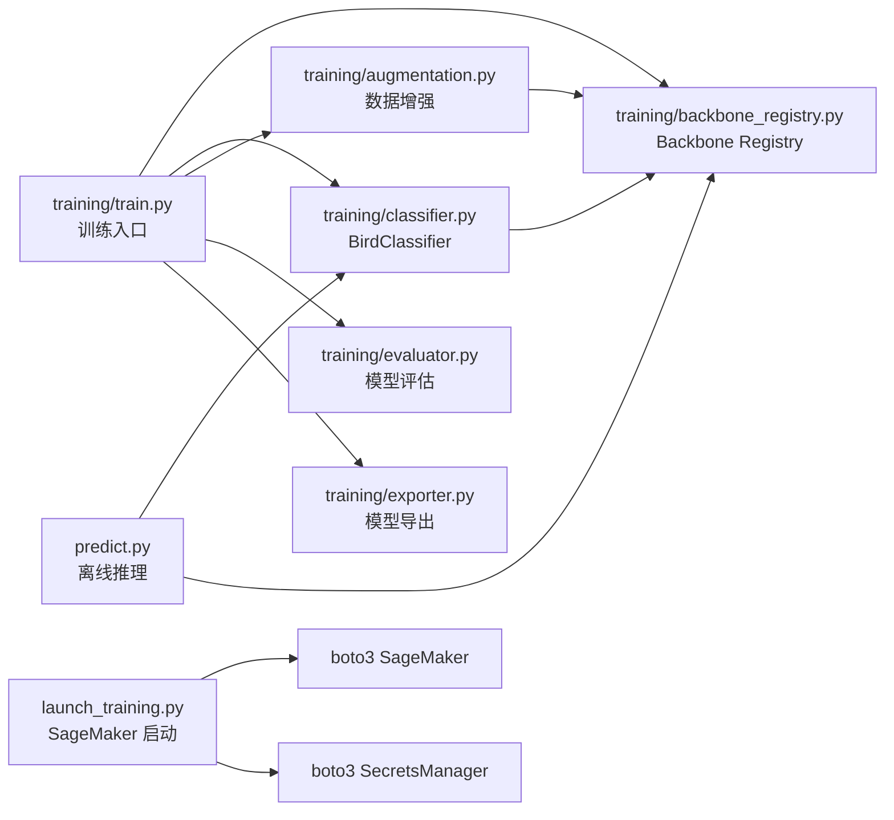
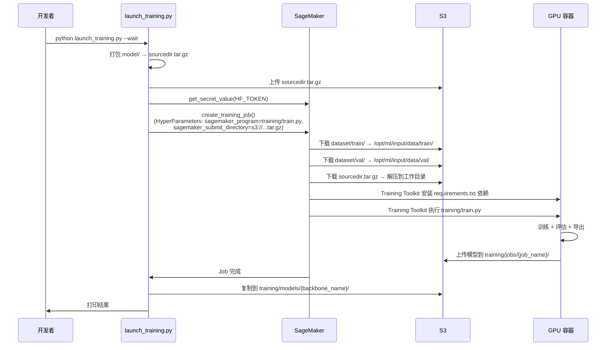

# 设计文档：Spec 29 — 鸟类分类模型训练

## 概述

本设计实现一个可切换 backbone 的鸟类分类模型训练框架。核心架构为 frozen backbone + linear classification head，通过 Backbone Registry 模式支持灵活切换不同预训练模型（DINOv3、DINOv2、ResNet、EfficientNet 等）进行对比实验。可选的 LoRA（Low-Rank Adaptation）模式支持对 Transformer backbone 进行参数高效微调，与纯 linear probe 形成对比。

训练在 SageMaker Training Job（GPU 实例）上运行，输入为 Spec 28 产出的 ImageFolder 格式数据集（S3），输出为 PyTorch .pt 模型文件 + 评估报告。训练完成后可通过离线推理脚本验证模型在真实场景下的分类效果。

### 设计决策

| 决策 | 选择 | 理由 |
|------|------|------|
| 模型架构 | frozen backbone + nn.Linear | 训练数据量有限（46 类 × ~1000 张），linear probing 足够且训练快 |
| LoRA 微调 | 可选，peft 库 LoRA adapter（rank=8，target: q_proj/v_proj） | 对细粒度物种可能比纯 linear probe 效果更好，参数量远少于全量微调 |
| 损失函数 | CrossEntropyLoss(label_smoothing=0.1) | label smoothing 防止模型过度自信，提升细粒度物种（噪鹛/画眉）泛化 |
| 默认 backbone | DINOv3 ViT-L/16 | 与 Spec 28 特征提取一致，自监督预训练特征质量高 |
| backbone 切换 | Registry 模式 + `--backbone` 参数 | 新增 backbone 只需添加一条配置，训练/评估/导出代码无需修改 |
| 优化器 | AdamW(lr=1e-3, weight_decay=1e-4) | linear head 参数少，AdamW 收敛快且有正则化 |
| 学习率调度 | CosineAnnealingLR | 平滑衰减，适合固定 epoch 训练 |
| 混合精度 | torch.amp (autocast + GradScaler) | 加速训练、降低显存占用，backbone 推理受益明显 |
| 数据增强 | RandomResizedCrop + HFlip + ColorJitter | 标准鸟类分类增强策略，增加训练多样性 |
| 模型导出 | PyTorch .pt（state_dict + 元数据） | SageMaker Serverless endpoint 部署需要，ONNX 为可选 |
| SageMaker 容器 | PyTorch 2.6 GPU 预构建容器 | 与 Spec 28 一致，复用镜像选择逻辑 |
| SageMaker 代码部署 | script mode（sagemaker_program + sagemaker_submit_directory） | 保留容器默认入口（Training Toolkit），确保 CloudWatch Logs 管道正常；不需要 wrapper 脚本 |
| PBT 框架 | Hypothesis | Python 生态最成熟的 PBT 库，与 pytest 无缝集成 |
| 图片处理 | Pillow + torchvision transforms v2 | 与 Spec 27/28 一致，不引入 OpenCV |

### 与 Spec 28 的边界

- **输入**：Spec 28 产出的 `s3://raspi-eye-model-data/dataset/train/{species}/*.jpg` 和 `dataset/val/{species}/*.jpg`（只读）
- **复用**：`launch_processing.py` 的容器镜像选择逻辑（`PYTORCH_IMAGE_URIS` + `get_image_uri()`）
- **差异**：Processing Job 使用 `ContainerEntrypoint` + `bash -c` 内联命令（Processing Job 无 Training Toolkit）；Training Job 使用 script mode（`sagemaker_program` + `sagemaker_submit_directory`），不覆盖容器默认入口
- **输出**：`s3://raspi-eye-model-data/training/models/{backbone_name}/`（模型 + 评估报告）

### 禁止项（Design 层）

- SHALL NOT 对任何 backbone 做全量参数更新（full fine-tuning），仅允许通过 LoRA adapter 进行参数高效微调（`--lora` 启用时）；未启用 LoRA 时 backbone 参数全部 `requires_grad=False`
- SHALL NOT 在训练循环、评估或导出代码中硬编码特定 backbone 的逻辑（所有差异通过 Backbone_Registry 抽象）
- SHALL NOT 在代码中硬编码 AWS 凭证、密钥、Role ARN 或 HF_TOKEN（通过环境变量或 Secrets Manager 获取）
- SHALL NOT 在日志中打印 HF_TOKEN、AWS 凭证等敏感信息
- SHALL NOT 使用 OpenCV 做图片处理（使用 Pillow + torchvision transforms，保持与 Spec 27/28 一致）
- SHALL NOT 使用 `ContainerEntrypoint` 覆盖 SageMaker 预构建容器的默认入口脚本（覆盖会导致 CloudWatch Logs 日志管道断裂，训练过程无法在 CloudWatch 控制台监控）

## 架构

### 整体数据流

```mermaid
flowchart TD
    A[S3: dataset/train/<br/>ImageFolder 格式] --> B[DataLoader<br/>+ 数据增强]
    C[S3: dataset/val/<br/>ImageFolder 格式] --> D[DataLoader<br/>+ 验证预处理]
    
    B --> E[BirdClassifier<br/>frozen backbone + linear head]
    D --> E
    
    E --> F[训练循环<br/>CrossEntropyLoss(label_smoothing=0.1)<br/>+ AdamW + CosineAnnealingLR + AMP]
    F -->|每 epoch 评估| G[Best Checkpoint<br/>val top-1 最高]
    
    G --> H[模型评估<br/>per-class accuracy<br/>confusion matrix<br/>top-5 易混淆对]
    
    H --> I[模型导出<br/>bird_classifier.pt<br/>+ class_names.json<br/>+ evaluation_report.json]
    
    I -->|可选| J[ONNX 导出<br/>bird_classifier.onnx]
    
    I --> K[S3: training/models/<br/>{backbone_name}/]

    style E fill:#4ecdc4,color:#000
    style F fill:#ff6b6b,color:#000
    style H fill:#ffd93d,color:#000
    style I fill:#96ceb4,color:#000
```

### 模块依赖



### SageMaker Training Job 流程



## 组件与接口

### 1. backbone_registry.py — Backbone 注册表

```python
@dataclass
class BackboneConfig:
    """Backbone 配置。"""
    name: str                                              # 注册名称
    load_fn: Callable[[], nn.Module]                       # 加载 backbone
    extract_fn: Callable[[nn.Module, torch.Tensor], torch.Tensor]  # 提取特征
    input_size: int                                        # 输入图片尺寸
    feature_dim: int                                       # 特征向量维度
    needs_hf_token: bool = False                           # 是否需要 HF_TOKEN

BACKBONE_REGISTRY: dict[str, BackboneConfig] = {
    "dinov3-vitl16": BackboneConfig(...),  # 默认
    "dinov2-vitl14": BackboneConfig(...),
}

def get_backbone(name: str) -> BackboneConfig:
    """根据名称获取 backbone 配置，不存在则抛出 ValueError。"""
```

### 2. classifier.py — BirdClassifier 模型

```python
class BirdClassifier(nn.Module):
    """可切换 backbone + linear classification head，可选 LoRA 微调。"""
    
    def __init__(self, num_classes: int, backbone_config: BackboneConfig,
                 lora: bool = False, lora_rank: int = 8):
        # backbone: frozen, eval mode
        # 可选：LoRA adapter 注入（仅 Transformer backbone）
        # head: nn.Linear(feature_dim, num_classes)
    
    def forward(self, x: torch.Tensor) -> torch.Tensor:
        # LoRA 模式：backbone 推理（有梯度）→ linear head
        # 非 LoRA 模式：backbone 推理（torch.no_grad）→ linear head
    
    def trainable_parameters(self) -> list[nn.Parameter]:
        # 非 LoRA：仅返回 head 参数
        # LoRA：返回 head 参数 + LoRA adapter 参数
    
    def merge_lora(self) -> None:
        # 导出前调用：将 LoRA 权重合并回 backbone（merge_and_unload）
```

### 3. augmentation.py — 数据增强

```python
def get_train_transform(input_size: int) -> v2.Compose:
    """训练集增强：RandomResizedCrop + HFlip + ColorJitter + Normalize。"""

def get_val_transform(input_size: int) -> v2.Compose:
    """验证集预处理：Resize + CenterCrop + Normalize。"""
```

### 4. evaluator.py — 模型评估

```python
@dataclass
class EvaluationReport:
    top1_accuracy: float
    top5_accuracy: float
    per_class_accuracy: dict[str, float]
    per_class_count: dict[str, int]
    confusion_matrix: list[list[int]]
    top5_confused_pairs: list[tuple[str, str, int]]
    class_names: list[str]

def evaluate(model, dataloader, class_names, device) -> EvaluationReport:
    """在验证集上执行完整评估。"""

def compute_confusion_matrix(all_preds, all_labels, num_classes) -> np.ndarray:
    """计算混淆矩阵。"""

def find_top_confused_pairs(cm, class_names, k=5) -> list[tuple[str, str, int]]:
    """从混淆矩阵中找出 top-k 最易混淆物种对。"""
```

### 5. exporter.py — 模型导出

```python
def export_pytorch(model, backbone_config, class_names, output_dir) -> Path:
    """导出 PyTorch .pt 模型（state_dict + 元数据）。"""

def export_onnx(model, backbone_config, output_dir) -> Path:
    """可选：导出 ONNX 模型并验证。"""
```

### 6. train.py — 训练入口

```python
def main():
    """训练入口，位于 model/training/train.py，SageMaker 容器内由 Training Toolkit 自动执行。
    
    SageMaker Training Toolkit 设置的环境变量：
    - SM_CHANNEL_TRAIN: /opt/ml/input/data/train/
    - SM_CHANNEL_VAL: /opt/ml/input/data/val/
    - SM_MODEL_DIR: /opt/ml/model/
    - SM_HP_*: 超参数（从 HyperParameters 自动映射）
    
    流程：
    1. 解析超参数（从 CLI 参数或 SM_HP_* 环境变量）
    2. 加载 backbone（从 Registry）
    3. 构建 BirdClassifier（可选 LoRA 注入）
    4. 加载数据（ImageFolder + DataLoader）
    5. 训练循环（CrossEntropyLoss(label_smoothing=0.1) + AdamW + CosineAnnealingLR + AMP）
    6. 评估（best checkpoint → per-class accuracy + confusion matrix）
    7. 导出前 merge LoRA（如启用）→ .pt + class_names.json + evaluation_report.json
    """
```

### 7. launch_training.py — SageMaker Training Job 启动

```python
def main():
    """创建并启动 SageMaker Training Job。
    
    使用 SageMaker 预构建容器的 script mode：
    1. 将 model/ 目录打包为 sourcedir.tar.gz（排除 data/、tests/、__pycache__/）
    2. 上传 tar.gz 到 S3
    3. 通过 HyperParameters 传入 sagemaker_program（training/train.py）和 sagemaker_submit_directory（tar.gz S3 路径）
    4. 不设置 ContainerEntrypoint，保留容器默认入口（SageMaker Training Toolkit）
    5. Training Toolkit 自动解压代码、安装 requirements.txt 中的依赖、执行训练脚本
    6. CloudWatch Logs 管道由默认入口维护，训练日志实时可见
    
    配置 S3 输入通道（train/val）和输出路径。
    支持 --wait 等待完成并复制模型到 models/{backbone_name}/。
    """
```

### 8. predict.py — 离线推理验证

```python
def main():
    """离线推理脚本。
    
    加载 .pt 模型 → 读取元数据 → 对图片目录批量推理 → 输出 top-k 预测。
    支持按物种子目录自动计算 accuracy。
    """
```

## 数据模型

### PyTorch 模型文件格式（bird_classifier.pt）

```python
{
    "state_dict": model.state_dict(),       # 完整模型权重（backbone + head，LoRA 已 merge）
    "metadata": {
        "backbone_name": "dinov3-vitl16",   # backbone 注册名称
        "num_classes": 46,                  # 类别数
        "class_names": ["Passer montanus", ...],  # 类别名列表（按 index 排序）
        "input_size": 518,                  # 输入图片尺寸
        "feature_dim": 1024,                # 特征向量维度
        "lora": True,                       # 是否使用了 LoRA 训练（信息记录用）
        "lora_rank": 8,                     # LoRA rank（仅 lora=True 时有意义）
    }
}
```

### class_names.json

```json
{
    "0": "Passer montanus",
    "1": "Pycnonotus sinensis",
    ...
}
```

### evaluation_report.json

```json
{
    "backbone": "dinov3-vitl16",
    "top1_accuracy": 0.95,
    "top5_accuracy": 0.99,
    "per_class": {
        "Passer montanus": {"accuracy": 0.97, "count": 120},
        ...
    },
    "top5_confused_pairs": [
        {"species_a": "Pterorhinus sannio", "species_b": "Pterorhinus perspicillatus", "count": 15},
        ...
    ]
}
```

### confusion_matrix.json

```json
{
    "class_names": ["Passer montanus", ...],
    "matrix": [[95, 2, 0, ...], ...]
}
```

### 超参数配置

| 参数 | 默认值 | 说明 |
|------|--------|------|
| backbone | dinov3-vitl16 | backbone 注册名称 |
| epochs | 10 | 训练轮数 |
| batch_size | 64 | 批大小 |
| lr | 1e-3 | 学习率 |
| weight_decay | 1e-4 | 权重衰减 |
| num_workers | 4 | DataLoader 工作线程数 |
| lora | false | 是否启用 LoRA 微调（仅 Transformer backbone） |
| lora_rank | 8 | LoRA 低秩矩阵的 rank |


## Correctness Properties

*A property is a characteristic or behavior that should hold true across all valid executions of a system—essentially, a formal statement about what the system should do. Properties serve as the bridge between human-readable specifications and machine-verifiable correctness guarantees.*

### Property 1: 模型构建不变量（Frozen backbone + Trainable head + 正确维度）

*For any* 已注册的 backbone 配置和任意 num_classes ∈ [2, 100]，构建 BirdClassifier 后：
- backbone 的所有参数 `requires_grad == False`
- head 的所有参数 `requires_grad == True`
- head 的 `in_features == backbone_config.feature_dim`
- head 的 `out_features == num_classes`
- `trainable_parameters()` 返回的参数集合恰好等于 head 的参数集合

**Validates: Requirements 1.3, 1.4, 1.5, 7.1**

### Property 2: 数据增强输出尺寸不变量

*For any* 已注册 backbone 的 `input_size` 和任意合法 RGB 图片（宽高 ∈ [32, 2048]），经过训练增强或验证预处理后，输出张量的 shape 恒为 `(3, input_size, input_size)`。

**Validates: Requirements 1.6, 2.2, 2.3, 7.2**

### Property 3: 评估指标数学不变量

*For any* 随机生成的预测 logits 矩阵（shape [N, C]）和标签向量（shape [N]，值 ∈ [0, C)），计算出的评估指标应满足：
- `top5_accuracy >= top1_accuracy`
- 每个类别的 `per_class_accuracy ∈ [0.0, 1.0]`
- 所有类别的 `per_class_count` 之和 == N

**Validates: Requirements 4.2**

### Property 4: 混淆矩阵正确性与 top-k 易混淆对提取

*For any* 随机生成的预测标签和真实标签（N 个样本，C 个类别），计算出的混淆矩阵应满足：
- shape == (C, C)
- 所有元素 >= 0
- 每行之和 == 该类的样本数
- 矩阵所有元素之和 == N
- `find_top_confused_pairs(cm, k)` 返回的 k 对确实是非对角线元素中最大的 k 个值（降序排列）

**Validates: Requirements 4.3, 4.4**

### Property 5: 模型导出 round-trip

*For any* 随机初始化的 BirdClassifier（任意 num_classes ∈ [2, 50]），导出为 .pt 文件后重新加载：
- 加载的 state_dict 与原始 state_dict 数值完全一致
- 元数据（backbone_name、num_classes、input_size、feature_dim、class_names）完全恢复
- 对相同输入张量，加载后模型的推理输出与原始模型完全一致

**Validates: Requirements 5.1, 7.4**

## Error Handling

### 训练阶段

| 错误场景 | 处理策略 |
|----------|----------|
| backbone 名称不在 Registry 中 | 抛出 ValueError，列出所有可用 backbone |
| HF_TOKEN 缺失但 backbone 需要 | 抛出 RuntimeError，提示设置 HF_TOKEN |
| 训练数据目录为空 | 抛出 FileNotFoundError，打印期望的目录结构 |
| GPU 不可用 | 回退到 CPU，打印警告（训练会很慢） |
| 训练过程中 loss 为 NaN | 终止训练，保存最后一个有效 checkpoint |
| peft 库未安装但指定了 --lora | 抛出 ImportError，提示安装 peft |
| 磁盘空间不足（checkpoint 保存失败） | 捕获 IOError，打印错误并继续训练（不保存） |

### 评估阶段

| 错误场景 | 处理策略 |
|----------|----------|
| best checkpoint 文件不存在 | 使用最后一个 epoch 的权重 |
| 某个类别验证样本数为 0 | per-class accuracy 标记为 N/A，不参与平均 |

### 导出阶段

| 错误场景 | 处理策略 |
|----------|----------|
| ONNX 导出失败（opset 不支持） | 打印错误，跳过 ONNX 导出，PyTorch 导出不受影响 |
| ONNX 数值验证失败（差异 > 1e-4） | 打印警告但仍保存 ONNX 文件，标记为未验证 |

### SageMaker 启动阶段

| 错误场景 | 处理策略 |
|----------|----------|
| Secrets Manager 获取 HF_TOKEN 失败 | 打印警告，继续（backbone 可能不需要 token） |
| create_training_job 失败 | 打印完整错误信息，退出 |
| --wait 超时 | 打印当前 Job 状态和 CloudWatch Logs 链接 |

### 离线推理阶段

| 错误场景 | 处理策略 |
|----------|----------|
| 模型文件不存在或格式错误 | 抛出 FileNotFoundError / ValueError |
| 图片无法打开（损坏） | 跳过该图片，打印警告，继续处理其余图片 |
| 模型元数据中 backbone 不在 Registry | 仅使用元数据中的 input_size，不加载 backbone（推理时已有完整模型） |

## Testing Strategy

### 测试框架

- **单元测试**：pytest
- **属性测试**：Hypothesis（PBT），每个属性最少 100 次迭代
- **测试目录**：`model/tests/`
- **运行命令**：`source .venv-raspi-eye/bin/activate && pytest model/tests/ -v`

### 双测试策略

| 测试类型 | 覆盖范围 | 工具 |
|----------|----------|------|
| 属性测试（PBT） | 模型构建不变量、数据增强尺寸、评估指标、混淆矩阵、模型导出 round-trip | Hypothesis |
| 单元测试（Example） | 训练循环（合成数据）、ONNX 导出验证、Registry 配置检查、推理脚本 | pytest |

### 属性测试配置

- 每个属性测试最少 100 次迭代（`@settings(max_examples=100)`）
- 使用小型随机初始化模型替代真实 backbone（不依赖 GPU/网络）
- Tag 格式：`Feature: bird-classifier-training, Property {N}: {description}`

### 测试用 Mock Backbone

```python
class MockBackbone(nn.Module):
    """测试用小型 backbone，随机初始化，不依赖网络。"""
    def __init__(self, feature_dim: int = 64):
        super().__init__()
        self.proj = nn.Linear(3 * 32 * 32, feature_dim)
    
    def forward(self, x):
        return self.proj(x.flatten(1))
```

测试中通过 monkey-patch `BackboneConfig.load_fn` 返回 MockBackbone，确保：
- 不下载真实模型权重
- 不依赖 GPU
- 不依赖网络
- CPU 上快速运行

### 单元测试清单

1. **模型构建**：backbone frozen、head trainable、输出维度正确
2. **数据增强**：训练/验证增强输出尺寸正确（PBT）
3. **训练循环**：合成 2 类 × 10 张 × 3 epoch，loss 下降、best checkpoint 保存
4. **评估指标**：合成预测 → 验证 top-1/top-5/per-class 计算正确（PBT）
5. **混淆矩阵**：合成预测 → 验证矩阵不变量 + top-k 提取正确（PBT）
6. **PyTorch 导出**：导出 → 加载 → 推理一致（PBT）
7. **ONNX 导出**（可选）：导出 → checker 通过 → ORT 推理一致
8. **Registry 查找**：已注册名称返回配置，未注册名称抛出 ValueError
