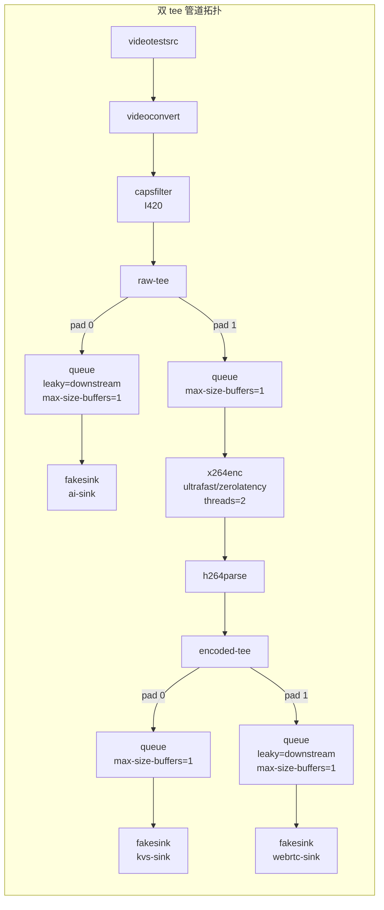
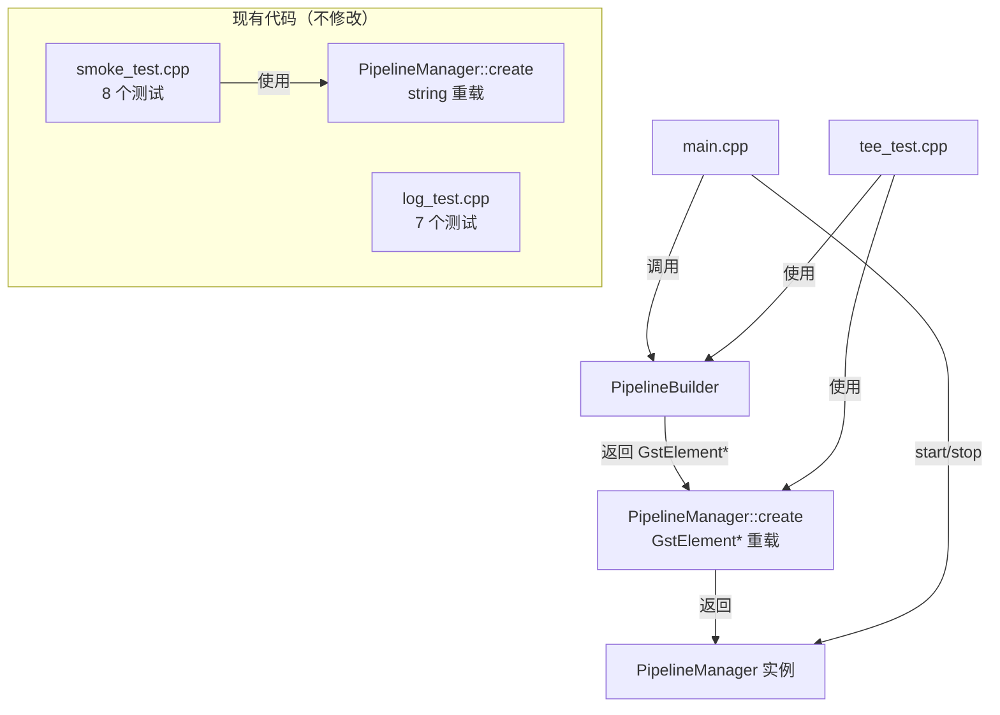

# 设计文档：Spec 3 — H.264 编码 + tee 三路分流

## 概述

本设计将当前基于 `gst_parse_launch` 的单路管道升级为手动构建的双 tee 分流管道。核心交付物是 `PipelineBuilder` 类——一个使用 GStreamer C API（`gst_element_factory_make` + `gst_bin_add_many` + `gst_element_link`）手动组装管道拓扑的构建器，以及 `PipelineManager` 的新工厂方法重载。

设计目标：
- 新增 `PipelineBuilder`，构建 `videotestsrc → videoconvert → capsfilter(I420) → raw-tee → [AI 分支] + [编码链路 → encoded-tee → KVS 分支 + WebRTC 分支]` 拓扑
- 为 `PipelineManager` 添加 `create(GstElement*, string*)` 工厂方法，接管预构建管道的所有权
- 运行时检测 H.264 编码器（`x264enc`），配置低延迟参数
- 三路分支使用 `fakesink` 占位，后续 Spec 逐一替换
- 保持现有 `create(string, string*)` 接口和全部 15 个测试不变

设计决策：
- **PipelineBuilder 独立于 PipelineManager**：PipelineBuilder 负责组装管道拓扑并返回 `GstElement*`，PipelineManager 负责生命周期管理。职责分离使两者可独立测试和演进。
- **新工厂方法重载而非修改现有方法**：添加 `create(GstElement*, string*)` 重载，现有 `create(string, string*)` 签名和行为完全不变，15 个现有测试零修改通过。
- **编码器候选列表模式**：通过 `gst_element_factory_find` 按优先级遍历候选编码器列表，当前仅 `x264enc`，后续可在列表头部插入硬件编码器。
- **双 tee 而非单 tee**：AI 推理需要 raw 帧，如果只在编码后分流，后续 Spec 9 需要加解码器将 H.264 解回 raw，白白浪费 CPU。raw-tee 在编码前分流，AI 分支直接拿到 raw 帧，零额外开销。

## 架构



### 模块关系



### 文件布局

```
device/
├── CMakeLists.txt              # 修改：添加 pipeline_builder 库和 tee_test 目标
├── src/
│   ├── pipeline_manager.h      # 修改：添加 create(GstElement*, string*) 声明
│   ├── pipeline_manager.cpp    # 修改：添加 create(GstElement*, string*) 实现
│   ├── pipeline_builder.h      # 新增：PipelineBuilder 接口
│   ├── pipeline_builder.cpp    # 新增：PipelineBuilder 实现
│   └── main.cpp                # 修改：使用 PipelineBuilder 替换 gst_parse_launch
└── tests/
    ├── smoke_test.cpp          # 不修改
    ├── log_test.cpp            # 不修改
    └── tee_test.cpp            # 新增：双 tee 管道冒烟测试
```


## 组件与接口

### PipelineManager 新工厂方法

在现有 `pipeline_manager.h` 中添加一个重载：

```cpp
// pipeline_manager.h — 新增声明
class PipelineManager {
public:
    // 现有工厂方法（不修改）
    static std::unique_ptr<PipelineManager> create(
        const std::string& pipeline_desc,
        std::string* error_msg = nullptr);

    // 新增：接管预构建管道的所有权
    // pipeline 必须是 gst_pipeline_new() 创建的 GstPipeline
    // 成功返回 unique_ptr，失败（nullptr 输入）返回 nullptr
    static std::unique_ptr<PipelineManager> create(
        GstElement* pipeline,
        std::string* error_msg = nullptr);

    // ... 其余接口不变
};
```

实现要点（`pipeline_manager.cpp`）：

```cpp
std::unique_ptr<PipelineManager> PipelineManager::create(
    GstElement* pipeline,
    std::string* error_msg)
{
    if (!pipeline) {
        if (error_msg) *error_msg = "Pipeline pointer is null";
        return nullptr;
    }

    // 确保 GStreamer 已初始化（与 string 重载共享同一个 static bool）
    static bool gst_initialised = false;
    if (!gst_initialised) {
        GError* init_err = nullptr;
        if (!gst_init_check(nullptr, nullptr, &init_err)) {
            if (error_msg) {
                *error_msg = "Failed to initialize GStreamer";
                if (init_err) { *error_msg += ": "; *error_msg += init_err->message; }
            }
            if (init_err) g_error_free(init_err);
            return nullptr;
        }
        gst_initialised = true;
    }

    auto pl = spdlog::get("pipeline");
    if (pl) pl->info("Pipeline adopted from pre-built GstElement*");

    return std::unique_ptr<PipelineManager>(new PipelineManager(pipeline));
}
```

设计决策：
- GStreamer 初始化逻辑需要与现有 `create(string)` 共享 `static bool gst_initialised`。将其提取为私有静态方法 `ensure_gst_init()` 避免重复代码。
- 新工厂方法不调用 `gst_parse_launch`，直接接管传入的 `GstElement*` 指针。调用方（PipelineBuilder）负责构建管道，PipelineManager 只负责生命周期。

### PipelineBuilder 接口

```cpp
// pipeline_builder.h
#pragma once
#include <gst/gst.h>
#include <string>

// 双 tee 三路分流管道构建器
// 构建拓扑：videotestsrc → videoconvert → capsfilter(I420) → raw-tee
//   → queue(leaky) → fakesink("ai-sink")
//   → queue → x264enc → h264parse → encoded-tee
//     → queue → fakesink("kvs-sink")
//     → queue(leaky) → fakesink("webrtc-sink")
namespace PipelineBuilder {

// 构建双 tee 管道，返回 GstElement*（GstPipeline）
// 调用方通过 PipelineManager::create(GstElement*) 接管所有权
// 失败返回 nullptr，error_msg 输出错误详情
GstElement* build_tee_pipeline(std::string* error_msg = nullptr);

} // namespace PipelineBuilder
```

设计决策：
- 使用 namespace 而非 class，因为 PipelineBuilder 无状态，`build_tee_pipeline()` 是纯工厂函数。
- 返回裸 `GstElement*` 而非 `unique_ptr`，因为 GStreamer 对象使用引用计数而非 C++ 智能指针。调用方（PipelineManager）负责接管所有权。
- 后续 Spec 替换 fakesink 时，可在此函数基础上扩展参数（如传入 sink 元素），或新增构建函数。

### PipelineBuilder 实现要点

```cpp
// pipeline_builder.cpp 核心逻辑

namespace {

// 编码器候选列表（按优先级排序）
// 当前仅 x264enc，后续可在头部插入硬件编码器
struct EncoderCandidate {
    const char* factory_name;  // GStreamer 元素工厂名
    const char* display_name;  // 日志显示名
};

const EncoderCandidate kEncoderCandidates[] = {
    {"x264enc", "x264enc (software)"},
    // 未来: {"v4l2h264enc", "V4L2 H.264 (hardware)"},
};

// 运行时检测并创建 H.264 编码器
// 遍历候选列表，返回第一个可用的编码器（已配置参数）
// 失败返回 nullptr
GstElement* create_encoder(std::string* error_msg) {
    for (const auto& candidate : kEncoderCandidates) {
        GstElementFactory* factory =
            gst_element_factory_find(candidate.factory_name);
        if (factory) {
            gst_object_unref(factory);  // factory_find 返回的引用需要释放

            GstElement* encoder =
                gst_element_factory_make(candidate.factory_name, "encoder");
            if (encoder) {
                // x264enc 特定参数
                g_object_set(G_OBJECT(encoder),
                    "tune",         0x00000004,  // zerolatency
                    "speed-preset", 1,           // ultrafast
                    "threads",      2,
                    nullptr);

                auto pl = spdlog::get("pipeline");
                if (pl) pl->info("Selected encoder: {} (ultrafast, zerolatency, threads=2)",
                                 candidate.display_name);
                return encoder;
            }
        }
    }
    if (error_msg) *error_msg = "No H.264 encoder available (tried: x264enc)";
    return nullptr;
}

// 将 tee 的 request pad 连接到下游元素
// tee → [request pad] → downstream_element
bool link_tee_to_element(GstElement* tee, GstElement* element,
                         std::string* error_msg) {
    GstPad* tee_pad = gst_element_request_pad_simple(tee, "src_%u");
    if (!tee_pad) {
        if (error_msg) *error_msg = "Failed to request pad from tee";
        return false;
    }

    GstPad* sink_pad = gst_element_get_static_pad(element, "sink");
    GstPadLinkReturn ret = gst_pad_link(tee_pad, sink_pad);

    gst_object_unref(sink_pad);
    gst_object_unref(tee_pad);

    if (ret != GST_PAD_LINK_OK) {
        if (error_msg) *error_msg = "Failed to link tee pad";
        return false;
    }
    return true;
}

} // anonymous namespace

GstElement* PipelineBuilder::build_tee_pipeline(std::string* error_msg) {
    // 1. 创建管道容器
    GstElement* pipeline = gst_pipeline_new("tee-pipeline");

    // 2. 创建所有元素
    GstElement* src       = gst_element_factory_make("videotestsrc", "src");
    GstElement* convert   = gst_element_factory_make("videoconvert", "convert");
    GstElement* capsfilter= gst_element_factory_make("capsfilter", "capsfilter");
    GstElement* raw_tee   = gst_element_factory_make("tee", "raw-tee");

    GstElement* q_ai      = gst_element_factory_make("queue", "q-ai");
    GstElement* ai_sink   = gst_element_factory_make("fakesink", "ai-sink");

    GstElement* q_enc     = gst_element_factory_make("queue", "q-enc");
    GstElement* encoder   = create_encoder(error_msg);
    GstElement* parser    = gst_element_factory_make("h264parse", "parser");
    GstElement* enc_tee   = gst_element_factory_make("tee", "encoded-tee");

    GstElement* q_kvs     = gst_element_factory_make("queue", "q-kvs");
    GstElement* kvs_sink  = gst_element_factory_make("fakesink", "kvs-sink");

    GstElement* q_web     = gst_element_factory_make("queue", "q-web");
    GstElement* web_sink  = gst_element_factory_make("fakesink", "webrtc-sink");

    // 3. 元素创建失败检查（省略详细错误处理伪代码）
    if (!encoder || !src || !convert || /* ... */) {
        // 清理已创建的元素，返回 nullptr
    }

    // 4. 设置 capsfilter caps（videotestsrc 不支持 caps 属性，通过 capsfilter 强制 I420）
    GstCaps* caps = gst_caps_new_simple("video/x-raw",
        "format", G_TYPE_STRING, "I420", nullptr);
    g_object_set(G_OBJECT(capsfilter), "caps", caps, nullptr);
    gst_caps_unref(caps);  // ⚠️ 必须立即 unref，SHALL NOT 遗漏

    // 5. 设置 queue 参数
    g_object_set(G_OBJECT(q_ai),  "max-size-buffers", 1, "leaky", 2, nullptr);  // 2=downstream
    g_object_set(G_OBJECT(q_enc), "max-size-buffers", 1, nullptr);
    g_object_set(G_OBJECT(q_kvs), "max-size-buffers", 1, nullptr);              // 无 leaky
    g_object_set(G_OBJECT(q_web), "max-size-buffers", 1, "leaky", 2, nullptr);  // 2=downstream

    // 6. 添加所有元素到管道
    gst_bin_add_many(GST_BIN(pipeline),
        src, convert, capsfilter, raw_tee,
        q_ai, ai_sink,
        q_enc, encoder, parser, enc_tee,
        q_kvs, kvs_sink,
        q_web, web_sink,
        nullptr);

    // 7. 链接主干：src → convert → capsfilter → raw-tee
    gst_element_link_many(src, convert, capsfilter, raw_tee, nullptr);

    // 8. 链接编码链路：q_enc → encoder → parser → enc_tee
    gst_element_link_many(q_enc, encoder, parser, enc_tee, nullptr);

    // 9. 链接 tee request pads
    link_tee_to_element(raw_tee, q_ai, error_msg);   // raw-tee → q-ai
    link_tee_to_element(raw_tee, q_enc, error_msg);   // raw-tee → q-enc
    link_tee_to_element(enc_tee, q_kvs, error_msg);   // encoded-tee → q-kvs
    link_tee_to_element(enc_tee, q_web, error_msg);   // encoded-tee → q-web

    // 10. 链接分支末端
    gst_element_link(q_ai, ai_sink);
    gst_element_link(q_kvs, kvs_sink);
    gst_element_link(q_web, web_sink);

    return pipeline;
}
```

### GStreamer tee request pad 连接模式

tee 元素使用 request pad（动态创建的输出 pad），连接流程：

```
1. gst_element_request_pad_simple(tee, "src_%u")  → 获取新 request pad
2. gst_element_get_static_pad(downstream, "sink") → 获取下游 sink pad
3. gst_pad_link(tee_pad, sink_pad)                → 连接两个 pad
4. gst_object_unref(tee_pad)                      → 释放 pad 引用
5. gst_object_unref(sink_pad)                     → 释放 pad 引用
```

关键点：
- `gst_element_request_pad_simple` 返回的 pad 引用计数 +1，使用后必须 `gst_object_unref`
- `gst_element_get_static_pad` 同样返回 +1 引用，使用后必须 unref
- tee 的 request pad 名称模式为 `"src_%u"`（`src_0`、`src_1`、...），由 GStreamer 自动分配编号

### x264enc 参数说明

| 属性 | 值 | GObject 类型 | 说明 |
|------|-----|-------------|------|
| `tune` | `0x00000004` | GstX264EncTune (flags) | zerolatency — 禁用 B 帧和帧重排序，最小化编码延迟 |
| `speed-preset` | `1` | GstX264EncPreset (enum) | ultrafast — 最快编码速度，牺牲压缩率换取最低 CPU 占用 |
| `threads` | `2` | guint | 编码线程数 — Pi 5 有 4 核，留 2 核给系统调度和后续 AI 推理 |

注意：`tune` 和 `speed-preset` 是 GStreamer 枚举/标志类型，需要使用整数值而非字符串。可通过 `gst-inspect-1.0 x264enc` 查看具体枚举值。

### CMakeLists.txt 变更

```cmake
# 修改 pipeline_manager 库，添加 pipeline_builder 源文件
add_library(pipeline_manager STATIC
    src/pipeline_manager.cpp
    src/pipeline_builder.cpp)
# 其余 target 配置不变

# 新增 tee 管道冒烟测试
add_executable(tee_test tests/tee_test.cpp)
target_link_libraries(tee_test PRIVATE pipeline_manager GTest::gtest_main)
add_test(NAME tee_test COMMAND tee_test)
```

设计决策：
- `pipeline_builder.cpp` 编入现有 `pipeline_manager` 静态库，而非创建独立库。两者紧密耦合（PipelineBuilder 产出的 `GstElement*` 直接交给 PipelineManager），共享同一个库简化链接依赖。
- `tee_test` 与现有 `smoke_test` 并列，通过 CTest 统一管理。

### main.cpp 变更

```cpp
// main.cpp — 关键变更
#include "pipeline_builder.h"

static int run_pipeline(int argc, char* argv[]) {
    // ... 日志初始化不变 ...

    // 替换原有 gst_parse_launch 管道
    std::string err_msg;
    GstElement* raw_pipeline = PipelineBuilder::build_tee_pipeline(&err_msg);
    if (!raw_pipeline) {
        if (logger) logger->error("Failed to build tee pipeline: {}", err_msg);
        log_init::shutdown();
        return 1;
    }

    auto pm = PipelineManager::create(raw_pipeline, &err_msg);
    if (!pm) {
        if (logger) logger->error("Failed to adopt pipeline: {}", err_msg);
        log_init::shutdown();
        return 1;
    }

    // ... GMainLoop、bus watch、SIGINT handler 逻辑不变 ...
}
```


## 数据模型

### 管道拓扑元素清单

| 元素名 | GStreamer 工厂 | 关键属性 | 角色 |
|--------|---------------|---------|------|
| `src` | `videotestsrc` | — | 测试视频源 |
| `convert` | `videoconvert` | — | 色彩空间转换（I420 时 pass-through） |
| `capsfilter` | `capsfilter` | `caps=video/x-raw,format=I420` | 强制 I420 格式 |
| `raw-tee` | `tee` | — | 编码前分流：AI + 编码链路 |
| `q-ai` | `queue` | `max-size-buffers=1, leaky=downstream` | AI 分支缓冲（允许丢帧） |
| `ai-sink` | `fakesink` | `name=ai-sink` | AI 分支占位 |
| `q-enc` | `queue` | `max-size-buffers=1` | 编码链路缓冲（不丢帧） |
| `encoder` | `x264enc` | `tune=zerolatency, speed-preset=ultrafast, threads=2` | H.264 软件编码 |
| `parser` | `h264parse` | — | H.264 码流解析，设置正确 caps |
| `encoded-tee` | `tee` | — | 编码后分流：KVS + WebRTC |
| `q-kvs` | `queue` | `max-size-buffers=1` | KVS 分支缓冲（不丢帧，保证录制完整性） |
| `kvs-sink` | `fakesink` | `name=kvs-sink` | KVS 分支占位 |
| `q-web` | `queue` | `max-size-buffers=1, leaky=downstream` | WebRTC 分支缓冲（允许丢帧） |
| `webrtc-sink` | `fakesink` | `name=webrtc-sink` | WebRTC 分支占位 |

### Queue leaky 策略

| 分支 | leaky 设置 | 原因 |
|------|-----------|------|
| AI（q-ai） | `downstream`（2） | AI 推理可能慢于帧率，丢弃旧帧避免积压 |
| 编码链路（q-enc） | 无 | 编码器需要连续帧流，不可丢帧 |
| KVS（q-kvs） | 无 | 录制完整性要求，不可丢帧 |
| WebRTC（q-web） | `downstream`（2） | 实时观看允许丢帧，优先低延迟 |

### GStreamer 资源引用计数规则

| 操作 | 获取引用 | 释放引用 |
|------|---------|---------|
| `gst_pipeline_new()` | 返回浮动引用，自动 sink | `gst_object_unref()` 在 PipelineManager::stop() 中 |
| `gst_element_factory_make()` | 返回浮动引用 | 添加到 GstBin 后由 bin 管理 |
| `gst_element_factory_find()` | +1 引用 | 检查后立即 `gst_object_unref()` |
| `gst_caps_new_simple()` | +1 引用 | 设置到 capsfilter 后立即 `gst_caps_unref()` |
| `gst_element_request_pad_simple()` | +1 引用 | 链接后立即 `gst_object_unref()` |
| `gst_element_get_static_pad()` | +1 引用 | 链接后立即 `gst_object_unref()` |
| `gst_element_get_bus()` | +1 引用 | 注册 watch 后立即 `gst_object_unref()` |

### Caps 协商链路

```
videotestsrc [video/x-raw,format=I420]
  → videoconvert [pass-through, I420→I420]
    → capsfilter [video/x-raw,format=I420]
      → raw-tee
        → q-ai → ai-sink [video/x-raw,format=I420]
        → q-enc → x264enc [video/x-raw,format=I420 → video/x-h264]
          → h264parse [video/x-h264]
            → encoded-tee
              → q-kvs → kvs-sink [video/x-h264]
              → q-web → webrtc-sink [video/x-h264]
```

## 正确性属性（Correctness Properties）

本 Spec 不包含正确性属性部分。

原因：本特性的核心逻辑是 GStreamer 外部 C API 的管道组装和生命周期管理。所有验收标准都属于以下类别：

- **EXAMPLE**：验证特定管道拓扑结构（元素是否存在、属性值是否正确、状态是否达到 PLAYING）
- **SMOKE**：验证构建和测试通过
- **EDGE_CASE**：验证 nullptr 输入、编码器不可用等边界条件

不存在"对所有输入 X，属性 P(X) 成立"的通用属性：
1. 管道拓扑是固定的（不随输入变化）
2. 元素属性是硬编码的常量值
3. 核心行为依赖 GStreamer 外部库（不是我们的代码逻辑）
4. 100 次迭代不会比 2-3 个具体测试发现更多 bug

适合的测试策略：example-based 冒烟测试 + ASan 运行时检查。

## 错误处理

### PipelineManager::create(GstElement*) 错误处理

| 错误场景 | 处理方式 | 输出 |
|---------|---------|------|
| 传入 nullptr | 返回 nullptr | error_msg: "Pipeline pointer is null" |
| GStreamer 未初始化且初始化失败 | 返回 nullptr | error_msg: "Failed to initialize GStreamer: {detail}" |

### PipelineBuilder::build_tee_pipeline() 错误处理

| 错误场景 | 处理方式 | 输出 |
|---------|---------|------|
| 编码器不可用（x264enc 未安装） | 返回 nullptr | error_msg: "No H.264 encoder available (tried: x264enc)" |
| 任意元素创建失败 | 清理已创建元素，返回 nullptr | error_msg: "Failed to create element: {element_name}" |
| tee request pad 请求失败 | 清理管道，返回 nullptr | error_msg: "Failed to request pad from tee" |
| pad 链接失败 | 清理管道，返回 nullptr | error_msg: "Failed to link tee pad to {element_name}" |
| 元素链接失败 | 清理管道，返回 nullptr | error_msg: "Failed to link {src_name} to {sink_name}" |

清理策略：
- 如果管道已通过 `gst_pipeline_new()` 创建，且元素已通过 `gst_bin_add_many()` 添加到管道中，则只需 `gst_object_unref(pipeline)` 即可释放所有子元素
- 如果元素尚未添加到管道中（`gst_bin_add_many` 之前失败），需要逐个 `gst_object_unref` 已创建的元素

### create_encoder() 错误处理

| 错误场景 | 处理方式 | 输出 |
|---------|---------|------|
| `gst_element_factory_find` 返回 nullptr | 跳过该候选，尝试下一个 | 日志: "Encoder {name} not available, trying next" |
| 所有候选均不可用 | 返回 nullptr | error_msg: "No H.264 encoder available" |
| `gst_element_factory_make` 返回 nullptr | 跳过该候选 | 日志: "Failed to create {name}" |

### main.cpp 错误处理

| 错误场景 | 处理方式 |
|---------|---------|
| `build_tee_pipeline()` 返回 nullptr | spdlog error 记录，`log_init::shutdown()`，`return 1` |
| `PipelineManager::create()` 返回 nullptr | spdlog error 记录，`log_init::shutdown()`，`return 1` |
| `pm->start()` 失败 | spdlog error 记录，清理 GMainLoop，`log_init::shutdown()`，`return 1` |
| Bus ERROR 消息 | 解析 GError，spdlog error 记录，退出 GMainLoop |
| Bus EOS 消息 | spdlog info 记录，退出 GMainLoop |

## 测试策略

### 测试方法

本 Spec 采用 example-based 冒烟测试 + ASan 运行时检查的双重验证策略：

- **冒烟测试**：Google Test 框架，通过 CTest 统一管理和运行
- **内存安全**：Debug 构建开启 ASan，测试运行时自动检测 heap-use-after-free、buffer-overflow、内存泄漏等问题
- **不使用 PBT**：核心逻辑是 GStreamer 外部 C API 的管道组装，输入空间固定（管道拓扑硬编码），行为不随输入变化，example-based 测试已足够覆盖

### 新增测试文件：tee_test.cpp

| 测试用例 | 验证内容 | 对应需求 |
|---------|---------|---------|
| `AdoptValidPipeline` | `PipelineManager::create(GstElement*)` 接管有效管道，返回非 nullptr | 1.1, 1.2 |
| `AdoptNullPipeline` | `PipelineManager::create(nullptr)` 返回 nullptr，error_msg 非空 | 1.3 |
| `AdoptedPipelineStart` | 通过新工厂方法创建的实例调用 `start()`，`current_state()` 返回 PLAYING | 1.5 |
| `TeePipelinePlaying` | `build_tee_pipeline()` 构建的管道启动后达到 PLAYING | 3.1, 3.8, 4.4, 7.2 |
| `TeePipelineNamedSinks` | 管道中存在 `"kvs-sink"`、`"webrtc-sink"`、`"ai-sink"` 三个命名元素 | 3.4, 7.3 |
| `TeePipelineStop` | 管道停止后 `pipeline()` 返回 nullptr，ASan 无报告 | 1.6, 7.4 |
| `TeePipelineRAII` | 在作用域内创建并启动管道，离开作用域后 ASan 无报告 | 7.5 |
| `EncoderDetection` | `create_encoder()` 返回非 nullptr，查询属性验证 tune/speed-preset/threads 值 | 2.1, 2.2, 7.8 |

### 现有测试回归

| 测试文件 | 测试数量 | 预期 |
|---------|---------|------|
| `smoke_test.cpp` | 8 个 | 全部通过，零修改 |
| `log_test.cpp` | 7 个 | 全部通过，零修改 |
| `tee_test.cpp` | 8 个（新增） | 全部通过 |

### 测试约束

- 每个测试用例执行时间 ≤ 5 秒
- 所有测试通过 `ctest --test-dir device/build --output-on-failure` 统一运行
- Debug 构建下 ASan 自动生效，任何内存错误会导致测试失败
- 所有测试仅使用 `fakesink`，不使用需要显示设备的 sink

### 验证命令

```bash
# macOS Debug 构建 + 测试
cmake -B device/build -S device -DCMAKE_BUILD_TYPE=Debug && cmake --build device/build && ctest --test-dir device/build --output-on-failure

# Pi 5 Release 构建 + 测试
cmake -B device/build -S device -DCMAKE_BUILD_TYPE=Release && cmake --build device/build && ctest --test-dir device/build --output-on-failure
```

预期结果：两个平台均配置成功、编译无错误、所有测试通过（23 个：8 smoke + 7 log + 8 tee）、macOS 下 ASan 无报告。

### 禁止项（Design 层）

- SHALL NOT 修改现有 `PipelineManager::create(const std::string&, std::string*)` 工厂方法的签名或行为，现有 smoke test 和 log test 依赖该接口
- SHALL NOT 修改现有已验证的 CMakeLists.txt 核心 target 定义（`pipeline_manager`、`raspi-eye`、`smoke_test`、`log_test`）
- SHALL NOT 在 macOS 上直接在 main() 中运行含 autovideosink 的 GStreamer 管道（用 `gst_macos_main()` 包装）
- SHALL NOT 在手动构建管道时遗漏 `gst_caps_unref`，GstCaps 设置到 capsfilter 后必须立即 unref
- SHALL NOT 在代码中硬编码 AWS 凭证、密钥、证书路径或任何 secret
- SHALL NOT 在日志或错误输出中打印密钥、证书内容、token 等敏感信息
