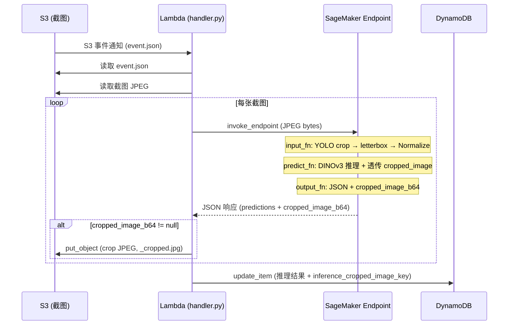
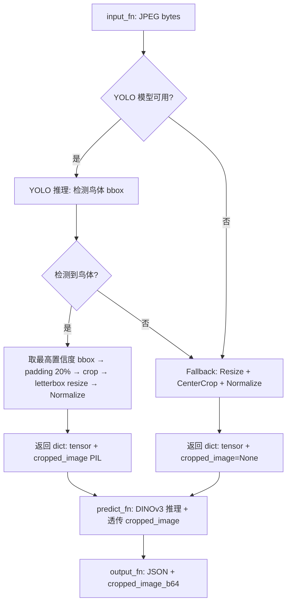

# 设计文档：Spec 30 — 推理链路 YOLO Crop 对齐

## 概述

本设计在 SageMaker endpoint 推理链路中加入 YOLO crop 步骤，消除 train-serving skew。核心改动集中在三个文件：`inference.py`（预处理 + 输出）、`handler.py`（crop 图片上传）、`packager.py`（打包 YOLO 模型）。

数据流：原始 JPEG → YOLO 检测鸟体 bbox → crop + padding 20% → letterbox resize 518×518 → Normalize → DINOv3 推理 → JSON 响应（含 crop 图片 base64）→ Lambda 提取 crop 上传 S3。

设计决策：
- YOLO crop 逻辑内联在 inference.py 中，不依赖 cleaning 模块（SageMaker 容器内没有 cleaning 模块）
- letterbox_resize 内联在 inference.py 中，与 `cleaning/cleaner.py` 中的实现行为等效
- 使用 yolo11s（~22MB）而非 yolo11x（~140MB），仅需定位鸟体位置，不需要高精度
- crop 图片通过 base64 编码放入 JSON 响应体（单张 ~70-140KB，远低于 6MB 限制），由 Lambda 负责上传 S3

## 架构

### 数据流图



### inference.py 内部流程



## 组件与接口

### 1. inference.py 修改

#### 新增模块级变量

```python
_yolo_model = None  # model_fn 加载后设置，供 input_fn 使用
BIRD_CLASS_ID = 14  # COCO class 14 = bird
```

#### model_fn 变更

在现有 model_fn 末尾增加 YOLO 模型加载：

```python
def model_fn(model_dir: str) -> dict:
    # ... 现有 DINOv3 加载逻辑不变 ...

    # 加载 YOLO 模型（可选）
    global _yolo_model
    yolo_path = os.path.join(model_dir, "yolo11s.pt")
    if os.path.exists(yolo_path):
        from ultralytics import YOLO
        _yolo_model = YOLO(yolo_path)
        logger.info("YOLO 模型加载完成: %s", yolo_path)
    else:
        _yolo_model = None
        logger.warning("未找到 YOLO 模型: %s，将使用原始预处理流程", yolo_path)

    return {
        "model": model,
        "transform": val_transform,
        "class_names": class_names,
        "metadata": metadata,
        "yolo_model": _yolo_model,
    }
```

#### 新增 _letterbox_resize 函数

内联实现，与 `cleaning/cleaner.py` 中的 `letterbox_resize` 行为等效：

```python
def _letterbox_resize(image: Image.Image, target_size: int) -> Image.Image:
    """Letterbox resize：等比缩放 + 黑色填充到 target_size × target_size。"""
    w, h = image.size
    scale = target_size / max(w, h)
    new_w = max(1, min(int(w * scale), target_size))
    new_h = max(1, min(int(h * scale), target_size))
    resized = image.resize((new_w, new_h), Image.LANCZOS)
    canvas = Image.new("RGB", (target_size, target_size), color=(0, 0, 0))
    paste_x = (target_size - new_w) // 2
    paste_y = (target_size - new_h) // 2
    canvas.paste(resized, (paste_x, paste_y))
    return canvas
```

#### 新增 _yolo_crop 函数

```python
def _yolo_crop(image: Image.Image, yolo_model, conf_threshold: float = 0.3, padding: float = 0.2) -> Image.Image | None:
    """YOLO 鸟体裁切。返回 letterbox resize 后的 PIL Image，未检测到鸟体时返回 None。"""
    results = yolo_model(image, verbose=False)
    bird_boxes = [
        box for box in results[0].boxes
        if int(box.cls) == BIRD_CLASS_ID and float(box.conf) >= conf_threshold
    ]
    if not bird_boxes:
        return None
    best = max(bird_boxes, key=lambda b: float(b.conf))
    x1, y1, x2, y2 = best.xyxy[0].tolist()
    w, h = x2 - x1, y2 - y1
    x1 = max(0, x1 - w * padding)
    y1 = max(0, y1 - h * padding)
    x2 = min(image.width, x2 + w * padding)
    y2 = min(image.height, y2 + h * padding)
    cropped = image.crop((int(x1), int(y1), int(x2), int(y2)))
    return _letterbox_resize(cropped, _input_size)
```

#### input_fn 变更

返回类型从 `torch.Tensor` 变为 `dict`：

```python
def input_fn(request_body: bytes, content_type: str) -> dict:
    """反序列化输入：JPEG 二进制 → dict(tensor, cropped_image)。"""
    # ... content_type 校验不变 ...
    image = Image.open(io.BytesIO(request_body)).convert("RGB")

    cropped_image = None
    if _yolo_model is not None:
        cropped_image = _yolo_crop(image, _yolo_model)

    if cropped_image is not None:
        # YOLO crop 路径：letterbox resize 后的图片 → ToImage → ToDtype → Normalize
        normalize = v2.Compose([
            v2.ToImage(),
            v2.ToDtype(torch.float32, scale=True),
            v2.Normalize(mean=IMAGENET_MEAN, std=IMAGENET_STD),
        ])
        tensor = normalize(cropped_image).unsqueeze(0)
    else:
        # 回退路径：原来的 Resize + CenterCrop + Normalize
        transform = _get_val_transform(_input_size)
        tensor = transform(image).unsqueeze(0)

    return {"tensor": tensor, "cropped_image": cropped_image}
```

#### predict_fn 变更

`input_data` 参数类型从 `torch.Tensor` 变为 `dict`：

```python
def predict_fn(input_data: dict, model_dict: dict) -> dict:
    """执行推理，透传 cropped_image 给 output_fn。"""
    tensor = input_data["tensor"]
    cropped_image = input_data["cropped_image"]
    model = model_dict["model"]
    # ... 推理逻辑不变 ...
    return {
        "predictions": predictions,
        "model_metadata": {...},
        "cropped_image": cropped_image,  # 透传
    }
```

#### output_fn 变更

新增 cropped_image base64 编码：

```python
import base64

def output_fn(prediction: dict, accept: str) -> tuple[str, str]:
    """序列化输出：prediction dict → JSON（含 cropped_image_b64）。"""
    cropped_image = prediction.pop("cropped_image", None)
    cropped_b64 = None
    if cropped_image is not None:
        buf = io.BytesIO()
        cropped_image.save(buf, format="JPEG", quality=95)
        cropped_b64 = base64.b64encode(buf.getvalue()).decode("ascii")
    prediction["cropped_image_b64"] = cropped_b64
    return json.dumps(prediction, ensure_ascii=False), "application/json"
```

### 2. packager.py 修改

`package_model` 函数新增 `yolo_model_path` 可选参数：

```python
def package_model(
    model_path: str,
    class_names_path: str,
    output_dir: str,
    s3_bucket: str | None = None,
    backbone_name: str = "dinov3-vitl16",
    yolo_model_path: str | None = None,  # 新增
) -> str:
    # ... 现有逻辑不变 ...
    with tarfile.open(tar_path, "w:gz") as tar:
        tar.add(local_model_path, arcname="bird_classifier.pt")
        tar.add(local_class_names_path, arcname="class_names.json")
        tar.add(inference_py, arcname="code/inference.py")
        tar.add(requirements_txt, arcname="code/requirements.txt")
        # 新增：打包 YOLO 模型
        if yolo_model_path:
            local_yolo_path = _resolve_path(yolo_model_path, staging_dir, "yolo11s.pt")
            tar.add(local_yolo_path, arcname="yolo11s.pt")
    # ...
```

### 3. handler.py 修改

在推理结果处理循环中，每张截图提取 crop 图片并上传 S3：

```python
import base64

# 在逐张推理循环内：
for jpg_key in snapshot_keys:
    # ... 现有推理逻辑 ...
    result_body = json.loads(response["Body"].read())

    # 提取并上传 crop 图片
    cropped_b64 = result_body.get("cropped_image_b64")
    cropped_s3_key = None
    if cropped_b64:
        base_name = jpg_key.rsplit(".", 1)[0]
        cropped_s3_key = base_name + "_cropped.jpg"
        try:
            cropped_bytes = base64.b64decode(cropped_b64)
            s3_client.put_object(
                Bucket=bucket, Key=cropped_s3_key,
                Body=cropped_bytes, ContentType="image/jpeg",
            )
        except Exception as e:
            logger.warning("crop 图片上传失败 %s: %s", cropped_s3_key, e)
            cropped_s3_key = None  # 上传失败时不记录 key

    inference_results.append({
        "image_key": jpg_key,
        "predictions": result_body["predictions"],
        "latency_ms": latency_ms,
        "cropped_s3_key": cropped_s3_key,  # 新增
    })
```

DynamoDB update_item 新增 `inference_cropped_image_key` 字段：

```python
if best:
    # 找到最佳预测对应的 cropped_s3_key
    best_cropped_key = None
    for r in inference_results:
        if r["image_key"] == best["image_key"]:
            best_cropped_key = r.get("cropped_s3_key")
            break

    update_expr_parts.append("inference_cropped_image_key = :cropped_key")
    expr_values[":cropped_key"] = best_cropped_key  # 可能为 None
```

### 4. deploy-inference-pipeline.sh 修改

`_put_lambda_policy` 函数中 S3 权限从 `s3:GetObject` 变为 `["s3:GetObject", "s3:PutObject"]`：

```bash
{
    "Effect": "Allow",
    "Action": ["s3:GetObject", "s3:PutObject"],
    "Resource": "arn:aws:s3:::'"${S3_CAPTURES_BUCKET}"'/*"
}
```

### 5. requirements.txt 修改

新增 `ultralytics` 依赖：

```
transformers>=4.56
Pillow
ultralytics
```

## 数据模型

### 更新后的 model.tar.gz 结构

```
model.tar.gz
├── bird_classifier.pt          # 分类模型（state_dict + 元数据）
├── class_names.json            # 类别映射
├── yolo11s.pt                  # YOLO 检测模型（~22MB，新增）
└── code/
    ├── inference.py            # 推理脚本（含 YOLO crop 逻辑 + crop 图片返回）
    └── requirements.txt        # 推理依赖（含 ultralytics）
```

### 更新后的 JSON 响应格式

```json
{
    "predictions": [
        {"species": "Passer montanus", "confidence": 0.92},
        {"species": "Pycnonotus sinensis", "confidence": 0.05}
    ],
    "model_metadata": {"backbone": "dinov3-vitl16", "num_classes": 46},
    "cropped_image_b64": "/9j/4AAQSkZJRg..."
}
```

回退路径（YOLO 未检测到鸟体）：

```json
{
    "predictions": [...],
    "model_metadata": {...},
    "cropped_image_b64": null
}
```

### 更新后的 DynamoDB 记录

```json
{
    "device_id": "RaspiEyeAlpha",
    "start_time": "2026-04-12T15:30:45Z",
    "inference_species": "Passer montanus",
    "inference_confidence": 0.92,
    "inference_image_key": "RaspiEyeAlpha/2026-04-12/evt_20260412_153045/20260412_153046_001.jpg",
    "inference_cropped_image_key": "RaspiEyeAlpha/2026-04-12/evt_20260412_153045/20260412_153046_001_cropped.jpg",
    "inference_top5": [...],
    "inference_latency_ms": 3200,
    "inference_error": null
}
```

### input_fn 返回 dict 结构

```python
{
    "tensor": torch.Tensor,       # shape: (1, 3, input_size, input_size)
    "cropped_image": Image | None  # YOLO crop 路径: PIL Image (518×518)，回退路径: None
}
```

### predict_fn 输出 dict 结构

```python
{
    "predictions": [{"species": str, "confidence": float}, ...],
    "model_metadata": {"backbone": str, "num_classes": int},
    "cropped_image": Image | None  # 透传自 input_fn
}
```

## Correctness Properties

*A property is a characteristic or behavior that should hold true across all valid executions of a system — essentially, a formal statement about what the system should do. Properties serve as the bridge between human-readable specifications and machine-verifiable correctness guarantees.*

### Property 1: letterbox_resize 输出尺寸不变量

*For any* PIL Image with width ∈ [1, 4000] and height ∈ [1, 4000], calling `_letterbox_resize(image, target_size)` SHALL produce an output image of exactly (target_size, target_size) pixels.

**Validates: Requirements 2.2, 8.1**

### Property 2: 内联 letterbox_resize 与 cleaning 版等价性

*For any* PIL Image with width ∈ [1, 4000] and height ∈ [1, 4000], the output of `inference._letterbox_resize(image, 518)` SHALL be pixel-identical to `cleaning.cleaner.letterbox_resize(image, 518)`.

**Validates: Requirements 2.2**

### Property 3: input_fn 输出结构不变量

*For any* valid JPEG image (width ∈ [32, 2048], height ∈ [32, 2048]) and any YOLO detection state (有检测结果 / 无检测结果 / YOLO 模型不可用), `input_fn` SHALL return a dict containing:
- `tensor` key with shape (1, 3, input_size, input_size)
- `cropped_image` key that is either a PIL Image of size (input_size, input_size) or None

**Validates: Requirements 2.1, 2.3, 2.4, 2.7, 2.8, 2.9**

### Property 4: 推理 round-trip 不变量（含 cropped_image_b64）

*For any* valid JPEG image, the complete pipeline `input_fn → predict_fn → output_fn` SHALL produce a valid JSON string containing:
- `predictions` list (length ∈ [1, 5], each with non-empty species and confidence ∈ (0, 1])
- `model_metadata` with non-empty backbone and positive num_classes
- `cropped_image_b64` field that is either a valid base64 string (decodable to JPEG bytes) or null

**Validates: Requirements 2.1, 2.3, 3.1, 3.2, 3.3, 3.4**

### Property 5: crop 文件名转换不变量

*For any* valid S3 key ending with a file extension (e.g., `.jpg`), the crop key SHALL equal the original key with the extension replaced by `_cropped.jpg`.

**Validates: Requirements 6.2**

## Error Handling

| 场景 | 处理方式 | 影响范围 |
|------|---------|---------|
| `yolo11s.pt` 不存在于 model_dir | model_fn 记录 warning，`_yolo_model = None`，回退到原始预处理 | 推理正常，无 crop 图片 |
| YOLO 推理未检测到鸟体 | input_fn 回退到 Resize + CenterCrop + Normalize，`cropped_image = None` | 推理正常，无 crop 图片 |
| YOLO 推理抛出异常 | input_fn 捕获异常，记录 warning，回退到原始预处理 | 推理正常，无 crop 图片 |
| crop 图片 base64 编码失败 | output_fn 捕获异常，`cropped_image_b64 = null` | 推理正常，无 crop 图片 |
| Lambda crop 图片 S3 上传失败 | handler 记录 warning，`cropped_s3_key = None`，继续处理 | 推理结果正常写入 DynamoDB，无 crop key |
| Lambda base64 解码失败 | 同上，记录 warning 并继续 | 同上 |
| DynamoDB 写入 top5 predictions 含 float | handler 将 predictions 列表中的 confidence 逐项转为 Decimal | DynamoDB 写入正常（部署时发现，已修复） |

关键原则：YOLO crop 是增强功能，任何 YOLO 相关的失败都不应影响核心推理链路。所有 YOLO 相关异常都捕获并回退到原始流程。

## 部署注意事项（实施中发现）

1. **S3 bucket region 必须与 SageMaker endpoint 一致**：`raspi-eye-model-data` bucket 在 us-east-1，SageMaker endpoint 在 ap-southeast-1，导致 CreateModel 失败。解决方案：将 model.tar.gz 上传到 ap-southeast-1 的 `raspi-eye-captures-*` bucket
2. **DynamoDB float 类型不兼容**：SageMaker 返回的 JSON 中 predictions 的 confidence 是 float，DynamoDB 不接受 float，必须转为 Decimal。handler.py 中 `expr_values[":top5"]` 需要逐项转换
3. **packager.py 的 class_names.json**：checkpoint 中已内嵌 class_names，但 packager 仍需要单独的 class_names.json 文件。可从 checkpoint metadata 导出

## Testing Strategy

### 测试框架

- pytest + Hypothesis（PBT）
- 所有测试在本地 CPU 环境运行，不依赖真实 YOLO 模型权重或 AWS 服务
- YOLO 模型使用 mock（返回预设 bbox 或空结果）

### Property-Based Tests（Hypothesis，每个 ≥ 100 iterations）

| Property | 测试文件 | 说明 |
|----------|---------|------|
| Property 1: letterbox_resize 尺寸不变量 | test_endpoint.py | 随机宽高 [1, 4000]，验证输出尺寸 |
| Property 2: letterbox_resize 等价性 | test_endpoint.py | 随机宽高 [1, 4000]，对比内联版和 cleaning 版 |
| Property 3: input_fn 输出结构不变量 | test_endpoint.py | 随机图片 + 随机 YOLO 状态，验证 dict 结构 |
| Property 4: 推理 round-trip（含 cropped_image_b64） | test_endpoint.py | 更新现有 round-trip PBT，验证新增字段 |
| Property 5: crop 文件名转换不变量 | test_lambda.py | 随机 S3 key，验证 crop key 格式 |

每个 PBT 测试标注：`Feature: inference-yolo-crop, Property {N}: {property_text}`

### Unit Tests（Example-Based）

**test_endpoint.py 新增：**
- model_fn 加载 YOLO 模型：验证返回字典包含 `yolo_model` 键
- model_fn YOLO 模型不存在：验证 `yolo_model` 为 None
- input_fn YOLO crop 路径：mock YOLO 返回 bbox，验证 cropped_image 非 None
- input_fn 回退路径：mock YOLO 返回空结果，验证 cropped_image 为 None
- output_fn cropped_image_b64：验证 YOLO crop 路径下为合法 base64，回退路径下为 null
- model.tar.gz 打包含 yolo11s.pt：验证 tar.gz 根目录包含 yolo11s.pt

**test_lambda.py 新增：**
- crop 图片上传：mock endpoint 响应含 cropped_image_b64，验证 s3:PutObject 调用
- crop 图片为 null 跳过：验证不调用 s3:PutObject
- DynamoDB inference_cropped_image_key：验证 update_item 包含该字段
- crop 上传失败不影响推理：mock s3 put_object 抛异常，验证推理结果仍写入 DynamoDB

### Mock 策略

- YOLO 模型：mock `ultralytics.YOLO`，返回预设的 `results[0].boxes`（含 cls、conf、xyxy 属性）
- SageMaker：mock `sm_runtime.invoke_endpoint`，返回预设 JSON 响应（含 cropped_image_b64）
- S3：mock `s3_client.get_object` 和 `s3_client.put_object`
- DynamoDB：mock `table.update_item`

### 验证命令

```bash
source .venv-raspi-eye/bin/activate
pytest model/tests/test_endpoint.py -v
pytest model/tests/test_lambda.py -v
```
