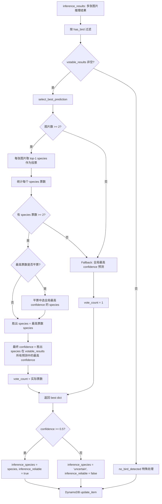
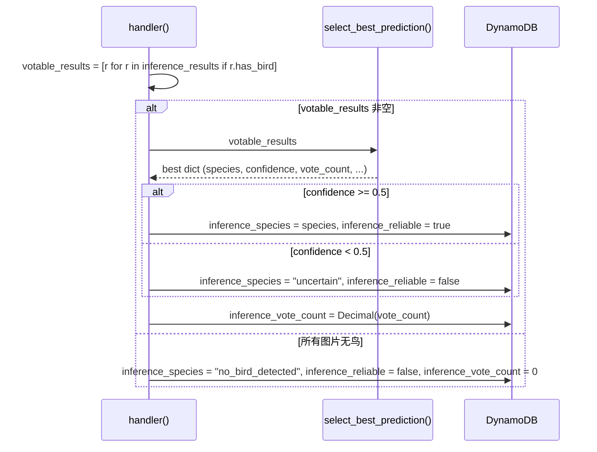

# 设计文档：Spec 31 — Lambda 端多图投票与置信度门槛

## 概述

本 Spec 在 Lambda 推理链路中引入三项改进：

1. **投票逻辑**：`handler.py` 的 `select_best_prediction` 从"全局最高 confidence"改为"多数投票 + 回退"，减少单张模糊图片的误导
2. **置信度门槛**：最终 confidence < 0.5 时标记 `inference_species = "uncertain"`，DynamoDB 新增 `inference_reliable` 和 `inference_vote_count` 字段
3. **YOLO 升级**：`inference.py` 云端 YOLO 从 yolo11s 升级为 yolo11x（~140MB），检测阈值从 0.3 提高到 0.4，`packager.py` arcname 改为动态推断

涉及 5 个文件：

| 文件 | 改动内容 |
|------|---------|
| `model/lambda/handler.py` | 投票逻辑重构 + has_bird 过滤 + 置信度门槛 + DynamoDB 新字段 |
| `model/tests/test_lambda.py` | 投票 PBT + 门槛单元测试 + 更新现有 PBT |
| `model/endpoint/inference.py` | model_fn YOLO 回退加载 + _yolo_crop 阈值 0.4 |
| `model/endpoint/packager.py` | arcname 从 yolo_model_path 文件名推断 |
| `model/tests/test_endpoint.py` | YOLO 回退/优先级测试 + 阈值测试 + packager 测试 |

设计决策：
- 投票逻辑内联在 `select_best_prediction` 函数中，返回值新增 `vote_count` 字段
- 置信度门槛判断在 handler 函数中、DynamoDB 写入之前执行（不在 select_best_prediction 中）
- `CONFIDENCE_THRESHOLD = 0.5` 作为模块级常量硬编码
- `has_bird` 标记基于 endpoint 响应中 `cropped_image_b64` 是否为 null（不是 `cropped_s3_key`）
- 所有 DynamoDB 数值（包括 `inference_vote_count`）必须转为 `Decimal(str(round(value, 6)))`

## 架构

### 投票流程图



### 数据流（handler 函数内）



## 组件与接口

### 组件 A: handler.py 投票逻辑 + 置信度门槛

#### 模块级常量

```python
CONFIDENCE_THRESHOLD = 0.5  # 置信度门槛
```

#### select_best_prediction 函数重构

```python
def select_best_prediction(results: list[dict]) -> dict:
    """从多张图片的推理结果中选取最佳预测（多数投票 + 回退）。

    投票逻辑：
    1. 每张图片取 top-1（confidence 最高）预测的 species 作为投票
    2. 统计每个 species 的票数，选最高票数的 species
    3. 平票时选全局最高 confidence 的 species
    4. 票数不足 2 时回退到全局最高 confidence

    Args:
        results: 推理结果列表（仅包含 has_bird=True 的图片），每项包含:
            - image_key: S3 图片 key
            - predictions: top-5 预测列表
            - latency_ms: 推理耗时

    Returns:
        最佳预测 dict，包含:
            species, confidence, image_key, top5_predictions, latency_ms, vote_count
    """
```

返回值结构（新增 `vote_count`）：

```python
{
    "species": str,
    "confidence": float,
    "image_key": str,
    "top5_predictions": list[dict],
    "latency_ms": float,
    "vote_count": int,  # 新增：投票胜出票数，回退时为 1
}
```

#### 投票算法伪代码

```python
# Step 1: 每张图片取 top-1 species
votes = []
for result in results:
    top1 = max(result["predictions"], key=lambda p: p["confidence"])
    votes.append(top1["species"])

# Step 2: 统计票数
from collections import Counter
vote_counts = Counter(votes)
max_count = max(vote_counts.values())

# Step 3: 判断是否启用投票
if max_count >= 2:
    # 投票生效：取最高票数的 species（平票时选全局最高 confidence）
    candidates = [sp for sp, cnt in vote_counts.items() if cnt == max_count]
    if len(candidates) == 1:
        winner = candidates[0]
    else:
        # 平票：每个 candidate 取其在 results 所有预测中的最高 confidence，选最大的
        winner = max(candidates, key=lambda sp: _max_confidence_for_species(results, sp))

    # 最终 confidence = winner species 在 results（参与投票的图片）所有预测中的最高 confidence
    best_confidence = _max_confidence_for_species(results, winner)
    vote_count = vote_counts[winner]
    # 找到对应的 image_key、top5_predictions、latency_ms（从给出最高 confidence 的那张图片取）
    ...
else:
    # 回退：全局最高 confidence
    # vote_count = 1
    ...
```

#### handler 函数 has_bird 过滤 + DynamoDB 写入变更

```python
# 在推理循环中，记录 has_bird 标记（基于 cropped_image_b64，不是 cropped_s3_key）
has_bird = cropped_b64 is not None
inference_results.append({
    "image_key": jpg_key,
    "predictions": result_body["predictions"],
    "latency_ms": latency_ms,
    "cropped_s3_key": cropped_s3_key,
    "has_bird": has_bird,  # 新增：云端 YOLO 是否检测到鸟
})

# 投票前过滤：仅 has_bird=True 的图片参与投票
votable_results = [r for r in inference_results if r.get("has_bird", False)]
if votable_results:
    best = select_best_prediction(votable_results)
elif inference_results:
    # 所有图片都没检测到鸟 → no_bird_detected 特殊处理
    best = None
```

正常路径（best 非 None）DynamoDB 写入：

```python
if best:
    species = best["species"]
    confidence = best["confidence"]
    vote_count = best["vote_count"]

    # 置信度门槛判断
    if confidence >= CONFIDENCE_THRESHOLD:
        reliable = True
    else:
        species = "uncertain"
        reliable = False

    update_expr_parts.extend([
        "inference_species = :species",
        "inference_confidence = :confidence",
        "inference_image_key = :image_key",
        "inference_top5 = :top5",
        "inference_latency_ms = :latency_ms",
        "inference_cropped_image_key = :cropped_key",
        "inference_reliable = :reliable",          # 新增
        "inference_vote_count = :vote_count",      # 新增
    ])
    expr_values[":species"] = species  # 可能被替换为 "uncertain"
    expr_values[":confidence"] = Decimal(str(round(confidence, 6)))
    expr_values[":reliable"] = reliable  # boolean
    expr_values[":vote_count"] = Decimal(str(vote_count))  # int → Decimal
    # ... 其余字段不变 ...
```

no_bird_detected 路径（best 为 None 且 inference_results 非空）DynamoDB 写入：

```python
if best is None and inference_results:
    # 所有图片云端 YOLO 均未检测到鸟
    update_expr_parts.extend([
        "inference_species = :species",
        "inference_confidence = :confidence",
        "inference_image_key = :image_key",
        "inference_reliable = :reliable",
        "inference_vote_count = :vote_count",
    ])
    expr_values[":species"] = "no_bird_detected"
    expr_values[":confidence"] = Decimal("0")
    expr_values[":image_key"] = "N/A"
    expr_values[":reliable"] = False
    expr_values[":vote_count"] = Decimal("0")
```

### 组件 B: inference.py YOLO 模型升级

#### model_fn 变更

优先加载 yolo11x.pt，回退 yolo11s.pt，都不存在则 `_yolo_model = None`：

```python
# 加载 YOLO 模型：优先 yolo11x.pt，回退 yolo11s.pt
yolo_path = os.path.join(model_dir, "yolo11x.pt")
if not os.path.exists(yolo_path):
    yolo_path = os.path.join(model_dir, "yolo11s.pt")
if os.path.exists(yolo_path):
    from ultralytics import YOLO
    _yolo_model = YOLO(yolo_path)
    logger.info("YOLO 模型加载完成: %s", yolo_path)
else:
    _yolo_model = None
    logger.warning("未找到 YOLO 模型，将使用原始预处理流程")
```

#### _yolo_crop 阈值变更

```python
def _yolo_crop(image, yolo_model, conf_threshold=0.4, padding=0.2):
    # conf_threshold 从 0.3 提高到 0.4（与 Spec 28 训练时一致）
    # BIRD_CLASS_ID = 14 和 padding = 0.2 保持不变
```

### 组件 C: packager.py 动态 arcname

`package_model` 中 YOLO 打包逻辑改为从 `yolo_model_path` 的文件名推断 arcname（不再硬编码 `yolo11s.pt`）：

```python
if yolo_model_path:
    yolo_filename = os.path.basename(yolo_model_path)  # e.g. "yolo11x.pt"
    local_yolo_path = _resolve_path(yolo_model_path, staging_dir, yolo_filename)
    tar.add(local_yolo_path, arcname=yolo_filename)
```

## 数据模型

### 更新后的 DynamoDB 记录

正常投票场景：

```json
{
    "device_id": "RaspiEyeAlpha",
    "start_time": "2026-04-12T15:30:45Z",
    "inference_species": "Passer montanus",
    "inference_confidence": 0.92,
    "inference_image_key": "RaspiEyeAlpha/.../20260412_153046_001.jpg",
    "inference_cropped_image_key": "RaspiEyeAlpha/.../20260412_153046_001_cropped.jpg",
    "inference_top5": [...],
    "inference_latency_ms": 3200,
    "inference_reliable": true,
    "inference_vote_count": 3,
    "inference_error": null
}
```

低置信度场景：

```json
{
    "inference_species": "uncertain",
    "inference_confidence": 0.35,
    "inference_reliable": false,
    "inference_vote_count": 2
}
```

回退场景（票数不足 2）：

```json
{
    "inference_species": "Passer montanus",
    "inference_confidence": 0.88,
    "inference_reliable": true,
    "inference_vote_count": 1
}
```

no_bird_detected 场景（所有图片云端 YOLO 均未检测到鸟）：

```json
{
    "inference_species": "no_bird_detected",
    "inference_confidence": 0,
    "inference_image_key": "N/A",
    "inference_reliable": false,
    "inference_vote_count": 0
}
```

### 新增字段说明

| 字段 | 类型 | DynamoDB 类型 | 说明 |
|------|------|-------------|------|
| `inference_reliable` | bool | BOOL | confidence >= 0.5 为 true，否则 false |
| `inference_vote_count` | int | N (Decimal) | 胜出 species 的票数，回退时为 1，no_bird_detected 时为 0 |

### select_best_prediction 返回值结构

```python
{
    "species": "Passer montanus",
    "confidence": 0.92,
    "image_key": "RaspiEyeAlpha/.../20260412_153046_001.jpg",
    "top5_predictions": [
        {"species": "Passer montanus", "confidence": 0.92},
        {"species": "Pycnonotus sinensis", "confidence": 0.05},
    ],
    "latency_ms": 3200.5,
    "vote_count": 3,
}
```


## Correctness Properties

*A property is a characteristic or behavior that should hold true across all valid executions of a system — essentially, a formal statement about what the system should do. Properties serve as the bridge between human-readable specifications and machine-verifiable correctness guarantees.*

### Property 1: 投票胜出不变量

*For any* 包含 2 张及以上图片的推理结果列表，且存在某个 species 获得 >= 2 票时，`select_best_prediction` 返回的结果 SHALL 满足：
1. 返回的 `species` 的票数（每张图片 top-1 species 中该 species 的出现次数）>= 所有其他 species 的票数
2. 返回的 `confidence` 等于该 species 在参与投票的图片的所有预测中的最高 confidence
3. 返回的 `vote_count` 等于该 species 的实际票数

**Validates: Requirements 1.1, 1.2, 1.3, 1.4, 5.2, 5.3**

### Property 2: 回退不变量

*For any* 推理结果列表，当没有任何 species 获得 >= 2 票时（包括仅 1 张图片的情况），`select_best_prediction` 返回的结果 SHALL 满足：
1. 返回的 `confidence` 等于所有图片所有预测中的全局最高 confidence
2. 返回的 `species` 等于全局最高 confidence 对应的 species
3. 返回的 `vote_count` 等于 1

**Validates: Requirements 1.5, 1.6, 3.3, 5.4**

## Error Handling

| 场景 | 处理方式 | 影响范围 |
|------|---------|---------|
| 所有图片推理失败（inference_results 为空） | handler 保持现有逻辑：best = None，写入 inference_error = "no inference results" | 不触发投票逻辑 |
| 仅 1 张图片推理成功（且 has_bird=True） | select_best_prediction 回退到全局最高 confidence，vote_count = 1 | 正常写入 DynamoDB |
| 所有图片预测同一 species（无争议） | 投票胜出，vote_count = 图片数 | 正常写入 DynamoDB |
| 多个 species 平票 | 选全局最高 confidence 的 species 打破平票 | 正常写入 DynamoDB |
| confidence 恰好等于 0.5 | >= 0.5 判断为 reliable = true | 正常写入 DynamoDB |
| SageMaker 调用异常 | 保持现有 inference_error 写入逻辑不变 | 不触发投票逻辑 |
| event.json 格式错误 | 保持现有跳过逻辑不变 | 不触发投票逻辑 |
| 所有图片云端 YOLO 均未检测到鸟 | handler 写入 `inference_species = "no_bird_detected"`，`inference_confidence = 0`，`inference_image_key = "N/A"`，`inference_reliable = false`，`inference_vote_count = 0` | 不触发投票逻辑，DynamoDB 仍写入完整记录 |
| 部分图片云端 YOLO 未检测到鸟 | 仅 has_bird=True 的图片参与投票（votable_results），未检测到的跳过 | 投票基数减少，可能触发回退 |

## 禁止项

- SHALL NOT 在 Lambda handler 中将 JSON 解析出的 float 直接写入 DynamoDB（来源：spec-30 部署验证）
  - 所有写入 DynamoDB 的数值必须先转为 `Decimal(str(round(value, 6)))`，包括 `inference_vote_count`
- SHALL NOT 使用 yolo11x（~140MB）做推理检测（来源：spec-30 requirements）→ **本 Spec 解除此限制，云端升级为 yolo11x**

## Testing Strategy

### 测试框架

- pytest + Hypothesis（PBT）
- 所有测试在本地 CPU 环境运行，不依赖 AWS 服务
- SageMaker、S3、DynamoDB 使用 mock

### Property-Based Tests（Hypothesis，每个 >= 100 iterations）

| Property | 测试文件 | 说明 |
|----------|---------|------|
| Property 1: 投票胜出不变量 | test_lambda.py | 生成 2-10 张图片、每张 1-5 个预测，确保存在 species 票数 >= 2，验证投票逻辑不变量 |
| Property 2: 回退不变量 | test_lambda.py | 生成 1-10 张图片（确保无 species 票数 >= 2），验证回退逻辑不变量 |

每个 PBT 测试标注：`Feature: inference-voting-threshold, Property {N}: {property_text}`

### Unit Tests（Example-Based）

**test_lambda.py 新增：**

1. 投票场景 — 3 张图片中 2 张 top-1 为同一 species：验证返回该 species 及正确 vote_count
2. 平票场景 — 2 个 species 各 2 票：验证选全局最高 confidence 的 species
3. 回退场景 — 3 张图片 top-1 各不同：验证回退到全局最高 confidence，vote_count = 1
4. 单图场景 — 仅 1 张图片：验证回退逻辑，vote_count = 1
5. 置信度门槛 — confidence >= 0.5：验证 DynamoDB 写入 species 不变，reliable = true
6. 置信度门槛 — confidence < 0.5：验证 DynamoDB 写入 "uncertain"，reliable = false
7. DynamoDB 字段完整性：验证 UpdateExpression 包含 inference_reliable 和 inference_vote_count
8. DynamoDB 类型正确性：验证 :reliable 为 bool，:vote_count 为 Decimal
9. 向后兼容 — 推理失败：验证 inference_error 写入逻辑不变
10. 向后兼容 — 现有字段保留：验证所有 Spec 17/30 定义的字段仍存在
11. has_bird 过滤 — 部分图片无鸟：验证仅 has_bird=True 的图片参与投票
12. no_bird_detected — 所有图片无鸟：验证 DynamoDB 写入 no_bird_detected、reliable=false、vote_count=0

**test_lambda.py 更新：**

- 现有 `TestSelectBestPredictionInvariant` PBT 需要更新：返回值新增 vote_count 字段，原有的 "confidence == 全局最大值" 断言仅在回退路径成立，投票路径下 confidence 是胜出 species 在 votable_results 所有预测中的最高 confidence（不一定是全局最大值）

**test_endpoint.py 新增/更新：**

- model_fn YOLO 回退测试：model_dir 中无 yolo11x.pt 但有 yolo11s.pt → 验证加载 yolo11s.pt
- model_fn YOLO 优先级测试：model_dir 中同时有 yolo11x.pt 和 yolo11s.pt → 验证加载 yolo11x.pt
- _yolo_crop 阈值测试：验证 conf_threshold 默认值为 0.4
- packager 动态 arcname 测试：传入 yolo11x.pt 路径 → 验证 tar.gz 中 arcname 为 yolo11x.pt（不是 yolo11s.pt）

### Mock 策略

- SageMaker：mock `sm_runtime.invoke_endpoint`，返回预设 JSON 响应（含 `cropped_image_b64` 字段控制 has_bird）
- S3：mock `s3_client.get_object` 和 `s3_client.put_object`
- DynamoDB：mock `table.update_item`

### 验证命令

```bash
source .venv-raspi-eye/bin/activate
pytest model/tests/test_lambda.py model/tests/test_endpoint.py -v
```
