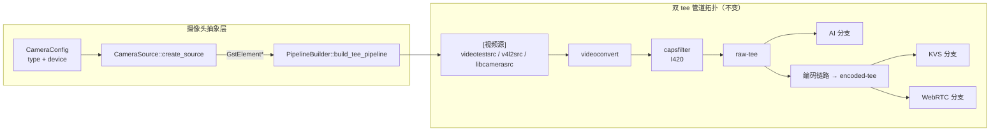
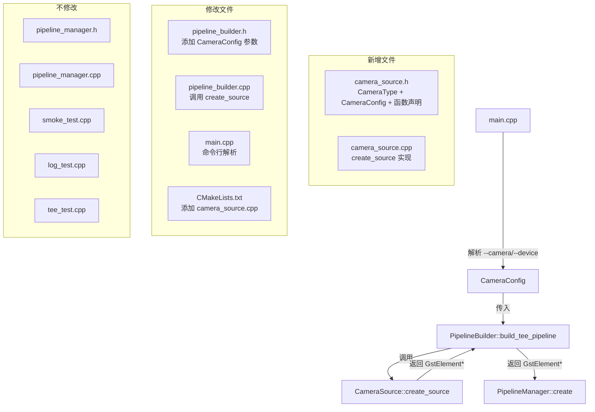

# 设计文档：Spec 4 — 摄像头接口抽象层

## 概述

本设计将 `build_tee_pipeline()` 中硬编码的 `videotestsrc` 视频源解耦为可配置的摄像头抽象层 `CameraSource`。核心交付物是 `CameraSource` namespace（纯工厂函数，无状态）和 `build_tee_pipeline()` 的参数扩展。

设计目标：
- 新增 `CameraSource` namespace，提供 `CameraType` 枚举、`CameraConfig` POD 结构体、`create_source()` 工厂函数
- 扩展 `build_tee_pipeline()` 接受 `CameraConfig` 默认参数，替换硬编码的 `videotestsrc`
- `main.cpp` 添加 `--camera` 和 `--device` 命令行参数解析
- macOS 自动使用 `videotestsrc`，Pi 5 默认使用 `v4l2src`（可切换 `libcamerasrc`）
- 现有 `tee_test`、`smoke_test`、`log_test` 零修改通过

设计决策：
- **CameraSource 是 namespace 而非 class**：无状态，所有函数都是纯工厂函数或纯函数，不需要实例化。与 `PipelineBuilder` 风格一致。
- **CameraType 枚举 + CameraConfig POD 可 header-only**：纯 POD 结构体和枚举无复杂逻辑，符合 `.kiro/steering/cpp-standards.md` 的例外规则。
- **默认参数而非重载**：`build_tee_pipeline(CameraConfig, std::string*)` 使用默认参数 `CameraConfig{}`，现有无参调用点（`tee_test.cpp`）和 `main.cpp` 无需修改。
- **条件编译只隔离平台头文件/链接库**：`gst_element_factory_make` 在插件不存在时安全返回 `nullptr`，GStreamer 工厂调用本身不需要条件编译。条件编译仅用于 `default_camera_type()` 返回值和未来可能的平台头文件引入。

## 架构



### 模块关系



### 文件布局

```
device/
├── CMakeLists.txt              # 修改：添加 camera_source.cpp 到 pipeline_manager 库
├── src/
│   ├── camera_source.h         # 新增：CameraType 枚举、CameraConfig 结构体、函数声明
│   ├── camera_source.cpp       # 新增：create_source 等函数实现
│   ├── pipeline_builder.h      # 修改：build_tee_pipeline 添加 CameraConfig 默认参数
│   ├── pipeline_builder.cpp    # 修改：调用 CameraSource::create_source 替换硬编码
│   ├── main.cpp                # 修改：添加 --camera/--device 命令行解析
│   ├── pipeline_manager.h      # 不修改
│   ├── pipeline_manager.cpp    # 不修改
│   └── ...
└── tests/
    ├── camera_test.cpp         # 新增：摄像头抽象层测试
    ├── smoke_test.cpp          # 不修改
    ├── log_test.cpp            # 不修改
    └── tee_test.cpp            # 不修改
```

## 组件与接口

### CameraSource 接口（camera_source.h）

```cpp
// camera_source.h
// 摄像头抽象层：根据配置创建对应的 GStreamer 视频源元素
#pragma once
#include <gst/gst.h>
#include <string>

namespace CameraSource {

// 摄像头类型枚举
enum class CameraType {
    TEST,       // videotestsrc（macOS 开发环境）
    V4L2,       // v4l2src（IMX678 USB 摄像头，Pi 5 主力）
    LIBCAMERA   // libcamerasrc（IMX216 CSI 摄像头，Pi 5 备用）
};

// 摄像头配置（POD 结构体，header-only）
struct CameraConfig {
    CameraType type = default_camera_type();
    std::string device;  // v4l2src 设备路径，默认空（create_source 中回退到 /dev/video0）
};

// 返回当前平台的默认摄像头类型
// macOS → TEST，Linux → V4L2
CameraType default_camera_type();

// 返回 CameraType 对应的人类可读名称
// TEST → "videotestsrc"，V4L2 → "v4l2src"，LIBCAMERA → "libcamerasrc"
const char* camera_type_name(CameraType type);

// 根据配置创建 GStreamer 视频源元素
// 成功返回 GstElement*（元素名 "src"），失败返回 nullptr
// error_msg 接收错误详情（可选）
GstElement* create_source(const CameraConfig& config,
                          std::string* error_msg = nullptr);

// 从字符串解析 CameraType（命令行参数解析用）
// 接受 "test"、"v4l2"、"libcamera"（大小写不敏感）
// 成功返回 true 并设置 out_type，失败返回 false
bool parse_camera_type(const std::string& str, CameraType& out_type);

} // namespace CameraSource
```

设计决策：
- `CameraConfig` 默认构造函数调用 `default_camera_type()`，使得 `CameraConfig{}` 在 macOS 上自动为 TEST，在 Linux 上自动为 V4L2。
- `parse_camera_type()` 放在 CameraSource namespace 中而非 main.cpp，便于测试和复用。
- `camera_type_name()` 返回 `const char*` 而非 `std::string`，避免不必要的堆分配。
- `device` 字段默认为空字符串，`create_source()` 内部在 V4L2 类型且 device 为空时回退到 `/dev/video0`。

### CameraSource 实现要点（camera_source.cpp）

```cpp
// camera_source.cpp
#include "camera_source.h"
#include <spdlog/spdlog.h>
#include <algorithm>
#include <cctype>

namespace CameraSource {

CameraType default_camera_type() {
#ifdef __APPLE__
    return CameraType::TEST;
#else
    return CameraType::V4L2;
#endif
}

const char* camera_type_name(CameraType type) {
    switch (type) {
        case CameraType::TEST:      return "videotestsrc";
        case CameraType::V4L2:      return "v4l2src";
        case CameraType::LIBCAMERA: return "libcamerasrc";
    }
    return "unknown";
}

GstElement* create_source(const CameraConfig& config,
                          std::string* error_msg) {
    const char* factory_name = camera_type_name(config.type);
    GstElement* src = gst_element_factory_make(factory_name, "src");

    if (!src) {
        if (error_msg) {
            *error_msg = "Failed to create camera source: ";
            *error_msg += factory_name;
            *error_msg += " (plugin not available)";
        }
        return nullptr;
    }

    // V4L2 设置设备路径
    if (config.type == CameraType::V4L2) {
        const char* dev = config.device.empty() ? "/dev/video0" : config.device.c_str();
        g_object_set(G_OBJECT(src), "device", dev, nullptr);

        auto pl = spdlog::get("pipeline");
        if (pl) pl->info("Camera source created: v4l2src (device={})", dev);
    } else {
        auto pl = spdlog::get("pipeline");
        if (pl) pl->info("Camera source created: {}", factory_name);
    }

    return src;
}

bool parse_camera_type(const std::string& str, CameraType& out_type) {
    std::string lower = str;
    std::transform(lower.begin(), lower.end(), lower.begin(),
                   [](unsigned char c) { return std::tolower(c); });

    if (lower == "test")      { out_type = CameraType::TEST;      return true; }
    if (lower == "v4l2")      { out_type = CameraType::V4L2;      return true; }
    if (lower == "libcamera") { out_type = CameraType::LIBCAMERA; return true; }
    return false;
}

} // namespace CameraSource
```

### PipelineBuilder 接口变更（pipeline_builder.h）

```cpp
// pipeline_builder.h — 变更部分
#pragma once
#include <gst/gst.h>
#include <string>
#include "camera_source.h"

namespace PipelineBuilder {

// 构建双 tee 管道
// error_msg 在前，保持与原签名 build_tee_pipeline(std::string*) 的调用兼容
// 现有 tee_test.cpp 中 build_tee_pipeline(&err) 无需修改
GstElement* build_tee_pipeline(
    std::string* error_msg = nullptr,
    CameraSource::CameraConfig config = CameraSource::CameraConfig{});

} // namespace PipelineBuilder
```

设计决策：
- `error_msg` 参数在 `config` 之前，保持与原签名 `build_tee_pipeline(std::string*)` 的调用兼容性。现有 `tee_test.cpp` 中 `build_tee_pipeline(&err)` 无需修改，`&err` 仍然匹配到第一个参数 `error_msg`。
- 使用值传递 `CameraConfig`（POD 结构体，含一个 `std::string`），避免悬空引用风险。
- 默认值 `CameraConfig{}` 调用 `default_camera_type()`，确保平台自适应。

### PipelineBuilder 实现变更（pipeline_builder.cpp）

核心变更：将硬编码的 `gst_element_factory_make("videotestsrc", "src")` 替换为 `CameraSource::create_source(config, error_msg)`。

```cpp
// pipeline_builder.cpp — 关键变更

GstElement* PipelineBuilder::build_tee_pipeline(
    std::string* error_msg,
    CameraSource::CameraConfig config)
{
    // 1. Pipeline container（不变）
    GstElement* pipeline = gst_pipeline_new("tee-pipeline");

    // 2. 创建视频源 — 替换硬编码
    GstElement* src = CameraSource::create_source(config, error_msg);
    // ... 其余元素创建不变 ...

    // 后续逻辑完全不变
}
```

### main.cpp 命令行解析变更

```cpp
// main.cpp — 关键变更
#include "camera_source.h"

static int run_pipeline(int argc, char* argv[]) {
    // 解析命令行参数
    bool use_json = false;
    CameraSource::CameraConfig cam_config;
    bool has_device = false;

    for (int i = 1; i < argc; ++i) {
        std::string arg(argv[i]);
        if (arg == "--log-json") {
            use_json = true;
        } else if (arg == "--camera" && i + 1 < argc) {
            CameraSource::CameraType type;
            if (!CameraSource::parse_camera_type(argv[++i], type)) {
                // 初始化日志后记录错误并退出
                log_init::init(use_json);
                auto logger = spdlog::get("main");
                if (logger) logger->error("Invalid camera type: {}", argv[i]);
                log_init::shutdown();
                return 1;
            }
            cam_config.type = type;
        } else if (arg == "--device" && i + 1 < argc) {
            cam_config.device = argv[++i];
            has_device = true;
        }
    }

    log_init::init(use_json);
    auto logger = spdlog::get("main");

    // --device 仅对 v4l2 有效，其他类型时 warn
    if (has_device && cam_config.type != CameraSource::CameraType::V4L2) {
        if (logger) logger->warn("--device ignored (only used with v4l2)");
    }

    // 记录启动摄像头类型
    if (logger) {
        if (cam_config.type == CameraSource::CameraType::V4L2) {
            const char* dev = cam_config.device.empty() ? "/dev/video0" : cam_config.device.c_str();
            logger->info("Starting with camera: v4l2src (device={})", dev);
        } else {
            logger->info("Starting with camera: {}",
                         CameraSource::camera_type_name(cam_config.type));
        }
    }

    // 构建管道 — 传入摄像头配置
    std::string err_msg;
    GstElement* raw_pipeline = PipelineBuilder::build_tee_pipeline(&err_msg, cam_config);
    // ... 后续逻辑不变 ...
}
```

### CMakeLists.txt 变更

```cmake
# 修改 pipeline_manager 库，添加 camera_source.cpp
add_library(pipeline_manager STATIC
    src/pipeline_manager.cpp
    src/pipeline_builder.cpp
    src/camera_source.cpp)
# 其余 target 配置不变

# 新增摄像头抽象层测试
add_executable(camera_test tests/camera_test.cpp)
target_link_libraries(camera_test PRIVATE pipeline_manager GTest::gtest)
add_test(NAME camera_test COMMAND camera_test)
```

## 数据模型

### CameraType 枚举映射

| CameraType | GStreamer 工厂名 | 平台 | 用途 |
|-----------|-----------------|------|------|
| `TEST` | `videotestsrc` | macOS + Linux | 开发测试，合成测试图案 |
| `V4L2` | `v4l2src` | Linux only | IMX678 USB 摄像头（Pi 5 主力） |
| `LIBCAMERA` | `libcamerasrc` | Linux only | IMX216 CSI 摄像头（Pi 5 备用） |

### CameraConfig 字段说明

| 字段 | 类型 | 默认值 | 说明 |
|------|------|--------|------|
| `type` | `CameraType` | `default_camera_type()` | macOS→TEST, Linux→V4L2 |
| `device` | `std::string` | `""` | v4l2src 设备路径，空时回退到 `/dev/video0` |

### 命令行参数

| 参数 | 值 | 说明 |
|------|-----|------|
| `--camera` | `test` / `v4l2` / `libcamera` | 指定摄像头类型（大小写不敏感） |
| `--device` | 设备路径（如 `/dev/video0`） | 仅 v4l2 有效，其他类型时 warn |
| `--log-json` | 无值 | 启用 JSON 日志格式（已有） |

### 管道拓扑变更

管道拓扑结构完全不变，仅视频源元素从硬编码变为可配置：

```
[videotestsrc / v4l2src / libcamerasrc] → videoconvert → capsfilter(I420) → raw-tee → [三路分流]
```


## 正确性属性（Correctness Properties）

本 Spec 不包含正确性属性部分。

原因：本特性的核心逻辑是枚举映射、GStreamer 工厂调用和命令行参数解析，所有验收标准都属于以下类别：

- **EXAMPLE**：验证特定枚举映射（3 种 CameraType → 3 种 GStreamer 工厂名）、默认值、管道构建成功
- **EDGE_CASE**：验证插件不存在时返回 nullptr、无效命令行参数
- **SMOKE**：验证双平台编译成功、现有测试回归通过

不存在"对所有输入 X，属性 P(X) 成立"的通用属性：
1. `CameraType` 枚举只有 3 个值，输入空间极小
2. `create_source()` 核心行为依赖 GStreamer 外部库（`gst_element_factory_make`），不是我们的纯逻辑
3. `parse_camera_type()` 有效输入只有 3 个字符串（加大小写变体），example 测试已完全覆盖
4. 100 次迭代不会比具体测试发现更多 bug

适合的测试策略：example-based 单元测试 + ASan 运行时检查。

## 错误处理

### CameraSource::create_source() 错误处理

| 错误场景 | 处理方式 | 输出 |
|---------|---------|------|
| GStreamer 插件不存在（如 macOS 上请求 v4l2src） | 返回 nullptr | error_msg: "Failed to create camera source: v4l2src (plugin not available)" |

### PipelineBuilder::build_tee_pipeline() 错误处理

| 错误场景 | 处理方式 | 输出 |
|---------|---------|------|
| `CameraSource::create_source()` 返回 nullptr | 返回 nullptr | error_msg: 透传 create_source 的错误信息 |
| 其余元素创建/链接失败 | 与 Spec 3 行为一致 | error_msg: 对应的错误详情 |

### main.cpp 命令行解析错误处理

| 错误场景 | 处理方式 | 输出 |
|---------|---------|------|
| `--camera` 值无效（如 `--camera usb`） | spdlog error 记录，`return 1` | 日志: "Invalid camera type: usb" |
| `--device` 在非 v4l2 类型时提供 | spdlog warn 记录，继续运行 | 日志: "--device ignored (only used with v4l2)" |
| `build_tee_pipeline()` 返回 nullptr | spdlog error 记录，`return 1` | 日志: "Failed to build tee pipeline: {detail}" |

### GStreamer 资源管理

`create_source()` 返回的 `GstElement*` 所有权规则：
- 成功时：调用方（`build_tee_pipeline`）负责将元素添加到 `GstBin`，之后由 bin 管理生命周期
- 失败时：返回 nullptr，无需清理
- `build_tee_pipeline` 中如果 `create_source` 成功但后续步骤失败，需要在 `gst_bin_add_many` 之前逐个 `gst_object_unref` 已创建的元素

## 测试策略

### 测试方法

本 Spec 采用 example-based 单元测试 + ASan 运行时检查的双重验证策略：

- **单元测试**：Google Test 框架，通过 CTest 统一管理和运行
- **内存安全**：Debug 构建开启 ASan，测试运行时自动检测内存错误
- **不使用 PBT**：核心逻辑是枚举映射和 GStreamer 工厂调用，输入空间极小（3 种 CameraType），example-based 测试已完全覆盖

### 新增测试文件：camera_test.cpp

| 测试用例 | 验证内容 | 对应需求 |
|---------|---------|---------|
| `DefaultCameraType` | `default_camera_type()` 在当前平台返回正确默认值（macOS→TEST, Linux→V4L2） | 1.3, 6.3 |
| `CameraTypeName` | `camera_type_name()` 对三种类型返回正确的 GStreamer 工厂名 | 1.4 |
| `ParseCameraType` | `parse_camera_type()` 正确解析 "test"/"v4l2"/"libcamera"（含大小写变体） | 5.1 |
| `ParseCameraTypeInvalid` | `parse_camera_type()` 对无效字符串返回 false | 5.4 |
| `CreateSourceTest` | `create_source(TEST)` 成功创建 videotestsrc 元素，元素名为 "src" | 2.1, 2.2, 6.4 |
| `CreateSourceUnavailable` | macOS 上 `create_source(V4L2)` 和 `create_source(LIBCAMERA)` 返回 nullptr 并输出错误信息（`#ifdef __APPLE__` 条件编译） | 2.5, 6.5 |
| `TeePipelineDefaultConfig` | 默认 `CameraConfig` 调用 `build_tee_pipeline()` 后管道达到 PLAYING | 3.1, 3.2, 6.6 |
| `TeePipelineExplicitTest` | 显式 `CameraType::TEST` 配置调用 `build_tee_pipeline()` 后管道达到 PLAYING | 3.3, 6.7 |
| `TeePipelineSourceElement` | 传入 TEST 配置后管道中 src 元素为 videotestsrc | 3.3, 3.5 |
| `TeePipelineUnavailableSource` | macOS 上传入 V4L2 配置，`build_tee_pipeline()` 返回 nullptr 并输出错误信息（`#ifdef __APPLE__`） | 3.4 |

### 现有测试回归

| 测试文件 | 测试数量 | 预期 |
|---------|---------|------|
| `smoke_test.cpp` | 8 个 | 全部通过，零修改 |
| `log_test.cpp` | 7 个 | 全部通过，零修改 |
| `tee_test.cpp` | 8 个 | 全部通过，零修改 |
| `camera_test.cpp` | ~10 个（新增） | 全部通过 |

### 测试约束

- 每个测试用例执行时间 ≤ 5 秒
- 所有测试通过 `ctest --test-dir device/build --output-on-failure` 统一运行
- Debug 构建下 ASan 自动生效，任何内存错误会导致测试失败
- 所有测试仅使用 `fakesink`，不使用需要显示设备的 sink
- `camera_test.cpp` 自带 `main()` 函数（需要 `gst_init`），链接 `GTest::gtest` 而非 `GTest::gtest_main`

### 验证命令

```bash
# macOS Debug 构建 + 测试
cmake -B device/build -S device -DCMAKE_BUILD_TYPE=Debug && cmake --build device/build && ctest --test-dir device/build --output-on-failure

# Pi 5 Release 构建 + 测试
cmake -B device/build -S device -DCMAKE_BUILD_TYPE=Release && cmake --build device/build && ctest --test-dir device/build --output-on-failure
```

预期结果：两个平台均配置成功、编译无错误、所有测试通过（~33 个：8 smoke + 7 log + 8 tee + ~10 camera）、macOS 下 ASan 无报告。

### 禁止项（Design 层）

- SHALL NOT 修改 `PipelineManager` 的任何公开接口（create、start、stop、current_state、pipeline）
- SHALL NOT 修改 `build_tee_pipeline` 的管道拓扑结构（双 tee 三路分流），仅替换视频源创建部分
- SHALL NOT 在 macOS 上引入 V4L2 或 libcamera 相关的平台头文件或链接库
- SHALL NOT 在手动构建管道时遗漏 GStreamer 引用计数释放
- SHALL NOT 在日志或错误输出中打印密钥、证书内容、token 等敏感信息
- SHALL NOT 在 macOS 上直接在 main() 中运行含 autovideosink 的 GStreamer 管道（用 `gst_macos_main()` 包装）
