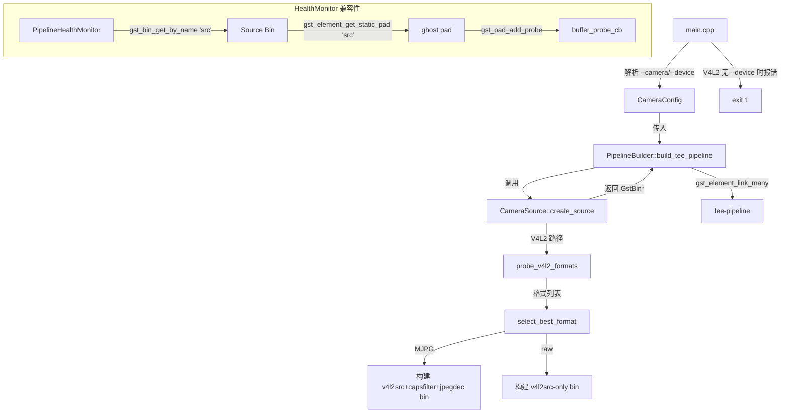

# 设计文档：Spec 4.5 — 摄像头源管道增强（Camera Source V2）

## 概述

本设计增强 `CameraSource::create_source()` 的实现，使其返回一个 GstBin（Source Bin），内部封装视频源元素及其必要的解码/转换链。核心变更：

1. **Source Bin 封装**：`create_source()` 返回 GstBin 而非单个 GstElement*，内部根据设备格式自动组装管道段（如 MJPG 设备自动添加 capsfilter + jpegdec），对外暴露统一的 `"src"` ghost pad
2. **V4L2 格式探测**：新增 `probe_v4l2_formats()` 函数，通过 GStreamer caps query 查询设备支持的像素格式，按优先级（I420 > YUYV > MJPG）选择最优格式
3. **强制 --device**：V4L2 类型不再默认 `/dev/video0`，必须显式指定 `--device` 路径
4. **零修改兼容**：`build_tee_pipeline` 函数签名不变，管道拓扑不变，现有测试零修改通过

设计决策：
- **GstBin 而非 GstElement***：MJPG 设备需要 `v4l2src → capsfilter → jpegdec` 三元素链，单个 GstElement* 无法表达。GstBin + ghost pad 是 GStreamer 标准做法，对外行为与单个元素一致。
- **GStreamer caps query 而非 v4l2 ioctl**：caps query 是 GStreamer 层面的抽象，不需要引入 V4L2 头文件，macOS 编译不受影响。在 Linux 上 v4l2src 插件内部已经做了 ioctl 查询，caps query 直接复用其结果。
- **格式探测仅在 Linux V4L2 路径执行**：TEST 和 LIBCAMERA 类型不需要格式探测，直接创建单元素 bin。
- **MJPG capsfilter 限制 1920x1080@15fps**：IMX678 支持 4K@60fps MJPG，不限制会打满 Pi 5 CPU。15fps 是 MJPG 软解码的安全上限。

## 架构

```mermaid
graph LR
    subgraph "CameraSource::create_source 返回的 Source Bin"
        direction LR
        V4L2[v4l2src] --> CF[capsfilter<br/>image/jpeg<br/>1920x1080@15fps]
        CF --> JDEC[jpegdec]
        JDEC -.-> GP["ghost pad 'src'"]
    end

    subgraph "build_tee_pipeline（不变）"
        GP --> CONV[videoconvert]
        CONV --> CAPS[capsfilter<br/>I420]
        CAPS --> RAWTEE[raw-tee]
        RAWTEE --> AI[AI 分支]
        RAWTEE --> ENC[编码链 → encoded-tee]
        ENC --> KVS[KVS 分支]
        ENC --> WEB[WebRTC 分支]
    end
```

### Source Bin 内部结构（按 CameraType 和格式）

| CameraType | 设备格式 | Bin 内部元素 | Ghost Pad 连接 |
|-----------|---------|-------------|---------------|
| TEST | N/A | `videotestsrc` | videotestsrc.src |
| V4L2 | I420/YUYV | `v4l2src` | v4l2src.src |
| V4L2 | MJPG only | `v4l2src → capsfilter → jpegdec` | jpegdec.src |
| LIBCAMERA | raw | `libcamerasrc` | libcamerasrc.src |

### 模块关系



### 文件布局

```
device/src/
├── camera_source.h         # 修改：接口不变（返回类型仍为 GstElement*）
├── camera_source.cpp       # 修改：create_source 返回 GstBin，新增格式探测逻辑
├── pipeline_builder.h      # 不修改
├── pipeline_builder.cpp    # 不修改（gst_element_link_many 自动适配 GstBin ghost pad）
├── main.cpp                # 修改：V4L2 无 --device 时报错退出
└── ...

device/tests/
├── camera_test.cpp         # 不修改（现有断言兼容 GstBin）
├── tee_test.cpp            # 不修改
└── ...
```

## 组件与接口

### CameraSource 接口（camera_source.h）— 不修改

```cpp
// camera_source.h — 接口完全不变
// create_source 的返回类型仍为 GstElement*（GstBin 是 GstElement 的子类）
// 调用方无需感知返回的是 bin 还是单个元素
namespace CameraSource {

enum class CameraType { TEST, V4L2, LIBCAMERA };

struct CameraConfig {
    CameraType type = default_camera_type();
    std::string device;  // V4L2 设备路径，空 = 未指定（V4L2 类型时 main.cpp 强制要求）
};

CameraType default_camera_type();
const char* camera_type_name(CameraType type);
GstElement* create_source(const CameraConfig& config, std::string* error_msg = nullptr);
bool parse_camera_type(const std::string& str, CameraType& out_type);

} // namespace CameraSource
```

设计决策：
- **接口不变**：`create_source` 返回类型仍为 `GstElement*`，因为 `GstBin` 继承自 `GstElement`。调用方（`build_tee_pipeline`）无需修改。
- **device 字段语义变更**：空字符串不再回退到 `/dev/video0`，而是表示"未指定"。V4L2 类型时 `main.cpp` 负责在启动前检查并报错。

### CameraSource 实现变更（camera_source.cpp）

核心变更：`create_source()` 内部根据 CameraType 构建不同的 GstBin。

#### V4L2 格式探测

```cpp
// 内部辅助函数（匿名 namespace）

// V4L2 设备支持的格式枚举
enum class V4L2Format { I420, YUYV, MJPG, UNKNOWN };

// 探测 V4L2 设备支持的格式列表
// 原理：创建临时 v4l2src，设置 device 属性，将其设为 READY 状态触发设备打开，
// 然后查询 src pad 的 caps 获取支持的格式列表
// 返回空 vector 表示探测失败
std::vector<V4L2Format> probe_v4l2_formats(const std::string& device_path,
                                            std::string* error_msg);

// 按优先级选择最佳格式：I420 > YUYV > MJPG
V4L2Format select_best_format(const std::vector<V4L2Format>& formats);
```

探测流程：
1. `gst_element_factory_make("v4l2src", nullptr)` 创建临时元素
2. `g_object_set(src, "device", device_path, nullptr)` 设置设备路径
3. `gst_element_set_state(src, GST_STATE_READY)` 触发设备打开
4. `gst_pad_query_caps(src_pad, nullptr)` 查询支持的 caps
5. 遍历 caps 结构体，提取 media type 和 format 字段
6. `gst_element_set_state(src, GST_STATE_NULL)` + `gst_object_unref(src)` 清理
7. 返回格式列表

Caps 解析逻辑：
- `video/x-raw, format=I420` → I420
- `video/x-raw, format=YUY2` 或 `format=YUYV` → YUYV
- `image/jpeg` → MJPG

#### Source Bin 构建

```cpp
// create_source 内部逻辑（伪代码）

GstElement* create_source(const CameraConfig& config, std::string* error_msg) {
    switch (config.type) {
        case CameraType::TEST:
            return create_test_bin(error_msg);      // videotestsrc-only bin
        case CameraType::V4L2:
            return create_v4l2_bin(config.device, error_msg);  // 格式探测 + 条件构建
        case CameraType::LIBCAMERA:
            return create_libcamera_bin(error_msg);  // libcamerasrc-only bin
    }
}

// 通用的单元素 bin 构建辅助函数
GstElement* create_single_element_bin(const char* factory_name,
                                       const char* element_name,
                                       std::string* error_msg);

// V4L2 bin 构建（核心逻辑）
GstElement* create_v4l2_bin(const std::string& device_path, std::string* error_msg) {
    // 1. 格式探测
    auto formats = probe_v4l2_formats(device_path, error_msg);
    if (formats.empty()) return nullptr;

    auto best = select_best_format(formats);

    // 2. 根据格式构建 bin
    if (best == V4L2Format::MJPG) {
        // v4l2src → capsfilter(image/jpeg,1920x1080@15fps) → jpegdec
        return create_mjpg_bin(device_path, error_msg);
    } else {
        // v4l2src only（raw 格式由下游 videoconvert 处理）
        return create_raw_v4l2_bin(device_path, error_msg);
    }
}
```

#### GstBin + Ghost Pad 构建模式

所有 bin 构建函数遵循统一模式：

```cpp
// 以 MJPG bin 为例
GstElement* create_mjpg_bin(const std::string& device_path, std::string* error_msg) {
    GstElement* bin = gst_bin_new("src");  // bin 命名为 "src"

    GstElement* v4l2 = gst_element_factory_make("v4l2src", "v4l2-source");
    GstElement* capsf = gst_element_factory_make("capsfilter", "mjpg-caps");
    GstElement* jdec = gst_element_factory_make("jpegdec", "jpeg-decoder");

    // 设置 v4l2src device 属性
    g_object_set(G_OBJECT(v4l2), "device", device_path.c_str(), nullptr);

    // 设置 capsfilter: image/jpeg, width=1920, height=1080, framerate=15/1
    GstCaps* caps = gst_caps_new_simple("image/jpeg",
        "width", G_TYPE_INT, 1920,
        "height", G_TYPE_INT, 1080,
        "framerate", GST_TYPE_FRACTION, 15, 1,
        nullptr);
    g_object_set(G_OBJECT(capsf), "caps", caps, nullptr);
    gst_caps_unref(caps);

    // 添加到 bin 并链接
    gst_bin_add_many(GST_BIN(bin), v4l2, capsf, jdec, nullptr);
    gst_element_link_many(v4l2, capsf, jdec, nullptr);

    // 创建 ghost pad：将 jpegdec 的 src pad 暴露为 bin 的 "src" pad
    GstPad* jdec_src = gst_element_get_static_pad(jdec, "src");
    GstPad* ghost = gst_ghost_pad_new("src", jdec_src);
    gst_element_add_pad(bin, ghost);
    gst_object_unref(jdec_src);

    return bin;
}
```

### main.cpp 变更

唯一变更：V4L2 类型未提供 `--device` 时报错退出。

```cpp
// main.cpp — 新增检查（在 Phase 3: Validate parsed values 中）
if (cam_config.type == CameraSource::CameraType::V4L2 && !has_device) {
    if (logger) logger->error("V4L2 camera requires --device (e.g. --device /dev/IMX678)");
    log_init::shutdown();
    return 1;
}
```

### HealthMonitor Ghost Pad 兼容性分析

`PipelineHealthMonitor::install_probe()` 的调用链：

```
gst_bin_get_by_name(pipeline, "src")  → 返回 Source Bin（GstBin，名为 "src"）
gst_element_get_static_pad(source, "src")  → 返回 ghost pad（名为 "src"）
gst_pad_add_probe(pad, BUFFER, cb, ...)  → 在 ghost pad 上安装 probe
```

GStreamer 的 ghost pad 是代理 pad，buffer 流经 ghost pad 时会触发 probe callback。这与直接在元素 src pad 上安装 probe 行为一致。**无需修改 HealthMonitor 代码。**

验证依据：
- GStreamer 文档明确说明 ghost pad 支持 pad probe
- `gst_bin_get_by_name` 递归搜索，返回名为 "src" 的 bin 本身
- `gst_element_get_static_pad(bin, "src")` 返回 bin 上名为 "src" 的 ghost pad

### build_tee_pipeline 兼容性分析

`build_tee_pipeline` 中的关键链接调用：

```cpp
gst_element_link_many(src, convert, capsfilter, raw_tee, nullptr);
```

当 `src` 是 GstBin 时，`gst_element_link_many` 自动使用 bin 的 ghost pad（名为 "src"）作为 src pad，与 `convert` 的 sink pad 链接。**无需修改 build_tee_pipeline 代码。**

## 数据模型

### V4L2Format 枚举

| V4L2Format | GStreamer Caps | 说明 | 优先级 |
|-----------|---------------|------|--------|
| I420 | `video/x-raw, format=I420` | YUV 4:2:0 planar，无需解码 | 最高 |
| YUYV | `video/x-raw, format=YUY2` | YUV 4:2:2 packed，无需解码 | 中 |
| MJPG | `image/jpeg` | Motion JPEG，需要 jpegdec 解码 | 最低 |
| UNKNOWN | 其他 | 不支持的格式，跳过 | — |

### CameraConfig 字段语义变更

| 字段 | Spec 4 语义 | Spec 4.5 语义 |
|------|-----------|-------------|
| `device` | 空 → 回退 `/dev/video0` | 空 → 未指定（V4L2 时 main.cpp 报错） |

### MJPG Capsfilter 默认参数

| 参数 | 值 | 说明 |
|------|-----|------|
| media type | `image/jpeg` | MJPG 格式 |
| width | 1920 | 限制水平分辨率 |
| height | 1080 | 限制垂直分辨率 |
| framerate | 15/1 | 限制帧率，避免 CPU 过载 |

### Source Bin 元素命名

| 元素 | 名称 | 说明 |
|------|------|------|
| GstBin | `"src"` | 与 Spec 4 的元素名一致，确保 `gst_bin_get_by_name` 兼容 |
| v4l2src（bin 内） | `"v4l2-source"` | 避免与 bin 名冲突 |
| capsfilter（bin 内） | `"mjpg-caps"` | MJPG capsfilter |
| jpegdec（bin 内） | `"jpeg-decoder"` | JPEG 解码器 |
| videotestsrc（bin 内） | `"test-source"` | TEST 类型 |
| libcamerasrc（bin 内） | `"libcam-source"` | LIBCAMERA 类型 |

## 错误处理

### create_source() 错误场景

| 错误场景 | 处理方式 | error_msg 内容 |
|---------|---------|---------------|
| GStreamer 插件不存在（如 macOS 上 v4l2src） | 返回 nullptr | `"Failed to create v4l2src (plugin not available)"` |
| V4L2 格式探测失败（设备不存在/无权限） | 返回 nullptr | `"V4L2 format probe failed for /dev/XXX: <detail>"` |
| V4L2 设备无支持的格式 | 返回 nullptr | `"V4L2 device /dev/XXX: no supported formats detected"` |
| Bin 内元素创建失败 | 返回 nullptr，清理已创建元素 | `"Failed to create <element> for source bin"` |
| Bin 内元素链接失败 | 返回 nullptr，unref bin | `"Failed to link source bin elements"` |
| Ghost pad 创建失败 | 返回 nullptr，unref bin | `"Failed to create ghost pad for source bin"` |

### GStreamer 资源管理

格式探测阶段的资源管理：
- 临时 v4l2src 元素：探测完成后 `gst_element_set_state(NULL)` + `gst_object_unref`
- 查询到的 caps：`gst_caps_unref`
- 探测失败时确保所有临时资源释放

Bin 构建阶段的资源管理：
- 元素添加到 bin 后由 bin 管理生命周期
- 添加到 bin 前如果失败，需要逐个 `gst_object_unref`
- Ghost pad 的 target pad 引用：`gst_object_unref(target_pad)` 在 `gst_ghost_pad_new` 后释放
- Bin 构建失败时 `gst_object_unref(bin)` 释放整个 bin（包括已添加的元素）

### main.cpp 错误场景

| 错误场景 | 处理方式 | 日志 |
|---------|---------|------|
| V4L2 类型未提供 --device | spdlog error + return 1 | `"V4L2 camera requires --device (e.g. --device /dev/IMX678)"` |

## 测试策略

### 测试方法

本 Spec 采用 example-based 单元测试 + ASan 运行时检查 + Pi 5 端到端验证的三重策略。

**不使用 PBT 的原因：**
- 核心逻辑是 GstBin 构建和 V4L2 格式探测，依赖 GStreamer 外部库和真实硬件
- 格式优先级选择的输入空间极小（3 种格式的组合）
- 大部分验收标准是 INTEGRATION 或 EXAMPLE 类型
- 不存在"对所有输入 X，属性 P(X) 成立"的通用属性
- 100 次迭代不会比具体测试发现更多 bug

### 现有测试回归（零修改）

| 测试文件 | 关键断言 | 兼容性分析 |
|---------|---------|-----------|
| `camera_test.cpp` `CreateSourceTest` | `GST_ELEMENT_NAME(src) == "src"` | GstBin 名为 "src"，通过 ✅ |
| `camera_test.cpp` `TeePipelineSourceElement` | `gst_bin_get_by_name(pipeline, "src") != nullptr` | 返回 Source Bin，通过 ✅ |
| `camera_test.cpp` `TeePipelineDefaultConfig` | 管道达到 PLAYING | Source Bin ghost pad 正常链接，通过 ✅ |
| `camera_test.cpp` `CreateSourceUnavailable` | macOS 上 V4L2/LIBCAMERA 返回 nullptr | 插件不存在时仍返回 nullptr，通过 ✅ |
| `tee_test.cpp` 全部 | 管道构建、启动、命名元素查找 | Source Bin 透明替换，通过 ✅ |

### 新增测试（可选，不修改现有文件）

如果需要新增测试验证 Source Bin 结构，可以创建新的测试文件（如 `camera_v2_test.cpp`），但根据约束"不修改现有测试文件"，现有测试已足够验证向后兼容性。

Pi 5 端到端验证命令：
```bash
# IMX678 USB 摄像头（MJPG 自动检测 + jpegdec）
./device/build/raspi-eye --camera v4l2 --device /dev/IMX678 --config device/config/config.toml

# 验证 V4L2 无 --device 报错
./device/build/raspi-eye --camera v4l2 --config device/config/config.toml
# 预期：error 日志 + exit 1
```

### 验证命令

```bash
# macOS Debug 构建 + 测试（验证向后兼容）
cmake -B device/build -S device -DCMAKE_BUILD_TYPE=Debug && cmake --build device/build && ctest --test-dir device/build --output-on-failure

# Pi 5 Release 构建 + 测试
cmake -B device/build -S device -DCMAKE_BUILD_TYPE=Release && cmake --build device/build && ctest --test-dir device/build --output-on-failure
```

预期结果：两个平台均编译成功、所有现有测试通过、macOS 下 ASan 无报告。

### 禁止项（Design 层）

- SHALL NOT 修改 `PipelineManager` 的任何公开接口
- SHALL NOT 修改 `build_tee_pipeline` 的函数签名或管道拓扑结构
- SHALL NOT 修改任何现有测试文件
- SHALL NOT 在 macOS 上引入 V4L2 或 libcamera 的平台头文件或链接库
- SHALL NOT 在手动构建管道时遗漏 GStreamer 引用计数释放
- SHALL NOT 在日志或错误输出中打印密钥、证书内容、token 等敏感信息
- SHALL NOT 在格式探测阶段泄漏临时 GstElement 或 GstCaps 引用
