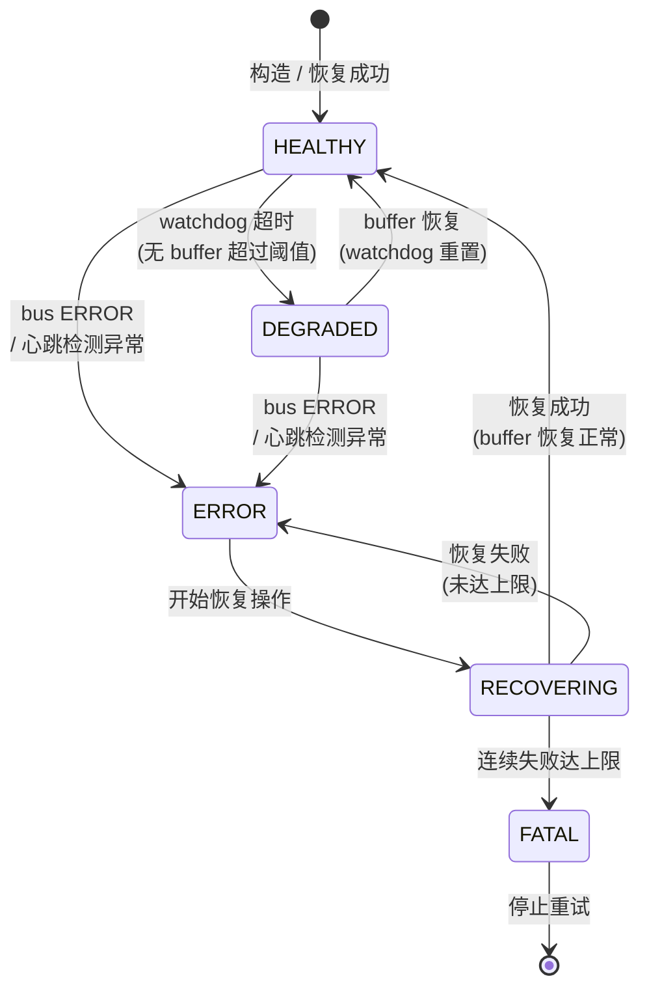
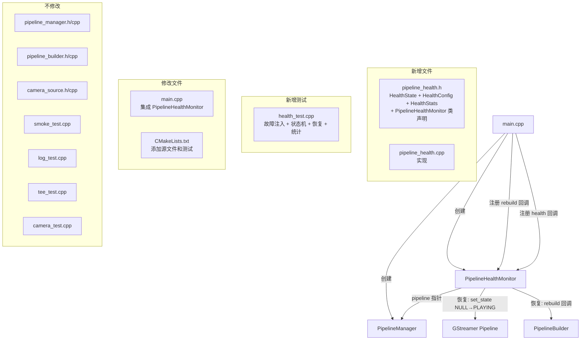

# 设计文档：Spec 5 — 管道健康监控 + 自动恢复

## 概述

本设计为 GStreamer 管道引入独立的 `PipelineHealthMonitor` 类，通过组合方式与现有 `PipelineManager` 协作，实现三层故障检测和两级自动恢复。

核心设计目标：
- 三层检测：Buffer Probe Watchdog（数据流级）→ Bus ERROR 监听（事件级）→ 心跳轮询（兜底）
- 五状态状态机：`HEALTHY → DEGRADED → ERROR → RECOVERING → FATAL`，`std::mutex` 保护防重入
- 两级恢复：状态重置（NULL→PLAYING）→ 完全重建（rebuild 回调），指数退避（1s→2s→4s）
- 不修改 `PipelineManager` 核心接口，通过 `pipeline()` 获取 `GstElement*` 进行操作
- 回调在 mutex 外调用，避免死锁
- watchdog 和心跳通过 GLib 定时器（`g_timeout_add`）集成到 `GMainLoop`

设计决策：
- **独立类而非继承**：`PipelineHealthMonitor` 不继承 `PipelineManager`，通过组合持有 `GstElement*` 指针。这样不修改 `PipelineManager` 接口，且 monitor 的生命周期可独立管理。
- **GLib 定时器而非 std::thread**：watchdog 和心跳使用 `g_timeout_add` 注册到 GMainLoop，与 GStreamer 事件循环天然集成，避免额外线程开销和跨线程同步复杂度。
- **Buffer probe 回调极简**：仅更新 `std::mutex` 保护的 `steady_clock::time_point` 时间戳（`time_point` 非 trivially copyable，不能用 `std::atomic`），开销可忽略。
- **rebuild 回调由调用方提供**：`PipelineHealthMonitor` 不知道如何构建管道，完全重建时调用用户注册的 `std::function<GstElement*()>` 回调，返回新的 `GstElement*`。调用方（main.cpp）负责在回调中同时更新 `PipelineManager` 实例。
- **Bus watch 由 monitor 接管**：`PipelineHealthMonitor::start()` 注册 bus watch，main.cpp 不再单独注册 `gst_bus_add_watch`。monitor 的 bus watch 处理 ERROR/WARNING，EOS 通过 health_callback 通知 main 退出 loop。GStreamer 的 bus watch 只能有一个，后注册的会替换前一个。

## 架构

### 整体架构图

```mermaid
graph TB
    subgraph "main.cpp"
        MAIN[应用入口] --> PM[PipelineManager]
        MAIN --> HM[PipelineHealthMonitor]
        MAIN --> LOOP[GMainLoop]
    end

    subgraph "PipelineHealthMonitor"
        SM[状态机<br/>HEALTHY→DEGRADED→ERROR→RECOVERING→FATAL]
        BP[Buffer Probe<br/>更新时间戳]
        WD[Watchdog Timer<br/>g_timeout_add]
        BUS[Bus ERROR 监听<br/>gst_bus_add_watch]
        HB[Heartbeat Poll<br/>g_timeout_add]
        REC[恢复引擎<br/>状态重置 / 完全重建]
        STATS[恢复统计]
        CB[健康回调]
    end

    PM -->|pipeline()| HM
    BP -->|更新 last_buffer_time_| SM
    WD -->|超时检查| SM
    BUS -->|ERROR 消息| SM
    HB -->|状态轮询| SM
    SM -->|ERROR 状态| REC
    REC -->|成功| SM
    REC -->|失败达上限| SM
    SM -->|状态变化| CB
```

### 状态机转换图



### 模块关系图



### 文件布局

```
device/
├── CMakeLists.txt              # 修改：添加 pipeline_health.cpp 和 health_test
├── src/
│   ├── pipeline_health.h       # 新增：HealthState、HealthConfig、HealthStats、PipelineHealthMonitor
│   ├── pipeline_health.cpp     # 新增：实现
│   ├── pipeline_manager.h      # 不修改
│   ├── pipeline_manager.cpp    # 不修改
│   ├── pipeline_builder.h      # 不修改
│   ├── pipeline_builder.cpp    # 不修改
│   ├── camera_source.h         # 不修改
│   ├── camera_source.cpp       # 不修改
│   ├── main.cpp                # 修改：集成 PipelineHealthMonitor
│   └── ...
└── tests/
    ├── health_test.cpp         # 新增：健康监控测试
    ├── smoke_test.cpp          # 不修改
    ├── log_test.cpp            # 不修改
    ├── tee_test.cpp            # 不修改
    └── camera_test.cpp         # 不修改
```

## 组件与接口

### PipelineHealthMonitor 完整头文件（pipeline_health.h）

```cpp
// pipeline_health.h
// Pipeline health monitor with three-layer detection and two-level recovery.
#pragma once
#include <gst/gst.h>
#include <chrono>
#include <cstdint>
#include <functional>
#include <mutex>
#include <string>

// Health state of the pipeline
enum class HealthState {
    HEALTHY,     // Pipeline running normally, buffers flowing
    DEGRADED,    // Watchdog timeout, no buffers but no bus error
    ERROR,       // Bus ERROR or heartbeat detected abnormal state
    RECOVERING,  // Recovery in progress (state-reset or full-rebuild)
    FATAL        // Max retries exceeded, giving up
};

// Return human-readable name for HealthState
const char* health_state_name(HealthState s);

// Configuration for PipelineHealthMonitor (POD, all durations in milliseconds)
struct HealthConfig {
    int watchdog_timeout_ms  = 5000;  // Buffer probe watchdog timeout
    int heartbeat_interval_ms = 2000; // Heartbeat poll interval
    int initial_backoff_ms   = 1000;  // Initial retry backoff
    int max_retries          = 3;     // Max consecutive recovery failures before FATAL
};

// Recovery statistics
struct HealthStats {
    uint32_t total_recoveries = 0;
    std::chrono::steady_clock::time_point last_recovery_time{};
    std::chrono::steady_clock::time_point healthy_since{};
};

// Callback types
using HealthCallback = std::function<void(HealthState old_state, HealthState new_state)>;
using RebuildCallback = std::function<GstElement*()>;

class PipelineHealthMonitor {
public:
    // Construct monitor for the given pipeline.
    // Does NOT take ownership of the pipeline pointer.
    // The pipeline must outlive the monitor (or be replaced via rebuild).
    explicit PipelineHealthMonitor(GstElement* pipeline,
                                   const HealthConfig& config = HealthConfig{});

    ~PipelineHealthMonitor();

    // No copy
    PipelineHealthMonitor(const PipelineHealthMonitor&) = delete;
    PipelineHealthMonitor& operator=(const PipelineHealthMonitor&) = delete;

    // Start monitoring: install buffer probe, bus watch, timers.
    // Must be called after pipeline is in PLAYING state.
    // source_element_name: name of the video source element for probe installation
    //                      (e.g. "src"). If empty, probe is not installed.
    void start(const std::string& source_element_name = "src");

    // Stop monitoring: remove probe, timers, bus watch.
    void stop();

    // Current health state (thread-safe)
    HealthState state() const;

    // Recovery statistics (thread-safe)
    HealthStats stats() const;

    // Register health state change callback.
    // Called outside mutex to avoid deadlock.
    void set_health_callback(HealthCallback cb);

    // Register rebuild callback for full-rebuild recovery.
    // Must return a new GstElement* pipeline in PLAYING state, or nullptr on failure.
    void set_rebuild_callback(RebuildCallback cb);

    // Update the monitored pipeline pointer (after rebuild).
    // Also re-installs buffer probe on the new pipeline.
    void set_pipeline(GstElement* new_pipeline,
                      const std::string& source_element_name = "src");

private:
    // State transition (must hold mutex_)
    // Returns true if transition occurred
    bool transition_to(HealthState new_state);

    // Buffer probe callback (static, minimal work)
    static GstPadProbeReturn buffer_probe_cb(GstPad* pad,
                                              GstPadProbeInfo* info,
                                              gpointer user_data);

    // Bus message handler (static)
    static gboolean bus_watch_cb(GstBus* bus, GstMessage* msg, gpointer user_data);

    // Watchdog timer callback (static, via g_timeout_add)
    static gboolean watchdog_timer_cb(gpointer user_data);

    // Heartbeat timer callback (static, via g_timeout_add)
    static gboolean heartbeat_timer_cb(gpointer user_data);

    // Recovery logic
    void attempt_recovery();
    bool try_state_reset();
    bool try_full_rebuild();

    // Install buffer probe on source element's src pad
    void install_probe(const std::string& source_element_name);

    // Remove buffer probe if installed
    void remove_probe();

    // Configuration
    HealthConfig config_;

    // Mutable state (protected by mutex_)
    mutable std::mutex mutex_;
    HealthState state_ = HealthState::HEALTHY;
    HealthStats stats_;
    int consecutive_failures_ = 0;
    int current_backoff_ms_ = 0;
    std::chrono::steady_clock::time_point last_buffer_time_;

    // Pipeline pointer (not owned)
    GstElement* pipeline_ = nullptr;

    // Buffer probe tracking
    GstPad* probe_pad_ = nullptr;
    gulong probe_id_ = 0;

    // Bus watch
    guint bus_watch_id_ = 0;

    // Timer IDs (g_timeout_add)
    guint watchdog_timer_id_ = 0;
    guint heartbeat_timer_id_ = 0;

    // Callbacks (set once, read from timer/bus callbacks)
    HealthCallback health_cb_;
    RebuildCallback rebuild_cb_;

    // Source element name for re-installing probe after rebuild
    std::string source_element_name_;

    // Flag to prevent re-entrant recovery
    bool recovery_in_progress_ = false;
};
```

### 实现要点（pipeline_health.cpp）

#### 1. Buffer Probe 回调（极简，高性能路径）

```cpp
GstPadProbeReturn PipelineHealthMonitor::buffer_probe_cb(
    GstPad* /*pad*/, GstPadProbeInfo* /*info*/, gpointer user_data) {
    auto* self = static_cast<PipelineHealthMonitor*>(user_data);
    {
        std::lock_guard<std::mutex> lock(self->mutex_);
        self->last_buffer_time_ = std::chrono::steady_clock::now();
    }
    return GST_PAD_PROBE_OK;
}
```

设计决策：使用 `std::mutex` 而非 `std::atomic`，因为 `steady_clock::time_point` 不保证 trivially copyable。mutex 在无竞争时开销极低（~25ns），对 720p@15fps 的 buffer 频率（~67ms/buffer）完全可接受。

#### 2. Watchdog 定时器

```cpp
gboolean PipelineHealthMonitor::watchdog_timer_cb(gpointer user_data) {
    auto* self = static_cast<PipelineHealthMonitor*>(user_data);
    HealthCallback cb_copy;
    HealthState old_state, new_state;
    bool changed = false;

    {
        std::lock_guard<std::mutex> lock(self->mutex_);
        auto now = std::chrono::steady_clock::now();
        auto elapsed = std::chrono::duration_cast<std::chrono::milliseconds>(
            now - self->last_buffer_time_).count();

        if (elapsed >= self->config_.watchdog_timeout_ms &&
            self->state_ == HealthState::HEALTHY) {
            old_state = self->state_;
            self->transition_to(HealthState::DEGRADED);
            new_state = self->state_;
            changed = (old_state != new_state);
            cb_copy = self->health_cb_;
            // Log watchdog timeout
        }
    }

    // Callback outside mutex
    if (changed && cb_copy) {
        cb_copy(old_state, new_state);
    }
    return G_SOURCE_CONTINUE;  // Keep timer running
}
```

#### 3. Bus ERROR 处理

```cpp
gboolean PipelineHealthMonitor::bus_watch_cb(
    GstBus* /*bus*/, GstMessage* msg, gpointer user_data) {
    auto* self = static_cast<PipelineHealthMonitor*>(user_data);

    switch (GST_MESSAGE_TYPE(msg)) {
        case GST_MESSAGE_ERROR: {
            GError* err = nullptr;
            gchar* dbg = nullptr;
            gst_message_parse_error(msg, &err, &dbg);
            // spdlog: element name + error message
            if (err) g_error_free(err);
            if (dbg) g_free(dbg);

            // Transition to ERROR and trigger recovery
            // (callback outside mutex)
            self->attempt_recovery();
            break;
        }
        case GST_MESSAGE_WARNING: {
            GError* err = nullptr;
            gchar* dbg = nullptr;
            gst_message_parse_warning(msg, &err, &dbg);
            // spdlog: warning only, no state transition
            if (err) g_error_free(err);
            if (dbg) g_free(dbg);
            break;
        }
        case GST_MESSAGE_EOS: {
            // spdlog: "End of stream"
            // Notify via health callback (main can decide to quit loop)
            break;
        }
        default:
            break;
    }
    return TRUE;
}
```

#### 4. 心跳轮询

```cpp
gboolean PipelineHealthMonitor::heartbeat_timer_cb(gpointer user_data) {
    auto* self = static_cast<PipelineHealthMonitor*>(user_data);

    GstState state = GST_STATE_NULL;
    gst_element_get_state(self->pipeline_, &state, nullptr, 0);  // Non-blocking query

    if (state != GST_STATE_PLAYING) {
        std::lock_guard<std::mutex> lock(self->mutex_);
        if (self->state_ == HealthState::HEALTHY ||
            self->state_ == HealthState::DEGRADED) {
            // Transition to ERROR, trigger recovery
        }
    }
    return G_SOURCE_CONTINUE;
}
```

#### 5. 恢复引擎

```cpp
void PipelineHealthMonitor::attempt_recovery() {
    // 1. Transition to RECOVERING
    // 2. Try state reset (NULL → PLAYING)
    // 3. If failed, try full rebuild via rebuild_cb_
    // 4. If success: reset backoff, increment stats, transition to HEALTHY
    // 5. If failed: increment consecutive_failures_, double backoff
    // 6. If max retries reached: transition to FATAL
    // All callbacks invoked outside mutex
}

bool PipelineHealthMonitor::try_state_reset() {
    // Set pipeline to NULL
    GstStateChangeReturn ret = gst_element_set_state(pipeline_, GST_STATE_NULL);
    if (ret == GST_STATE_CHANGE_FAILURE) return false;

    // Wait for NULL state
    gst_element_get_state(pipeline_, nullptr, nullptr, 3 * GST_SECOND);

    // Set back to PLAYING
    ret = gst_element_set_state(pipeline_, GST_STATE_PLAYING);
    return (ret != GST_STATE_CHANGE_FAILURE);
}

bool PipelineHealthMonitor::try_full_rebuild() {
    if (!rebuild_cb_) return false;

    GstElement* new_pipeline = rebuild_cb_();
    if (!new_pipeline) return false;

    // Update pipeline pointer and re-install probe
    set_pipeline(new_pipeline, source_element_name_);
    return true;
}
```

#### 6. 指数退避

```cpp
// In attempt_recovery(), after failure:
consecutive_failures_++;
if (consecutive_failures_ >= config_.max_retries) {
    transition_to(HealthState::FATAL);
    return;
}
current_backoff_ms_ = config_.initial_backoff_ms * (1 << (consecutive_failures_ - 1));
// Schedule next recovery attempt after current_backoff_ms_
// via g_timeout_add(current_backoff_ms_, retry_timer_cb, this)

// On success:
consecutive_failures_ = 0;
current_backoff_ms_ = 0;
stats_.total_recoveries++;
stats_.last_recovery_time = std::chrono::steady_clock::now();
stats_.healthy_since = std::chrono::steady_clock::now();
```

### main.cpp 集成变更

```cpp
// main.cpp — 关键变更
#include "pipeline_health.h"

static int run_pipeline(int argc, char* argv[]) {
    // ... 现有参数解析和管道构建 ...

    auto pm = PipelineManager::create(raw_pipeline, &err_msg);
    if (!pm) { /* ... */ }

    // 创建健康监控器
    PipelineHealthMonitor health_monitor(pm->pipeline());

    // 注册 rebuild 回调（同时更新 PipelineManager 实例）
    health_monitor.set_rebuild_callback([&pm, &cam_config]() -> GstElement* {
        std::string err;
        GstElement* p = PipelineBuilder::build_tee_pipeline(&err, cam_config);
        if (!p) return nullptr;
        // 用新管道替换 PipelineManager（旧管道由 PipelineManager 析构释放）
        auto new_pm = PipelineManager::create(p, &err);
        if (!new_pm) {
            gst_object_unref(p);
            return nullptr;
        }
        if (!new_pm->start(&err)) {
            return nullptr;
        }
        pm = std::move(new_pm);
        return pm->pipeline();
    });

    // 注册健康回调（日志记录 + FATAL 时退出 loop）
    health_monitor.set_health_callback(
        [](HealthState old_s, HealthState new_s) {
            auto logger = spdlog::get("main");
            if (logger) {
                logger->info("Health state: {} -> {}",
                             health_state_name(old_s),
                             health_state_name(new_s));
            }
            if (new_s == HealthState::FATAL && loop) {
                g_main_loop_quit(loop);
            }
        });

    // 创建 GMainLoop
    loop = g_main_loop_new(nullptr, FALSE);

    // 注意：不再单独注册 bus_callback，由 health_monitor 接管 bus watch
    // main 的 bus_callback 中 ERROR 处理已移交给 monitor
    // EOS 通过 monitor 的 bus watch 处理后通知 health_callback

    std::signal(SIGINT, sigint_handler);

    if (!pm->start(&err_msg)) { /* ... */ }

    // 启动健康监控（管道已 PLAYING，monitor 注册 bus watch + probe + timers）
    health_monitor.start("src");

    g_main_loop_run(loop);

    // 清理
    health_monitor.stop();
    pm->stop();
    // ...
}
```

注意：集成后 main.cpp 中原有的 `bus_callback` 不再需要——`PipelineHealthMonitor` 接管了 bus watch，处理 ERROR（触发恢复）和 WARNING（仅日志）。EOS 消息也由 monitor 的 bus watch 处理，通过 health_callback 通知 main 退出 loop。FATAL 状态时 health_callback 调用 `g_main_loop_quit(loop)` 退出。

### CMakeLists.txt 变更

```cmake
# 修改 pipeline_manager 库，添加 pipeline_health.cpp
add_library(pipeline_manager STATIC
    src/pipeline_manager.cpp
    src/pipeline_builder.cpp
    src/camera_source.cpp
    src/pipeline_health.cpp)

# 新增健康监控测试
add_executable(health_test tests/health_test.cpp)
target_link_libraries(health_test PRIVATE pipeline_manager GTest::gtest rapidcheck rapidcheck_gtest)
add_test(NAME health_test COMMAND health_test)
```

## 数据模型

### HealthState 状态枚举

| 状态 | 含义 | 进入条件 | 退出条件 |
|------|------|---------|---------|
| `HEALTHY` | 管道正常运行，数据流畅通 | 初始状态 / 恢复成功 | watchdog 超时 / bus ERROR / 心跳异常 |
| `DEGRADED` | 数据流中断但无 bus 错误 | watchdog 超时（HEALTHY→DEGRADED） | buffer 恢复 / bus ERROR / 心跳异常 |
| `ERROR` | 检测到明确错误 | bus ERROR / 心跳检测异常 | 开始恢复 |
| `RECOVERING` | 恢复操作进行中 | 从 ERROR 开始恢复 | 恢复成功 / 恢复失败 |
| `FATAL` | 连续恢复失败达上限 | 连续失败 ≥ max_retries | 终态，不退出 |

### HealthConfig 配置参数

| 字段 | 类型 | 默认值 | 说明 |
|------|------|--------|------|
| `watchdog_timeout_ms` | `int` | 5000 | Buffer probe watchdog 超时（毫秒） |
| `heartbeat_interval_ms` | `int` | 2000 | 心跳轮询间隔（毫秒） |
| `initial_backoff_ms` | `int` | 1000 | 初始退避间隔（毫秒） |
| `max_retries` | `int` | 3 | 最大连续恢复失败次数 |

### HealthStats 统计结构

| 字段 | 类型 | 说明 |
|------|------|------|
| `total_recoveries` | `uint32_t` | 总恢复成功次数 |
| `last_recovery_time` | `steady_clock::time_point` | 最后一次恢复成功的时间 |
| `healthy_since` | `steady_clock::time_point` | 自最后一次恢复成功以来的起始时间 |

### 合法状态转换表

| 当前状态 | 目标状态 | 触发条件 |
|---------|---------|---------|
| HEALTHY | DEGRADED | watchdog 超时 |
| HEALTHY | ERROR | bus ERROR / 心跳异常 |
| DEGRADED | HEALTHY | buffer 恢复（watchdog 重置） |
| DEGRADED | ERROR | bus ERROR / 心跳异常 |
| ERROR | RECOVERING | 开始恢复操作 |
| RECOVERING | HEALTHY | 恢复成功 |
| RECOVERING | ERROR | 恢复失败（未达上限，等待退避后重试） |
| RECOVERING | FATAL | 连续失败达上限 |


## 正确性属性（Correctness Properties）

*属性（Property）是在系统所有合法执行中都应成立的特征或行为——本质上是对系统行为的形式化陈述。属性是人类可读规格与机器可验证正确性保证之间的桥梁。*

### Prework 分析总结

从 10 个需求的 40+ 条验收标准中，识别出以下可作为 property-based testing 的候选：

| 来源 | 分类 | 说明 |
|------|------|------|
| 1.7 + 6.1 + 6.2 | PROPERTY | 指数退避序列和 FATAL 终止条件，输入空间：(initial_backoff, max_retries) |
| 7.2 | PROPERTY | 恢复计数器准确性，输入空间：恢复成功次数 N |
| 8.2 | PROPERTY | 状态转换回调正确性，输入空间：状态转换序列 |

其余验收标准分类为 EXAMPLE（具体场景测试）、SMOKE（构建/平台验证）或 INTEGRATION（线程安全/ASan 验证），不适合 PBT。

### Property Reflection

- 1.7（FATAL after N failures）和 6.1（exponential backoff）可合并为一个属性：对任意 `(initial_backoff, max_retries)` 配置，退避序列应为 `[B, 2B, 4B, ...]` 且第 N 次失败后进入 FATAL。两者测试同一个恢复引擎的不同方面，合并后更全面。
- 7.2（recovery count）独立于恢复失败逻辑，测试成功路径的计数准确性。保留。
- 8.2（callback correctness）测试通知机制，独立于恢复逻辑。保留。

最终 3 个属性，无冗余。

### Property 1: 指数退避序列与 FATAL 终止

*For any* `HealthConfig` with `initial_backoff_ms = B`（B ∈ [1, 1000]）and `max_retries = N`（N ∈ [1, 10]），when the monitor encounters N consecutive recovery failures, the backoff intervals should follow the sequence `[B, B*2, B*4, ..., B*2^(N-2)]` and after the N-th failure the state should be `FATAL` with no further recovery attempts.

**Validates: Requirements 1.7, 6.1, 6.2**

### Property 2: 恢复计数器准确性

*For any* sequence of K successful recoveries（K ∈ [1, 20]），`stats().total_recoveries` should equal K, and `stats().last_recovery_time` should be no earlier than the time of the K-th recovery.

**Validates: Requirements 7.2**

### Property 3: 状态转换回调正确性

*For any* valid state transition sequence（由故障注入和恢复操作产生），the registered health callback should be invoked exactly once per transition, with the correct `(old_state, new_state)` pair matching the actual transition.

**Validates: Requirements 8.2**

## 错误处理

### 状态转换错误处理

| 错误场景 | 处理方式 | 日志 |
|---------|---------|------|
| 非法状态转换（如 HEALTHY→RECOVERING） | `transition_to()` 返回 false，不执行转换 | warn: "Invalid transition from X to Y" |
| 重入恢复（recovery_in_progress_ == true） | 跳过，不重复触发 | debug: "Recovery already in progress, skipping" |

### 恢复错误处理

| 错误场景 | 处理方式 | 日志 |
|---------|---------|------|
| 状态重置失败（`set_state(NULL)` 返回 FAILURE） | 尝试完全重建 | warn: "State reset failed, attempting full rebuild" |
| 完全重建失败（rebuild_cb_ 返回 nullptr） | 递增失败计数，等待退避后重试 | error: "Full rebuild failed, retry {N}/{max}" |
| rebuild_cb_ 未注册 | 跳过完全重建，直接计为失败 | warn: "No rebuild callback registered, cannot attempt full rebuild" |
| 连续失败达上限 | 转换到 FATAL，停止所有定时器 | error: "Max retries ({N}) exceeded, entering FATAL state" |

### Buffer Probe 错误处理

| 错误场景 | 处理方式 | 日志 |
|---------|---------|------|
| 源元素不存在（`gst_bin_get_by_name` 返回 nullptr） | probe 不安装，仅依赖 bus + heartbeat | warn: "Source element '{}' not found, probe not installed" |
| src pad 不存在 | 同上 | warn: "Source pad not found on element '{}'" |

### GStreamer 资源管理

| 资源 | 获取 | 释放 | 时机 |
|------|------|------|------|
| `GstPad* probe_pad_` | `gst_element_get_static_pad()` | `gst_object_unref()` | `remove_probe()` 或析构 |
| `GstBus*`（bus watch） | `gst_element_get_bus()` | `gst_object_unref()` | `start()` 中获取后立即释放（watch 不持有引用） |
| Bus watch ID | `gst_bus_add_watch()` | `g_source_remove()` | `stop()` 或析构 |
| Watchdog timer ID | `g_timeout_add()` | `g_source_remove()` | `stop()` 或析构 |
| Heartbeat timer ID | `g_timeout_add()` | `g_source_remove()` | `stop()` 或析构 |
| Buffer probe ID | `gst_pad_add_probe()` | `gst_pad_remove_probe()` | `remove_probe()` 或析构 |

析构函数调用 `stop()` 确保所有资源释放，遵循 RAII 原则。

### 线程安全设计

- `mutex_` 保护：`state_`、`stats_`、`consecutive_failures_`、`current_backoff_ms_`、`last_buffer_time_`
- Buffer probe 回调（GStreamer streaming thread）：获取 mutex，更新 `last_buffer_time_`，释放 mutex
- Watchdog/Heartbeat 回调（GMainLoop thread）：获取 mutex，读取状态和时间戳，可能触发状态转换
- `health_cb_` 调用：在 mutex 外执行，避免回调中调用 `state()` 或 `stats()` 导致死锁
- `recovery_in_progress_` 标志：防止 bus ERROR 和 heartbeat 同时触发恢复

## 测试策略

### 测试方法

本 Spec 采用三重验证策略：

1. **Property-based testing（RapidCheck）**：验证恢复引擎的数学属性（指数退避、计数器、回调正确性）
2. **Example-based 单元测试（Google Test）**：验证具体场景（故障注入、状态转换、恢复流程）
3. **ASan 运行时检查**：Debug 构建自动检测内存错误

### Property-Based Testing 配置

- 框架：RapidCheck（已通过 FetchContent 引入）
- 每个属性最少 100 次迭代
- 标签格式：`Feature: pipeline-health, Property {N}: {description}`
- 测试中使用毫秒级间隔（`initial_backoff_ms = 1~10`，`watchdog_timeout_ms = 50~200`）以满足 5 秒约束

### 新增测试文件：health_test.cpp

#### Property-Based Tests

| 测试用例 | 对应属性 | 验证内容 |
|---------|---------|---------|
| `ExponentialBackoffAndFatal` | Property 1 | 随机 (B, N) 配置，验证退避序列和 FATAL 终止 |
| `RecoveryCounterAccuracy` | Property 2 | 随机 K 次成功恢复，验证 total_recoveries == K |
| `StateTransitionCallbackCorrectness` | Property 3 | 随机故障注入序列，验证回调 (old, new) 对 |

#### Example-Based Tests

| 测试用例 | 验证内容 | 对应需求 |
|---------|---------|---------|
| `InitialStateIsHealthy` | 构造后 state() == HEALTHY | 1.2 |
| `BusErrorTriggersRecovery` | post ERROR → 状态经过 ERROR → RECOVERING → HEALTHY | 3.2, 5.1, 5.2, 9.1, 9.2 |
| `ConsecutiveFailuresReachFatal` | 连续失败 N 次 → FATAL | 1.7, 9.3 |
| `HealthCallbackInvoked` | 每次状态转换调用回调，传入正确 (old, new) | 8.2, 9.4 |
| `NoCallbackNoCrash` | 未注册回调时正常运行 | 8.3 |
| `CallbackOutsideMutex` | 回调中调用 state()/stats() 不死锁 | 8.4 |
| `StatsIncrementOnRecovery` | 恢复成功后 total_recoveries 递增 | 7.2, 9.5 |
| `WarningNoStateChange` | post WARNING → 状态不变 | 3.4 |
| `FullRebuildAfterStateResetFails` | 状态重置失败 → 尝试完全重建 | 5.3, 5.4 |

#### 测试辅助设施

```cpp
// 测试用快速配置（毫秒级间隔）
HealthConfig test_config() {
    return HealthConfig{
        .watchdog_timeout_ms  = 100,   // 100ms watchdog
        .heartbeat_interval_ms = 50,   // 50ms heartbeat
        .initial_backoff_ms   = 10,    // 10ms initial backoff
        .max_retries          = 3
    };
}

// 故障注入辅助函数
void inject_bus_error(GstElement* pipeline) {
    GstBus* bus = gst_element_get_bus(pipeline);
    GError* error = g_error_new(GST_CORE_ERROR, GST_CORE_ERROR_FAILED,
                                 "Injected test error");
    GstMessage* msg = gst_message_new_error(
        GST_OBJECT(pipeline), error, "fault injection");
    gst_bus_post(bus, msg);
    g_error_free(error);
    gst_object_unref(bus);
}

// GMainLoop 辅助：运行 loop 直到条件满足或超时
bool run_until(GMainLoop* loop, std::function<bool()> condition,
               int timeout_ms = 3000);
```

### 现有测试回归

| 测试文件 | 测试数量 | 预期 |
|---------|---------|------|
| `smoke_test.cpp` | 8 个 | 全部通过，零修改 |
| `log_test.cpp` | 7 个 | 全部通过，零修改 |
| `tee_test.cpp` | 8 个 | 全部通过，零修改 |
| `camera_test.cpp` | 10 个 | 全部通过，零修改 |
| `health_test.cpp` | ~12 个（新增） | 全部通过 |

### 测试约束

- 每个测试用例执行时间 ≤ 5 秒
- 所有测试通过 `ctest --test-dir device/build --output-on-failure` 统一运行
- Debug 构建下 ASan 自动生效，任何内存错误会导致测试失败
- 所有测试仅使用 `fakesink`，不使用需要显示设备的 sink
- `health_test.cpp` 自带 `main()` 函数（需要 `gst_init` 和 GMainLoop），链接 `GTest::gtest` + `rapidcheck` + `rapidcheck_gtest`
- Property tests 使用毫秒级配置参数，确保在 5 秒内完成 100+ 迭代

### 验证命令

```bash
# macOS Debug 构建 + 测试
cmake -B device/build -S device -DCMAKE_BUILD_TYPE=Debug && cmake --build device/build && ctest --test-dir device/build --output-on-failure

# Pi 5 Release 构建 + 测试
cmake -B device/build -S device -DCMAKE_BUILD_TYPE=Release && cmake --build device/build && ctest --test-dir device/build --output-on-failure
```

预期结果：两个平台均配置成功、编译无错误、所有测试通过（~45 个：8 smoke + 7 log + 8 tee + 10 camera + ~12 health）、macOS 下 ASan 无报告。

## 禁止项（Design 层）

- SHALL NOT 修改 `PipelineManager` 的任何公开接口（create、start、stop、current_state、pipeline）
- SHALL NOT 修改现有测试文件（smoke_test.cpp、log_test.cpp、tee_test.cpp、camera_test.cpp）
- SHALL NOT 在 buffer probe 回调中执行同步磁盘 I/O 或阻塞操作
- SHALL NOT 在 mutex 保护范围内调用 health_callback，避免死锁
- SHALL NOT 在手动构建管道时遗漏 GStreamer 引用计数释放
- SHALL NOT 在日志或错误输出中打印密钥、证书内容、token 等敏感信息
- SHALL NOT 在日志中使用非 ASCII 字符
