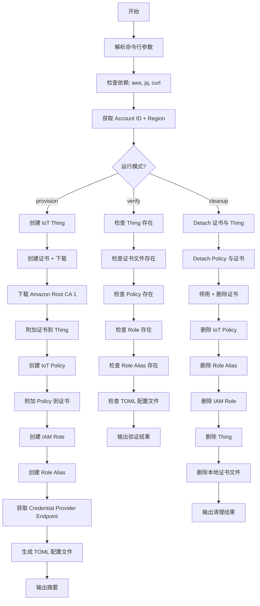
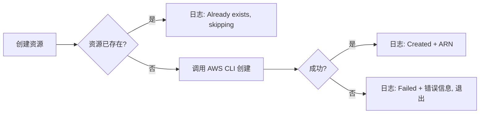
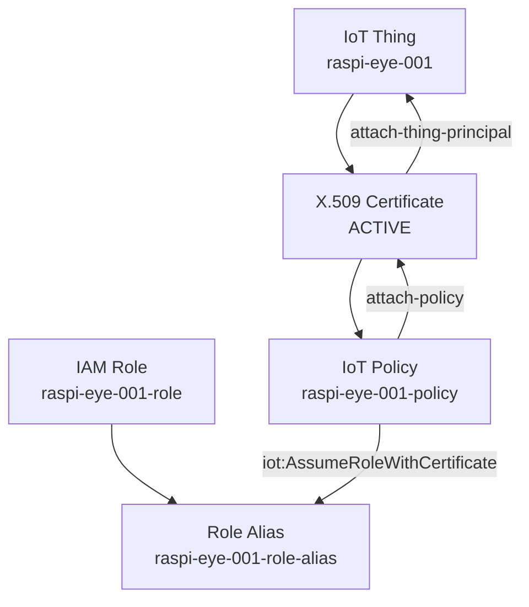

# 设计文档：Spec 6 — AWS IoT 设备注册与证书配置

## 概述

本设计实现一个 Bash 脚本 `scripts/provision-device.sh`，通过 AWS CLI 完成 IoT 设备注册的全部云端配置。脚本支持三种运行模式：provision（默认）、verify、cleanup。

核心设计目标：
- 幂等性：所有创建操作先检查资源是否存在，已存在则跳过
- 安全性：不硬编码 Account ID / Region，从 AWS CLI 配置和 STS 动态获取
- 可逆性：cleanup 模式按正确依赖顺序删除所有资源
- 输出完整：执行结束输出摘要 + 生成 TOML 配置文件

设计决策：
- **单文件脚本**：所有逻辑集中在 `scripts/provision-device.sh`，不拆分辅助脚本。脚本总行数预计 300-400 行，复杂度可控。
- **AWS CLI + jq**：不引入 Python/boto3，保持与现有 scripts/ 目录风格一致（纯 Bash）。jq 用于解析 JSON 响应。
- **TOML 配置文件**：输出到 `device/config/config.toml`，仅写入 `[aws]` section。如果文件已存在且包含其他 section，保留其他 section 不变。
- **证书路径使用相对路径**：TOML 中的 `cert_path`、`key_path`、`ca_path` 使用相对于项目根目录的路径（如 `device/certs/device-cert.pem`），便于跨机器使用。
- **cleanup 顺序**：先 detach 证书与 Thing/Policy 的关联 → 停用并删除证书 → 删除 Policy → 删除 Role Alias → 删除 IAM Role → 删除 Thing。顺序错误会导致 AWS API 报依赖错误。

## 架构

### 脚本执行流程



### 幂等性检查流程（每个资源创建步骤）



### 文件布局

```
scripts/
└── provision-device.sh          # 新增：设备注册脚本

device/
├── certs/                       # 新增目录（.gitignore 已排除）
│   ├── device-cert.pem          # 设备证书（脚本生成）
│   ├── device-private.key       # 设备私钥（脚本生成）
│   └── root-ca.pem              # Amazon Root CA 1（脚本下载）
└── config/
    ├── config.toml           # 实际配置文件（.gitignore 排除，脚本生成）
    └── config.toml.example   # 新增：配置模板（提交到 git）
```

## 组件与接口

### 命令行接口

```bash
scripts/provision-device.sh [OPTIONS]

必选参数:
  --thing-name NAME        IoT Thing 名称

可选参数:
  --output-dir DIR         证书输出目录（默认: device/certs）
  --policy-name NAME       IoT Policy 名称（默认: {thing-name}-policy）
  --role-name NAME         IAM Role 名称（默认: {thing-name}-role）
  --role-alias NAME        Role Alias 名称（默认: {thing-name}-role-alias）
  --verify                 验证模式：检查资源是否完整
  --cleanup                清理模式：删除所有资源
  --help                   显示帮助信息
```

### 脚本内部函数设计

```bash
#!/usr/bin/env bash
set -euo pipefail

# ============================================================
# 全局变量（从参数和 AWS CLI 获取，不硬编码）
# ============================================================
THING_NAME=""
OUTPUT_DIR="device/certs"
POLICY_NAME=""
ROLE_NAME=""
ROLE_ALIAS=""
MODE="provision"  # provision | verify | cleanup

# 运行时获取（不硬编码）
AWS_ACCOUNT_ID=""
AWS_REGION=""
CERT_ARN=""
CERT_ID=""

# ============================================================
# 工具函数
# ============================================================

log_info()    # 格式: [INFO] message
log_warn()    # 格式: [WARN] message
log_error()   # 格式: [ERROR] message
log_success() # 格式: [OK] message

check_dependencies()
# 检查 aws, jq, curl 是否可用
# 检查 aws sts get-caller-identity 是否成功（验证凭证配置）

get_aws_context()
# AWS_ACCOUNT_ID=$(aws sts get-caller-identity --query Account --output text)
# AWS_REGION=$(aws configure get region)

parse_args()
# 解析命令行参数，设置全局变量
# --thing-name 必选
# 默认值: POLICY_NAME="${THING_NAME}-policy"
#          ROLE_NAME="${THING_NAME}-role"
#          ROLE_ALIAS="${THING_NAME}-role-alias"

# ============================================================
# Provision 函数
# ============================================================

create_thing()
# 幂等：aws iot describe-thing 检查是否存在
# 创建：aws iot create-thing --thing-name "$THING_NAME"
# 输出：Thing ARN

create_certificate()
# 创建：aws iot create-keys-and-certificate --set-as-active
# 保存：certificatePem → device-cert.pem
#        keyPair.PrivateKey → device-private.key
# 记录：CERT_ARN, CERT_ID

download_root_ca()
# curl -o "${OUTPUT_DIR}/root-ca.pem" https://www.amazontrust.com/repository/AmazonRootCA1.pem
# 幂等：文件已存在则跳过

attach_cert_to_thing()
# aws iot attach-thing-principal --thing-name "$THING_NAME" --principal "$CERT_ARN"
# 幂等：list-thing-principals 检查是否已附加

create_iot_policy()
# 幂等：aws iot get-policy 检查是否存在
# Policy 内容：允许 iot:Connect 和 iot:AssumeRoleWithCertificate
# 创建：aws iot create-policy --policy-name "$POLICY_NAME" --policy-document "$POLICY_DOC"

attach_policy_to_cert()
# aws iot attach-policy --policy-name "$POLICY_NAME" --target "$CERT_ARN"
# 幂等：list-attached-policies 检查是否已附加

create_iam_role()
# 幂等：aws iam get-role 检查是否存在
# 信任策略：允许 credentials.iot.amazonaws.com 代入
# 创建：aws iam create-role --role-name "$ROLE_NAME" --assume-role-policy-document "$TRUST_POLICY"
# 注意：不附加权限策略（空权限），后续 Spec 按需追加

create_role_alias()
# 幂等：aws iot describe-role-alias 检查是否存在
# 创建：aws iot create-role-alias --role-alias "$ROLE_ALIAS" --role-arn "$ROLE_ARN"

get_credential_endpoint()
# aws iot describe-endpoint --endpoint-type iot:CredentialProvider --query endpointAddress --output text

generate_toml_config()
# 生成 device/config/config.toml
# 如果文件已存在，保留非 [aws] section，仅替换 [aws] section
# 证书路径使用相对路径

print_summary()
# 输出所有资源信息摘要

# ============================================================
# Verify 函数
# ============================================================

verify_resources()
# 逐项检查：Thing、证书文件、Policy、Role、Role Alias、TOML 配置
# 每项输出 [OK] 或 [FAIL]
# 最终输出总结

# ============================================================
# Cleanup 函数
# ============================================================

cleanup_resources()
# 按依赖顺序删除（先 detach 再 delete）:
# 1. detach cert from thing
# 2. detach policy from cert
# 3. deactivate + delete cert
# 4. delete policy
# 5. delete role alias
# 6. delete iam role
# 7. delete thing
# 8. 删除本地证书文件和 TOML 配置
# 每步失败不中断（set +e），记录警告继续
```

### IoT Policy 文档

```json
{
    "Version": "2012-10-17",
    "Statement": [
        {
            "Effect": "Allow",
            "Action": "iot:Connect",
            "Resource": "arn:aws:iot:REGION:ACCOUNT_ID:client/${iot:Connection.Thing.ThingName}"
        },
        {
            "Effect": "Allow",
            "Action": "iot:AssumeRoleWithCertificate",
            "Resource": "arn:aws:iot:REGION:ACCOUNT_ID:rolealias/ROLE_ALIAS_NAME"
        }
    ]
}
```

其中 `REGION`、`ACCOUNT_ID`、`ROLE_ALIAS_NAME` 在脚本运行时动态替换。

### IAM Role 信任策略

```json
{
    "Version": "2012-10-17",
    "Statement": [
        {
            "Effect": "Allow",
            "Principal": {
                "Service": "credentials.iot.amazonaws.com"
            },
            "Action": "sts:AssumeRole"
        }
    ]
}
```

### TOML 配置文件格式

```toml
[aws]
thing_name = "raspi-eye-001"
credential_endpoint = "xxxxxxxxxxxx.credentials.iot.ap-northeast-1.amazonaws.com"
role_alias = "raspi-eye-001-role-alias"
cert_path = "device/certs/device-cert.pem"
key_path = "device/certs/device-private.key"
ca_path = "device/certs/root-ca.pem"
```

### TOML 更新逻辑

当 `device/config/config.toml` 已存在时，脚本需要保留其他 section（如 `[camera]`、`[pipeline]`），仅替换 `[aws]` section。实现方式：

1. 读取现有文件内容
2. 用 `sed` 或 `awk` 删除 `[aws]` 到下一个 `[` 之间的内容
3. 追加新的 `[aws]` section
4. 如果文件不存在，直接写入

```bash
generate_toml_config() {
    local config_dir="device/config"
    local config_file="${config_dir}/config.toml"
    mkdir -p "$config_dir"

    local aws_section=""
    aws_section+="[aws]"$'\n'
    aws_section+="thing_name = \"${THING_NAME}\""$'\n'
    aws_section+="credential_endpoint = \"${CREDENTIAL_ENDPOINT}\""$'\n'
    aws_section+="role_alias = \"${ROLE_ALIAS}\""$'\n'
    aws_section+="cert_path = \"${OUTPUT_DIR}/device-cert.pem\""$'\n'
    aws_section+="key_path = \"${OUTPUT_DIR}/device-private.key\""$'\n'
    aws_section+="ca_path = \"${OUTPUT_DIR}/root-ca.pem\""

    if [[ -f "$config_file" ]]; then
        # 删除现有 [aws] section（从 [aws] 到下一个 [ 或文件末尾）
        # 追加新的 [aws] section
        local tmp_file="${config_file}.tmp"
        awk '/^\[aws\]/{skip=1; next} /^\[/{skip=0} !skip' "$config_file" > "$tmp_file"
        printf '\n%s\n' "$aws_section" >> "$tmp_file"
        mv "$tmp_file" "$config_file"
    else
        printf '%s\n' "$aws_section" > "$config_file"
    fi
}
```

## 数据模型

### AWS 资源依赖关系



### 资源命名规则

| 资源类型 | 命名格式 | 示例 |
|---------|---------|------|
| IoT Thing | `{thing-name}` | `raspi-eye-001` |
| IoT Policy | `{thing-name}-policy` | `raspi-eye-001-policy` |
| IAM Role | `{thing-name}-role` | `raspi-eye-001-role` |
| Role Alias | `{thing-name}-role-alias` | `raspi-eye-001-role-alias` |
| 设备证书 | `device-cert.pem` | `device/certs/device-cert.pem` |
| 设备私钥 | `device-private.key` | `device/certs/device-private.key` |
| Root CA | `root-ca.pem` | `device/certs/root-ca.pem` |

### 本地文件输出

| 文件 | 路径 | 来源 | .gitignore |
|------|------|------|-----------|
| 设备证书 | `device/certs/device-cert.pem` | `create-keys-and-certificate` 响应 | ✅ `*.pem` |
| 设备私钥 | `device/certs/device-private.key` | `create-keys-and-certificate` 响应 | ✅ `*.key` |
| Root CA | `device/certs/root-ca.pem` | `https://www.amazontrust.com/repository/AmazonRootCA1.pem` | ✅ `*.pem` |
| TOML 配置 | `device/config/config.toml` | 脚本生成 | ✅ 已排除 |
| TOML 模板 | `device/config/config.toml.example` | 手动创建，提交到 git | ❌ 提交 |

## 错误处理

### 脚本级错误处理

| 错误场景 | 处理方式 | 退出码 |
|---------|---------|--------|
| 缺少必选参数 `--thing-name` | 输出用法提示，退出 | 1 |
| 依赖工具缺失（aws/jq/curl） | 输出缺失工具名称，退出 | 1 |
| AWS 凭证未配置 | `sts get-caller-identity` 失败，输出提示，退出 | 1 |
| AWS API 调用失败（provision 模式） | 输出错误信息，立即退出（`set -e`） | 非零 |
| AWS API 调用失败（cleanup 模式） | 输出警告，继续执行下一步 | 0（尽力清理） |
| 网络错误（下载 Root CA） | curl 失败，退出 | 1 |
| 证书文件已存在（provision 模式） | 跳过证书创建，使用现有证书 | 0 |

### Cleanup 模式的容错设计

cleanup 模式使用 `set +e` 临时关闭错误退出，每步操作独立执行：

```bash
cleanup_resources() {
    local errors=0

    # 每步操作独立，失败不中断
    detach_cert_from_thing || { log_warn "Failed to detach cert from thing"; ((errors++)); }
    detach_policy_from_cert || { log_warn "Failed to detach policy from cert"; ((errors++)); }
    deactivate_and_delete_cert || { log_warn "Failed to delete cert"; ((errors++)); }
    delete_iot_policy || { log_warn "Failed to delete policy"; ((errors++)); }
    delete_role_alias || { log_warn "Failed to delete role alias"; ((errors++)); }
    delete_iam_role || { log_warn "Failed to delete IAM role"; ((errors++)); }
    delete_thing || { log_warn "Failed to delete thing"; ((errors++)); }
    delete_local_files || { log_warn "Failed to delete local files"; ((errors++)); }

    if [[ $errors -gt 0 ]]; then
        log_warn "Cleanup completed with $errors warnings"
    else
        log_success "All resources cleaned up"
    fi
}
```

### 幂等性保证

| 操作 | 检查方式 | 已存在时行为 |
|------|---------|-------------|
| 创建 Thing | `aws iot describe-thing` 返回 0 | 跳过，日志提示 |
| 创建证书 | 检查本地证书文件是否存在 | 跳过创建，从本地文件读取 cert ARN |
| 下载 Root CA | 检查文件是否存在 | 跳过下载 |
| 附加证书到 Thing | `aws iot list-thing-principals` 检查 | 跳过，日志提示 |
| 创建 Policy | `aws iot get-policy` 返回 0 | 跳过创建 |
| 附加 Policy 到证书 | `aws iot list-attached-policies` 检查 | 跳过，日志提示 |
| 创建 IAM Role | `aws iam get-role` 返回 0 | 跳过创建 |
| 创建 Role Alias | `aws iot describe-role-alias` 返回 0 | 跳过创建 |

### 证书 ARN 恢复（幂等场景）

当证书文件已存在但 `CERT_ARN` 未知时（如脚本中断后重新运行），需要从 AWS 恢复证书信息：

```bash
# 通过 Thing 的 principals 列表获取证书 ARN
CERT_ARN=$(aws iot list-thing-principals \
    --thing-name "$THING_NAME" \
    --query 'principals[0]' \
    --output text 2>/dev/null || echo "")
```

### 本地文件与 AWS 状态不一致的处理

当本地证书文件存在但 AWS 端证书已被手动删除时（`list-thing-principals` 返回空），后续 attach 操作会失败。处理方式：

```bash
if [[ -f "${OUTPUT_DIR}/device-cert.pem" ]] && [[ -z "$CERT_ARN" ]]; then
    log_error "Local cert files exist but no certificate found in AWS for thing '${THING_NAME}'"
    log_error "Run with --cleanup first, then re-provision"
    exit 1
fi
```

## 测试策略

### PBT 不适用说明

本 Spec 是纯 Bash 运维脚本，调用 AWS CLI 外部服务，不包含可测试的纯函数逻辑。不适用 property-based testing：
- 脚本操作是 side-effect-only（创建 AWS 资源、写文件）
- 行为不随输入变化（给定相同 thing-name，结果确定）
- 测试需要真实 AWS 环境，无法本地 mock

因此跳过 Correctness Properties 部分。

### 手动验证流程

本 Spec 的验证通过手动执行脚本完成，不编写自动化测试。

#### 验证步骤

```bash
# 1. Provision（首次执行）
bash scripts/provision-device.sh --thing-name raspi-eye-test

# 预期：
# - 创建 Thing、证书、Policy、Role、Role Alias
# - 下载 Root CA
# - 生成 device/config/config.toml
# - 输出摘要

# 2. 幂等性验证（再次执行）
bash scripts/provision-device.sh --thing-name raspi-eye-test

# 预期：
# - 所有资源显示 "Already exists, skipping"
# - 不创建重复资源

# 3. Verify 模式
bash scripts/provision-device.sh --thing-name raspi-eye-test --verify

# 预期：
# - 逐项检查所有资源，全部 [OK]

# 4. 凭证获取测试（验证端到端）
curl --cert device/certs/device-cert.pem \
     --key device/certs/device-private.key \
     -H "x-amzn-iot-thingname: raspi-eye-test" \
     --cacert device/certs/root-ca.pem \
     "https://$(aws iot describe-endpoint --endpoint-type iot:CredentialProvider --query endpointAddress --output text)/role-aliases/raspi-eye-test-role-alias/credentials"

# 预期：返回 JSON，包含 accessKeyId、secretAccessKey、sessionToken
# 注意：IAM Role 无权限策略，返回的临时凭证权限为空，但请求本身应成功

# 5. Cleanup
bash scripts/provision-device.sh --thing-name raspi-eye-test --cleanup

# 预期：
# - 按顺序删除所有资源
# - 删除本地证书文件

# 6. Cleanup 后 Verify
bash scripts/provision-device.sh --thing-name raspi-eye-test --verify

# 预期：
# - 所有资源显示 [FAIL]
```

### 现有测试回归

本 Spec 不修改 device/ 目录，不影响现有 C++ 测试。但作为安全检查：

```bash
# 确认现有测试不受影响
cmake -B device/build -S device -DCMAKE_BUILD_TYPE=Debug
cmake --build device/build
ctest --test-dir device/build --output-on-failure
```

预期：所有现有测试通过，零修改。

## 禁止项（Design 层）

- SHALL NOT 在脚本中硬编码 AWS Account ID 或 Region（通过 `aws sts get-caller-identity` 和 `aws configure get region` 动态获取）
- SHALL NOT 在日志或错误输出中打印证书内容、私钥内容（仅输出 ARN、ID 等标识符）
- SHALL NOT 在 cleanup 模式中因单步失败而中断整个清理流程（每步独立执行，失败记录警告继续）
- SHALL NOT 将 .pem、.key 证书文件或 config.toml 配置文件提交到 git（已在 .gitignore 中排除）
- SHALL NOT 使用 `cat <<` heredoc 方式写入文件（使用 `printf` 或变量赋值 + 重定向）
- SHALL NOT 在 TOML 更新时覆盖非 `[aws]` section 的内容
