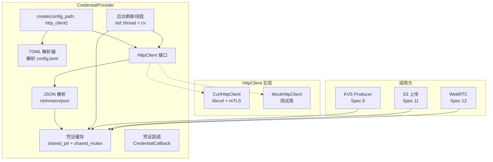
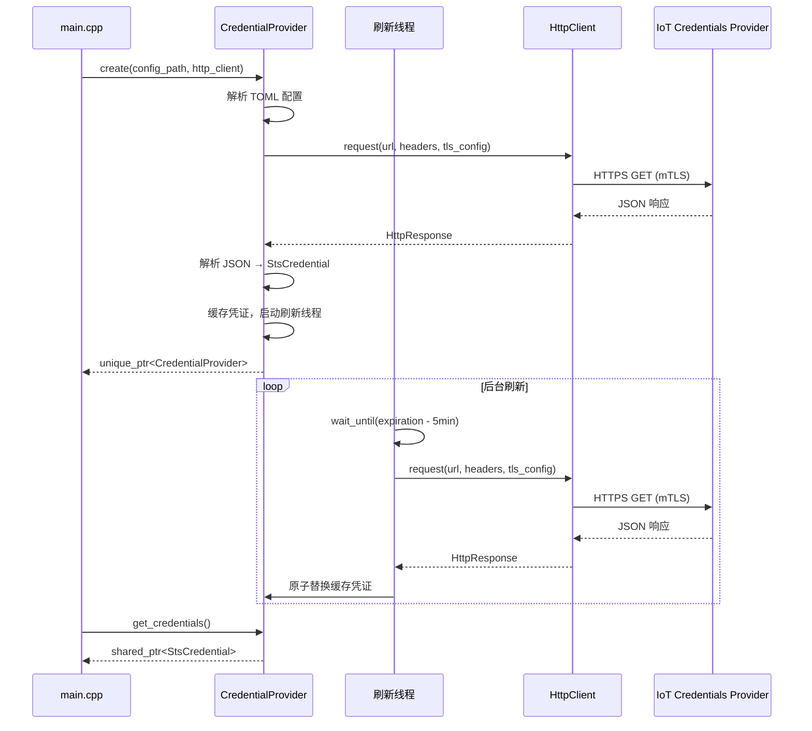

# 设计文档：Spec 7 — 设备端 AWS IoT 凭证获取模块

## 概述

本设计实现设备端 C++ 凭证模块 `CredentialProvider`，通过 libcurl + mTLS 向 AWS IoT Credentials Provider 发起 HTTPS 请求，获取 STS 临时凭证（accessKeyId、secretAccessKey、sessionToken、expiration），并在后台线程自动刷新。

核心设计目标：
- HTTP 层抽象：定义 `HttpClient` 纯虚接口，生产用 `CurlHttpClient`，测试用 mock 注入
- 简易 TOML 解析：手动解析 `[aws]` section 的 `key = "value"` 格式，不引入 toml++ 库
- JSON 解析：nlohmann/json v3.11.3（FetchContent，header-only）
- 凭证缓存：`std::shared_ptr<StsCredential>` + `std::shared_mutex`（读多写少场景）
- 后台刷新：`std::thread` + `std::condition_variable`，过期前 5 分钟触发
- curl 全局初始化：static 保证进程级单次调用
- 工厂方法：`CredentialProvider::create(config_path, http_client)` 返回 `std::unique_ptr`

设计决策：
- **HttpClient 接口抽象**：参考 AWS KVS Producer C SDK 的 `serviceCallFn` 回调模式，将 HTTP 请求抽象为接口。测试时注入 `MockHttpClient` 返回预设 JSON，无需真实 AWS 环境。这是可测试性的关键。
- **std::shared_mutex 而非 std::mutex**：`get_credentials()` 是高频读操作（KVS/S3 每次请求都调用），刷新是低频写操作。`shared_mutex` 允许多线程并发读，仅写入时独占。
- **std::thread 而非 GLib 定时器**：凭证刷新与 GStreamer 管道无关，不应依赖 GMainLoop。独立线程 + condition_variable 更简洁，且 `CredentialProvider` 可在管道启动前初始化。
- **简易 TOML 解析器**：仅需解析 `[section]` + `key = "value"` 格式。provision-device.sh 生成的 config.toml 格式固定，不需要完整 TOML 规范支持。Spec 18 再引入 toml++。
- **初始化时同步获取**：`create()` 工厂方法内执行一次同步 HTTP 请求，确保返回时凭证已可用。失败则返回错误，不启动后台线程。
- **超时拆分**：需求要求 10s 总超时，参考 AWS 官方实现拆分为连接超时 5s + 完成超时 10s，更精确地区分网络不可达和服务端慢响应。
- **证书预检查**：在初始化时验证证书文件存在性、PEM 格式、私钥权限（chmod 400/600）。防止运行时 curl 报晦涩的 TLS 错误，提前给出明确的诊断信息。
- **TLS 版本限制**：限制 TLS 1.2-1.3，加 `CURLOPT_CAPATH=/etc/ssl/certs` 作为系统 CA 库 fallback，增强证书链验证的兼容性。
- **指数退避重试**：从 1s 开始指数退避到 60s，最多 10 次。瞬时网络抖动快速恢复，持续故障不频繁重试。

## 架构

### 整体架构图



### 凭证刷新时序图



### 文件布局

```
device/
├── CMakeLists.txt              # 修改：添加 libcurl、nlohmann/json、credential_module
├── src/
│   ├── credential_provider.h   # 新增：所有类型定义和类声明
│   ├── credential_provider.cpp # 新增：实现
│   ├── pipeline_manager.h      # 不修改
│   └── ...
└── tests/
    ├── credential_test.cpp     # 新增：凭证模块测试（含 PBT）
    ├── smoke_test.cpp          # 不修改
    └── ...
```

## 组件与接口

### 完整头文件（credential_provider.h）

```cpp
// credential_provider.h
// AWS IoT Credentials Provider client with background refresh.
#pragma once

#include <chrono>
#include <condition_variable>
#include <functional>
#include <memory>
#include <mutex>
#include <shared_mutex>
#include <string>
#include <thread>
#include <unordered_map>

// ============================================================
// Data structures
// ============================================================

// AWS 连接配置（从 TOML 解析）
struct AwsConfig {
    std::string thing_name;
    std::string credential_endpoint;
    std::string role_alias;
    std::string cert_path;
    std::string key_path;
    std::string ca_path;
};

// STS 临时凭证
struct StsCredential {
    std::string access_key_id;
    std::string secret_access_key;
    std::string session_token;
    std::chrono::system_clock::time_point expiration;
};

// HTTP 请求的 TLS 配置
struct TlsConfig {
    std::string cert_path;    // 客户端证书（PEM）
    std::string key_path;     // 客户端私钥（PEM）
    std::string ca_path;      // CA 证书
};

// HTTP 响应
struct HttpResponse {
    long status_code = 0;
    std::string body;
    std::string error_message;  // curl 错误描述（非零错误码时填充）
};

// 凭证不可用回调
using CredentialCallback = std::function<void()>;

// ============================================================
// TOML 解析（仅 [aws] section）
// ============================================================

// 解析 TOML 文件的指定 section，返回 key-value map
// 支持 key = "value"（带引号）和 key = value（不带引号）
// 忽略 # 注释行和空行
// 错误时返回空 map 并填充 error_msg
std::unordered_map<std::string, std::string> parse_toml_section(
    const std::string& file_path,
    const std::string& section_name,
    std::string* error_msg = nullptr);

// 从 TOML key-value map 构建 AwsConfig
// 缺少必要字段时返回 false 并填充 error_msg
bool build_aws_config(
    const std::unordered_map<std::string, std::string>& kv,
    AwsConfig& config,
    std::string* error_msg = nullptr);

// ============================================================
// JSON 解析
// ============================================================

// 从 JSON 响应体解析 STS 凭证
// 错误时返回 false 并填充 error_msg
bool parse_credential_json(
    const std::string& json_body,
    StsCredential& credential,
    std::string* error_msg = nullptr);

// 解析 ISO 8601 时间字符串为 time_point
// 支持格式：2025-01-01T00:00:00Z
bool parse_iso8601(
    const std::string& time_str,
    std::chrono::system_clock::time_point& tp,
    std::string* error_msg = nullptr);

// ============================================================
// 证书预检查（初始化时验证文件有效性）
// ============================================================

// 检查文件是否存在且为普通文件
bool file_exists(const std::string& path);

// 检查文件是否为 PEM 格式（包含 -----BEGIN 和 -----END 标记）
bool is_pem_format(const std::string& file_path);

// 检查私钥文件权限是否安全（chmod 400 或 600，group/other 无权限）
// macOS/Linux 均支持
bool check_key_permissions(const std::string& file_path);

// 验证证书文件：存在性 + PEM 格式 + 私钥权限
// 错误时返回 false 并填充 error_msg
bool validate_cert_files(const AwsConfig& config, std::string* error_msg = nullptr);

// ============================================================
// HttpClient 接口（可测试性关键）
// ============================================================

class HttpClient {
public:
    virtual ~HttpClient() = default;

    // 发起 HTTPS GET 请求
    // url: 完整 URL
    // headers: HTTP 请求头（key: value）
    // tls: mTLS 配置
    virtual HttpResponse get(
        const std::string& url,
        const std::unordered_map<std::string, std::string>& headers,
        const TlsConfig& tls) = 0;
};

// ============================================================
// CurlHttpClient（生产实现）
// ============================================================

class CurlHttpClient : public HttpClient {
public:
    CurlHttpClient();
    ~CurlHttpClient() override;

    // No copy
    CurlHttpClient(const CurlHttpClient&) = delete;
    CurlHttpClient& operator=(const CurlHttpClient&) = delete;

    HttpResponse get(
        const std::string& url,
        const std::unordered_map<std::string, std::string>& headers,
        const TlsConfig& tls) override;

private:
    // curl_global_init / cleanup 的进程级单次调用
    static void ensure_curl_global_init();

    // libcurl write callback
    static size_t write_callback(char* ptr, size_t size, size_t nmemb, void* userdata);
};

// ============================================================
// CredentialProvider
// ============================================================

class CredentialProvider {
public:
    ~CredentialProvider();

    // No copy
    CredentialProvider(const CredentialProvider&) = delete;
    CredentialProvider& operator=(const CredentialProvider&) = delete;

    // 工厂方法：解析配置 → 同步获取首次凭证 → 启动后台刷新
    // config_path: TOML 配置文件路径
    // http_client: HTTP 客户端（生产传 CurlHttpClient，测试传 mock）
    // error_msg: 失败时填充错误信息
    // 返回 nullptr 表示失败
    static std::unique_ptr<CredentialProvider> create(
        const std::string& config_path,
        std::shared_ptr<HttpClient> http_client,
        std::string* error_msg = nullptr);

    // 获取当前缓存的凭证（线程安全，不发起网络请求）
    // 返回 shared_ptr 允许调用方安全持有快照
    std::shared_ptr<const StsCredential> get_credentials() const;

    // 凭证是否已过期
    bool is_expired() const;

    // 注册凭证不可用回调（连续刷新失败且凭证已过期时触发）
    void set_credential_callback(CredentialCallback cb);

    // 获取 AWS 配置（只读）
    const AwsConfig& config() const { return config_; }

private:
    // 私有构造，由 create() 调用
    CredentialProvider(AwsConfig config, std::shared_ptr<HttpClient> http_client);

    // 执行一次凭证获取（同步）
    bool fetch_credentials(std::string* error_msg = nullptr);

    // 后台刷新线程入口
    void refresh_loop();

    // 配置
    AwsConfig config_;

    // HTTP 客户端（共享所有权，测试中可能被多个对象引用）
    std::shared_ptr<HttpClient> http_client_;

    // 凭证缓存（shared_mutex 保护，读多写少）
    mutable std::shared_mutex credential_mutex_;
    std::shared_ptr<const StsCredential> cached_credential_;

    // 后台刷新线程
    std::thread refresh_thread_;
    std::mutex refresh_mutex_;
    std::condition_variable refresh_cv_;
    bool stop_requested_ = false;

    // 刷新重试配置（指数退避）
    static constexpr int kRefreshBeforeExpirySec = 300;  // 过期前 5 分钟
    static constexpr int kInitialRetryDelaySec = 1;      // 首次重试 1 秒
    static constexpr int kMaxRetryDelaySec = 60;         // 最大重试间隔 60 秒
    static constexpr int kMaxRetries = 10;               // 最大重试次数

    // 凭证不可用回调
    CredentialCallback credential_cb_;
};
```

### 实现要点（credential_provider.cpp）

#### 1. TOML 解析器

```cpp
std::unordered_map<std::string, std::string> parse_toml_section(
    const std::string& file_path,
    const std::string& section_name,
    std::string* error_msg) {
    std::unordered_map<std::string, std::string> result;
    std::ifstream file(file_path);
    if (!file.is_open()) {
        if (error_msg) *error_msg = "Cannot open config file: " + file_path;
        return result;
    }

    std::string target = "[" + section_name + "]";
    bool in_section = false;
    std::string line;

    while (std::getline(file, line)) {
        // 去除首尾空白
        auto trimmed = trim(line);
        // 跳过空行和注释
        if (trimmed.empty() || trimmed[0] == '#') continue;
        // 检测 section 头
        if (trimmed[0] == '[') {
            in_section = (trimmed == target);
            continue;
        }
        if (!in_section) continue;
        // 解析 key = value 或 key = "value"
        auto eq_pos = trimmed.find('=');
        if (eq_pos == std::string::npos) continue;
        auto key = trim(trimmed.substr(0, eq_pos));
        auto val = trim(trimmed.substr(eq_pos + 1));
        // 去除引号
        if (val.size() >= 2 && val.front() == '"' && val.back() == '"') {
            val = val.substr(1, val.size() - 2);
        }
        result[key] = val;
    }
    return result;
}
```

#### 2. CurlHttpClient 实现

```cpp
void CurlHttpClient::ensure_curl_global_init() {
    static bool initialized = [] {
        curl_global_init(CURL_GLOBAL_DEFAULT);
        std::atexit(curl_global_cleanup);
        return true;
    }();
    (void)initialized;
}

HttpResponse CurlHttpClient::get(
    const std::string& url,
    const std::unordered_map<std::string, std::string>& headers,
    const TlsConfig& tls) {

    ensure_curl_global_init();
    HttpResponse response;

    CURL* curl = curl_easy_init();
    if (!curl) {
        response.error_message = "curl_easy_init failed";
        return response;
    }

    // URL
    curl_easy_setopt(curl, CURLOPT_URL, url.c_str());

    // Headers
    struct curl_slist* header_list = nullptr;
    for (const auto& [key, value] : headers) {
        std::string header = key + ": " + value;
        header_list = curl_slist_append(header_list, header.c_str());
    }
    if (header_list) {
        curl_easy_setopt(curl, CURLOPT_HTTPHEADER, header_list);
    }

    // mTLS 配置
    curl_easy_setopt(curl, CURLOPT_SSLCERT, tls.cert_path.c_str());
    curl_easy_setopt(curl, CURLOPT_SSLCERTTYPE, "PEM");
    curl_easy_setopt(curl, CURLOPT_SSLKEY, tls.key_path.c_str());
    curl_easy_setopt(curl, CURLOPT_CAINFO, tls.ca_path.c_str());
    // 系统 CA 库作为 fallback（Linux: /etc/ssl/certs）
    curl_easy_setopt(curl, CURLOPT_CAPATH, "/etc/ssl/certs");

    // TLS 版本限制：最低 TLS 1.2，最高 TLS 1.3
    constexpr long CURL_SSLVERSION_MAX_TLSv1_3_VAL = (7L << 16);
    curl_easy_setopt(curl, CURLOPT_SSLVERSION,
                     CURL_SSLVERSION_TLSv1_2 | CURL_SSLVERSION_MAX_TLSv1_3_VAL);

    // 超时：连接 5s，完成 10s
    curl_easy_setopt(curl, CURLOPT_CONNECTTIMEOUT, 5L);
    curl_easy_setopt(curl, CURLOPT_TIMEOUT, 10L);

    // 响应体写入
    std::string body;
    curl_easy_setopt(curl, CURLOPT_WRITEFUNCTION, write_callback);
    curl_easy_setopt(curl, CURLOPT_WRITEDATA, &body);

    // 执行请求
    CURLcode res = curl_easy_perform(curl);
    if (res != CURLE_OK) {
        response.error_message = curl_easy_strerror(res);
    } else {
        curl_easy_getinfo(curl, CURLINFO_RESPONSE_CODE, &response.status_code);
        response.body = std::move(body);
    }

    curl_slist_free_all(header_list);
    curl_easy_cleanup(curl);
    return response;
}
```

#### 3. JSON 解析

```cpp
bool parse_credential_json(
    const std::string& json_body,
    StsCredential& credential,
    std::string* error_msg) {
    try {
        auto j = nlohmann::json::parse(json_body);
        auto& creds = j.at("credentials");
        credential.access_key_id = creds.at("accessKeyId").get<std::string>();
        credential.secret_access_key = creds.at("secretAccessKey").get<std::string>();
        credential.session_token = creds.at("sessionToken").get<std::string>();
        std::string exp_str = creds.at("expiration").get<std::string>();
        if (!parse_iso8601(exp_str, credential.expiration, error_msg)) {
            return false;
        }
        return true;
    } catch (const nlohmann::json::exception& e) {
        if (error_msg) *error_msg = std::string("JSON parse error: ") + e.what();
        return false;
    }
}
```

#### 4. ISO 8601 解析

```cpp
bool parse_iso8601(
    const std::string& time_str,
    std::chrono::system_clock::time_point& tp,
    std::string* error_msg) {
    // 支持格式：2025-01-01T00:00:00Z
    std::tm tm = {};
    std::istringstream ss(time_str);
    ss >> std::get_time(&tm, "%Y-%m-%dT%H:%M:%S");
    if (ss.fail()) {
        if (error_msg) *error_msg = "Invalid ISO 8601 format: " + time_str;
        return false;
    }
    // timegm 将 UTC tm 转为 time_t（POSIX 标准，macOS/Linux 均支持）
    time_t t = timegm(&tm);
    if (t == -1) {
        if (error_msg) *error_msg = "timegm failed for: " + time_str;
        return false;
    }
    tp = std::chrono::system_clock::from_time_t(t);
    return true;
}
```

#### 5. 后台刷新线程

```cpp
void CredentialProvider::refresh_loop() {
    while (true) {
        // 计算下次刷新时间
        std::chrono::system_clock::time_point refresh_at;
        {
            std::shared_lock lock(credential_mutex_);
            if (cached_credential_) {
                refresh_at = cached_credential_->expiration
                    - std::chrono::seconds(kRefreshBeforeExpirySec);
            }
        }

        // 等待到刷新时间或被唤醒退出
        {
            std::unique_lock lock(refresh_mutex_);
            auto now = std::chrono::system_clock::now();
            if (refresh_at > now) {
                refresh_cv_.wait_until(lock, refresh_at, [this] {
                    return stop_requested_;
                });
            }
            if (stop_requested_) return;
        }

        // 尝试刷新，失败则指数退避重试
        int retries = 0;
        int delay_sec = kInitialRetryDelaySec;
        bool success = false;
        while (retries < kMaxRetries && !stop_requested_) {
            std::string err;
            if (fetch_credentials(&err)) {
                success = true;
                spdlog::info("Credential refreshed successfully");
                break;
            }
            retries++;
            spdlog::warn("Credential refresh failed (attempt {}/{}): {}",
                         retries, kMaxRetries, err);
            // 指数退避等待
            {
                std::unique_lock lock(refresh_mutex_);
                refresh_cv_.wait_for(lock,
                    std::chrono::seconds(delay_sec),
                    [this] { return stop_requested_; });
                if (stop_requested_) return;
            }
            delay_sec = std::min(delay_sec * 2, kMaxRetryDelaySec);
        }

        // 连续失败且凭证已过期 → 通知调用方
        if (!success && is_expired()) {
            spdlog::error("Credential expired and refresh failed after {} retries",
                          kMaxRetries);
            if (credential_cb_) {
                credential_cb_();
            }
        }
    }
}
```

#### 6. 凭证获取（同步）

```cpp
bool CredentialProvider::fetch_credentials(std::string* error_msg) {
    // 构建 URL
    std::string url = "https://" + config_.credential_endpoint
        + "/role-aliases/" + config_.role_alias + "/credentials";

    // 构建 headers
    std::unordered_map<std::string, std::string> headers;
    headers["x-amzn-iot-thingname"] = config_.thing_name;

    // TLS 配置
    TlsConfig tls{config_.cert_path, config_.key_path, config_.ca_path};

    // 发起请求
    auto response = http_client_->get(url, headers, tls);

    // 检查 curl 错误
    if (!response.error_message.empty()) {
        if (error_msg) *error_msg = "HTTP request failed: " + response.error_message;
        return false;
    }

    // 检查 HTTP 状态码
    if (response.status_code != 200) {
        if (error_msg) {
            *error_msg = "HTTP " + std::to_string(response.status_code)
                + ": " + response.body;
        }
        return false;
    }

    // 解析 JSON
    auto credential = std::make_shared<StsCredential>();
    if (!parse_credential_json(response.body, *credential, error_msg)) {
        return false;
    }

    // 原子替换缓存
    {
        std::unique_lock lock(credential_mutex_);
        cached_credential_ = std::move(credential);
    }
    return true;
}
```

#### 7. 析构与优雅退出

```cpp
CredentialProvider::~CredentialProvider() {
    {
        std::lock_guard lock(refresh_mutex_);
        stop_requested_ = true;
    }
    refresh_cv_.notify_all();
    if (refresh_thread_.joinable()) {
        refresh_thread_.join();  // 等待线程退出（应在 2 秒内）
    }
}
```

### CMakeLists.txt 变更

```cmake
# nlohmann/json（FetchContent，header-only）
FetchContent_Declare(json
    URL https://github.com/nlohmann/json/releases/download/v3.11.3/json.tar.xz)
FetchContent_MakeAvailable(json)

# libcurl（系统包）
find_package(CURL REQUIRED)

# 凭证模块库
add_library(credential_module STATIC src/credential_provider.cpp)
target_include_directories(credential_module PUBLIC src)
target_link_libraries(credential_module PUBLIC
    nlohmann_json::nlohmann_json
    CURL::libcurl
    spdlog::spdlog
    log_module)

# 凭证测试
add_executable(credential_test tests/credential_test.cpp)
target_link_libraries(credential_test PRIVATE
    credential_module
    GTest::gtest_main
    rapidcheck
    rapidcheck_gtest)
add_test(NAME credential_test COMMAND credential_test)
```

## 数据模型

### AwsConfig（TOML 配置）

| 字段 | 类型 | 来源 | 说明 |
|------|------|------|------|
| `thing_name` | `std::string` | config.toml `[aws]` | IoT Thing 名称 |
| `credential_endpoint` | `std::string` | config.toml `[aws]` | Credentials Provider 端点 |
| `role_alias` | `std::string` | config.toml `[aws]` | IAM Role Alias |
| `cert_path` | `std::string` | config.toml `[aws]` | 客户端证书路径（PEM） |
| `key_path` | `std::string` | config.toml `[aws]` | 客户端私钥路径（PEM） |
| `ca_path` | `std::string` | config.toml `[aws]` | CA 证书路径 |

### StsCredential（临时凭证）

| 字段 | 类型 | JSON 字段 | 说明 |
|------|------|-----------|------|
| `access_key_id` | `std::string` | `credentials.accessKeyId` | 访问密钥 ID |
| `secret_access_key` | `std::string` | `credentials.secretAccessKey` | 秘密访问密钥 |
| `session_token` | `std::string` | `credentials.sessionToken` | 会话令牌 |
| `expiration` | `system_clock::time_point` | `credentials.expiration` | 过期时间（ISO 8601） |

### HttpResponse

| 字段 | 类型 | 说明 |
|------|------|------|
| `status_code` | `long` | HTTP 状态码（0 表示 curl 错误） |
| `body` | `std::string` | 响应体 |
| `error_message` | `std::string` | curl 错误描述（非零错误码时填充） |

### TOML 配置文件格式

```toml
[aws]
thing_name = "RaspiEyeAlpha"
credential_endpoint = "c19imbvbcm8u20.credentials.iot.ap-southeast-1.amazonaws.com"
role_alias = "RaspiEyeRoleAlias"
cert_path = "device/certs/device-cert.pem"
key_path = "device/certs/device-private.key"
ca_path = "device/certs/root-ca.pem"
```

### JSON 响应格式

```json
{
    "credentials": {
        "accessKeyId": "ASIAQE...",
        "secretAccessKey": "wJalr...",
        "sessionToken": "FwoGZX...",
        "expiration": "2025-01-01T00:00:00Z"
    }
}
```

## 正确性属性（Correctness Properties）

*属性（Property）是在系统所有合法执行中都应成立的特征或行为——本质上是对系统行为的形式化陈述。属性是人类可读规格与机器可验证正确性保证之间的桥梁。*

### Prework 分析总结

从 6 个需求的 30+ 条验收标准中，识别出以下可作为 property-based testing 的候选：

| 来源 | 分类 | 说明 |
|------|------|------|
| 1.1 + 1.4 | PROPERTY | TOML round-trip：生成 → 序列化 → 解析 → 验证一致（含引号格式变体） |
| 1.5 | PROPERTY | TOML metamorphic：插入注释/空行不改变解析结果 |
| 1.3 | PROPERTY | TOML 缺失字段：随机移除字段 → 报错含字段名 |
| 2.1 + 2.2 + 2.3 + 2.4 | PROPERTY | 请求参数完整性：URL 格式、header、TLS 配置与 AwsConfig 一致 |
| 2.7 | PROPERTY | 非 200 状态码 → 返回错误含状态码 |
| 3.1 + 3.4 + 3.5 | PROPERTY | JSON round-trip：生成凭证 → 序列化 JSON → 解析 → 验证一致（含 ISO 8601） |
| 3.3 | PROPERTY | JSON 缺失字段：随机移除字段 → 报错含字段名 |
| 4.3 | PROPERTY | 缓存读取不触发额外网络请求 |
| 6.4 | PROPERTY | 过期判断：expiration vs now 的比较正确性 |

其余验收标准分类为 EXAMPLE（具体场景如初始化失败、刷新重试）、SMOKE（编译约束、RAII）或 INTEGRATION（多线程并发、curl 超时），不适合 PBT。

### Property Reflection

- 1.1（TOML round-trip）和 1.4（引号格式）合并：round-trip 测试中随机选择带引号/不带引号格式，一个属性覆盖两者。
- 3.1（JSON round-trip）、3.4（ISO 8601 round-trip）和 3.5（字段值一致）合并：JSON round-trip 已包含 expiration 的 ISO 8601 解析验证。
- 2.1（URL 格式）、2.2（header）、2.3（cert/key）、2.4（ca_path）合并为一个属性：通过 mock 捕获的请求参数验证所有配置正确传递。
- 其余属性各自独立，无冗余。

最终 9 个属性，无冗余。

### Property 1: TOML 解析 round-trip

*For any* 有效的 AwsConfig（6 个字段均为非空字符串），将其序列化为 TOML `[aws]` section 格式（随机选择带引号或不带引号），然后解析该 TOML 内容，解析结果的每个字段值应与原始 AwsConfig 完全一致。

**Validates: Requirements 1.1, 1.4**

### Property 2: TOML 注释和空行不影响解析

*For any* 有效的 TOML `[aws]` section 内容，在其中随机位置插入任意数量的注释行（以 `#` 开头）和空行后，解析结果应与未插入注释/空行的版本完全一致。

**Validates: Requirements 1.5**

### Property 3: TOML 缺失字段检测

*For any* 6 个必要字段（thing_name、credential_endpoint、role_alias、cert_path、key_path、ca_path）的非空真子集被移除后，`build_aws_config()` 应返回 false，且错误信息应包含所有被移除字段的名称。

**Validates: Requirements 1.3**

### Property 4: HTTP 请求参数完整性

*For any* 有效的 AwsConfig，通过 mock HttpClient 捕获 `fetch_credentials()` 发出的请求参数，URL 应为 `https://{endpoint}/role-aliases/{role_alias}/credentials`，headers 应包含 `x-amzn-iot-thingname: {thing_name}`，TlsConfig 的 cert_path、key_path、ca_path 应与配置一致。

**Validates: Requirements 2.1, 2.2, 2.3, 2.4**

### Property 5: 非 200 状态码返回错误

*For any* HTTP 状态码 N（N ≠ 200 且 N ∈ [100, 599]），当 mock HttpClient 返回该状态码时，`fetch_credentials()` 应返回 false，且错误信息应包含状态码数字。

**Validates: Requirements 2.7**

### Property 6: JSON 凭证解析 round-trip

*For any* 有效的 StsCredential（access_key_id、secret_access_key、session_token 为非空字符串，expiration 为合理时间范围内的 time_point），将其序列化为 AWS IoT Credentials Provider 的 JSON 响应格式，然后用 `parse_credential_json()` 解析，解析结果的每个字段值应与原始 StsCredential 完全一致（expiration 精确到秒）。

**Validates: Requirements 3.1, 3.4, 3.5**

### Property 7: JSON 缺失字段检测

*For any* 4 个必要 JSON 字段（accessKeyId、secretAccessKey、sessionToken、expiration）的非空真子集被移除后，`parse_credential_json()` 应返回 false，且错误信息应非空。

**Validates: Requirements 3.3**

### Property 8: 缓存读取不触发网络请求

*For any* 正整数 N（N ∈ [2, 100]），在 CredentialProvider 初始化成功后连续调用 N 次 `get_credentials()`，mock HttpClient 的 `get()` 方法应仅被调用 1 次（初始化时的同步获取）。

**Validates: Requirements 4.3**

### Property 9: 过期判断正确性

*For any* StsCredential，如果 expiration 早于当前时间，则 `is_expired()` 应返回 true；如果 expiration 晚于当前时间超过 1 秒，则 `is_expired()` 应返回 false。

**Validates: Requirements 6.4**

## 错误处理

### TOML 解析错误

| 错误场景 | 处理方式 | 日志 |
|---------|---------|------|
| 配置文件不存在 | `parse_toml_section()` 返回空 map，error_msg 包含文件路径 | error: "Cannot open config file: {path}" |
| `[aws]` section 不存在 | 返回空 map（无错误，但后续 `build_aws_config()` 会检测缺失字段） | — |
| 缺少必要字段 | `build_aws_config()` 返回 false，error_msg 列出缺失字段 | error: "Missing required fields: {field1}, {field2}" |
| 格式错误的行（无 `=`） | 跳过该行，不报错 | — |

### HTTP 请求错误

| 错误场景 | 处理方式 | 日志 |
|---------|---------|------|
| curl 错误（网络不可达、超时等） | `HttpResponse.error_message` 非空，`fetch_credentials()` 返回 false | error: "HTTP request failed: {curl_error}" |
| HTTP 非 200 响应 | `fetch_credentials()` 返回 false，error_msg 包含状态码和响应体 | error: "HTTP {status_code}: {body}" |
| `curl_easy_init()` 失败 | 返回 error_message = "curl_easy_init failed" | error: "curl_easy_init failed" |

### JSON 解析错误

| 错误场景 | 处理方式 | 日志 |
|---------|---------|------|
| JSON 格式不合法 | `parse_credential_json()` 返回 false，error_msg 包含 nlohmann 异常信息 | error: "JSON parse error: {what()}" |
| `credentials` 对象缺失 | 同上（nlohmann `at()` 抛出 `out_of_range`） | error: "JSON parse error: key 'credentials' not found" |
| 必要字段缺失 | 同上 | error: "JSON parse error: key '{field}' not found" |
| ISO 8601 格式错误 | `parse_iso8601()` 返回 false | error: "Invalid ISO 8601 format: {time_str}" |

### 凭证刷新错误

| 错误场景 | 处理方式 | 日志 |
|---------|---------|------|
| 刷新失败（第 1-10 次） | 记录 warn 日志，指数退避重试（1s → 2s → 4s → ... → 60s） | warn: "Credential refresh failed (attempt {N}/{max}): {error}" |
| 连续 10 次失败且凭证已过期 | 触发 `credential_cb_` 回调 | error: "Credential expired and refresh failed after 10 retries" |
| 刷新失败但凭证未过期 | 继续使用旧凭证，下次过期前再尝试 | warn 级别日志 |

### 日志安全

所有日志输出遵循以下规则：
- 允许输出：thing_name、credential_endpoint、role_alias、HTTP 状态码、错误描述
- 禁止输出：access_key_id、secret_access_key、session_token、证书内容、私钥内容

## 测试策略

### 测试方法

本 Spec 采用三重验证策略：

1. **Property-based testing（RapidCheck）**：验证 TOML 解析、JSON 解析、请求参数构建的数学属性
2. **Example-based 单元测试（Google Test）**：验证具体场景（初始化、刷新、错误处理）
3. **ASan 运行时检查**：Debug 构建自动检测内存错误

### Property-Based Testing 配置

- 框架：RapidCheck（已通过 FetchContent 引入）
- 每个属性最少 100 次迭代
- 标签格式：`Feature: spec-7-credential-provider, Property {N}: {description}`
- TOML/JSON 测试使用内存字符串，不涉及文件 I/O（除 TOML 文件读取测试外）

### 新增测试文件：credential_test.cpp

#### Property-Based Tests

| 测试用例 | 对应属性 | 验证内容 |
|---------|---------|---------|
| `TomlRoundTrip` | Property 1 | 随机 AwsConfig → TOML 字符串 → 解析 → 验证一致 |
| `TomlCommentsAndBlankLines` | Property 2 | 随机插入注释/空行 → 解析结果不变 |
| `TomlMissingFieldsDetected` | Property 3 | 随机移除字段 → 报错含字段名 |
| `HttpRequestParams` | Property 4 | 随机 AwsConfig → mock 捕获请求 → 验证 URL/header/TLS |
| `NonOkStatusReturnsError` | Property 5 | 随机非 200 状态码 → 返回错误含状态码 |
| `JsonCredentialRoundTrip` | Property 6 | 随机 StsCredential → JSON → 解析 → 验证一致 |
| `JsonMissingFieldsDetected` | Property 7 | 随机移除 JSON 字段 → 解析失败 |
| `CacheDoesNotTriggerNetwork` | Property 8 | N 次 get_credentials() → mock 仅调用 1 次 |
| `ExpirationCheck` | Property 9 | 随机过期时间 → is_expired() 正确 |

#### Example-Based Tests

| 测试用例 | 验证内容 | 对应需求 |
|---------|---------|---------|
| `CreateSuccess` | mock 返回有效凭证 → create() 成功 → get_credentials() 有值 | 5.6 |
| `CreateFailsOnHttpError` | mock 返回 curl 错误 → create() 返回 nullptr | 5.7, 2.6 |
| `CreateFailsOnMissingConfig` | 配置文件不存在 → create() 返回 nullptr | 1.2 |
| `CreateFailsOnInvalidJson` | mock 返回非法 JSON → create() 返回 nullptr | 3.2 |
| `DestructorGracefulShutdown` | 创建后立即析构 → 2 秒内完成 | 5.4 |
| `NoCopyable` | static_assert 验证不可拷贝 | 5.5 |

#### 测试辅助设施

```cpp
// MockHttpClient：记录请求参数，返回预设响应
class MockHttpClient : public HttpClient {
public:
    // 预设响应
    HttpResponse preset_response;

    // 记录的请求参数
    std::string last_url;
    std::unordered_map<std::string, std::string> last_headers;
    TlsConfig last_tls;
    int call_count = 0;

    HttpResponse get(
        const std::string& url,
        const std::unordered_map<std::string, std::string>& headers,
        const TlsConfig& tls) override {
        last_url = url;
        last_headers = headers;
        last_tls = tls;
        call_count++;
        return preset_response;
    }
};

// 生成有效的 JSON 凭证响应
std::string make_credential_json(
    const std::string& access_key,
    const std::string& secret_key,
    const std::string& token,
    const std::string& expiration);

// 生成有效的 TOML [aws] section 字符串
std::string make_toml_aws_section(const AwsConfig& config, bool use_quotes = true);
```

### 现有测试回归

| 测试文件 | 测试数量 | 预期 |
|---------|---------|------|
| `smoke_test.cpp` | 8 个 | 全部通过，零修改 |
| `log_test.cpp` | 7 个 | 全部通过，零修改 |
| `tee_test.cpp` | 8 个 | 全部通过，零修改 |
| `camera_test.cpp` | 10 个 | 全部通过，零修改 |
| `health_test.cpp` | ~12 个 | 全部通过，零修改 |
| `yolo_test.cpp` | ~10 个 | 全部通过，零修改（如 ONNX Runtime 可用） |
| `credential_test.cpp` | ~15 个（新增） | 全部通过 |

### 测试约束

- 每个测试用例执行时间 ≤ 1 秒（纯逻辑测试，无管道启停）
- 所有测试通过 `ctest --test-dir device/build --output-on-failure` 统一运行
- Debug 构建下 ASan 自动生效，任何内存错误会导致测试失败
- 所有测试使用 MockHttpClient，不需要真实 AWS 环境
- Property tests 使用 RapidCheck，每个属性 100+ 迭代
- TOML 文件测试使用临时文件（`std::tmpnam` 或固定测试路径）

### 验证命令

```bash
# macOS Debug 构建 + 测试
cmake -B device/build -S device -DCMAKE_BUILD_TYPE=Debug && cmake --build device/build && ctest --test-dir device/build --output-on-failure

# Pi 5 Release 构建 + 测试
cmake -B device/build -S device -DCMAKE_BUILD_TYPE=Release && cmake --build device/build && ctest --test-dir device/build --output-on-failure
```

预期结果：两个平台均配置成功、编译无错误、所有测试通过、macOS 下 ASan 无报告。

## 禁止项（Design 层）

- SHALL NOT 在代码中硬编码 AWS 凭证、密钥、证书路径或任何 secret（来源：安全基线）
  - 原因：泄露风险，一旦提交到 git 无法撤回
  - 建议：所有配置从 config.toml 读取

- SHALL NOT 在日志或错误输出中打印密钥、证书内容、token 等敏感信息（来源：安全基线）
  - 原因：日志可能被收集到云端或共享给他人
  - 建议：日志中只输出 thing_name、endpoint、role_alias 等非敏感标识

- SHALL NOT 修改现有测试文件（smoke_test、log_test、tee_test、camera_test、health_test、yolo_test）
  - 原因：保持现有测试回归稳定

- SHALL NOT 在 `get_credentials()` 中发起网络请求
  - 原因：该方法在 KVS/S3 请求路径上被高频调用，必须是纯内存操作
  - 建议：仅返回 `shared_ptr` 快照

- SHALL NOT 实现完整的 TOML 解析器
  - 原因：Spec 18 再引入 toml++，当前仅需解析 `[aws]` section 的简单 key-value
  - 建议：仅支持 `[section]` + `key = "value"` / `key = value` + `#` 注释

- SHALL NOT 在 credential_provider.cpp 中直接 `#include <curl/curl.h>`（仅在 CurlHttpClient 实现中使用）
  - 原因：HttpClient 接口抽象的目的就是隔离 curl 依赖，头文件不应泄漏 curl 细节
  - 建议：credential_provider.h 不包含 curl 头文件，curl 相关代码全部在 .cpp 中

- SHALL NOT 在后台刷新线程中持有 `credential_mutex_` 的写锁超过必要时间
  - 原因：写锁会阻塞所有 `get_credentials()` 读操作
  - 建议：先在局部变量中完成 JSON 解析和 StsCredential 构建，最后仅在替换 `cached_credential_` 时短暂持有写锁
