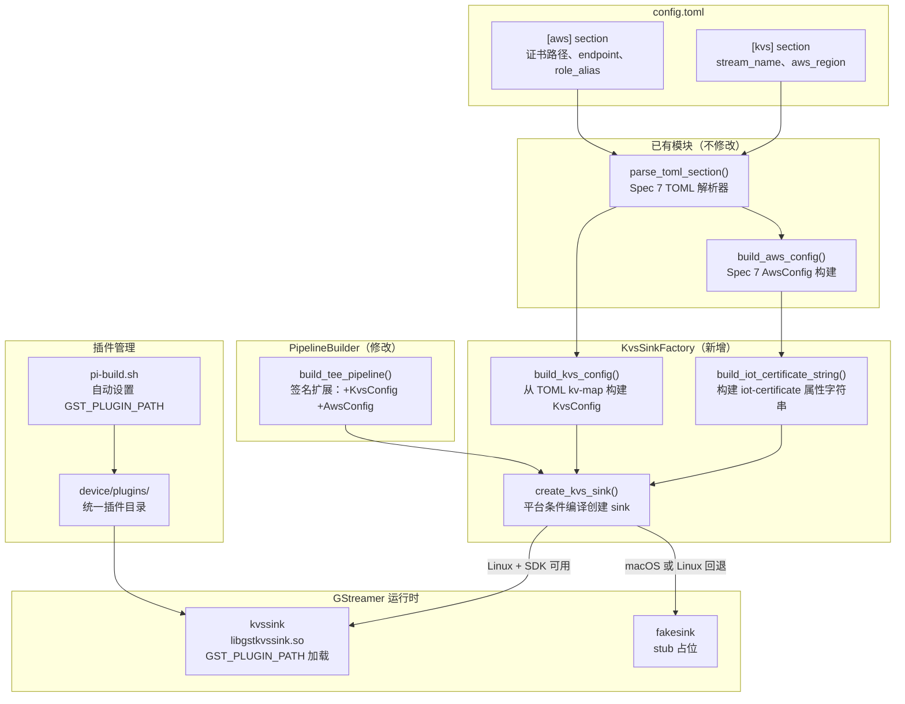

# 设计文档：Spec 8 — KVS Producer 集成

## 概述

本设计将 H.264 tee 管道中 KVS 分支的 `fakesink("kvs-sink")` 替换为 KVS Producer SDK 提供的 `kvssink` GStreamer element，实现视频流上传到 Amazon Kinesis Video Streams。

核心设计目标：
- **KvsSinkFactory 工厂模块**：封装 kvssink 的创建、属性配置和平台隔离逻辑
- **平台条件编译**：Linux 使用 `kvssink`（通过 `GST_PLUGIN_PATH` 运行时加载 `libgstkvssink.so`，插件统一存放在 `device/plugins/`），macOS 使用 `fakesink` stub
- **kvssink 原生 IoT 认证**：使用 `iot-certificate` 属性直接传入证书路径，由 kvssink 内部处理凭证获取和自动刷新，不通过 CredentialProvider 中转
- **配置复用**：复用 Spec 7 的 `parse_toml_section()` 读取新增的 `[kvs]` section，复用已有的 `AwsConfig` 获取证书路径
- **向后兼容**：PipelineBuilder 签名扩展为可选参数，默认行为不变（fakesink）
- **编译时零依赖**：CMakeLists.txt 不链接 KVS Producer SDK，kvssink 通过 GStreamer 插件机制运行时加载

设计决策：
- **KvsSinkFactory 独立模块**：将 kvssink 创建逻辑从 PipelineBuilder 中分离，职责单一，便于单元测试。PipelineBuilder 只负责管道拓扑，不关心 sink 的具体实现。
- **iot-certificate 而非 CredentialProvider**：kvssink 原生支持 IoT 证书认证且内置凭证刷新机制。CredentialProvider（Spec 7）保留给不支持 IoT 认证的组件（如 S3 上传）。
- **Linux 回退策略**：Linux 上 kvssink 不可用时（SDK 未安装或 `GST_PLUGIN_PATH` 未设置）回退到 fakesink 并记录警告，而非直接失败。这允许在没有 KVS SDK 的 Linux 环境中继续开发和测试。
- **可选参数而非 PipelineConfig 聚合**：当前 PipelineBuilder 仅需 3 个参数（error_msg、CameraConfig、KvsConfig+AwsConfig），使用可选参数即可。等后续 Spec（WebRTC、AI）参数超过 3 个时再重构为聚合结构体。

## 架构

### 整体架构图



### 管道拓扑（替换后）

```
videotestsrc -> videoconvert -> capsfilter(I420) -> raw-tee
  -> queue(leaky) -> fakesink("ai-sink")           [AI 分支, raw frames]
  -> queue -> x264enc -> h264parse -> encoded-tee
    -> queue -> kvssink("kvs-sink")                 [KVS 分支, H.264] ← 本 Spec 替换
    -> queue(leaky) -> fakesink("webrtc-sink")      [WebRTC 分支, H.264]
```

### 文件布局

```
device/
├── CMakeLists.txt              # 修改：添加 kvs_module 静态库 + kvs_test
├── plugins/                    # 新增：运行时 GStreamer 插件目录（.gitignore 排除）
│   ├── libgstkvssink.so        # KVS Producer SDK 编译产出（Pi 5 手动复制）
│   └── (libgstwebrtc.so)       # 未来 WebRTC 插件（同样手动复制）
├── src/
│   ├── kvs_sink_factory.h      # 新增：KvsConfig 结构体 + 工厂函数声明
│   ├── kvs_sink_factory.cpp    # 新增：工厂实现（平台条件编译）
│   ├── pipeline_builder.h      # 修改：签名扩展
│   ├── pipeline_builder.cpp    # 修改：调用 KvsSinkFactory
│   ├── credential_provider.h   # 不修改（复用 AwsConfig、parse_toml_section）
│   └── ...
├── config/
│   ├── config.toml             # 修改：由 provision 脚本自动生成 [kvs] section
│   └── config.toml.example     # 修改：新增 [kvs] section 示例
└── tests/
    ├── kvs_test.cpp            # 新增：KVS 配置加载 + 工厂创建测试（含 PBT）
    └── ...                     # 现有测试不修改

scripts/
└── provision-device.sh         # 修改：新增 KVS Stream 创建 + IAM KVS 权限
└── pi-build.sh                 # 修改：自动检测 device/plugins/ 并设置 GST_PLUGIN_PATH
```

## 组件与接口

### kvs_sink_factory.h（新增）

```cpp
// kvs_sink_factory.h
// KVS sink element factory with platform-conditional compilation.
#pragma once

#include <gst/gst.h>
#include <string>
#include <unordered_map>
#include "credential_provider.h"  // AwsConfig, parse_toml_section

namespace KvsSinkFactory {

// KVS 流配置（从 TOML [kvs] section 解析）
struct KvsConfig {
    std::string stream_name;   // KVS 流名称
    std::string aws_region;    // AWS 区域
};

// 从 TOML key-value map 构建 KvsConfig
// 缺少必要字段时返回 false 并填充 error_msg（包含缺失字段名）
bool build_kvs_config(
    const std::unordered_map<std::string, std::string>& kv,
    KvsConfig& config,
    std::string* error_msg = nullptr);

// 构建 iot-certificate 属性字符串
// 格式："iot-certificate,endpoint=...,cert-path=...,key-path=...,ca-path=...,role-aliases=..."
std::string build_iot_certificate_string(const AwsConfig& aws_config);

// 创建 KVS sink element（平台条件编译）
// - Linux：尝试创建 kvssink，不可用时回退到 fakesink
// - macOS：直接创建 fakesink stub
// 成功时设置 stream-name、aws-region、iot-certificate 属性（仅 kvssink）
// 失败时返回 nullptr 并填充 error_msg
GstElement* create_kvs_sink(
    const KvsConfig& kvs_config,
    const AwsConfig& aws_config,
    std::string* error_msg = nullptr);

}  // namespace KvsSinkFactory
```

### kvs_sink_factory.cpp 实现要点

```cpp
// kvs_sink_factory.cpp
#include "kvs_sink_factory.h"
#include <spdlog/spdlog.h>

namespace KvsSinkFactory {

bool build_kvs_config(
    const std::unordered_map<std::string, std::string>& kv,
    KvsConfig& config,
    std::string* error_msg) {
    // 与 build_aws_config 同模式：检查必要字段，缺失时报错含字段名
    std::vector<std::string> missing;
    auto get = [&](const std::string& key, std::string& out) {
        auto it = kv.find(key);
        if (it == kv.end() || it->second.empty()) {
            missing.push_back(key);
        } else {
            out = it->second;
        }
    };
    get("stream_name", config.stream_name);
    get("aws_region", config.aws_region);

    if (!missing.empty()) {
        if (error_msg) {
            std::string msg = "Missing required fields in [kvs]: ";
            for (size_t i = 0; i < missing.size(); ++i) {
                if (i > 0) msg += ", ";
                msg += missing[i];
            }
            *error_msg = msg;
        }
        return false;
    }
    return true;
}

std::string build_iot_certificate_string(const AwsConfig& aws_config) {
    return "iot-certificate,"
           "endpoint=" + aws_config.credential_endpoint + ","
           "cert-path=" + aws_config.cert_path + ","
           "key-path=" + aws_config.key_path + ","
           "ca-path=" + aws_config.ca_path + ","
           "role-aliases=" + aws_config.role_alias;
}

GstElement* create_kvs_sink(
    const KvsConfig& kvs_config,
    const AwsConfig& aws_config,
    std::string* error_msg) {
    auto pl = spdlog::get("pipeline");

#ifdef __linux__
    GstElement* sink = gst_element_factory_make("kvssink", "kvs-sink");
    if (!sink) {
        if (pl) pl->warn("kvssink not available, falling back to fakesink");
        sink = gst_element_factory_make("fakesink", "kvs-sink");
        if (!sink) {
            if (error_msg) *error_msg = "Failed to create fakesink for kvs-sink";
            return nullptr;
        }
        if (pl) pl->info("Created fakesink stub for kvs-sink (Linux fallback)");
        return sink;  // fakesink 不设置 kvssink 属性
    }
    // 设置 kvssink 属性
    g_object_set(G_OBJECT(sink),
        "stream-name", kvs_config.stream_name.c_str(),
        "aws-region",  kvs_config.aws_region.c_str(),
        "restart-on-error", FALSE,  // 禁用内置重试，由 PipelineHealthMonitor 统一管理
        nullptr);
    std::string iot_cert = build_iot_certificate_string(aws_config);
    g_object_set(G_OBJECT(sink),
        "iot-certificate", iot_cert.c_str(),
        nullptr);
    if (pl) pl->info("Created kvssink: stream-name={}, aws-region={}",
                     kvs_config.stream_name, kvs_config.aws_region);
#else
    GstElement* sink = gst_element_factory_make("fakesink", "kvs-sink");
    if (!sink) {
        if (error_msg) *error_msg = "Failed to create fakesink for kvs-sink";
        return nullptr;
    }
    if (pl) pl->info("macOS: using fakesink stub for kvs-sink");
#endif

    return sink;
}

}  // namespace KvsSinkFactory
```

### pipeline_builder.h 修改

```cpp
// pipeline_builder.h（修改后）
#pragma once
#include <gst/gst.h>
#include <string>
#include "camera_source.h"
#include "kvs_sink_factory.h"  // KvsConfig

namespace PipelineBuilder {

// Build the dual-tee pipeline.
// 当 kvs_config 和 aws_config 非空指针时，使用 KvsSinkFactory 创建 kvssink。
// 当 kvs_config 为 nullptr 时，保持原有 fakesink 行为（向后兼容）。
GstElement* build_tee_pipeline(
    std::string* error_msg = nullptr,
    CameraSource::CameraConfig config = CameraSource::CameraConfig{},
    const KvsSinkFactory::KvsConfig* kvs_config = nullptr,
    const AwsConfig* aws_config = nullptr);

}  // namespace PipelineBuilder
```

### pipeline_builder.cpp 修改要点

KVS sink 创建部分从：
```cpp
GstElement* kvs_sink = gst_element_factory_make("fakesink", "kvs-sink");
```

改为：
```cpp
GstElement* kvs_sink = nullptr;
if (kvs_config && aws_config) {
    kvs_sink = KvsSinkFactory::create_kvs_sink(*kvs_config, *aws_config, error_msg);
} else {
    kvs_sink = gst_element_factory_make("fakesink", "kvs-sink");
}
```

其余管道拓扑代码不变。

### config.toml 新增内容

```toml
[kvs]
stream_name = "RaspiEyeStream"
aws_region = "ap-southeast-1"
```

### config.toml.example 新增内容

```toml
# KVS (Kinesis Video Streams) configuration
# stream_name: KVS stream name (must be pre-created via AWS CLI or IaC)
# aws_region: AWS region where the KVS stream is located
[kvs]
stream_name = "<your-kvs-stream-name>"
aws_region = "<your-aws-region>"
```

### CMakeLists.txt 修改

```cmake
# KVS sink 工厂模块
add_library(kvs_module STATIC src/kvs_sink_factory.cpp)
target_include_directories(kvs_module PUBLIC src ${GST_INCLUDE_DIRS})
target_link_directories(kvs_module PUBLIC ${GST_LIBRARY_DIRS})
target_link_libraries(kvs_module PUBLIC ${GST_LIBRARIES} spdlog::spdlog credential_module)

# pipeline_manager 链接 kvs_module
# （pipeline_manager 已包含 pipeline_builder.cpp，需要链接 kvs_module）
target_link_libraries(pipeline_manager PUBLIC kvs_module)

# KVS 测试
add_executable(kvs_test tests/kvs_test.cpp)
target_link_libraries(kvs_test PRIVATE
    kvs_module
    pipeline_manager
    GTest::gtest_main
    rapidcheck
    rapidcheck_gtest)
add_test(NAME kvs_test COMMAND kvs_test
    WORKING_DIRECTORY "${CMAKE_CURRENT_SOURCE_DIR}/..")
```

## provision-device.sh 扩展设计

### 幂等设计原则

所有新增函数遵循现有脚本的幂等模式 — 先检查资源是否存在，已存在则跳过并记录日志。多次执行 provision 不会产生副作用：

| 函数 | 幂等检查方式 | 已存在时行为 |
|------|------------|------------|
| `create_kvs_stream()` | `aws kinesisvideo describe-stream` | 跳过，记录 "already exists" |
| `attach_kvs_iam_policy()` | `aws iam get-role-policy` | 跳过，记录 "already attached" |
| `generate_toml_config()` [kvs] | awk 删除旧 `[kvs]` section 再追加新的 | 覆盖更新，不重复 |

### 新增参数

| 参数 | 必需 | 默认值 | 说明 |
|------|------|--------|------|
| `--kvs-stream-name` | 否 | `{thing-name}Stream` | KVS 流名称 |

### 新增函数

#### `create_kvs_stream()`（provision 模式）

```bash
create_kvs_stream() {
    local stream_name="${KVS_STREAM_NAME}"
    log_info "Checking KVS Stream '${stream_name}'..."
    if aws kinesisvideo describe-stream --stream-name "$stream_name" &>/dev/null; then
        log_info "KVS Stream '${stream_name}' already exists, skipping"
        return 0
    fi
    log_info "Creating KVS Stream '${stream_name}'..."
    aws kinesisvideo create-stream \
        --stream-name "$stream_name" \
        --data-retention-in-hours 2
    log_success "Created KVS Stream '${stream_name}'"
}
```

#### `attach_kvs_iam_policy()`（provision 模式）

IAM inline policy 名称：`{project-name}KvsPolicy`

权限范围限定到特定 KVS Stream ARN（最小权限原则）：

```json
{
    "Version": "2012-10-17",
    "Statement": [
        {
            "Effect": "Allow",
            "Action": [
                "kinesisvideo:PutMedia",
                "kinesisvideo:GetDataEndpoint",
                "kinesisvideo:DescribeStream"
            ],
            "Resource": "arn:aws:kinesisvideo:{region}:{account-id}:stream/{stream-name}/*"
        }
    ]
}
```

```bash
attach_kvs_iam_policy() {
    local policy_name="${PROJECT_NAME}KvsPolicy"
    log_info "Checking IAM inline policy '${policy_name}' on role '${ROLE_NAME}'..."
    if aws iam get-role-policy --role-name "$ROLE_NAME" --policy-name "$policy_name" &>/dev/null; then
        log_info "KVS IAM policy already attached, skipping"
        return 0
    fi
    local stream_arn="arn:aws:kinesisvideo:${AWS_REGION}:${AWS_ACCOUNT_ID}:stream/${KVS_STREAM_NAME}/*"
    local policy_doc
    policy_doc=$(printf '{"Version":"2012-10-17","Statement":[{"Effect":"Allow","Action":["kinesisvideo:PutMedia","kinesisvideo:GetDataEndpoint","kinesisvideo:DescribeStream"],"Resource":"%s"}]}' "$stream_arn")
    log_info "Attaching KVS IAM policy to role '${ROLE_NAME}'..."
    aws iam put-role-policy \
        --role-name "$ROLE_NAME" \
        --policy-name "$policy_name" \
        --policy-document "$policy_doc"
    log_success "Attached KVS IAM policy '${policy_name}'"
}
```

#### `generate_toml_config()` 修改

在现有 `[aws]` section 生成之后，追加 `[kvs]` section。

幂等处理：沿用现有 `[aws]` section 的 awk "先删旧再写新"模式。如果 config.toml 已存在且包含 `[kvs]` section，先用 awk 删除旧的 `[kvs]` section（从 `[kvs]` 行到下一个 `[` 行或文件末尾），再追加新内容。这样多次执行 provision 不会产生重复的 `[kvs]` section。

```bash
# 构建 [kvs] section 内容
local kvs_section=""
kvs_section+="[kvs]"
kvs_section+=$'\n'
kvs_section+="stream_name = \"${KVS_STREAM_NAME}\""
kvs_section+=$'\n'
kvs_section+="aws_region = \"${AWS_REGION}\""

# 写入 config.toml（幂等：先删旧 [kvs] section 再追加新的）
if [[ -f "$config_file" ]]; then
    # 删除已有的 [kvs] section（如果存在）
    local tmp_file="${config_file}.tmp"
    awk '/^\[kvs\]/{skip=1; next} /^\[/{skip=0} !skip' "$config_file" > "$tmp_file"
    mv "$tmp_file" "$config_file"
fi
printf '\n%s\n' "$kvs_section" >> "$config_file"
```

#### verify 模式扩展

新增两项检查：
- KVS Stream 存在性：`aws kinesisvideo describe-stream --stream-name "$KVS_STREAM_NAME"`
- IAM inline policy 存在性：`aws iam get-role-policy --role-name "$ROLE_NAME" --policy-name "${PROJECT_NAME}KvsPolicy"`

#### cleanup 模式扩展

新增两项删除（在现有删除步骤之前执行）：
- 删除 IAM inline policy：`aws iam delete-role-policy --role-name "$ROLE_NAME" --policy-name "${PROJECT_NAME}KvsPolicy"`
- 删除 KVS Stream：`aws kinesisvideo delete-stream --stream-arn "$STREAM_ARN"`

#### summary 输出扩展

新增一行：
```
[INFO] KVS Stream:          {KVS_STREAM_NAME}
```

### 调用顺序（provision 模式）

```
do_provision():
    create_thing
    create_certificate
    download_root_ca
    recover_cert_arn
    attach_cert_to_thing
    create_iot_policy
    attach_policy_to_cert
    create_iam_role
    create_role_alias
    create_kvs_stream          ← 新增
    attach_kvs_iam_policy      ← 新增
    get_credential_endpoint
    generate_toml_config       ← 修改：追加 [kvs] section
    print_summary              ← 修改：追加 KVS Stream 信息
```

## 数据模型

### KvsConfig（TOML [kvs] section）

| 字段 | 类型 | 来源 | 说明 |
|------|------|------|------|
| `stream_name` | `std::string` | config.toml `[kvs]` | KVS 流名称（需预先创建） |
| `aws_region` | `std::string` | config.toml `[kvs]` | AWS 区域（如 `ap-southeast-1`） |

### AwsConfig（已有，复用）

| 字段 | 类型 | 来源 | 说明 |
|------|------|------|------|
| `thing_name` | `std::string` | config.toml `[aws]` | IoT Thing 名称 |
| `credential_endpoint` | `std::string` | config.toml `[aws]` | IoT Credentials Provider 端点 |
| `role_alias` | `std::string` | config.toml `[aws]` | IAM Role Alias |
| `cert_path` | `std::string` | config.toml `[aws]` | 客户端证书路径（PEM） |
| `key_path` | `std::string` | config.toml `[aws]` | 客户端私钥路径（PEM） |
| `ca_path` | `std::string` | config.toml `[aws]` | CA 证书路径 |

### iot-certificate 属性字符串格式

```
iot-certificate,endpoint={credential_endpoint},cert-path={cert_path},key-path={key_path},ca-path={ca_path},role-aliases={role_alias}
```

示例：
```
iot-certificate,endpoint=c19imbvbcm8u20.credentials.iot.ap-southeast-1.amazonaws.com,cert-path=device/certs/device-cert.pem,key-path=device/certs/device-private.key,ca-path=device/certs/root-ca.pem,role-aliases=RaspiEyeRoleAlias
```

### TOML 配置文件完整格式

```toml
[aws]
thing_name = "RaspiEyeAlpha"
credential_endpoint = "c19imbvbcm8u20.credentials.iot.ap-southeast-1.amazonaws.com"
role_alias = "RaspiEyeRoleAlias"
cert_path = "device/certs/device-cert.pem"
key_path = "device/certs/device-private.key"
ca_path = "device/certs/root-ca.pem"

[kvs]
stream_name = "RaspiEyeStream"
aws_region = "ap-southeast-1"
```


## 正确性属性（Correctness Properties）

*属性（Property）是在系统所有合法执行中都应成立的特征或行为——本质上是对系统行为的形式化陈述。属性是人类可读规格与机器可验证正确性保证之间的桥梁。*

### Prework 分析总结

从 7 个需求的验收标准中，识别出以下可作为 property-based testing 的候选：

| 来源 | 分类 | 说明 |
|------|------|------|
| 1.1 + 5.1 + 5.10 | PROPERTY | KVS 配置 round-trip：随机生成 stream_name/aws_region → 写入 TOML → 解析 → 验证一致 |
| 1.3 + 5.3 | PROPERTY | 缺失字段检测：随机移除 {stream_name, aws_region} 子集 → build_kvs_config 返回 false → 错误信息包含字段名 |
| 3.3 | PROPERTY | iot-certificate 字符串构建：随机 AwsConfig → build_iot_certificate_string → 验证格式正确且包含所有字段值 |
| 1.2 | EXAMPLE | [kvs] section 不存在 → 空 map → build_kvs_config 失败 |
| 2.2 + 5.4 | EXAMPLE | macOS 创建 fakesink stub |
| 4.4 + 5.5 | EXAMPLE | 不传 KvsConfig → PipelineBuilder 向后兼容 |
| 4.1 + 5.6 | EXAMPLE | 传入 KvsConfig → 管道正常构建 |
| 6.1-6.8 | MANUAL | provision 脚本扩展（KVS Stream 创建、IAM 权限、verify、cleanup）— 需要真实 AWS 环境手动验证 |
| 2.1, 2.4, 3.1, 3.2 | INTEGRATION | Linux + kvssink 属性设置（需 Pi 5 + KVS SDK） |
| 其余 | SMOKE | 编译约束、测试约束、代码组织约束 |

### Property Reflection

- 1.1（KVS 配置 round-trip）测试 `build_kvs_config` 的正常路径
- 1.3（缺失字段检测）测试 `build_kvs_config` 的错误路径
- 3.3（iot-certificate 字符串）测试 `build_iot_certificate_string` 的纯函数行为

这 3 个属性分别测试不同的函数和不同的路径，无冗余，各自提供独立的验证价值。

### Property 1: KVS 配置解析 round-trip

*For any* 非空 ASCII 字符串 stream_name 和 aws_region，将其序列化为 TOML `[kvs]` section 格式（`stream_name = "..."` 和 `aws_region = "..."`），然后用 `parse_toml_section` 解析该 TOML 内容，再用 `build_kvs_config` 构建 KvsConfig，结果的 `stream_name` 和 `aws_region` 应与原始值完全一致。

**Validates: Requirements 1.1, 5.1, 5.10**

### Property 2: KVS 配置缺失字段检测

*For any* {stream_name, aws_region} 的非空真子集被移除后，`build_kvs_config()` 应返回 false，且错误信息应包含所有被移除字段的名称。

**Validates: Requirements 1.3, 5.3**

### Property 3: iot-certificate 字符串包含所有字段

*For any* 有效的 AwsConfig（credential_endpoint、cert_path、key_path、ca_path、role_alias 均为非空字符串），`build_iot_certificate_string()` 的返回值应以 `"iot-certificate,"` 开头，且包含 `"endpoint={credential_endpoint}"`、`"cert-path={cert_path}"`、`"key-path={key_path}"`、`"ca-path={ca_path}"`、`"role-aliases={role_alias}"` 子串。

**Validates: Requirements 3.3**

## 错误处理

### 配置加载错误

| 错误场景 | 处理方式 | 日志 |
|---------|---------|------|
| config.toml 不存在 | `parse_toml_section()` 返回空 map，error_msg 包含文件路径 | error: "Cannot open config file: {path}" |
| `[kvs]` section 不存在 | 返回空 map，`build_kvs_config()` 检测到缺失字段 | error: "Missing required fields in [kvs]: stream_name, aws_region" |
| 缺少 `stream_name` | `build_kvs_config()` 返回 false | error: "Missing required fields in [kvs]: stream_name" |
| 缺少 `aws_region` | `build_kvs_config()` 返回 false | error: "Missing required fields in [kvs]: aws_region" |

### Sink 创建错误

| 错误场景 | 处理方式 | 日志 |
|---------|---------|------|
| macOS 平台 | 创建 fakesink stub，正常返回 | info: "macOS: using fakesink stub for kvs-sink" |
| Linux + kvssink 不可用 | 回退到 fakesink，正常返回 | warn: "kvssink not available, falling back to fakesink" |
| Linux + kvssink 可用 | 创建 kvssink 并设置属性 | info: "Created kvssink: stream-name={name}, aws-region={region}" |
| fakesink 创建失败（极端情况） | 返回 nullptr，填充 error_msg | error: "Failed to create fakesink for kvs-sink" |

### PipelineBuilder 错误传播

| 错误场景 | 处理方式 | 日志 |
|---------|---------|------|
| KvsSinkFactory 返回 nullptr | PipelineBuilder 返回 nullptr，error_msg 透传 | 由 KvsSinkFactory 记录 |
| KvsConfig 为空（nullptr） | 使用 fakesink（向后兼容），不报错 | — |

### 日志安全

- 允许输出：stream-name、aws-region、sink 类型
- 禁止输出：cert_path、key_path、ca_path、credential_endpoint、role_alias
- SHALL NOT 在任何日志级别（包括 debug/trace）输出 iot-certificate 完整字符串（包含所有证书路径，泄露风险高）

### kvssink 运行时容错

kvssink 运行时可能遇到的错误（网络断开、凭证过期、Stream 不存在等）会通过 GStreamer bus 发送 ERROR 消息。

容错策略：**禁用 kvssink 内置重试，由 PipelineHealthMonitor 统一管理恢复**。

理由：
- kvssink 的 `restart-on-error=true`（默认值）会在内部重试，同时 PipelineHealthMonitor 检测到 bus ERROR 也会尝试重建管道，两者冲突
- 统一由 PipelineHealthMonitor 管理恢复逻辑更简单、更可控、更易调试
- PipelineHealthMonitor 已有指数退避和最大重试次数机制（spec-5）

实现：在 `create_kvs_sink()` 中设置 `restart-on-error=false`：

```cpp
// 禁用 kvssink 内置重试，由 PipelineHealthMonitor 统一管理
g_object_set(G_OBJECT(sink), "restart-on-error", FALSE, nullptr);
```

kvssink 运行时错误的处理流程：
1. kvssink 发送 GST_MESSAGE_ERROR 到 bus
2. PipelineHealthMonitor 的 bus_watch_cb 捕获 ERROR → 状态转为 ERROR
3. PipelineHealthMonitor 触发恢复（state-reset → full-rebuild）
4. 重建后的管道包含新的 kvssink，重新连接 KVS

## 测试策略

### 测试方法

本 Spec 采用三重验证策略：

1. **Property-based testing（RapidCheck）**：验证 KVS 配置解析 round-trip、缺失字段检测、iot-certificate 字符串构建
2. **Example-based 单元测试（Google Test）**：验证 macOS stub 创建、PipelineBuilder 向后兼容、管道构建
3. **ASan 运行时检查**：Debug 构建自动检测内存错误

### Property-Based Testing 配置

- 框架：RapidCheck（已通过 FetchContent 引入）
- 每个属性最少 100 次迭代
- 标签格式：`Feature: kvs-producer, Property {N}: {description}`
- TOML 测试使用临时文件写入/读取

### 新增测试文件：kvs_test.cpp

#### Property-Based Tests

| 测试用例 | 对应属性 | 验证内容 |
|---------|---------|---------|
| `KvsConfigRoundTrip` | Property 1 | 随机 stream_name/aws_region → TOML → 解析 → 验证一致 |
| `KvsConfigMissingFields` | Property 2 | 随机移除字段 → build_kvs_config 失败 → 错误含字段名 |
| `IotCertificateStringContainsAllFields` | Property 3 | 随机 AwsConfig → build_iot_certificate_string → 验证格式和字段 |

#### Example-Based Tests

| 测试用例 | 验证内容 | 对应需求 |
|---------|---------|---------|
| `MacOsCreatesFakesink` | macOS 上 create_kvs_sink 返回 fakesink，名称为 "kvs-sink" | 2.2, 5.4 |
| `MissingSectionReturnsError` | [kvs] section 不存在时 build_kvs_config 返回 false | 1.2, 5.2 |
| `BackwardCompatibleWithoutKvsConfig` | 不传 KvsConfig 时 build_tee_pipeline 仍成功，kvs-sink 为 fakesink | 4.4, 5.5 |
| `PipelineBuildsWithKvsConfig` | 传入 KvsConfig 时管道正常构建（macOS stub 场景） | 4.1, 4.2, 5.6 |
| `FakesinkSkipsIotCertificate` | fakesink stub 场景下不设置 iot-certificate 属性，无崩溃 | 3.5 |
| `PipelineTopologyUnchanged` | 传入 KvsConfig 后管道仍包含 raw-tee、encoded-tee、ai-sink、webrtc-sink | 4.5 |

### 现有测试回归

| 测试文件 | 预期 |
|---------|------|
| `smoke_test.cpp` | 全部通过，零修改 |
| `log_test.cpp` | 全部通过，零修改 |
| `tee_test.cpp` | 全部通过，零修改 |
| `camera_test.cpp` | 全部通过，零修改 |
| `health_test.cpp` | 全部通过，零修改 |
| `credential_test.cpp` | 全部通过，零修改 |
| `yolo_test.cpp` | 全部通过，零修改（如 ONNX Runtime 可用） |

### 测试约束

- 每个测试用例执行时间 ≤ 5 秒
- 所有测试通过 `ctest --test-dir device/build --output-on-failure` 统一运行
- Debug 构建下 ASan 自动生效，任何内存错误会导致测试失败
- 所有测试使用 fakesink（macOS 环境），不需要真实 KVS 环境
- Property tests 使用 RapidCheck，每个属性 100+ 迭代
- TOML 文件测试使用临时文件

### 验证命令

```bash
# macOS Debug 构建 + 测试
cmake -B device/build -S device -DCMAKE_BUILD_TYPE=Debug && cmake --build device/build && ctest --test-dir device/build --output-on-failure

# Pi 5 Release 构建 + 测试
cmake -B device/build -S device -DCMAKE_BUILD_TYPE=Release && cmake --build device/build && ctest --test-dir device/build --output-on-failure
```

## 禁止项（Design 层）

- SHALL NOT 在代码中硬编码 AWS 凭证、密钥、证书路径或任何 secret（来源：安全基线）
- SHALL NOT 在日志或错误输出中打印密钥、证书内容、token 等敏感信息（来源：安全基线）
- SHALL NOT 在 macOS 上尝试加载或链接 KVS Producer SDK（macOS 使用 fakesink stub）
- SHALL NOT 修改现有测试文件（smoke_test、log_test、tee_test、camera_test、health_test、credential_test、yolo_test）
- SHALL NOT 在不确定 kvssink 属性名称和语义时凭猜测编写代码（属性名已通过 AWS 官方文档确认）
- SHALL NOT 在 CMakeLists.txt 中链接 KVS Producer SDK（kvssink 通过 GStreamer 插件机制运行时加载）
- SHALL NOT 通过 CredentialProvider 中转凭证给 kvssink（kvssink 原生 iot-certificate 已内置凭证刷新）
