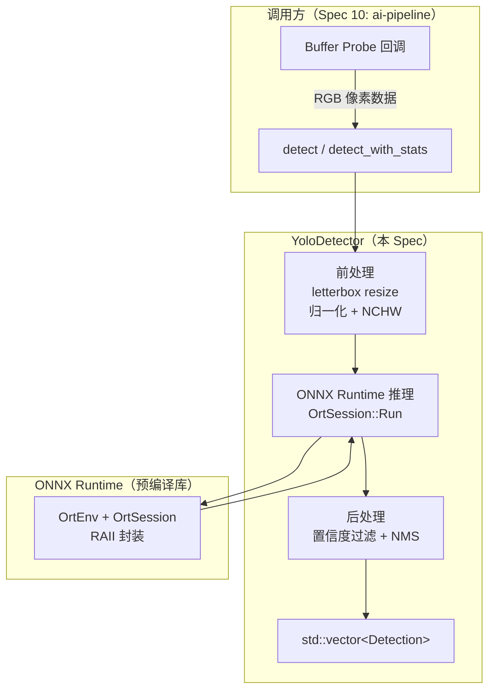
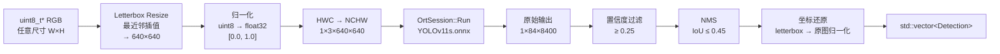

# 设计文档：Spec 9 — YOLO 设备端目标检测（独立模块）

## 概述

本设计为 raspi-eye 项目引入独立的 YOLO 目标检测模块。核心类 `YoloDetector` 封装 ONNX Runtime C API，对输入的 RGB 像素数据执行 YOLOv11s 推理，输出检测框列表。

核心设计目标：
- 纯推理模块：输入 `uint8_t*` RGB 像素 + 宽高，输出 `std::vector<Detection>`，不依赖 GStreamer
- ONNX Runtime C API RAII 封装：用自定义 deleter 的 `std::unique_ptr` 管理 OrtEnv、OrtSession 等资源
- Letterbox resize 手写实现：双线性插值，不依赖 OpenCV，保持零额外依赖
- NMS 独立函数：按类别分组 + 贪心选择，可独立测试
- 条件编译：`ENABLE_YOLO` CMake option 控制，ONNX Runtime 未安装时不影响现有模块
- 性能基线采集：记录 Pi 5 上推理耗时和内存占用，为 Spec 10 抽帧策略提供数据

设计决策：
- **预编译库而非 FetchContent**：ONNX Runtime 源码编译耗时 30+ 分钟，Pi 5 上更久。macOS 用 Homebrew（`brew install onnxruntime`），Pi 5 从 GitHub Releases 下载 aarch64 预编译包。CMake 中通过自定义 `FindOnnxRuntime.cmake` module 查找（`find_path` + `find_library`），因为 ONNX Runtime 没有标准的 CMake config 文件。
- **C API 而非 C++ API**：ONNX Runtime C++ API 是 header-only 的 C API 封装，但版本间接口变化较大。直接使用 C API + RAII 封装更稳定，且与项目 C++17 标准兼容性更好。
- **双线性插值而非最近邻**：letterbox resize 用于模型输入预处理，YOLO 官方使用双线性插值。最近邻在缩小图像时会跳过像素导致信息丢失，影响检测精度。双线性插值手写实现也不复杂（加权平均），适合 Pi 5 的 CPU 预算。
- **工厂方法而非构造函数抛异常**：`YoloDetector::create()` 返回 `std::unique_ptr<YoloDetector>` + 错误字符串，遵循项目既有模式（参考 `PipelineManager::create()`），不使用异常。
- **NMS 作为独立函数**：从 `YoloDetector` 中分离出来，接受 `std::vector<Detection>` 输入，方便独立进行 example-based 和 property-based 测试。

## 架构

### 整体架构图



### 数据流图



### 文件布局

```
device/
├── CMakeLists.txt              # 修改：添加 ENABLE_YOLO option、yolo_module、yolo_test
├── cmake/
│   └── FindOnnxRuntime.cmake   # 新增：自定义 CMake find module（find_path + find_library）
├── models/                     # 新增目录（.gitignore 排除 *.onnx）
│   ├── yolov11s.onnx           # 模型文件 small（脚本下载，不提交 git）
│   └── yolov11n.onnx           # 模型文件 nano（脚本下载，对比基线用）
├── src/
│   ├── yolo_detector.h         # 新增：Detection、DetectorConfig、InferenceStats、YoloDetector
│   ├── yolo_detector.cpp       # 新增：实现
│   ├── pipeline_manager.h      # 不修改
│   ├── pipeline_manager.cpp    # 不修改
│   └── ...                     # 其他现有文件不修改
└── tests/
    ├── yolo_test.cpp           # 新增：NMS 测试 + PBT + 端到端 + 性能基线
    ├── smoke_test.cpp          # 不修改
    ├── log_test.cpp            # 不修改
    ├── tee_test.cpp            # 不修改
    ├── camera_test.cpp         # 不修改
    └── health_test.cpp         # 不修改
scripts/
└── download-model.sh           # 新增：模型下载脚本
```

## 组件与接口

### YoloDetector 完整头文件（yolo_detector.h）

```cpp
// yolo_detector.h
// YOLO object detector using ONNX Runtime C API with RAII resource management.
#pragma once

#include <cstdint>
#include <memory>
#include <string>
#include <utility>
#include <vector>

// Forward declare ONNX Runtime C types to avoid exposing onnxruntime_c_api.h in header
struct OrtEnv;
struct OrtSession;
struct OrtMemoryInfo;

// Single detection result (POD)
struct Detection {
    float x;          // Center x, normalized to original image [0.0, 1.0]
    float y;          // Center y, normalized to original image [0.0, 1.0]
    float w;          // Width, normalized to original image [0.0, 1.0]
    float h;          // Height, normalized to original image [0.0, 1.0]
    int class_id;     // COCO 80-class ID
    float confidence; // Detection confidence [0.0, 1.0]
};

// Detector configuration (POD)
struct DetectorConfig {
    float confidence_threshold = 0.25f; // Min confidence to keep
    float iou_threshold = 0.45f;        // NMS IoU threshold
    int num_threads = 2;                // ONNX Runtime intra-op threads
};

// Inference timing statistics (POD)
struct InferenceStats {
    double preprocess_ms = 0.0;  // Letterbox + normalize + NCHW
    double inference_ms = 0.0;   // OrtSession::Run
    double postprocess_ms = 0.0; // Confidence filter + NMS + coord restore
    double total_ms = 0.0;       // End-to-end
};

// Letterbox transform info (POD, used internally and for coordinate restoration)
struct LetterboxInfo {
    float scale;   // min(640.0/w, 640.0/h)
    int pad_x;     // Horizontal padding offset (pixels)
    int pad_y;     // Vertical padding offset (pixels)
    int new_w;     // Scaled width before padding
    int new_h;     // Scaled height before padding
};

// --- Standalone functions (testable independently) ---

// Non-Maximum Suppression: per-class greedy selection.
// Deterministic: same input produces same output order.
std::vector<Detection> nms(std::vector<Detection> dets, float iou_threshold);

// Compute IoU (Intersection over Union) between two detections.
float compute_iou(const Detection& a, const Detection& b);

// Letterbox resize: bilinear interpolation, gray (128) padding.
// Output is always 640x640, NCHW float32 [0.0, 1.0].
// Returns LetterboxInfo for coordinate restoration.
LetterboxInfo letterbox_resize(const uint8_t* src, int src_w, int src_h,
                               std::vector<float>& dst_nchw);

// Restore detection coordinates from letterbox space to original image
// normalized coordinates [0.0, 1.0], clamped.
void restore_coordinates(std::vector<Detection>& dets,
                         const LetterboxInfo& info,
                         int orig_w, int orig_h);

// --- YoloDetector class ---

class YoloDetector {
public:
    // Factory method: create detector from ONNX model file.
    // Returns unique_ptr on success, nullptr on failure.
    // error_msg receives the error detail if non-null.
    static std::unique_ptr<YoloDetector> create(
        const std::string& model_path,
        const DetectorConfig& config = DetectorConfig{},
        std::string* error_msg = nullptr);

    ~YoloDetector();

    // No copy
    YoloDetector(const YoloDetector&) = delete;
    YoloDetector& operator=(const YoloDetector&) = delete;

    // Move
    YoloDetector(YoloDetector&& other) noexcept;
    YoloDetector& operator=(YoloDetector&& other) noexcept;

    // Run detection on RGB image data.
    // Returns detected objects with coordinates normalized to original image.
    std::vector<Detection> detect(const uint8_t* data, int width, int height);

    // Run detection with timing statistics.
    std::pair<std::vector<Detection>, InferenceStats>
    detect_with_stats(const uint8_t* data, int width, int height);

private:
    // Private constructor (use create() factory)
    YoloDetector(const DetectorConfig& config);

    // ONNX Runtime resource management (custom deleters)
    struct OrtEnvDeleter { void operator()(OrtEnv* p) const; };
    struct OrtSessionDeleter { void operator()(OrtSession* p) const; };
    struct OrtMemoryInfoDeleter { void operator()(OrtMemoryInfo* p) const; };

    std::unique_ptr<OrtEnv, OrtEnvDeleter> env_;
    std::unique_ptr<OrtSession, OrtSessionDeleter> session_;
    std::unique_ptr<OrtMemoryInfo, OrtMemoryInfoDeleter> memory_info_;

    DetectorConfig config_;

    // Cached input/output names and shapes (queried once at creation)
    std::string input_name_;
    std::string output_name_;
    int64_t input_h_ = 640;
    int64_t input_w_ = 640;
    int64_t num_classes_ = 80;
    int64_t num_proposals_ = 8400;

    // Reusable buffer for NCHW input tensor
    std::vector<float> input_buffer_;
};
```

### 实现要点（yolo_detector.cpp）

#### 1. RAII 自定义 Deleter

```cpp
#include <onnxruntime_c_api.h>

// Thread-safe lazy initialization of ORT API pointer
static const OrtApi* get_ort_api() {
    static const OrtApi* api = OrtGetApiBase()->GetApi(ORT_API_VERSION);
    return api;
}

void YoloDetector::OrtEnvDeleter::operator()(OrtEnv* p) const {
    if (p) get_ort_api()->ReleaseEnv(p);
}
void YoloDetector::OrtSessionDeleter::operator()(OrtSession* p) const {
    if (p) get_ort_api()->ReleaseSession(p);
}
void YoloDetector::OrtMemoryInfoDeleter::operator()(OrtMemoryInfo* p) const {
    if (p) get_ort_api()->ReleaseMemoryInfo(p);
}
```

#### 2. 工厂方法 create()

```cpp
std::unique_ptr<YoloDetector> YoloDetector::create(
    const std::string& model_path,
    const DetectorConfig& config,
    std::string* error_msg) {

    // 1. 检查文件存在性
    // 2. 创建 OrtEnv
    OrtEnv* env_raw = nullptr;
    OrtStatus* status = g_ort->CreateEnv(ORT_LOGGING_LEVEL_WARNING, "yolo", &env_raw);
    if (status) { /* 设置 error_msg, 释放 status, return nullptr */ }

    // 3. 创建 SessionOptions, 设置线程数
    OrtSessionOptions* opts = nullptr;
    g_ort->CreateSessionOptions(&opts);
    g_ort->SetIntraOpNumThreads(opts, config.num_threads);

    // 4. 创建 Session
    OrtSession* session_raw = nullptr;
    status = g_ort->CreateSession(env_raw, model_path.c_str(), opts, &session_raw);
    g_ort->ReleaseSessionOptions(opts);
    if (status) { /* 设置 error_msg, 释放资源, return nullptr */ }

    // 5. 创建 MemoryInfo
    OrtMemoryInfo* mem_raw = nullptr;
    g_ort->CreateCpuMemoryInfo(OrtArenaAllocator, OrtMemTypeDefault, &mem_raw);

    // 6. 查询输入/输出名称和维度
    // 7. 构造 YoloDetector, 移动资源所有权
    // 8. spdlog::info 记录模型加载成功 + 输入/输出维度
    // 9. return unique_ptr
}
```

#### 3. Letterbox Resize（双线性插值）

```cpp
LetterboxInfo letterbox_resize(const uint8_t* src, int src_w, int src_h,
                               std::vector<float>& dst_nchw) {
    constexpr int TARGET = 640;
    dst_nchw.resize(1 * 3 * TARGET * TARGET);

    float scale = std::min(static_cast<float>(TARGET) / src_w,
                           static_cast<float>(TARGET) / src_h);
    int new_w = static_cast<int>(src_w * scale);
    int new_h = static_cast<int>(src_h * scale);
    int pad_x = (TARGET - new_w) / 2;
    int pad_y = (TARGET - new_h) / 2;

    // Fill with gray background (128/255 = 0.502)
    constexpr float GRAY = 128.0f / 255.0f;
    std::fill(dst_nchw.begin(), dst_nchw.end(), GRAY);

    // Bilinear interpolation + normalize + HWC→NCHW
    for (int dy = 0; dy < new_h; ++dy) {
        float sy = dy / scale;
        int sy0 = static_cast<int>(sy);
        int sy1 = std::min(sy0 + 1, src_h - 1);
        float fy = sy - sy0;

        for (int dx = 0; dx < new_w; ++dx) {
            float sx = dx / scale;
            int sx0 = static_cast<int>(sx);
            int sx1 = std::min(sx0 + 1, src_w - 1);
            float fx = sx - sx0;

            int dst_y = dy + pad_y;
            int dst_x = dx + pad_x;

            for (int c = 0; c < 3; ++c) {
                // Bilinear: (1-fx)(1-fy)*p00 + fx*(1-fy)*p10 + (1-fx)*fy*p01 + fx*fy*p11
                float p00 = src[(sy0 * src_w + sx0) * 3 + c];
                float p10 = src[(sy0 * src_w + sx1) * 3 + c];
                float p01 = src[(sy1 * src_w + sx0) * 3 + c];
                float p11 = src[(sy1 * src_w + sx1) * 3 + c];
                float val = (1 - fx) * (1 - fy) * p00 + fx * (1 - fy) * p10
                          + (1 - fx) * fy * p01 + fx * fy * p11;
                dst_nchw[c * TARGET * TARGET + dst_y * TARGET + dst_x] =
                    val / 255.0f;
            }
        }
    }

    return {scale, pad_x, pad_y, new_w, new_h};
}
```

#### 4. NMS 实现

```cpp
float compute_iou(const Detection& a, const Detection& b) {
    // 转换 center (x,y,w,h) → corner (x1,y1,x2,y2)
    float a_x1 = a.x - a.w / 2, a_y1 = a.y - a.h / 2;
    float a_x2 = a.x + a.w / 2, a_y2 = a.y + a.h / 2;
    float b_x1 = b.x - b.w / 2, b_y1 = b.y - b.h / 2;
    float b_x2 = b.x + b.w / 2, b_y2 = b.y + b.h / 2;

    float inter_x1 = std::max(a_x1, b_x1);
    float inter_y1 = std::max(a_y1, b_y1);
    float inter_x2 = std::min(a_x2, b_x2);
    float inter_y2 = std::min(a_y2, b_y2);

    float inter_area = std::max(0.0f, inter_x2 - inter_x1) *
                       std::max(0.0f, inter_y2 - inter_y1);
    float union_area = a.w * a.h + b.w * b.h - inter_area;

    return (union_area > 0.0f) ? inter_area / union_area : 0.0f;
}

std::vector<Detection> nms(std::vector<Detection> dets, float iou_threshold) {
    // 1. 按 class_id 分组（std::unordered_map<int, std::vector<size_t>>）
    // 2. 每组内按 confidence 降序排序（稳定排序保证确定性）
    // 3. 贪心选择：保留最高 confidence 的框，抑制与其 IoU > iou_threshold 的框
    // 4. 合并所有类别的结果，按 confidence 降序排序
    std::vector<Detection> result;
    // ... 实现 ...
    return result;
}
```

#### 5. 坐标还原

```cpp
void restore_coordinates(std::vector<Detection>& dets,
                         const LetterboxInfo& info,
                         int orig_w, int orig_h) {
    constexpr int TARGET = 640;
    for (auto& d : dets) {
        // letterbox 空间 [0,1] → 像素坐标
        float cx_px = d.x * TARGET;
        float cy_px = d.y * TARGET;
        float w_px = d.w * TARGET;
        float h_px = d.h * TARGET;

        // 去除 padding 偏移
        cx_px -= info.pad_x;
        cy_px -= info.pad_y;

        // 还原缩放
        cx_px /= info.scale;
        cy_px /= info.scale;
        w_px /= info.scale;
        h_px /= info.scale;

        // 归一化到原图 [0,1] 并 clamp
        d.x = std::clamp(cx_px / orig_w, 0.0f, 1.0f);
        d.y = std::clamp(cy_px / orig_h, 0.0f, 1.0f);
        d.w = std::clamp(w_px / orig_w, 0.0f, 1.0f);
        d.h = std::clamp(h_px / orig_h, 0.0f, 1.0f);
    }
}
```

#### 6. 推理执行

```cpp
std::pair<std::vector<Detection>, InferenceStats>
YoloDetector::detect_with_stats(const uint8_t* data, int width, int height) {
    InferenceStats stats;
    auto t0 = std::chrono::steady_clock::now();

    // 前处理
    auto info = letterbox_resize(data, width, height, input_buffer_);
    auto t1 = std::chrono::steady_clock::now();
    stats.preprocess_ms = /* t1 - t0 in ms */;

    // 推理
    // 创建输入 tensor → OrtSession::Run → 获取输出 tensor
    // YOLOv11s 输出形状: [1, 84, 8400]
    // 84 = 4 (bbox) + 80 (classes)
    auto t2 = std::chrono::steady_clock::now();
    stats.inference_ms = /* t2 - t1 in ms */;

    // 后处理
    // 1. 转置输出 [1,84,8400] → 遍历 8400 个 proposal
    // 2. 对每个 proposal: 取最大类别置信度，过滤低于阈值的
    // 3. 构造 Detection（letterbox 空间归一化坐标）
    // 4. NMS
    // 5. 坐标还原到原图归一化坐标
    auto t3 = std::chrono::steady_clock::now();
    stats.postprocess_ms = /* t3 - t2 in ms */;
    stats.total_ms = /* t3 - t0 in ms */;

    spdlog::debug("Inference: pre={:.1f}ms infer={:.1f}ms post={:.1f}ms total={:.1f}ms",
                  stats.preprocess_ms, stats.inference_ms,
                  stats.postprocess_ms, stats.total_ms);

    return {std::move(detections), stats};
}

std::vector<Detection> YoloDetector::detect(
    const uint8_t* data, int width, int height) {
    return detect_with_stats(data, width, height).first;
}
```

#### 7. 进程 RSS 内存获取（测试用）

```cpp
// 在 yolo_test.cpp 中使用
#ifdef __linux__
#include <fstream>
#include <string>
static long get_rss_kb() {
    std::ifstream status("/proc/self/status");
    std::string line;
    while (std::getline(status, line)) {
        if (line.rfind("VmRSS:", 0) == 0) {
            return std::stol(line.substr(6));  // kB
        }
    }
    return -1;
}
#elif defined(__APPLE__)
#include <mach/mach.h>
static long get_rss_kb() {
    mach_task_basic_info_data_t info;
    mach_msg_type_number_t count = MACH_TASK_BASIC_INFO_COUNT;
    if (task_info(mach_task_self(), MACH_TASK_BASIC_INFO,
                  (task_info_t)&info, &count) == KERN_SUCCESS) {
        return static_cast<long>(info.resident_size / 1024);
    }
    return -1;
}
#endif
```

### CMakeLists.txt 变更

```cmake
# 新增 ENABLE_YOLO option（默认 ON）
option(ENABLE_YOLO "Build YOLO detector module (requires ONNX Runtime)" ON)

if(ENABLE_YOLO)
    # 查找 ONNX Runtime via custom FindOnnxRuntime.cmake
    list(APPEND CMAKE_MODULE_PATH "${CMAKE_CURRENT_SOURCE_DIR}/cmake")
    find_package(OnnxRuntime REQUIRED)

    # Pass model paths to tests via compile definitions
    set(YOLO_MODEL_PATH "${CMAKE_CURRENT_SOURCE_DIR}/models/yolov11s.onnx")
    set(YOLO_MODEL_PATH_NANO "${CMAKE_CURRENT_SOURCE_DIR}/models/yolov11n.onnx")

    # YOLO 模块库
    add_library(yolo_module STATIC src/yolo_detector.cpp)
    target_include_directories(yolo_module PUBLIC src ${OnnxRuntime_INCLUDE_DIRS})
    target_link_libraries(yolo_module PUBLIC ${OnnxRuntime_LIBRARIES} log_module)

    # YOLO 测试
    add_executable(yolo_test tests/yolo_test.cpp)
    target_link_libraries(yolo_test PRIVATE yolo_module GTest::gtest_main
                          rapidcheck rapidcheck_gtest)
    target_compile_definitions(yolo_test PRIVATE
        YOLO_MODEL_PATH="${YOLO_MODEL_PATH}"
        YOLO_MODEL_PATH_NANO="${YOLO_MODEL_PATH_NANO}")
    add_test(NAME yolo_test COMMAND yolo_test)
endif()
```

### 模型下载脚本（scripts/download-model.sh）

```bash
#!/usr/bin/env bash
set -euo pipefail

MODEL_DIR="device/models"
mkdir -p "${MODEL_DIR}"

download_model() {
    local name="$1"   # e.g. yolo11s or yolo11n
    local file="${MODEL_DIR}/${name}.onnx"

    if [ -f "${file}" ]; then
        echo "Model already exists: ${file}"
        return 0
    fi

    # Method 1: Export via ultralytics CLI (preferred)
    if command -v yolo &>/dev/null; then
        echo "Exporting ${name} via ultralytics CLI..."
        yolo export model=${name}.pt format=onnx imgsz=640
        mv ${name}.onnx "${file}"
        echo "Model exported: ${file}"
        return 0
    fi

    # Method 2: Download from GitHub Releases (fallback)
    echo "Downloading ${name} ONNX model..."
    curl -L -o "${file}" \
        "https://github.com/ultralytics/assets/releases/download/v8.3.0/${name}.onnx"

    if [ ! -s "${file}" ]; then
        echo "ERROR: Download failed or file is empty"
        rm -f "${file}"
        return 1
    fi

    echo "Model downloaded: ${file}"
}

download_model "yolo11s"
download_model "yolo11n"
```

## 数据模型

### Detection 结构体

| 字段 | 类型 | 范围 | 说明 |
|------|------|------|------|
| `x` | `float` | [0.0, 1.0] | 检测框中心 x，归一化到原图宽度 |
| `y` | `float` | [0.0, 1.0] | 检测框中心 y，归一化到原图高度 |
| `w` | `float` | [0.0, 1.0] | 检测框宽度，归一化到原图宽度 |
| `h` | `float` | [0.0, 1.0] | 检测框高度，归一化到原图高度 |
| `class_id` | `int` | [0, 79] | COCO 80 类 ID |
| `confidence` | `float` | [0.0, 1.0] | 检测置信度 |

### DetectorConfig 配置

| 字段 | 类型 | 默认值 | 说明 |
|------|------|--------|------|
| `confidence_threshold` | `float` | 0.25 | 最低置信度阈值 |
| `iou_threshold` | `float` | 0.45 | NMS IoU 阈值 |
| `num_threads` | `int` | 2 | ONNX Runtime 推理线程数（Pi 5 四核留余量） |

### InferenceStats 统计

| 字段 | 类型 | 说明 |
|------|------|------|
| `preprocess_ms` | `double` | 前处理耗时（letterbox + 归一化 + NCHW） |
| `inference_ms` | `double` | 模型推理耗时 |
| `postprocess_ms` | `double` | 后处理耗时（过滤 + NMS + 坐标还原） |
| `total_ms` | `double` | 端到端总耗时 |

### LetterboxInfo 变换信息

| 字段 | 类型 | 说明 |
|------|------|------|
| `scale` | `float` | 缩放比例 = min(640/w, 640/h) |
| `pad_x` | `int` | 水平填充偏移（像素） |
| `pad_y` | `int` | 垂直填充偏移（像素） |
| `new_w` | `int` | 缩放后实际宽度（不含填充） |
| `new_h` | `int` | 缩放后实际高度（不含填充） |

### YOLOv11s 模型 I/O

| 方向 | 名称 | 形状 | 类型 | 说明 |
|------|------|------|------|------|
| 输入 | `images` | [1, 3, 640, 640] | float32 | NCHW RGB，归一化 [0,1] |
| 输出 | `output0` | [1, 84, 8400] | float32 | 84 = 4(bbox) + 80(classes)，8400 个 proposal |


## 正确性属性（Correctness Properties）

*属性（Property）是在系统所有合法执行中都应成立的特征或行为——本质上是对系统行为的形式化陈述。属性是人类可读规格与机器可验证正确性保证之间的桥梁。*

### Prework 分析总结

从 8 个需求的 40+ 条验收标准中，识别出以下可作为 property-based testing 的候选：

| 来源 | 分类 | 说明 |
|------|------|------|
| 3.1 + 3.2 + 3.5 + 3.6 | PROPERTY | Letterbox 输出尺寸恒定 640×640，输入空间：(w, h) ∈ [1, 4096] |
| 3.3 + 3.4 | PROPERTY | Letterbox 缩放比例正确 + 输出值范围 [0,1]，可合并到 Property 3 |
| 4.2 + 6.3 | PROPERTY | NMS 输出数量 ≤ 输入数量（单调递减） |
| 4.3 + 6.3 | PROPERTY | NMS 同类别输出框 IoU ≤ 阈值（不变量） |
| 4.5 + 6.5 | PROPERTY | 坐标还原后 clamp 到 [0.0, 1.0] |
| 4.7 | PROPERTY | NMS 确定性（同输入同输出），被 Property 1/2 的 100+ 次迭代隐式覆盖 |

其余验收标准分类为 EXAMPLE（API 设计、错误处理）、SMOKE（构建验证、ASan）或 INTEGRATION（端到端推理、性能基线），不适合 PBT。

### Property Reflection

- 3.1、3.2、3.5、3.6 均测试 letterbox 输出尺寸恒为 640×640，合并为一个属性。3.3（缩放比例）和 3.4（值范围）作为该属性的附加断言一并验证。
- 4.2 和 6.3（输出 ≤ 输入）测试 NMS 的单调递减性质，合并为一个属性。
- 4.3 和 6.3（IoU ≤ 阈值）测试 NMS 的 IoU 不变量，合并为一个属性。
- 4.5 和 6.5 均测试坐标还原后 clamp 到 [0,1]，合并为一个属性。
- 4.7（NMS 确定性）被 Property 1 和 2 的 100+ 次迭代隐式覆盖（如果非确定性，重复运行会暴露），不单独设属性。

最终 4 个属性，无冗余。

### Property 1: NMS 单调递减

*For any* 输入检测框列表 `dets`（长度 ∈ [0, 200]，每个框的 class_id ∈ [0, 79]，confidence ∈ (0, 1]，x/y/w/h ∈ (0, 1]）和任意 IoU 阈值 `iou_thresh` ∈ (0, 1]，NMS 输出的检测框数量 SHALL ≤ 输入数量。

**Validates: Requirements 4.2, 6.3**

### Property 2: NMS IoU 不变量

*For any* 输入检测框列表，经过 NMS 后，同一 `class_id` 的任意两个输出框之间的 IoU SHALL ≤ `iou_threshold`。

**Validates: Requirements 4.3, 6.3**

### Property 3: Letterbox 输出尺寸恒定

*For any* 有效的输入图像尺寸 (w, h)（w ∈ [1, 4096]，h ∈ [1, 4096]），`letterbox_resize` 的输出 buffer 大小 SHALL 恒为 3×640×640 = 1,228,800 个 float，且所有值 SHALL 在 [0.0, 1.0] 范围内，且 `LetterboxInfo.scale` SHALL 等于 `min(640.0/w, 640.0/h)`。

**Validates: Requirements 3.1, 3.2, 3.3, 3.4, 3.5, 3.6**

### Property 4: 坐标还原 clamp [0, 1]

*For any* letterbox 空间中的检测框（x/y/w/h ∈ [0, 1]）和任意有效的 `LetterboxInfo`（由合法的 w, h 生成），经过 `restore_coordinates` 还原后，所有坐标字段（x, y, w, h）SHALL 被 clamp 到 [0.0, 1.0] 范围内。

**Validates: Requirements 4.5, 6.5**

## 错误处理

### 模型加载错误

| 错误场景 | 处理方式 | 日志 |
|---------|---------|------|
| 模型文件不存在 | `create()` 返回 nullptr，error_msg 设置错误描述 | error: "Model file not found: {path}" |
| 模型文件格式无效 | `create()` 返回 nullptr，error_msg 包含 ONNX Runtime 错误信息 | error: "Failed to create session: {ort_error}" |
| OrtEnv 创建失败 | `create()` 返回 nullptr | error: "Failed to create ORT environment: {ort_error}" |
| SessionOptions 配置失败 | `create()` 返回 nullptr | error: "Failed to configure session options: {ort_error}" |

### 推理错误

| 错误场景 | 处理方式 | 日志 |
|---------|---------|------|
| OrtSession::Run 失败 | 返回空 `std::vector<Detection>` | error: "Inference failed: {ort_error}" |
| 输出张量形状不匹配 | 返回空向量 | error: "Unexpected output shape: expected [1,84,8400], got [...]" |
| 输入数据为 nullptr | 返回空向量（不调用 ONNX Runtime） | warn: "Null input data, skipping inference" |
| 输入宽高 ≤ 0 | 返回空向量 | warn: "Invalid input dimensions: {}x{}" |

### ONNX Runtime 资源管理

| 资源 | 获取 | 释放 | 管理方式 |
|------|------|------|---------|
| `OrtEnv*` | `OrtApi::CreateEnv()` | `OrtApi::ReleaseEnv()` | `unique_ptr<OrtEnv, OrtEnvDeleter>` |
| `OrtSession*` | `OrtApi::CreateSession()` | `OrtApi::ReleaseSession()` | `unique_ptr<OrtSession, OrtSessionDeleter>` |
| `OrtSessionOptions*` | `OrtApi::CreateSessionOptions()` | `OrtApi::ReleaseSessionOptions()` | 局部变量，create() 内释放 |
| `OrtMemoryInfo*` | `OrtApi::CreateCpuMemoryInfo()` | `OrtApi::ReleaseMemoryInfo()` | `unique_ptr<OrtMemoryInfo, OrtMemoryInfoDeleter>` |
| `OrtValue*`（输入张量） | `OrtApi::CreateTensorWithDataAsOrtValue()` | `OrtApi::ReleaseValue()` | 局部 unique_ptr，detect() 内释放 |
| `OrtValue*`（输出张量） | `OrtApi::Run()` 返回 | `OrtApi::ReleaseValue()` | 局部 unique_ptr，detect() 内释放 |
| `OrtStatus*` | 各 API 调用返回 | `OrtApi::ReleaseStatus()` | 检查后立即释放 |
| `OrtAllocator*` | `OrtApi::GetAllocatorWithDefaultOptions()` | 不需要释放（全局单例） | 直接使用 |
| `char*`（名称字符串） | `OrtApi::SessionGetInputName()` | `OrtApi::AllocatorFree()` | 查询后立即复制到 std::string 并释放 |

析构函数通过 unique_ptr 自动释放所有资源，遵循 RAII 原则。

## 测试策略

### 测试方法

本 Spec 采用四重验证策略：

1. **Property-based testing（RapidCheck）**：验证 NMS 和 letterbox 的数学属性
2. **Example-based 单元测试（Google Test）**：验证具体场景（空输入、单框、重叠框、错误路径）
3. **端到端推理测试**：加载真实模型执行推理，验证输出格式（模型不可用时自动跳过）
4. **ASan 运行时检查**：Debug 构建自动检测内存错误

### Property-Based Testing 配置

- 框架：RapidCheck（已通过 FetchContent 引入）
- 每个属性最少 100 次迭代
- 标签格式：`Feature: yolo-detector, Property {N}: {description}`
- NMS 测试生成随机 Detection 列表（长度 0-200，坐标/置信度随机）
- Letterbox 测试生成随机图像尺寸（1-4096）和随机像素数据

### 新增测试文件：yolo_test.cpp

#### Property-Based Tests

| 测试用例 | 对应属性 | 验证内容 |
|---------|---------|---------|
| `NmsMonotonicDecrease` | Property 1 | 随机检测框列表，NMS 输出数量 ≤ 输入数量 |
| `NmsIouInvariant` | Property 2 | 随机检测框列表，同类别输出框 IoU ≤ 阈值 |
| `LetterboxOutputSizeConstant` | Property 3 | 随机 (w, h)，输出 buffer 大小恒为 3×640×640，值在 [0,1]，scale 正确 |
| `CoordinateRestoreClamp` | Property 4 | 随机检测框 + 随机 LetterboxInfo，还原后坐标 clamp [0,1] |

#### Example-Based Tests

| 测试用例 | 验证内容 | 对应需求 |
|---------|---------|---------|
| `NmsEmptyInput` | 空输入返回空输出 | 6.2 |
| `NmsSingleBox` | 单框直接保留 | 6.2 |
| `NmsSameClassOverlap` | 同类别重叠框保留高置信度 | 6.2 |
| `NmsDifferentClassOverlap` | 不同类别重叠框均保留 | 6.2 |
| `NmsDeterministic` | 同输入两次调用结果相同 | 4.7 |
| `LetterboxSquareInput` | 640×640 输入无缩放无填充 | 3.2 |
| `LetterboxWideInput` | 宽图上下填充 | 3.2 |
| `LetterboxTallInput` | 高图左右填充 | 3.2 |
| `CreateWithInvalidPath` | 无效路径返回 nullptr + 错误信息 | 2.3 |
| `CreateWithValidModel` | 有效模型成功创建（模型不可用时跳过） | 2.2 |
| `DetectEndToEnd` | 端到端推理返回非空结果（模型不可用时跳过） | 4.1, 6.6 |
| `DetectWithStatsTimings` | detect_with_stats 返回非负耗时 | 5.1, 5.3 |

#### 性能基线测试

| 测试用例 | 验证内容 | 对应需求 |
|---------|---------|---------|
| `PerformanceBaseline` | 10 次推理（yolov11s），输出 avg/min/max 耗时 + RSS 内存差值（模型不可用时跳过） | 7.1, 7.2, 7.3 |
| `PerformanceBaselineNano` | 10 次推理（yolov11n），输出 avg/min/max 耗时 + RSS，与 yolov11s 对比（模型不可用时跳过） | 7.1, 7.2, 7.3 |

#### 测试辅助设施

```cpp
// Model file path (passed via CMake compile definition)
#ifndef YOLO_MODEL_PATH
#define YOLO_MODEL_PATH ""
#endif

// Check if model file exists
bool model_available() {
    return std::filesystem::exists(YOLO_MODEL_PATH);
}

// 生成随机 RGB 图像数据
std::vector<uint8_t> random_rgb_image(int w, int h) {
    std::vector<uint8_t> data(w * h * 3);
    // 填充随机像素
    return data;
}

// 生成随机 Detection
Detection random_detection(int class_id = -1) {
    // 随机 x, y, w, h ∈ (0, 1], confidence ∈ (0, 1]
    // class_id 随机 [0, 79] 或指定
}
```

### 现有测试回归

| 测试文件 | 预期 |
|---------|------|
| `smoke_test.cpp` | 全部通过，零修改 |
| `log_test.cpp` | 全部通过，零修改 |
| `tee_test.cpp` | 全部通过，零修改 |
| `camera_test.cpp` | 全部通过，零修改 |
| `health_test.cpp` | 全部通过，零修改 |
| `yolo_test.cpp`（新增） | 全部通过（端到端和性能测试在模型不可用时跳过） |

### 测试约束

- 纯逻辑测试（NMS、letterbox、坐标还原）≤ 1 秒
- 含推理测试（端到端、性能基线）≤ 10 秒
- 所有测试通过 `ctest --test-dir device/build --output-on-failure` 统一运行
- Debug 构建下 ASan 自动生效，任何内存错误会导致测试失败
- 模型文件不可用时，端到端和性能测试通过 `GTEST_SKIP()` 跳过，不导致失败
- Property tests 使用 RapidCheck，最少 100 次迭代

### 验证命令

```bash
# macOS Debug 构建 + 测试（ONNX Runtime 已安装）
cmake -B device/build -S device -DCMAKE_BUILD_TYPE=Debug && cmake --build device/build && ctest --test-dir device/build --output-on-failure

# Pi 5 Release 构建 + 测试
cmake -B device/build -S device -DCMAKE_BUILD_TYPE=Release && cmake --build device/build && ctest --test-dir device/build --output-on-failure

# 跳过 YOLO 模块（ONNX Runtime 未安装时）
cmake -B device/build -S device -DCMAKE_BUILD_TYPE=Debug -DENABLE_YOLO=OFF && cmake --build device/build && ctest --test-dir device/build --output-on-failure
```

预期结果：两个平台均配置成功、编译无错误、所有测试通过（macOS 下 ASan 无报告）。模型文件不可用时端到端推理测试和性能基线测试自动跳过。

## 禁止项（Design 层）

- SHALL NOT 将 ONNX Runtime 通过 FetchContent 源码编译引入（编译时间 30+ 分钟）
- SHALL NOT 将模型文件（.onnx）提交到 git 仓库（文件 > 20MB）
- SHALL NOT 在 YoloDetector 内部管理图像采集或 GStreamer 元素（纯推理模块）
- SHALL NOT 在日志或错误输出中打印密钥、证书内容、token 等敏感信息
- SHALL NOT 在不确定 ONNX Runtime API 用法时凭猜测编写代码
- SHALL NOT 使用 `new`/`malloc` 管理 ONNX Runtime 资源（通过 RAII unique_ptr 封装）
- SHALL NOT 依赖 OpenCV（letterbox resize 手写实现，保持零额外依赖）
- SHALL NOT 修改现有测试文件和现有模块代码
