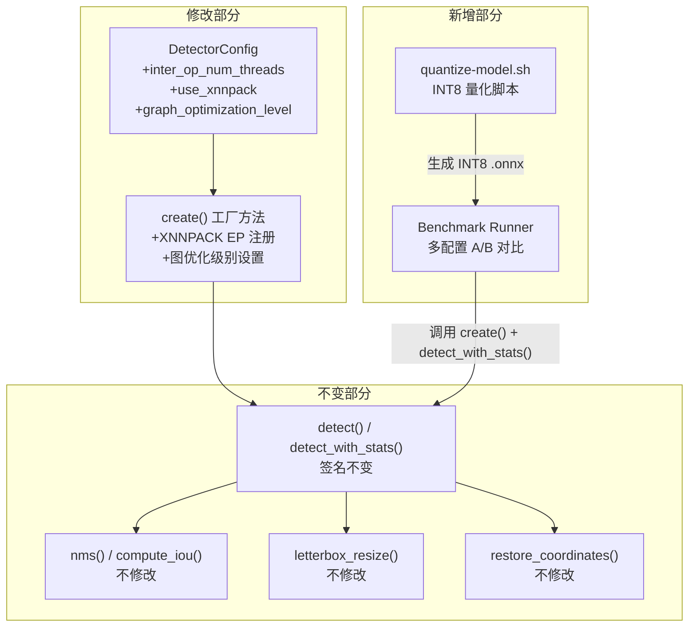
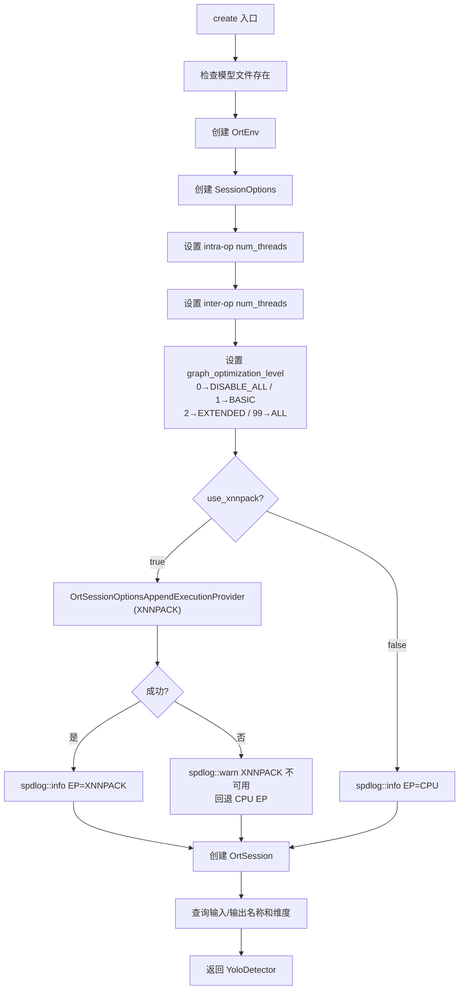

# 设计文档：Spec 9.5 — ONNX Runtime ARM 推理优化

## 概述

本设计在 Spec 9（yolo-detector）基础上，通过四个维度优化 Pi 5 上的 ONNX Runtime 推理性能：

1. **XNNPACK Execution Provider**：利用 ARM NEON 指令集加速卷积等算子
2. **图优化级别配置**：通过 `SetSessionGraphOptimizationLevel` 控制图优化策略
3. **线程数调优**：测试 1-4 线程配置找到 Pi 5 四核最优值
4. **INT8 量化模型**：通过 Python 脚本生成 INT8 量化模型，评估速度/精度权衡

所有优化通过 `DetectorConfig` 扩展字段控制，不改变 `YoloDetector` 的公开接口（`detect()` / `detect_with_stats()` 签名不变）。新增 A/B 对比基准测试框架，量化每项优化的实际收益。

核心设计决策：

- **DetectorConfig 扩展而非新类**：新增 `inter_op_num_threads`、`use_xnnpack` 和 `graph_optimization_level` 三个字段，所有字段有默认值，现有代码零修改即可编译。这保持了 Spec 9 的接口契约，对 Spec 10（ai-pipeline）透明。
- **XNNPACK 运行时检测而非编译时开关**：通过 `OrtSessionOptionsAppendExecutionProvider("XNNPACK", ...)` 注册，如果 ONNX Runtime 未编译 XNNPACK 支持则返回错误状态，代码 warn + 回退 CPU EP。这样同一份二进制在有/无 XNNPACK 的环境中都能运行。
- **XNNPACK 推荐线程配置**：启用 XNNPACK EP 时，关闭 ORT intra-op spinning（`SetIntraOpNumThreads(1)`），让 XNNPACK 使用自己的内部线程池，避免两套线程池竞争 CPU 核心。
- **基准测试在 yolo_test.cpp 中扩展**：复用现有 `run_perf_baseline` 框架，新增多配置 A/B 对比函数。macOS 上跳过（ARM 优化在 x86 上无意义），仅 Pi 5 Release 上运行。
- **INT8 量化脚本独立**：`scripts/quantize-model.sh` 调用 Python `onnxruntime.quantization`，YoloDetector 无需改动（ONNX Runtime 自动处理 INT8 模型的算子调度）。

## 架构

### 变更影响图



### create() 工厂方法变更流程



### 文件布局（变更清单）

```
device/
├── src/
│   ├── yolo_detector.h         # 修改：DetectorConfig 新增 3 个字段
│   └── yolo_detector.cpp       # 修改：create() 新增 XNNPACK EP + 图优化级别逻辑
├── tests/
│   └── yolo_test.cpp           # 修改：新增 A/B 对比基准测试
└── models/
    ├── yolo11s.onnx            # 已有（FP32）
    ├── yolo11n.onnx            # 已有（FP32）
    ├── yolo11s-int8.onnx       # 新增（INT8 量化，脚本生成，.gitignore 排除）
    └── yolo11n-int8.onnx       # 新增（INT8 量化，脚本生成，.gitignore 排除）
scripts/
└── quantize-model.sh           # 新增：INT8 量化脚本
```

涉及文件：4 个（yolo_detector.h、yolo_detector.cpp、yolo_test.cpp、quantize-model.sh），加上 .gitignore 微调。

## 组件与接口

### DetectorConfig 扩展（yolo_detector.h）

```cpp
// Detector configuration (POD)
struct DetectorConfig {
    float confidence_threshold = 0.25f; // Min confidence to keep
    float iou_threshold = 0.45f;        // NMS IoU threshold
    int num_threads = 2;                // ONNX Runtime intra-op threads
    int inter_op_num_threads = 1;       // ONNX Runtime inter-op threads (YOLO is sequential)
    bool use_xnnpack = false;           // Enable XNNPACK EP (ARM NEON)
    int graph_optimization_level = 99;  // 0=DISABLE_ALL, 1=BASIC, 2=EXTENDED, 99=ALL
};
```

新增字段均有默认值，现有代码 `DetectorConfig{}` 或 `DetectorConfig{0.25f, 0.45f, 2}` 均可编译通过（C++ aggregate initialization 向后兼容）。

### create() 工厂方法变更（yolo_detector.cpp）

在现有 `SetIntraOpNumThreads` 之后、`CreateSession` 之前，新增两段逻辑：

#### 1. Inter-op 线程数设置

```cpp
// 设置 inter-op 线程数（图节点间并行，YOLO 串行结构默认 1）
status = ort->SetInterOpNumThreads(opts, config.inter_op_num_threads);
if (!check_ort_status(ort, status, error_msg)) {
    // 非致命，warn 并继续
    spdlog::warn("Failed to set inter-op threads: {}", config.inter_op_num_threads);
}
spdlog::info("Threads: intra-op={}, inter-op={}", config.num_threads, config.inter_op_num_threads);
```

#### 2. 图优化级别设置

```cpp
// 设置图优化级别
auto opt_level = static_cast<GraphOptimizationLevel>(config.graph_optimization_level);
status = ort->SetSessionGraphOptimizationLevel(opts, opt_level);
if (!check_ort_status(ort, status, error_msg)) {
    ort->ReleaseSessionOptions(opts);
    ort->ReleaseEnv(env_raw);
    spdlog::error("Failed to set graph optimization level: {}", config.graph_optimization_level);
    return nullptr;
}
spdlog::info("Graph optimization level: {}", config.graph_optimization_level);
```

#### 3. XNNPACK EP 注册（运行时检测）

```cpp
if (config.use_xnnpack) {
    // XNNPACK EP 通过通用 API 注册
    // 不传额外配置键值对，让 XNNPACK 使用默认线程池
    status = OrtSessionOptionsAppendExecutionProvider(opts, "XNNPACK", nullptr, nullptr, 0);
    if (status != nullptr) {
        const char* msg = ort->GetErrorMessage(status);
        spdlog::warn("XNNPACK EP not available: {}, falling back to CPU EP", msg);
        ort->ReleaseStatus(status);
        // 继续使用 CPU EP，不返回错误
    } else {
        spdlog::info("Execution Provider: XNNPACK");
    }
} else {
    spdlog::info("Execution Provider: CPU");
}
```

注意：`OrtSessionOptionsAppendExecutionProvider` 是全局函数（非 `OrtApi` 成员），在 `onnxruntime_c_api.h` 中声明。如果 ONNX Runtime 编译时未启用 XNNPACK，该函数返回错误状态，代码安全回退。

### 基准测试框架（yolo_test.cpp 扩展）

```cpp
// 基准测试配置结构体
struct BenchConfig {
    std::string label;              // 配置名称（日志输出用）
    DetectorConfig detector_config; // 检测器配置
    std::string model_path;         // 模型路径
};

// 通用基准测试运行器
static void run_benchmark(const BenchConfig& bench, int runs = 10) {
    if (!std::filesystem::exists(bench.model_path)) {
        spdlog::info("[{}] SKIPPED: model not available", bench.label);
        return;
    }

    // 温度检查（Linux only）：等待 CPU 冷却到 < 70°C
    wait_for_cool_cpu();

    long rss_before = get_rss_kb();
    int cpu_temp = get_cpu_temp_celsius();  // -1 on non-Linux
    auto det = YoloDetector::create(bench.model_path, bench.detector_config);
    if (!det) {
        spdlog::info("[{}] SKIPPED: detector creation failed", bench.label);
        return;
    }
    long rss_after_load = get_rss_kb();

    auto img = random_rgb_image(640, 480);
    std::vector<double> pre_ms, inf_ms, post_ms, tot_ms;

    for (int i = 0; i < runs; ++i) {
        auto [results, stats] = det->detect_with_stats(img.data(), 640, 480);
        pre_ms.push_back(stats.preprocess_ms);
        inf_ms.push_back(stats.inference_ms);
        post_ms.push_back(stats.postprocess_ms);
        tot_ms.push_back(stats.total_ms);
    }

    // 输出结构化结果
    auto avg = [](const std::vector<double>& v) { ... };
    auto mn = [](const std::vector<double>& v) { ... };
    auto mx = [](const std::vector<double>& v) { ... };

    long rss_delta = (rss_before > 0 && rss_after_load > 0)
                         ? (rss_after_load - rss_before) : -1;

    spdlog::info("[{}] {} runs | infer: avg={:.1f} min={:.1f} max={:.1f}ms | "
                 "total: avg={:.1f} min={:.1f} max={:.1f}ms | RSS delta: {}kB",
                 bench.label, runs,
                 avg(inf_ms), mn(inf_ms), mx(inf_ms),
                 avg(tot_ms), mn(tot_ms), mx(tot_ms),
                 rss_delta);
}

// A/B 对比测试（仅 Pi 5 Release 运行）
TEST(YoloBenchmark, OptimizationComparison) {
    #ifdef __APPLE__
    GTEST_SKIP() << "ARM optimization benchmark skipped on macOS";
    #endif
    if (!model_available()) GTEST_SKIP() << "Model not available";

    // 定义配置矩阵
    std::vector<BenchConfig> configs = {
        {"baseline-cpu-2t-all",  {0.25f, 0.45f, 2, 1, false, 99}, YOLO_MODEL_PATH_SMALL},
        {"cpu-1t-all",           {0.25f, 0.45f, 1, 1, false, 99}, YOLO_MODEL_PATH_SMALL},
        {"cpu-3t-all",           {0.25f, 0.45f, 3, 1, false, 99}, YOLO_MODEL_PATH_SMALL},
        {"cpu-4t-all",           {0.25f, 0.45f, 4, 1, false, 99}, YOLO_MODEL_PATH_SMALL},
        {"cpu-4t-inter2-all",    {0.25f, 0.45f, 4, 2, false, 99}, YOLO_MODEL_PATH_SMALL},
        {"xnnpack-2t-all",       {0.25f, 0.45f, 2, 1, true,  99}, YOLO_MODEL_PATH_SMALL},
        {"cpu-2t-disable",       {0.25f, 0.45f, 2, 1, false,  0}, YOLO_MODEL_PATH_SMALL},
        {"cpu-2t-basic",         {0.25f, 0.45f, 2, 1, false,  1}, YOLO_MODEL_PATH_SMALL},
        {"cpu-2t-extended",      {0.25f, 0.45f, 2, 1, false,  2}, YOLO_MODEL_PATH_SMALL},
    };

    // INT8 量化模型（如果可用）
    std::string int8_path = /* YOLO_MODEL_PATH_SMALL_INT8 */;
    if (std::filesystem::exists(int8_path)) {
        configs.push_back({"int8-cpu-2t-all", {0.25f, 0.45f, 2, 1, false, 99}, int8_path});
    }

    for (const auto& cfg : configs) {
        run_benchmark(cfg);
    }
}
```

### INT8 量化脚本（scripts/quantize-model.sh）

```bash
#!/usr/bin/env bash
set -euo pipefail

# 依赖：项目 Python venv 中的 onnxruntime 和 onnx 包
VENV_DIR=".venv-raspi-eye"
if [ ! -f "${VENV_DIR}/bin/activate" ]; then
    echo "ERROR: Python venv not found at ${VENV_DIR}"
    exit 1
fi
source "${VENV_DIR}/bin/activate"

MODEL_DIR="device/models"

quantize_model() {
    local input="$1"   # e.g. device/models/yolo11s.onnx
    local output="$2"  # e.g. device/models/yolo11s-int8.onnx

    if [ ! -f "${input}" ]; then
        echo "SKIP: Input model not found: ${input}"
        return 0
    fi
    if [ -f "${output}" ]; then
        echo "SKIP: Output already exists: ${output}"
        return 0
    fi

    python3 -c "
from onnxruntime.quantization import quantize_dynamic, QuantType
quantize_dynamic('${input}', '${output}', weight_type=QuantType.QInt8)
print('Quantized: ${input} -> ${output}')
"
}

quantize_model "${MODEL_DIR}/yolo11s.onnx" "${MODEL_DIR}/yolo11s-int8.onnx"
quantize_model "${MODEL_DIR}/yolo11n.onnx" "${MODEL_DIR}/yolo11n-int8.onnx"
```

## 数据模型

### DetectorConfig 扩展

| 字段 | 类型 | 默认值 | 说明 |
|------|------|--------|------|
| `confidence_threshold` | `float` | 0.25 | 最低置信度阈值（不变） |
| `iou_threshold` | `float` | 0.45 | NMS IoU 阈值（不变） |
| `num_threads` | `int` | 2 | ONNX Runtime intra-op 线程数（不变） |
| `inter_op_num_threads` | `int` | 1 | **新增**：ONNX Runtime inter-op 线程数（YOLO 串行结构，默认 1） |
| `use_xnnpack` | `bool` | false | **新增**：是否启用 XNNPACK EP |
| `graph_optimization_level` | `int` | 99 | **新增**：图优化级别（0/1/2/99） |

### 图优化级别映射

| `graph_optimization_level` 值 | ONNX Runtime 枚举 | 说明 |
|------|------|------|
| 0 | `ORT_DISABLE_ALL` | 禁用所有图优化 |
| 1 | `ORT_ENABLE_BASIC` | 基础优化（常量折叠、冗余节点消除） |
| 2 | `ORT_ENABLE_EXTENDED` | 扩展优化（算子融合） |
| 99 | `ORT_ENABLE_ALL` | 全部优化（默认，包含布局优化） |

### BenchConfig 结构体（测试内部）

| 字段 | 类型 | 说明 |
|------|------|------|
| `label` | `std::string` | 配置名称，用于日志输出 |
| `detector_config` | `DetectorConfig` | 检测器配置 |
| `model_path` | `std::string` | 模型文件路径 |

### 基准测试配置矩阵

| 配置名称 | EP | intra-op | inter-op | 图优化 | 模型 | 说明 |
|---------|-----|---------|---------|--------|------|------|
| baseline-cpu-2t-all | CPU | 2 | 1 | ALL | FP32 | 复现 Spec 9 基线 |
| cpu-1t-all | CPU | 1 | 1 | ALL | FP32 | 单线程 |
| cpu-3t-all | CPU | 3 | 1 | ALL | FP32 | 三线程 |
| cpu-4t-all | CPU | 4 | 1 | ALL | FP32 | 四线程（满核） |
| cpu-4t-inter2-all | CPU | 4 | 2 | ALL | FP32 | 四线程 + inter-op=2 |
| xnnpack-2t-all | XNNPACK | 2 | 1 | ALL | FP32 | XNNPACK EP |
| cpu-2t-disable | CPU | 2 | 1 | DISABLE | FP32 | 无图优化 |
| cpu-2t-basic | CPU | 2 | 1 | BASIC | FP32 | 基础图优化 |
| cpu-2t-extended | CPU | 2 | 1 | EXTENDED | FP32 | 扩展图优化 |
| int8-cpu-2t-all | CPU | 2 | 1 | ALL | INT8 | INT8 量化模型 |


## 正确性属性（Correctness Properties）

本 Spec 不新增 Property-Based Testing 属性。

原因：本 Spec 的变更主要是配置扩展（DetectorConfig 新增字段）、EP 注册逻辑（运行时检测 + 回退）、基准测试框架（多配置 A/B 对比）和量化脚本。这些变更属于配置/集成类，不涉及新的纯函数或数据变换逻辑：

- DetectorConfig 字段扩展：编译时验证 + 默认值例子测试
- XNNPACK EP 注册：运行时检测外部库可用性，行为不随输入变化
- 图优化级别映射：4 个固定值的 static_cast，例子测试覆盖
- 基准测试框架：集成测试，测试外部推理引擎性能
- INT8 量化脚本：Python 脚本，不在 C++ 测试范围内

Spec 9 已有的 4 个 PBT 属性（NMS 单调递减、NMS IoU 不变量、Letterbox 输出尺寸恒定、坐标还原 clamp）继续有效且不受本 Spec 影响，因为本 Spec 不修改 `nms()`、`letterbox_resize()`、`restore_coordinates()` 等独立函数。

## 错误处理

### XNNPACK EP 注册失败

| 错误场景 | 处理方式 | 日志 |
|---------|---------|------|
| ONNX Runtime 未编译 XNNPACK 支持 | `OrtSessionOptionsAppendExecutionProvider` 返回错误状态，释放状态，继续使用 CPU EP | warn: "XNNPACK EP not available: {msg}, falling back to CPU EP" |
| XNNPACK EP 注册成功 | 正常继续 | info: "Execution Provider: XNNPACK" |
| `use_xnnpack` 为 false | 跳过 XNNPACK 注册 | info: "Execution Provider: CPU" |

### 图优化级别设置失败

| 错误场景 | 处理方式 | 日志 |
|---------|---------|------|
| `SetSessionGraphOptimizationLevel` 返回错误 | `create()` 返回 nullptr，error_msg 设置错误描述 | error: "Failed to set graph optimization level: {level}" |
| 无效的 graph_optimization_level 值 | ONNX Runtime 内部处理（非 0/1/2/99 的值由 ORT 决定行为） | 依赖 ORT 错误信息 |

### 基准测试容错

| 错误场景 | 处理方式 | 日志 |
|---------|---------|------|
| 模型文件不存在 | 跳过该配置 | info: "[{label}] SKIPPED: model not available" |
| 检测器创建失败（如 XNNPACK 不可用） | 跳过该配置 | info: "[{label}] SKIPPED: detector creation failed" |
| macOS 平台 | 整个基准测试跳过 | GTEST_SKIP: "ARM optimization benchmark skipped on macOS" |

### 量化脚本容错

| 错误场景 | 处理方式 |
|---------|---------|
| Python venv 不存在 | 脚本报错退出（exit 1） |
| 输入 FP32 模型不存在 | 跳过该模型（SKIP 日志） |
| 输出 INT8 模型已存在 | 跳过（不覆盖） |
| onnxruntime.quantization 包未安装 | Python 报 ImportError，脚本失败 |

## 测试策略

### 测试方法

本 Spec 采用 Example-Based 单元测试 + 集成基准测试的双重验证策略。不新增 PBT（原因见正确性属性章节）。

1. **Example-Based 单元测试**：验证配置扩展、EP 回退逻辑、图优化级别映射
2. **集成基准测试**：多配置 A/B 对比，量化优化收益
3. **回归测试**：确保现有 6 个测试套件 + Spec 9 的 4 个 PBT 属性全部通过
4. **ASan 运行时检查**：Debug 构建自动检测内存错误

### 新增测试用例（yolo_test.cpp 扩展）

#### 配置扩展测试

| 测试用例 | 验证内容 | 对应需求 |
|---------|---------|---------|
| `ConfigDefaultValues` | 默认 DetectorConfig 的 use_xnnpack=false, graph_optimization_level=99 | 1.1, 1.2 |
| `ConfigBackwardCompatible` | 用旧式初始化 `{0.25f, 0.45f, 2}` 创建 DetectorConfig 编译通过 | 1.3 |

#### XNNPACK EP 回退测试

| 测试用例 | 验证内容 | 对应需求 |
|---------|---------|---------|
| `XnnpackFallbackOnUnsupported` | use_xnnpack=true 但 XNNPACK 不可用时，create() 仍返回有效检测器 | 2.2 |

#### 图优化级别测试

| 测试用例 | 验证内容 | 对应需求 |
|---------|---------|---------|
| `GraphOptLevelAll` | graph_optimization_level=99 创建成功 | 4.4 |
| `GraphOptLevelDisable` | graph_optimization_level=0 创建成功 | 4.1 |
| `GraphOptLevelBasic` | graph_optimization_level=1 创建成功 | 4.2 |
| `GraphOptLevelExtended` | graph_optimization_level=2 创建成功 | 4.3 |

#### A/B 对比基准测试

| 测试用例 | 验证内容 | 对应需求 |
|---------|---------|---------|
| `OptimizationComparison` | 多配置 A/B 对比（仅 Pi 5 Release），输出结构化结果 | 3.2, 3.3, 6.1-6.5 |
| `Int8ModelBenchmark` | FP32 vs INT8 对比（如果 INT8 模型可用） | 5.6 |

#### 平台跳过逻辑

- macOS 上：`OptimizationComparison` 和 `Int8ModelBenchmark` 通过 `GTEST_SKIP()` 跳过
- 模型不可用时：所有需要模型的测试通过 `GTEST_SKIP()` 跳过
- XNNPACK 不可用时：XNNPACK 配置在基准测试中跳过（日志记录跳过原因），不导致测试失败

### 现有测试回归

| 测试文件 | 预期 |
|---------|------|
| `smoke_test.cpp` | 全部通过，零修改 |
| `log_test.cpp` | 全部通过，零修改 |
| `tee_test.cpp` | 全部通过，零修改 |
| `camera_test.cpp` | 全部通过，零修改 |
| `health_test.cpp` | 全部通过，零修改 |
| `yolo_test.cpp` | 现有测试全部通过（NMS、letterbox、PBT、端到端、性能基线），新增测试通过 |

### CMakeLists.txt 变更

需要为 yolo_test 新增 INT8 模型路径的编译定义：

```cmake
set(YOLO_MODEL_PATH_SMALL_INT8 "${CMAKE_CURRENT_SOURCE_DIR}/models/yolo11s-int8.onnx")
set(YOLO_MODEL_PATH_NANO_INT8 "${CMAKE_CURRENT_SOURCE_DIR}/models/yolo11n-int8.onnx")

target_compile_definitions(yolo_test PRIVATE
    YOLO_MODEL_PATH_SMALL="${YOLO_MODEL_PATH_SMALL}"
    YOLO_MODEL_PATH_NANO="${YOLO_MODEL_PATH_NANO}"
    YOLO_MODEL_PATH_SMALL_INT8="${YOLO_MODEL_PATH_SMALL_INT8}"
    YOLO_MODEL_PATH_NANO_INT8="${YOLO_MODEL_PATH_NANO_INT8}")
```

### 测试约束

- 配置扩展测试（纯逻辑）≤ 1 秒
- 图优化级别测试（含模型加载）≤ 10 秒
- A/B 对比基准测试 ≤ 120 秒（仅 Pi 5 Release）
- 所有测试通过 `ctest --test-dir device/build --output-on-failure` 统一运行
- Debug 构建下 ASan 自动生效
- macOS 上基准测试自动跳过

### 验证命令

```bash
# macOS Debug 构建 + 测试
cmake -B device/build -S device -DCMAKE_BUILD_TYPE=Debug && cmake --build device/build && ctest --test-dir device/build --output-on-failure

# Pi 5 Release 构建 + 测试（含基准测试）
cmake -B device/build -S device -DCMAKE_BUILD_TYPE=Release && cmake --build device/build && ctest --test-dir device/build --output-on-failure
```

预期结果：两个平台均编译成功、所有测试通过。macOS 上基准测试跳过，ASan 无报告。Pi 5 上基准测试输出多配置对比结果。

## 禁止项（Design 层）

- SHALL NOT 将 ONNX Runtime 通过 FetchContent 源码编译引入（编译时间 30+ 分钟，Pi 5 上更久）
- SHALL NOT 在日志或错误输出中打印密钥、证书内容、token 等敏感信息
- SHALL NOT 在不确定 ONNX Runtime API 用法时凭猜测编写代码，必须先查阅官方文档确认
- SHALL NOT 破坏现有 NMS、letterbox_resize、restore_coordinates 等独立函数的行为（这些函数已有 PBT 覆盖）
- SHALL NOT 改变 YoloDetector 的公开接口签名（detect / detect_with_stats 的参数和返回类型不变）
- SHALL NOT 使用 `new`/`malloc` 管理 ONNX Runtime 资源（通过 RAII unique_ptr 封装）
